# 1.1 操作系统的应用 

操作系统的定义：操作系统是一组能有效地组织和管理计算机硬件和软件资源，合理地对各作业进行调度，以及方便用户使用的程序的集合

## 目标

方便：方便用户使用

有效：提高系统的资源利用率；提高系统的吞吐量

可扩充性：适用硬件、体系结构、应用的发展需求；误解偶->模块化->层次结构->面向对象

开放性：遵循国际标准，以实现兼容性

## 作用

用户与计算机硬件系统之间的接口

计算机系统资源的管理者

实现对计算机资源的抽象

## 推动OS发展的动力

不断提高计算机资源利用率

方便用户

器件的不断更新

计算机体系结构的不断发展

不断提出新的应用需求

# 1.2 操作系统的发展过程 

## 人工操作方式

用户独占全机

CPU等待人工操作

## 脱机输入输出方式

解决问题：人机矛盾、CPU和I/O设备之间速度不匹配

减少CPU空闲时间

提高I/O速度

## 单道批处理系统

批处理系统旨在提高系统资源利用率和系统吞吐量

缺点：系统中的资源得不到充分利用

## 多道批处理系统

后备队列

### 优缺点

资源利用率高

系统吞吐量大

平均周转时间长

无交互能力

### 要解决的问题

处理机争用问题

内存分配和保护问题

I/O设备分配问题

文件的组织和管理问题

作业管理问题

用户与系统的接口问题

## 分时系统

主要动力：满足用户对人机交互的需求

用户需求：人机交互、共享主机

关键问题：及时接收、及时处理（作业直接进入内存、采用轮转运行方式）

特征1：多路性

特征2：独立性

特征3：及时性

特征4：交互性

## 实时系统

特征1-4同分时系统

特征5：可靠性

注意点：开始截止时间、完成截止时间、硬实时任务(HRT)、软实时任务(SRT)

## 微机系统

单用户单任务OS：只允许一个用户上机且只允许用户程序作为一个任务运行，CP/M、MS-DOS

单用户多任务OS：只允许一个用户上机但允许用户把程序分为若干个任务使它们并发执行

多用户多任务OS：允许多个用户通过各自的终端，使用同一台机器，共享主机系统中的各种资源，而每个用户程序又可进一步分为几个任务，使它们能并发执行，从而可进一步提高资源利用率和系统吞吐量，UNIX OS

# 1.3 操作系统的基本特性

## 并发

## 共享

互斥共享

同时访问

## 虚拟

互斥共享技术

​	虚拟处理机技术

​	虚拟设备技术

空分复用技术

## 异步

进程以人们不可预知的顺序推进，但是无论以何种顺序推进，结构都相同

# 1.4 操作系统的主要功能

## 处理机管理

### 进程控制

创建

撤销

状态转换

### 进程同步

#### 同步机制

互斥

同步

锁-信号

临界资源

### 进程通信

管道

消息队列

### 调度

作业调度

进程调度

## 存储器管理

主要任务：为多道程序的运行提供良好的环境，提高存储器的利用率，方便用户使用，并能从逻辑上扩充内存

### 内存分配

主要任务：为每道程序分配内存空间、提高存储器的利用率、允许正在运行的程序申请附加的内存空间

静态分配

动态分配

### 内存保护

主要任务：1、确保每道用户程序都仅在自己的内存空间内运行，彼此互不干扰。2、绝不允许用户程序访问操作系统的程序和数据，也不允许用户程序转移到非共享的其他用户程序中去执行

### 地址映射

### 内存扩充

请求调入功能

置换功能

## 设备管理

主要任务：

1、完成用户进程提供的I/O请求，为用户进程分配所需的I/O设备，并完成指定的I/O操作

2、提高CPU和I/O设备的利用率，提高I/O速度，方便用户使用I/O设备

### 缓冲管理

缓和CPU和I/O设备速度不匹配的矛盾，提高CPU的利用率，进而提高系统吞吐量

### 设备分配

### 设备处理

驱动

实现CPU和设备控制器之间的通信

## 文件管理

主要任务：对用户文件和系统文件进行管理以方便用户使用，并保证文件的安全性

### 文件存储空间管理

为每个文件分配必要的外存空间，提高外存的利用率，进而提高文件系统的存、取速度

### 目录管理

为每个文件建立目录项，并对众多的目录项有效组织，以实现方便的按名存取

### 文件的读写管/理和保护

文件保护：防止未经核准的用户存取文件、防止冒名顶替存取文件、防止以不正确的方式使用文件

### 操作系统与用户之间的接口

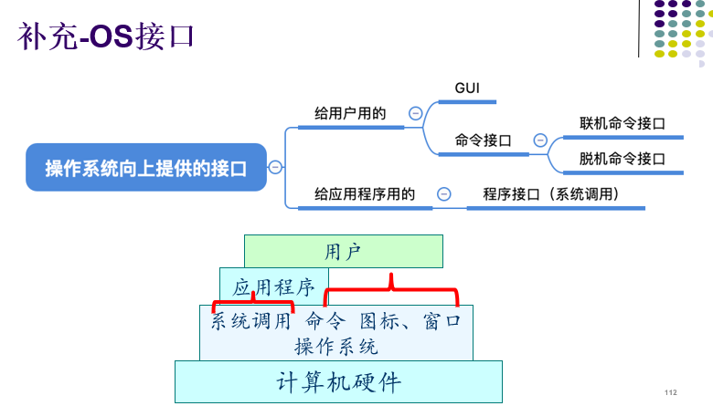

#### 用户接口

联机用户接口

脱机用户接口

图形用户接口

#### 程序接口

### 现代操作系统的新功能

#### 系统安全

认证技术

密码技术

访问控制技术

反病毒技术

#### 网络功能和服务

网络通信

资源管理

应用互操作

#### 支持多媒体

接纳控制功能

实时调度

多媒体文件的存储

# 1.5 操作系统的结构设计

## 传统操作系统结构

无结构操作系统

模块化操作系统

​	优点：

​		提高了OS设计的正确性、可理解性和可维护性

​		容易扩充，增强了OS的可适应性

​		加速了OS的开发过程

​	缺点

​		模块及接口划分较困难

​		从功能上划分模块，未区别共享资源和独占资源

​		由于管理的差异，使OS结构变得不够清晰

分层结构操作系统

​	优点：

​		功能明确，调用关系清晰（高层对低层单向依赖），有利于**保证设计和实现的正确性**

​		低层和高层可分别实现（**便于扩充和维护**）；高层错误不会影响到低层；避免递归调用

​	缺点：

​		**系统效率降低**，各系统对具体划分多少层次有不同的看法。

## 内核

在CPU设计和生产的时候就划分了特权指令和非特权指令

应用程序只能使用非特权指令，如加法指令、减法指令

内核程序可以执行特权指令，如内存清零指令

特权指令只能由操作系统内核来使用

CPU 有两种状态，**“内核态”**和**“用户态”** （在CPU程序状态字寄存器PSW中存储）

处于**内核态时**，说明此时正在运行的是内核程序，此时可以执行**特权指令** 

处于**用户态时**，说明此时正在运行的是应用程序，此时只能执行**非特权指令**

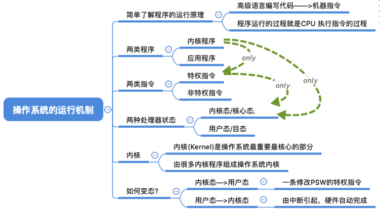

**内核**是操作系统最基本、最核心的部分。 实现操作系统内核功能的那些程序就是**内核程序**。

注意：操作系统内核需要运行在**内核态**
操作系统的非内核功能运行在**用户态**

## 客户/服务器模式

优点

​	数据分布处理和存储、便于集中管理、灵活性和可扩充性、易于改编应用软件

缺点

​	不可靠性和瓶颈问题、各模块与微内核间通过通信机制交互，系统运行效率较低

## 面向对象程序设计

## 微内核OS结构

### 优点

增强了操作系统的可扩展性

增强了系统的可靠性

可移植性强

提供了对分布式系统的支持

融入了面向对象技术

### 存在问题#

内核态与用户态频繁切换，导致运行效率有所降低

## 操作行动的体系结构

### 运行机制

#### 两种指令

特权指令	如：内存清零指令

非特权指令	如：普通的运算指令

#### 两种处理器状态

核心态#

用户态

#### 两种程序

内核程序

应用程序

### 操作系统内核

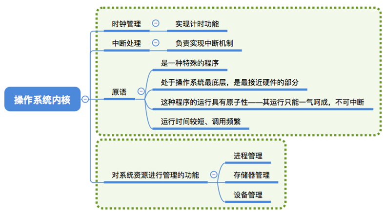

#### 时钟管理

实现计时功能

#### 中断处理

负责实现中断机制

#### 原语

是一种特殊的程序

处于操作系统最底层，是最接近硬件的部分

这种程序的运行具有原子性——其运行只能一气呵成，不可中断

运行时间较短，调用频繁

#### 对系统资源进行管理的功能

进程管理

存储器管理

设备管理

## 中断

CPU 上会运行两种程序，一种是**操作系统内核程序**，一种是应用程序

“中断”是让操作系统内核夺回CPU使用权的**唯一途径**

如果没有“中断”机制，那么一旦应用程序上CPU运行，CPU就会一直运行这个应用程序

中断”会使CPU由**用户态**变为**内核态**，使操作系统重新夺回对CPU的控制权

内中断：与当前执行的指令有关， 中断信号来源于CPU内部

​	如除法指令除数为0、陷入指令（应用程序请求操作系统服务）

外中断：与当前执行的指令无关， 中断信号来源于CPU外部

​	如始终不见每30ms发送一个时钟中断信号

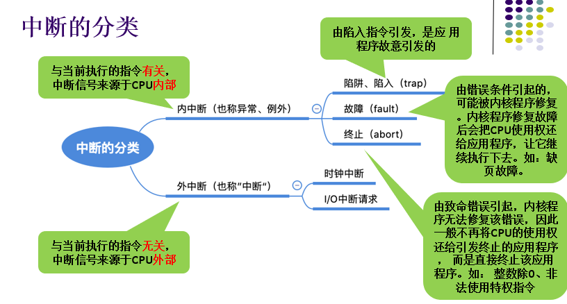

## 系统调用

应用程序通过系统调用请求操作系统的服务。而系统中的各种共享资源都由操作系统内核统一掌管，因此凡是**与共享资源有关的操作（如存储分配、I/O操作、文件管理等）**，都必须通过系统调用的方式向操作系统内核提 出服务请求，由操作系统内核代为完成。这样可以保证系统的稳定性和安全性，防止用户进行非法操作。

# 2.1 程序

## 前趋图

## 程序顺序执行特征

顺序性

封闭性

可再现性

## 程序并发执行特征

间断性

失去封闭性

不可再现性

# 2.2 进程的描述

## 定义

程序关于某个数据集合的一次执行过程

## 组成部分(PCB+程序段+数据段)

## 特征

动态性

并发性

独立性

异步性

## 状态

### 就绪、执行、堵塞

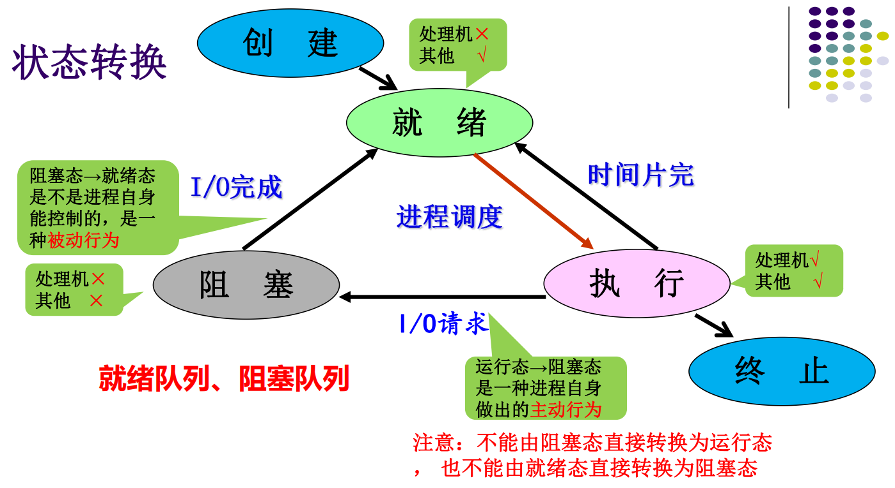

### 挂起原语

引起挂起状态的原因：
	终端用户的请求
	父进程请求
	负荷调节的需要
	操作系统的需要  

### PCB的作用

### PCB中的信息

#### 进程标识符

内部标识符

外部标识符

#### 处理机状态

通用寄存器

指令计数器

程序状态字PSW

用户栈指针

#### 进程调度信息

进程状态

进程优先级

进程调度算法

事件：进程变为堵塞态的事件

#### 进程控制信息

程序和数据地址

进程同步和通信机制

资源清单

### PCB的组织方式

线性方式

链接方式

索引方式

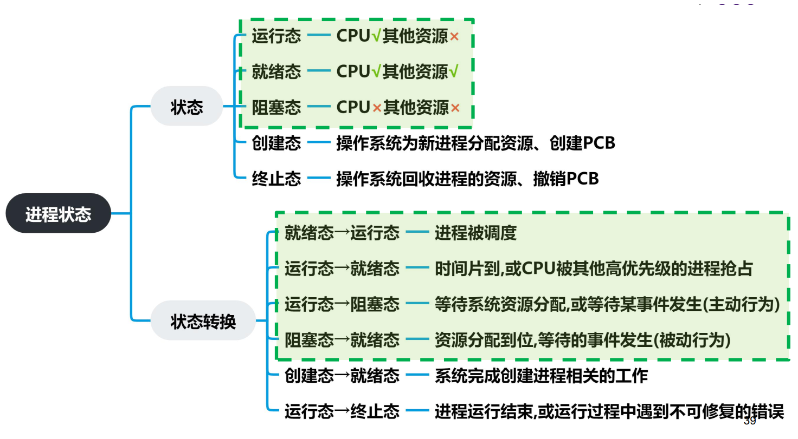

# 2.3 进程控制

进程的创建

进程的终止

进程的堵塞与唤醒

进程的挂起与激活

无论哪个进程控制原语， 要做的无非三类事情：
	更新PCB中的信息
		a. 所有的进程控制原语一定都会修改进程状态标志
		b. 剥夺当前运行进程的CPU使用权必然需要保存其运行环境
		c. 某进程开始运行前必然要恢复其运行环境
	将PCB插入合适的队列
	分配/回收资源  

# 2.4-2.5 进程同步

## 两种制约方式

间接制约方式

直接制约方式

## 临界资源

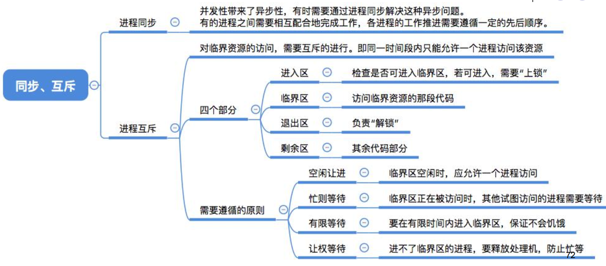

## 临界区

进程访问临界资源的**代码段**

## 同步规则

 **空闲让进、忙则等待、有限等待、让权等待**

## 硬件同步机制

关中断

test-and-set指令：测试指令

Swap指令：交换指令

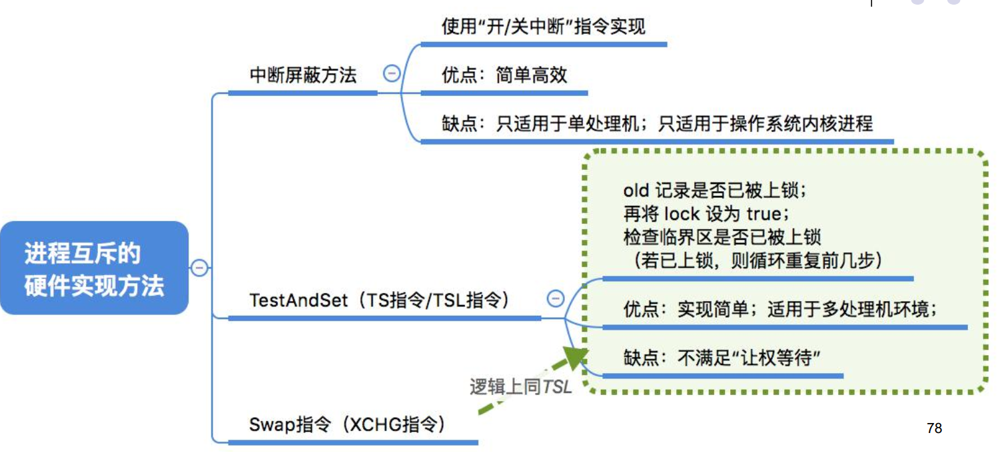

## 信号量机制

### 分类

整形信号量

记录型信号量：满足忙则等待

AND型信号量

信号量集

​	Swait(S, d, d)， 只有一个信号量S， 允许每次申请d个资源，若现有资源数少于d， 不予分配
​	Swait(S, 1, 1)， 蜕化为一般的记录型信号量(S>1时)或互斥信号量(S=1时)
​	Swait(S, 1, 0)， 当S>=1时， 允许多个进程进入某特定区， 当S变为0后， 阻止任何进程进入特定区， 相当于可控开关  

### 应用

进程互斥

实现前驱关系

## 管程机制

## 经典进程同步问题

生产者-消费者问题

哲学家进餐问题

读者-写者问题

**行人过桥问题**

# 2.6 进程通信

## 进程通信的类型

低级通信，进程间仅交换一些状态和少量数据。 如： 进程之间的互斥和同步
	信号量机制作为通信工具的缺点：	(1)效率低 (2)通信对用户不透明
	共享某些数据结构或共享存储区

高级通信： 进程间可交换大量数据，对用户透明
	共享存储器系统、 消息传递系统、 管道通信系统、 客户机-服务器

### 共享存储器系统

基于共享数据结构的通信方式

基于共享存储区的通信方式

### 管道通信系统

只能实现单向的传输

各进程要互斥地访问管道

数据以字符流的形式写入管道， 当管道写满时， 写进程的write()系统调用将被阻塞， 等待读进程将数据取走。 当读进程将数据全部取走后， 管道变空， 此时读进程的read()系统调用将被阻塞。

如果没写完， 就不允许读。 如果没读空， 就不允许写。

数据一旦被读出， 就从管道中被抛弃， 这就意味着读进程最多只能有一个

### 消息传递系统

直接通信方式

间接通信方式：信箱通信

### 客户端-服务器系统

套接字

远程过程与方法调用

## 消息传递通信的实现方式

### 直接消息传递系统

对称寻址方式

非对称寻址方式

### 邮箱通信

信箱通信

# 2.7-2.8 线程

## 调度单位

## 不是资源拥有单位

## 进程与线程的比较

|            | 调度的基本单位 |  并发性   |           拥有资源           | 独立性 | 系统开销 | 多处理机 |
| :--------: | :------------: | :-------: | :--------------------------: | :----: | :------: | :------: |
| 无线程的OS |      进程      |     √     |         以进程为单位         | 进程高 |    大    |  不支持  |
| 有线程的OS |      线程      | 进程+线程 | 线程仅拥有必不可少的部分资源 | 线程低 |    小    |   支持   |

## 线程的实现

内核支持线程KST

用户级线程

组合方式及对应关系：一对一、多对一、多对多

## 线程的实现

内核支持线程KST

用户级线程

组合方式及对应关系：一对一、多对一、多对多

# 3.1 处理机调度的层次和目标

作业：外存->内存

## 处理机调度的层次

高级调度(作业调度、长程调度)

中级调度(内存调度，挂起+激活)

低级调度(进程调度、短程调度)

|                       |                           要做什么                           | 调度发生在.. | 发生 频率 |            对进程状态的影响             |
| :-------------------: | :----------------------------------------------------------: | :----------: | :-------: | :-------------------------------------: |
| 高级调度 （作业调度） | 按照某种规则，从后备队列中 选择合适的作业将其调入内存，并为其创建进程 |  外存→内存   |   最低    |            无→创建态→就绪态             |
| 中级调度 （内存调度） |   按照某种规则，从挂起队列中选择合适的进程将其数据调回内存   |  外存→内存   |   中等    | 禁止就绪→活动就绪 （禁止阻塞→活动阻塞） |
| 低级调度 （进程调度） |    按照某种规则，从就绪队列中 选择一个进程为其分配处理机     |   内存→CPU   |   最高    |              就绪态→运行态              |

## 处理机调度目标

### 共同目标

提高资源利用率

公平性(面向进程)

平衡性(面向设备)

策略强制执行

### 批处理OS的目标

平均周转时间短：在后备队列上的时间+在就绪队列的时间+在CPU的时间+等待I/O完成的时间

系统吞吐量高

处理机利用率高

### 分时系统目标

响应时间快

均衡性

### 实时系统目标

截止时间保证

可预测性

# 3.2 作业与作业调度（早期批处理系统）

## 先来先服务FCFS

| 算法思想           | 主要从“公平” 的角度考虑（类似于我们生活中排队买东西的例子）  |
| ------------------ | ------------------------------------------------------------ |
| 算法规则           | 按照作业/进程到达的先后顺序进行服务                          |
| 用于作业/进 程调度 | 用于作业调度时， 考虑的是哪个作业先到达后备队列； 用于进程调度 时， 考虑的是哪个进程先到达就绪队列 |
| 是否可抢占？       | 非抢占式的算法                                               |
| 优缺点             | 优点： 公平、 算法实现简单 缺点： 排在长作业（进程） 后面的短作业 需要等待很长时 间， 带权周转时间很大， 对短作业来说用户体验不好。 即， FCFS算法对长作业有利， 对短作业不利（Eg ： 排队买奶茶…） |
| 是否会导致 饥饿    | 不会                                                         |

## 短作业优先SJF

| 算法思想           | 追求最少的平均等待时间， 最少的平均周转时间、 最少的平均带权周转时间 |
| ------------------ | ------------------------------------------------------------ |
| 算法规则           | 最短的作业/进程优先得到服务（所谓“最短” ， 是指**要求服务时间最短** |
| 用于作业/进 程调度 | 即可用于作业调度， 也可用于进程调度。 用于进程调度时称为“短进程 优先（**SPF**, Shortest Process First） 算法” |
| 是否可抢占？       | SJF和SPF是**非抢占式**的算法。 但是也有抢占式的版本——**最短剩余时 间优先算法**（SRTN, Shortest Remaining Time Next） ， **默认非抢占式** |
| 优缺点             | 优点： “最短的” **平均等待时间、 平均周转时间**  缺点： 不公平。 **对短作业有利， 对长作业不利**。 可能产生饥饿现象。 |
| 是否会导致 饥饿    | 会。 如果源源不断地有短作业/进程到来， 可能使长作业/进程长时间得不 到服务， 产生“**饥饿**” 现象。 如果一直得不到服务， 则称为“**饿死**” |

## 优先级调度算法

Priority-Scheduling Algorithm, PSA

外部赋予

## 高相应比优先调度算法

Highest Response Ratio Next, HRRN

优先权 = (等待服务时间 + 要求服务时间) / 要求服务时间

| 算法思想          | 要综合考虑作业/进程的等待时间和要求服务的时间                |
| ----------------- | ------------------------------------------------------------ |
| 算法规则          | 在每次调度时先计算各个作业/进程的**响应比**，选择**响应比最高**的作业/进程为其服务 |
| 用于作业/进程调度 | 即可用于作业调度，也可用于进程调度。                         |
| 是否可抢占？      | **非抢占式**的算法。 因此只有当前运行的作业/进程**主动放弃处理机**时，才需要调度，才需要计算响应比 |
| 优缺点            | 综合考虑了等待时间和运行时间（要求服务时间）等待时间相同时，要求服务时间短的优先（SJF的优点） 要求服务时间相同时， 等待时间长的优先（FCFS 的优点） 对于长作业来说， 随着等待时间越来越久， 其响应比也会 越来越大， 从而避免了长作业饥饿的问题 |
| 是否会导致饥饿    | 不会                                                         |

# 3.3 进程调度（交互式系统）

### 轮转调度算法	Round Robin, RR

| 算法思想           | 公平地、 轮流地为各个进程服务， 让每个进程在一定时间间隔得到内都可以响应 |
| ------------------ | ------------------------------------------------------------ |
| 算法规则           | 按照各进程到达就绪队列的顺序， 轮流让各个进程执行**一个时间片**（如 100ms） 。 若进程未在一个时间片内执行完， 则剥夺处理机， 将进程重 新放到就绪队列队尾重新排队。 |
| 用于作业/进 程调度 | 用于**进程调度**（只有作业放入内存建立了相应的进程后， 才能被分配处 理机时间片） |
| 是否可抢占？       | 若进程未能在时间片内运行完， 将被强行剥夺处理机使用权， 因此时间 片轮转调度算法属于**抢占式的算法**。 由时钟装置发出时钟中断来通知 CPU时间片已到 |
| 优缺点             | 优点： 公平； 响应快， 适用于分时操作系统； 缺点： 由于高频率的进程切换， 因此有一定开销； 不区分任务的紧急程 度。 |
| 是否会导致 饥饿    | 不会                                                         |

### 优先级调度算法

此算法常用于**批处理系统**中， 作为**作业调度算法**。 也作为多种操作系统中的**进程调度算法**， 还可用于**实时系统**中。

两种占用CPU的方式：**非抢占式优先级算法**， **抢占式优先级算法**

**非抢占式优先级算法**：主要用于**批处理系统**

**抢占式优先级算法**：优点： 能更好的满足**紧迫作业**的要求。 主要用于比较严格的**实时系统**

**优先级类型**：

​	**静态优先级**：在进程创建时确定的， 在进程整个运行期间保持不变

​	**优先级**： 利用某一范围的整数来表示， 该整数称为优先数。 如：0—7， 0—255

​	**确定优先级的依据**：进程类型、进程对资源的需求、用户要求

| 算法思想           | 随着计算机的发展， 特别是实时操作系统的出现， 越来越多的应用场景需要根据任务的紧急程度来决定处理顺序 |
| ------------------ | ------------------------------------------------------------ |
| 算法规则           | 调度时选择**优先级最高**的作业/进程                          |
| 用于作业/进 程调度 | 既可用于作业调度， 也可用于进程调度。 甚至， 还会用于在之后会学习 的I/O调度中 |
| 是否可抢占？       | **抢占式、 非抢占式**都有。 做题时的区别在于： 非抢占式只需在进程主动 放弃处理机时进行调度即可， 而抢占式还需在就绪队列变化时， 检查是 否会发生抢占。 |
| 优缺点             | 优点： 用优先级区分紧急程度、 重要程度， 适用于实时操作系统。 可灵 活地调整对各种作业/进程的偏好程度。 缺点： 若源源不断地有高优先级进程到来， 则可能导致饥饿 |
| 是否会导致 饥饿    | 会                                                           |

### 多队列调度算法

### 多级反馈队列调度算法	Multileved Feedback Queue

| 算法思想          | 对其他调度算法的折中权衡                                     |
| ----------------- | ------------------------------------------------------------ |
| 算法规则          | 1. 设置多级就绪队列， 各级队列优先级从高到低， 时间片从小到大  2. 新进程到达时先进入第1级队列， 按FCFS原则排队等待被分配时间片若用完时间片进程还未结束， 则进程进入下一级队列队尾。 如果此时已经是在最下级的队列， 则重新放回该队列队尾  3. 只有第 k 级队列为空时， 才会为 k+1 级队头的进程分配时间片 |
| 用于作业/进程调度 | 用于进程调度                                                 |
| 是否可抢占？      | **抢占式**的算法。 新进程可抢占低级进程的处理机              |
| 优缺点            | 对各类型进程相对公平（FCFS的优点）；每个新到达的进程都可以很快就得到响应（RR的优点）；短进程只用较少的时间就可完成（SPF的优点） |
| 是否会导致饥饿    | 会                                                           |

### 基于公平原则的调度算法

# 3.4 实时调度

最早截止时间优先算法	Earliest Deadline First, EDF

最低松弛度优先算法	Least Laxity First, LLF

优先级倒置问题	优先级继承

# 3.5 死锁概述

## 死锁的定义

一组进程死锁指：进程所等待的事件是该组中其他进程释放所占有的资源

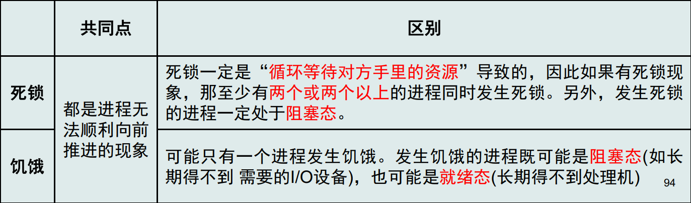

## 产生死锁的原因

竞争不可抢占资源

竞争可消耗性资源

进程推进顺序不当：进程异步性特征

## 处理死锁的必要条件

互斥：只有对必须互斥使用的资源的争抢才会导致死锁

请求和保持：进程已经保持了至少一个资源， 但又提出了新的资源请求， 而该资源又被其他进程占有， 此时请求进程被阻塞， 但又对自己已有的资源保持不放

不可抢占：进程所获得的资源在未使用完之前， 不能由其他进程强行夺走， 只能主动释放。

循环等待/环路等待：存在一种进程资源的循环等待链，链中的每一个进程已获得的资源同时被下一个进程所请求。
	注意！ 发生死锁时一定有循环等待， 但是发生循环等待时未必死锁  

## 处理死锁的方法

### 预防死锁

#### 互斥条件是由设备**固有条件**所决定的，应加以保证，不可破坏

#### 破坏“请求和保持”

第一种协议： 即进程在运行前一次申请完它所需要的全部资源， 在它的资源未满足前， 不让它投入运行。 一旦投入运行后， 这些资源就一直归它所有， 该进程就不会再请求别的任何资源了。

优点： 算法简单、 易于实现且很安全。 缺点： 资源浪费严重和进程延容易

第二种协议： 允许进程只获得运行初期所需的资源， 便开始运行。 运行过程中再逐步释放已分配给自己的资源及已用毕的资源， 然后再请求新的资源。

优点： 提高设备利用率， 减少进程发生饥饿的概率。  

#### 破坏“不可抢占”

破坏不可抢占条件： 当某个进程请求新的资源得不到满足时， 它必须立即释放保持的所有资源， 待以后需要时再重新申请。  

缺点：

1. 实现起来比较复杂。
2. 释放已获得的资源可能造成前一阶段工作的**失效**。 因此这种方法一般只适用于易保存和恢复状态的资源， 如CPU。
3. 反复地申请和释放资源会**增加系统开销**， 降低**系统吞吐量**。
4. 意味着只要暂时得不到某个资源， 之前获得的那些资源就都需要放弃， 以后再重新申请。 如果一直发生这样的情况， 就会导致进程**饥饿**。  

#### 破坏“循环等待”

顺序资源分配法  

### 避免死锁

安全状态

银行家算法

### 检测死锁

资源分配图，能完全简化则无死锁

### 解除死锁

以最小代价终止进程，解除死锁

剥夺资源、撤销进程

# 第4章 存储器管理

## 4.1 存储器的层次结构

### 4.1.1 多级存储器结构

存储层次至少应有三级：**CPU寄存器**、**主存**、**辅存**

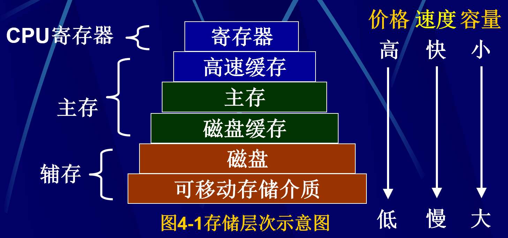

### 4.1.2 主存储器与寄存器（可执行存储器）

1. 主存储器

​	CPU可从其中取指令和数据，数据能从主存读取并装入到寄存器中，或从寄存器存入到主存。用于保存进程运行时的程序和数据。

2. 寄存器

​	寄存器访问速度最快，与处理机相同。其长度以字为单位。

### 4.1.3 高速缓存和磁盘缓存

1. 高速缓存（cache)

​	容量大于寄存器，访问速度快于内存。

​	Cache分类：

​		一级cache紧靠内存，速度最高，容量最小。

​		二级cache容量稍大，速度也稍低。

2. 磁盘缓存

​	目的：为了缓和磁盘的I/O速度和主存的访问速度的不匹配，暂时存放频繁使用的一部分磁盘数据和信息，以减少访问磁盘的次数

​	磁盘缓存本身并不是一种实际存储介质。

​	实质：利用主存中的存储空间，来暂存从磁盘中读出或写入的信息

## 4.2 程序的装入和链接

用户程序要在系统中运行，必须先将它装入内存，然后再将其转变为一个可以执行的程序，通常要经过以下几个步骤：编译、链接、装入

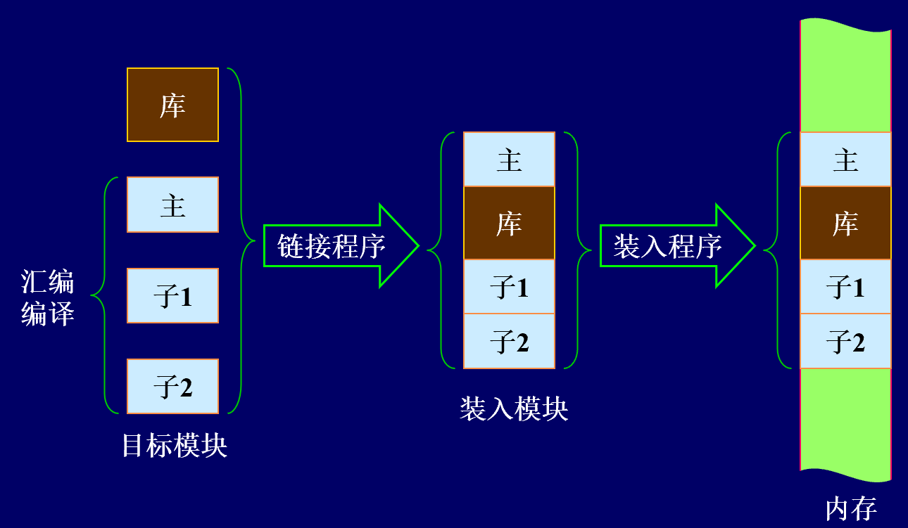

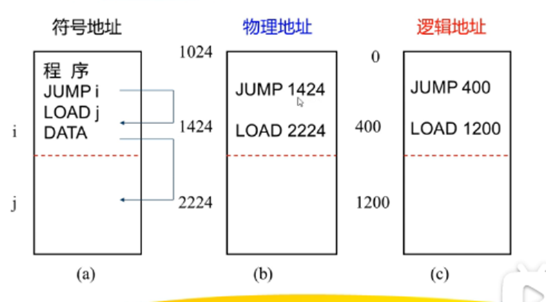

**物理地址**：物理内存的地址，内存以字节为单位编址，物理地址空间是所有物理地址的集合

**逻辑地址（虚拟地址）**：程序编译后使用的相对于0字节的地址。逻辑地址空间是由程序锁生成的所有逻辑地址的集合

用大白话说：符号地址是用户视图，物理地址是计算机视图，逻辑地址是其中的转换视图

### 4.2.1 程序的装入

#### 1. 绝对装入方式

编译时产生的地址使用绝对地址

程序或数据被修改时，需要重新编译程序

只适用于单道程序环境

#### 2. 可重定位装入方式

编译后的目标模块使用相对地址

在装入时，完成重定位（**静态重定位**）

需硬件支持

**重定位**：逻辑地址转换为物理地址的过程，称为重定位，也称为地址变换

可重定位装入的特点是在一个作业装入内存时， 必须分配其要求的全部内存空间， 如果没有足够的内存， 就不能装入该作业。 作业一旦进入内存后， 在运行期间就不能再移动， 也不能再申请内存空间  

#### 3. 动态运行时的装入方式

编译后的目标模块使用相对地址

在运行时，完成重定位（动态重定位）

需要**重定位寄存器**

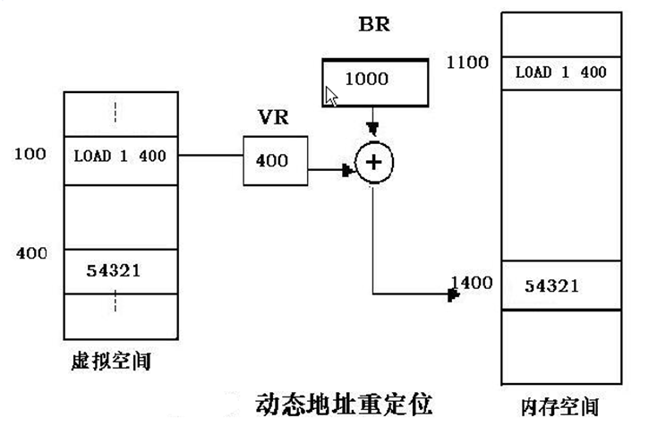

编译： 由编译程序将用户源代码编译成若干个目标模块（编译就是把高级语言翻译为机器语言）

链接： 由链接程序将编译后形成的一组目标模块， 以及所需库函数链接在一起， 形成一个完整的装入模块

装入（装载） ： 由装入程序将装入模块装入内存运行  

### 4.2.2 程序的链接

源程序经过编译后，可得到一组目标模块。链接程序的功能是将这组目标模块以及它们所需要的库函数装配成一个完整的装入模块。

具体工作：对相对地址修改；变换外部调用符号

#### 1. 静态链接方式

在程序运行前，将各目标模块及它们所需的库函数链接成一个完整的模块，以后不再拆开

对相对地址进行修改；变换外部调用符号

#### 2. 装入时动态链接

在装入内存时，采用边装入边链接的链接方式

便于修改和更新

便于实现对目标模块的共享

#### 3. 运行时动态链接

将某些模块的链接推迟到执行时才执行。即在执行过程中，若发现一个被调用模块尚未装入内存时，立即由OS去找到该模块并将它装入内存，并把它链接到调用者模块上。

加快装入过程，节省大量内存空间，便于实现对目标模块的共享

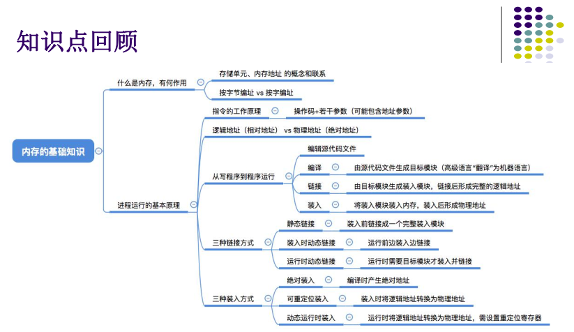

## 4.3 连续分配存储管理方式

为用户程序分配一个连续的内存空间，曾被广泛应用，且现在仍被采用。

### 4.3.1 单一连续分配

在单道程序环境下，仅装有一道用户程序，即整个内存的用户空间由该程序独占

优点： 实现简单； 无外部碎片； 可以采用覆盖技术扩充内存； 不一定需要采取内存保护（ eg： 早期的 PC 操作系统MS-DOS）。
缺点： 只能用于单用户、 单任务的操作系统中； 有内部碎片； 存储器利用率极低。

### 4.3.2 固定分区分配

预先把可分配的主存空间分割成若干个连续的区域，称为一个分区

**划分分区的方法**：分区大小一样、分区大小不等

**内存分配管理**：

​	将分区按大小排队，一般由小到大

​	建立分区使用表——起址、大小、状态

​	程序装入时，由内存分配程序检索**分区使用表**，找到符合要求的分区，并进行标记。

分区大小相等： 缺乏灵活性， 但是很适合用于用一台计算机控制多个相同对象的场合（ 比如： 钢铁厂有n个相 同的炼钢炉， 就可把内存分为n个大小相等的区域存放 n个炼钢炉控制程序）

分区大小不等： 增加了灵活性， 可以满足不同大小的进程需求。 根据常在系统中运行的作业大小情况进行划分 （比如： 划分多个小分区、 适量中等分区、 少量大分区）  

优点： 实现简单。
缺点： a. 当用户程序太大时， 可能所有的分区都不能满足需求；
b. 会产生内部碎片， 内存利用率低  

### 4.3.3 动态分区分配

根据进程的实际需要，动态地分配内存空间

#### 1. 动态分区分配中的数据结构

空闲分区表：每个空闲分区占一个表目，表目中包括分区号、分区大小和分区始址等数据项

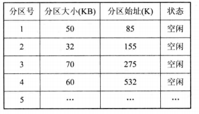

空闲分区链：双向链表

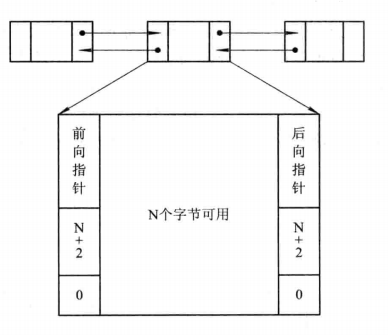

#### 2. 动态分区分配算法

4.3.4 - 4.3.5

#### 3. 分区分配操作

**分配内存**

从空闲分区链（表）中找到所需大小的分区。

设请求的分区大小为u.size，表中每个空闲分区的大小为m.size，规定的不再切割的分区大小为size

判断条件：M.Size - U.Size ≦ Size

剩余部分挂接到空闲分区链（表）上。

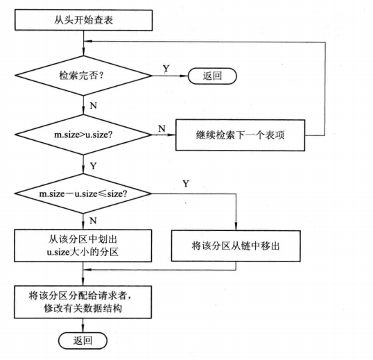

**回收内存**

回收区与插入点的前一个空闲分区相邻接

回收区与插入点的后一个空闲分区相邻接

回收区与插入点的前后两个空闲分区相邻接

回收区不与任何一个空闲分区相邻接

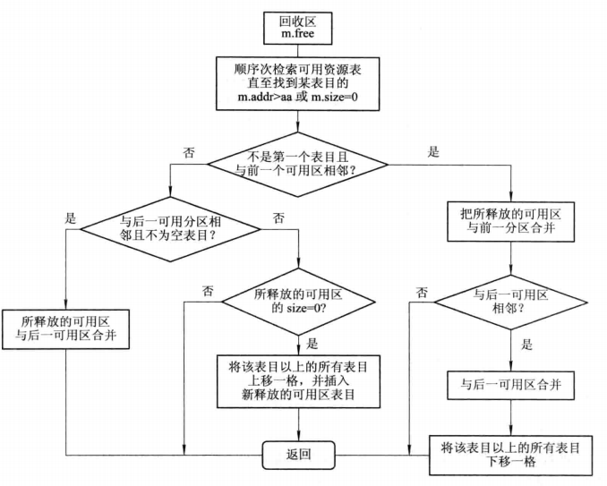

### 4.3.4 基于顺序搜索的动态分区分配算法

**首次适应算法（First Fit, FF）**：

  空闲分区按起址递增次序排列，从头开始直至找到第一个满足要求的空闲分区。

  特点：内存低端会留下小的空闲区，高端有大的空闲区

**循环首次适应算法（Next Fit, NF）**：

  从上次分配的位置之后开始查找。

  特点：使内存的空闲分区均匀，但缺乏大的空闲分区

**最佳适应算法（Best Fit, BF）**：

  搜索整个序列，找到适合条件的最小的分区进行分配

  空闲分区按其容量从小到大的顺序链接

  用最小空间满足要求，但缺点明显会留下大量难以利用的小碎片。

**最坏适应算法（Worst Fit, WF）**：

  与BF正好相反，空闲分区按大小从大到小的次序排列，最前面的最大的空闲分区就是找到的分区。

  优点：分割后空闲块仍为较大空块

  缺点：一段时间后就不能满足对于较大空闲区的分配要求。

### 4.3.5 基于索引搜索的动态分区分配算法

**快速适应算法（Quick Fit）**：

  空闲分区按容量大小进行分类。

  优点是查找效率高， 仅需要根据进程的长度， 寻找到能容纳它的最小空闲区链表， 并取下第一块进行分配即可。 在进行空闲分区分配时，不会对任何分区产生分割， 所以能保留大的分区， 满足对大空间的需求， 也不会产生内存碎片。  

  对于每一类具有相同容量的所有空闲空间分区，单独设立一个空闲分区链表。

  在内存中设立一张管理索引表，每个表项对应一种空闲分区类型。

  优点：不分割分区，不产生碎片，查找效率高

  缺点：分区归还主存时算法复杂。一个进程占用一个分区，存在浪费

**伙伴系统（Bubby system）**：

分区（已分配和空闲）大小均为2的k次幂（1<=k<=m), $2^m$为可分配内存大小。

对不连续的空闲分区，按分区大小进行分类。对具有相同大小的所有空闲分区，单独设立一个空闲分区双向链表，即会存在k个空闲分区链表。

分配时，设需分配长度为n，找$2^i$分区链的分区，使$2^{i-1}<n<2^i$，若无，找$2^{i+1}$且把它均分两块，称为伙伴。一个加入$2^i$分区链，一个分配；.......

回收时，若已存在$2^i$空闲分区，则将其于伙伴合并为$2^{i+1}$分区，.....

特点：性能取决于查找空闲分区的位置和分割、合并的时间。 时间上不及快速适应算法，但空闲分区的使用率高

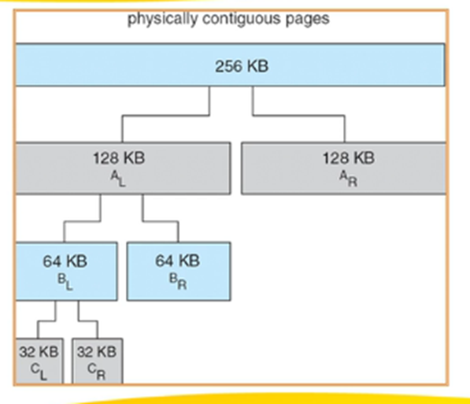

**哈希算法**：

利用哈希快速查找的优点，以及空闲分区在可利用空闲区表中的分布规律，建立哈希函数。

构造一张以空闲分区大小为关键字的哈希表，该表的每一个表项记录了一个对应的空闲分区链表。

分配时，根据所需空闲分区大小，通过哈希函数计算，即得到在哈希表中的位置，找到对应的空闲分区表。

优点：查找快速

### 4.3.6 可重定位分区分配

随着系统接收的作业的增加，内存中连续的大块分区不复存在，产生了大量的“碎片”。

新的作业无法装入到每个“碎片”小分区上运行，但所有碎片的空间总和可能大于需求。

紧凑：通过移动内存中进程位置，一把原来多个分散的小分区拼接成一个大分区的方法，也叫作 “拼接”。

动态重定位：在指令运行时，实现地址转换（从相对地址转换为绝对地址）

分配算法：类似于动态分区分配，增加了紧凑的功能。

缺点： 用户程序在内存中的地址发生变化， 必须重定位。

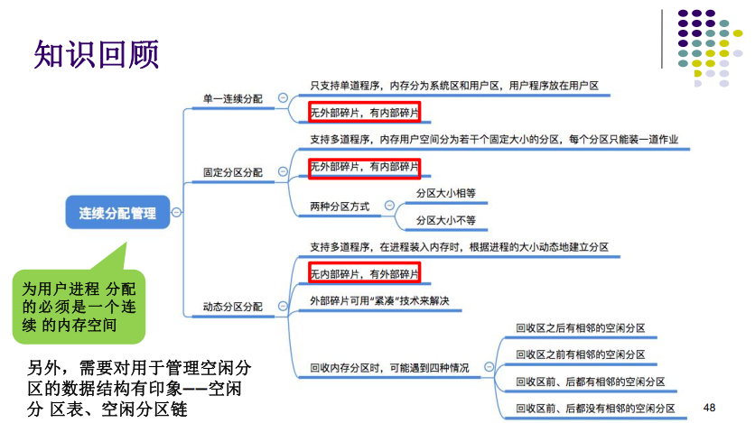

## 4.4 对换

定义：把内存中暂时不能运行的进程或者暂时不用的程序和数据换出到外存上，以便腾出足够的内存空间，再把已具备运行条件的进程或进程所需要的程序和数据换入内存

目的：用于解决内存不足的问题，提高内存利用率，目前广泛应用于OS中。

实现进程对换， 系统必须具备的功能： 对换空间的管理、 进程的换出、 进程的换入

**对换的类型**

​	整体对换（中级调度）：以进程为单位的对换

​	部分对换（页面替换算法）：以“页”或“段”为单位的对换

**对换空间的管理**

外存的划分：文件区、对换区

​	文件区管理目标：首先是提高文件存储空间利用率，然后才是提高文件的访问速度，采用离散分配方式

​	对换区管理目标：首先是提高进程换入和换出的速度，然后才是提高文件存储空间的利用率，采取连续分配方式，较少考虑外存中的碎片问题		

管理方式：空闲分区表、空闲分区链

分配算法：首次适应法、循环首次适应法、最佳适应法

**进程的换出与换入**

进程的换出

​	选择处于阻塞或睡眠状态且优先级最低的进程

​	将该进程的程序和数据传送到磁盘的对换区上

​	回收内存空间，修改该进程的PCB

进程的换入

​	定时查看进程状态

​	将处于就绪态的，换出时间最久的进程换入内存

## 4.5 分页存储管理方式

离散分配方式：分页存储管理方式、分段存储管理方式、段页式存储管理方式

### 4.5.1 分页存储管理的基本方法

页面：分页存储管理将进程的逻辑地址空间分成若干个页

**地址结构**：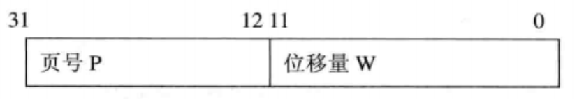

图中的地址长度为32位，其中0~11位为页内地址，即每页的大小为4KB，12~31位为页号，地址空间最多允许有1M页

对于特定机器，地址结构一定，给定一个逻辑地址空间中的地址为A，页面的大小为L，页号P和页内地址d可按下式求得：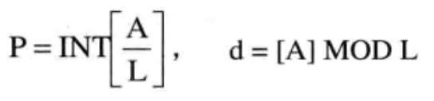

其中，INT是整除函数，MOD是取余函数

**页表**：实现从页号到物理块号的地址映射

### 4.5.2 地址变换机构

将用户地址空间中的逻辑地址转换为内存空间中的物理地址

借助**页表**实现

**基本的地址变换机构**：设置页表寄存器PTR

二次访问内存，第一次访问页表，第二次访问真实物理地址

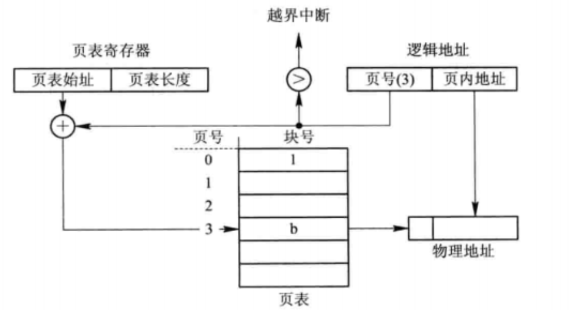

**快表**：又称为联想寄存器，效果类似于cache

### 4.5.3 访问内存的有效时间

从进程发出指定逻辑地址的访问请求，经过地址变换，到在内存中找到的实际地址单元并取出数据，所需要花费的总时间，称为内存的有效访问时间EAT。

假设访问依次内存的时间为t，

​	在基本分页存储管理方式中：$EAT=t+t=2t$

​	在引入快表的分页存储管理方式中：$EAT=a*\lambda + (t+\lambda)(1-a)+t=2t+\lambda-t*a$

​		其中，$\lambda$表示查找快表所需要的时间，a为命中率，t表示访问一次内存所需要的时间

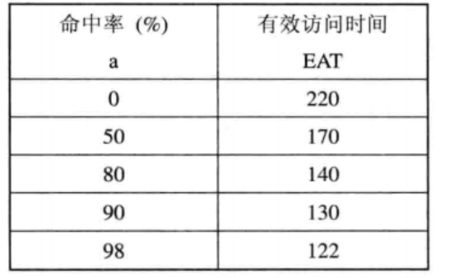

### 4.5.4 两级和多级页表

解决页表过大且连续的问题：

 	1. 对于页表所需的内存空间，可采用离散分配方式，以解决难以找到一块连续的大内存空间的问题
 	2. 只将当前需要的部分页表项调入内存，其余的页表仍驻留在磁盘上，需要时再调入

#### 两级页表

将页表分页，使每个页面的大小与内存物理块的大小相同，并为它们进行编号，然后离散地将各个页面分别存放再不同物理块中 ，并再建立一张页表，称为**外层页表**

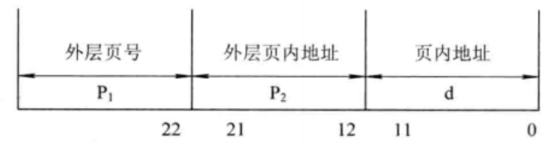

#### 多级页表

多用于64位计算机

### 4.5.5 反置页表

一般页表记录一个进程的逻辑地址，每个进程都有一份，反置页表记录物理块号，只有一份，大大减少空间占用

可利用Hash算法进行检索

## 4.6 分段存储管理方式

引入分段存储管理方式的目的：满足用户（程序员）在编程和使用上多方面的需求

### 4.6.1 分段存储管理方式的引入

方便编程

信息共享

信息保护

动态增长

动态链接

### 4.6.2 分段系统的基本原理

#### 1. 分段

分段地址的结构：

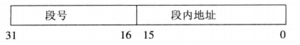

#### 2. 段表

从物理内存中找到每个逻辑段对应的位置

用于实现从逻辑段到物理内存的映射

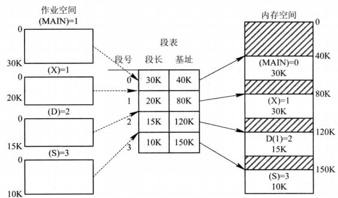

#### 3. 地址变换机构

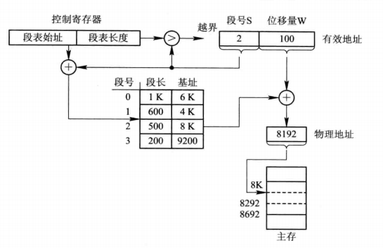

段式存储方式和页式存储方式访问一次数据都须访问两次内存，成倍降低计算机速率， 解决方法：增设联想存储器

#### 4. 分页和分段的主要区别

页是信息的物理单位

页的大小固定且有系统决定

分页的用户程序地址空间是一维的

### 4.6.3 信息共享

#### 1. 分页系统中对程序和数据的共享

#### 2. 分段系统中程序和数据的共享

### 4.6.4 段页式存储管理方式

优点：便于实现、分段可共享、易于保护、可动态链接、便于解决外部碎片

#### 1. 基本原理

先将用户程序分成若干个段，再把每个段分成若干个页

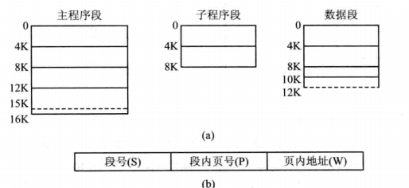

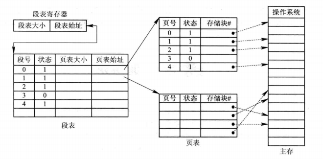

#### 2. 地址变换过程

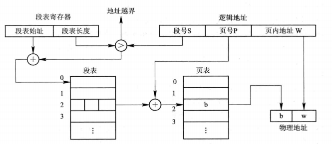

需三次访问内存，需要增加高速缓冲寄存器

## 第四章复习

4.2 程序的装入和链接

# 第5章 虚拟存储器

## 5.1 虚拟存储器概述

虚拟存储器解决的问题：

1. 作业过大，所需内存空间超过内存总容量
2. 大量作业要求运行，内存容量不足

解决思路：从逻辑上扩充内存容量

### 5.1.1 常规存储管理方式的特征和局部性原理

#### 1. 常规存储器管理方式的特征

一次性

驻留性

#### 2. 局部性原理

1. 程序执行时，除了少部分的转移和过程调用指令外，在大多数情况下时顺序执行的
2. 过程调用将会使程序的执行轨迹由一部分区域转移至另一部分区域
3. 程序中存在许多循环结构，这些结构虽然只由少数指令构成，但是它们被多次执行
4. 程序中还包括许多对数据结构的处理，如对数组进行操作，这些处理往往都局限于很小的范围内

局限性又表现在下述两个方面：

1. 时间局限性
2. 空间局限性

#### 3. 虚拟存储器的基本工作情况

缺页中断：调入缺页

置换功能：调出暂时不用的页（段）

### 5.1.2 虚拟存储器的定义和特征

#### 1. 虚拟存储器的定义

具有请求调入功能和置换功能，能从逻辑上对内存容量加以扩充的一种存储器系统

逻辑容量由内存容量和外存容量之和所决定

#### 2. 虚拟存储器的特征

多次性

对换性

虚拟性

虚拟性是以多次性和对换性为基础；多次性和对换性必须建立在离散分配的基础上

### 5.1.3 虚拟存储器的实现方法

建立在离散分配存储管理方式的基础上

#### 1. 分页请求系统

在分页系统的基础上增加了请求调页功能和页面置换功能所形成的页式虚拟存储系统

**硬件支持**：

1. 请求分页的页表机制
2. 缺页中断机构
3. 地址变换机构

**实现请求分页的软件**：包括所有用于实现请求调页的软件和实现页面置换的软件

#### 2. 请求分段系统

在分段系统的基础上增加了请求掉段及分段置换功能所形成的段式虚拟存储系统

**硬件支持**：

1. 请求分段的段表机制
2. 缺页中断机构
3. 地址变换机构

**软件支持**：包括所有用于实现请求调段的软件和实现段置换的软件

## 5.2 请求分页存储管理方式

### 5.2.1 请求分页中的硬件支持

#### 1. 请求页表机制

请求页表：将用户地址空间中的逻辑地址映射为内存空间中的物理地址

状态位（存在位）P：用于指示该页是否已调入内存

访问字段A：用于记录本页在一段时间内被访问的次数

修改位M：标识该页是否被修改过

外存地址：指出该页在外存上的地址

#### 2. 缺页中断机构

缺页中断是一种特殊的中断，表现在：

1. CPU通常是在一条指令执行完后才检查是否有中断请求到达，而缺页中断是在指令执行期间产生和处理中断信号
2. 一条指令在执行期间可能产生多次缺页中断

#### 3. 地址变换机构

### 5.2.2 请求分页中的内存分配

#### 1. 最小物理块数的确定

最小物理块数是指能保证进程正常运行所需的最小物理块数。低于这个数量，进程将无法运行。

#### 2.  内存分配策略

固定分配：为每个进程分配一组固定的物理块

可变分配：为每个进程分配一定的物理块，运行期间可适当增减

局部置换：进程在运行中发现缺页，只能从分配给该进程的n个页面中选出一页换出，然后再调入一页

全局置换：缺页时，在OS所保留的全部空闲物理块中选择一块调出

1. 固定分配局部置换

   实现困难：应为每个进程分配多少个物理块难以确认

2. 可变分配全局置换

3. 可变分配局部置换

#### 3. 物理块分配算法

1. 平均分配算法

2. 按比例分配算法

   系统中共有n个进程，每个进程的页面数为$S_i$，则系统中各进程页面数的总和为：$S=\sum^n_{i=1}S_i$，又假定系统中可用的物理块总数为m，则每个进程所能分到的物理块数为$b_i$，则$b_i=\frac{S_i}{S}*m$，这里，$b_i$应该取整且大于最小物理块数

3. 考虑优先权的分配算法

### 5.2.3 页面调入策略

#### 1. 何时调入页面

确定系统将进程运行时所缺的页面调入内存的时机

1. 预调页策略：将那些预计在不久之后便会被访问的页面预先调入内存
2. 请求调页策略：发现缺页便提出请求，开销大

#### 2. 从何处调入页面

1. 系统拥有足够的对换区空间：全部从对换区调入所需页面，提高调页速度
2. 系统缺少足够的对换区空间：对于不会被修改的文件，在文件区调入换出；可能被修改的文件，在对换区调入换出
3. UNIX方式

#### 3. 页面调入过程

对用户透明

#### 4. 缺页率

假设一个进程的逻辑空间为n页，系统为其分配的内存物理块数为m($m\leq n$)，在进程运行过程中，访问页面成功的次数为S，访问失败的次数为F，则总访问次数为$A=S+F$，则缺页率为$f=\frac{F}{A}$

影响缺页率的因素：

1. 页面大小
2. 进程所分配的物理块的数目
3. 页面置换算法
4. 程序固有特性

## 5.3 页面置换算法

抖动：刚被换出的页很快又被访问，需要重新调入，选一页调出，而被换出的页又很快被访问，需要重新调入。

### 5.3.1 最佳置换算法和先进先出置换算法

#### 1. 最佳（Optimal）置换算法

调出未来最长时间内不再被访问的页面，理论算法，无法实现

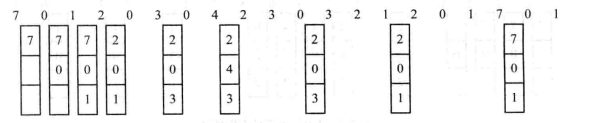

#### 2. 先进先出（FIFO）页面置换算法

按调入内存的页面的顺序建立队列，并设立替换指针，使它总是指向最老的页面

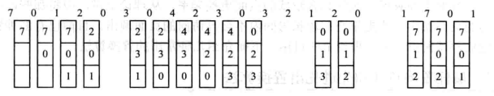

### 5.3.2 最近最久未使用和最少使用置换算法

#### 1. LRU（Least Recently Used）置换算法

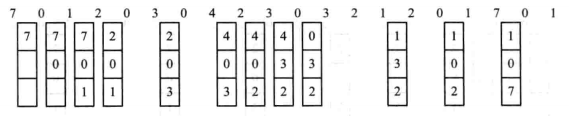

#### 2. LRU算法的硬件支持

寄存器和栈两类硬件之一

1. 寄存器

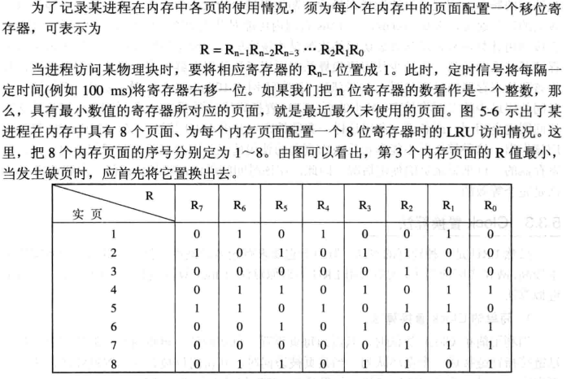

2. 栈

   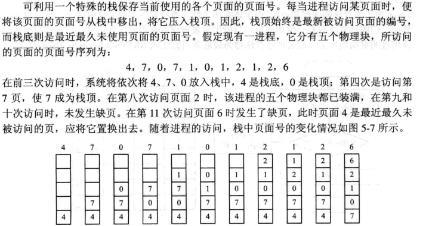

#### 3. 最少使用（Least Frequently Used，LFU）置换算法

### 5.3.3 Clock置换算法

#### 1. 简单的Clock置换算法

又称为最近未用算法或NRU（Not Recently Used）算法

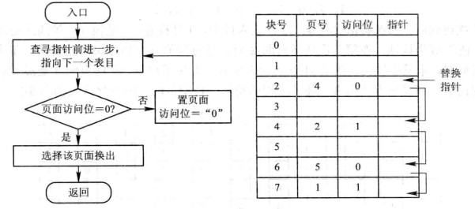

#### 2. 改进型Clock置换算法

由访问位A和修改位M可以组合成下面四种类型的页面：

​	1类（A=0，M=0）：表示该页最近既未被访问，又未被修改，是最佳淘汰页

​	2类（A=0，M=1）：表示该页最近未被访问，但已被修改，并不是很好的淘汰页

​	3类（A=1，M=0）：表示该页最近已被访问，但未被修改，该页有可能再被访问

​	4类（A=1，M=1）：表示该页最近已被访问且被修改，可能再被访问

算法步骤：

1. 从指针当前位置开始，寻找1类页面，扫描期间不改变访问位A
2. 若第一步失败，寻找2类页面，将所有扫描过的访问位置0
3. 若第二步失败，将所有访问位复0，指针回到开始的位置，重复1、2步操作

### 5.3.4 页面缓冲算法（Page Buffering Algorithm，PBA）

#### 1. 影响页面换进换出效率的若干因素

1. 页面置换算法
2. 写回磁盘的频率
3. 读入内存的频率

#### 2. 页面缓冲算法PBA

PBA主要特点：1. 显著降低页面换进换出的频率，减少磁盘I/O次数，减少换进换出的开销；2、可采用简单的置换策略，不需要硬件支持，实现简单

1. 空闲页面链表

   进程需要读入页面时，将空闲页面链表中的第一个物理块装入该页；页面换出时，改在空闲链表末尾，当某进程再需要该也表示，在空闲链表中查找，免除磁盘读入的操作

2. 修改页面链表

   当进程需要将一个已修改的页面换出时，系统并不立即把它换出到外存上，而是将它所在的物理块改在修改页面链表的末尾，降低磁盘内容读入的频率

### 5.3.5 访问内存的有效时间

1. 被访问页在内存中，且其对应的页表在快表中

   此时不存在缺页中断情况，内存的有效访问时间（EAT）分为查找快表的时间（$\lambda$）和访问实际物理地址所需的时间（t）
   $$
   EAT=\lambda + t
   $$

2. 被访问页在内存中，且其所对应的页表项不在快表中

   此时不存在缺页中断情况，但需要两次访问内存，一次读取页表，一次读取数据，还需要更新快表，EAT可分为：查找快表的时间、查找页表的时间、修改快表的时间、访问实际物理地址的时间
   $$
   EAT = \lambda + t + \lambda + t = 2 * (\lambda + t)
   $$

3. 被访问页不在内存中

   分为：查找快表的时间、查找页表的时间、处理缺页中断的时间、更新快表的时间、访问实际物理地址的时间

   中断处理时间$\varepsilon$

$$
EAT=\lambda + t+\varepsilon + \lambda + t=\varepsilon +2(\lambda + t)
$$

考虑到命中率a和缺页率f等因素后：
$$
EAT=\lambda + a*t+(1-a)*[t+f*(\varepsilon + \lambda+t)+(1-f)*(\lambda+t)]
$$
不考虑命中率，仅考虑缺页率，即上式中的$\lambda=0$和$a=0$，设缺页中断处理时间为$\phi$，则
$$
EAT=t+f*(\phi+t)+(1-f)*t
$$

## 5.4 “抖动”与工作集

### 5.4.1 多道程序度与“抖动”

1. 多道程序度与处理机的利用率

   横轴表示多道程序的数量，纵轴表示相应的处理机的利用率

   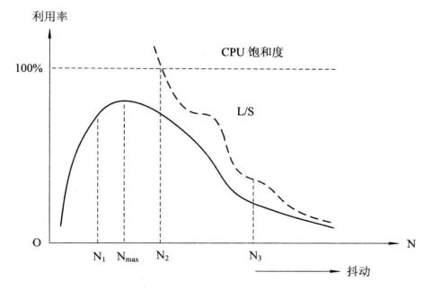

2. 产生“抖动”的原因

   根本原因：同时在系统中运行的进程太多，使分配给每一个进程的物理块太少，不能满足进程正常运行的基本要求，频繁缺页

### 5.4.2 工作集

工作集的定义：在某段时间间隔$\Delta$里，进程实际所要访问的页面的集合

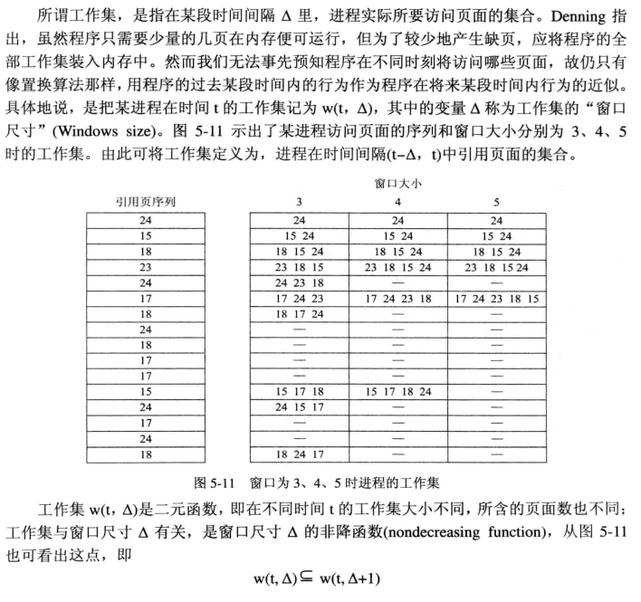

### 5.4.3 ”抖动“的预防方法

1. 采取局部置换策略
2. 把工作集算法融入到处理机调度中
3. 利用”L=S“准则调节缺页率
4. 选择暂停的进程

## 5.5 请求分段存储管理方式

### 5.5.1 请求分段中的硬件支持

#### 1. 请求段表机制

存取方式：根据该信息的属性对段进行保护（权限）

访问字段A：记录频繁访问程度

修改位M：是否被修改过

存在位P：是否已调入内存

增补位：本段在运行过程中是否做过动态增长

外存地址：指示起始地址，即起始盘块号

#### 2. 缺段中断机构

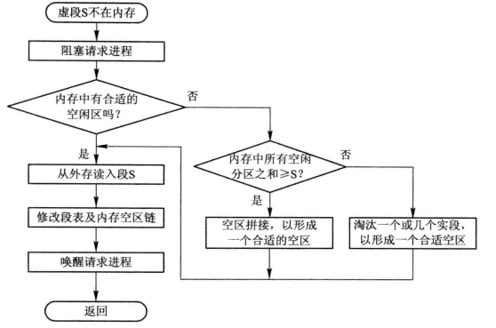

#### 3. 地址变换机构

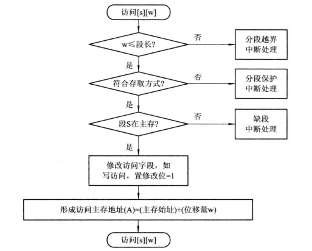

### 5.5.2 分段的共享与保护

#### 1. 共享段表

系统中配置共享段表，记录共享段数据

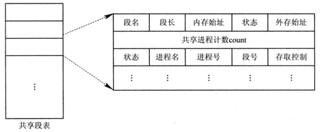

共享进程计数count：记录有多少进程正在共享该分段

存取控制字符：对不同进程的权限控制

段号：不同进程对于同一个共享段可以有不同的段号

#### 2. 共享段的分配和回收

1. 分配：

2. 回收：

#### 3. 分段保护

1. 月结检查

2. 存取控制检查：只读、只执行、读/写

3. 环保护机构：

   一个程序可以访问驻留在相同环或较低特权环（外环）中的数据

   一个程序可以调用驻留在相同环或较高特权环（内环）中的服务

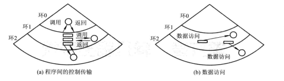

# 第7章 文件管理

## 7.1 文件和文件系统

基于文件系统的概念，可以把数据组成分为数据项、记录和文件三级

### 7.1.1 数据项、记录和文件

#### 1. 数据项

在文件系统中，数据项是最低级的数据组织形式，可分为基本数据项和组合数据项

#### 2. 记录

一组相关数据项的集合，用于描述一个对象在某方面的属性

在不同环境下，一个对象的记录不同

关键字：用于唯一标识一个记录的一个或多个数据项的集合

#### 3. 文件

文件是指由创建者所定义的、具有文件名的一组相关元素的集合，可分为有结构文件和无结构文件两种。

文件属性：文件类型、文件长度、文件的物理位置、文件的建立时间

### 7.1.2 文件名和类型

**1. 文件名和扩展名**

**2. 文件类型**

1. 按用途分类：系统文件、用户文件、库文件
2. 按文件中数据的形式分类：源文件、目标文件、可执行文件
3. 按存取控制属性分类：只执行文件、只读文件、读写文件
4. 按组织形式和处理方式分类：普通文件、目录文件、特殊文件

### 7.1.3 文件系统的层次结构

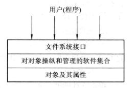

1. 对象及其属性

   文件管理系统管理的对象：文件、目录、磁盘存储空间

2. 对对象操纵和管理的软件的集合

   文件系统的功能大多在这一层实现：对文件存储空间的管理、对文件目录的管理、将文件的逻辑地址转换为物理地址、对文件读和写的管理、对文件的共享与保护等功能

   四个层次：I/O控制层、基本文件系统层、基本I/O管理程序、逻辑文件系统

3. 文件系统的接口

   命令接口、程序接口

### 7.1.4 文件操作

1. 最基本的文件操作：创建文件、删除文件、读文件、写文件、设置文件的读/写位置

2. 文件的“打开”和“关闭”操作
3. 其他文件操作

## 7.2 文件的逻辑结构

### 7.2.1 文件逻辑结构的类型

#### 1. 按文件是否有结构分类

1. 有结构文件：定长记录、变长记录
2. 无结构文件

#### 2. 按文件的组织方式分类

1. 顺序文件
2. 索引文件
3. 索引顺序文件

### 7.2.2 顺序文件

#### 1. 顺序文件的排列方式

1. 串结构
2. 顺序结构

#### 2. 顺序文件的优缺点

优点：

1. 适用于对文件中的记录进行批量存取时（即每次要读或写一大批记录），所有逻辑文件中顺序文件的存取效率最高
2. 对于顺序存储设备（如磁带），只有顺序文件才能被存储并能有效地工作

缺点：

1. 在交互查询时效率很低
2. 想增加或删除一个记录比较困难

### 7.2.3 记录寻址

#### 1. 隐式寻址方式

#### 2. 显式寻址方式

1. 通过文件中记录的位置
2. 利用关键字

### 7.2.4 索引文件

1. 按关键字建立索引
2. 具有多个索引表的索引文件

### 7.2.5 索引顺序文件

#### 1. 索引顺序文件的特征

1. 记录是按关键字的顺序组织起来的
2. 引入了文件索引表，实现对索引文件的随机访问
3. 增加了溢出文件，记录新增加的、删除的和修改的记录

克服变长记录文件的缺点，而且代价不算太大

#### 2. 一级索引顺序文件

建立方法：将变长记录顺序文件中的所有记录分为若干个组，然后为顺序文件建立一张索引表，并为每组中的第一个记录在索引表中建立一个索引项，其中含有该记录的关键字和指向该记录的指针

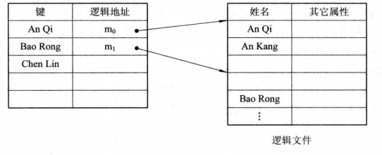

#### 3. 两级索引顺序文件

### 7.2.6 直接文件和哈希文件

1. 直接文件
2. 哈希文件

## 7.3 文件目录

对目录管理的要求如下：

1. 实现”按名存取“
2. 提高对目录的检索速度
3. 文件共享
4. 允许文件重名

### 7.3.1 文件控制块和索引结点

#### 1. 文件控制块FCB

1. 基本信息类：文件名、文件物理地址、文件逻辑结构、文件的物理结构
2. 存取控制信息类
3. 使用信息类

#### 2. 索引结点

1. 索引结点的引入

   检索目录文件的过程中，只用到了结点名，仅当找到了一个目录项才需读出其物理地址，其他信息一概不用
   
   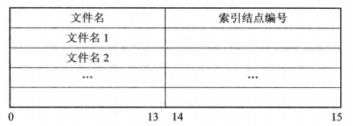

2. 磁盘索引结点

   每个文件有唯一的一个磁盘索引结点，主要包括：文件主标识符、文件类型、文件存取权限、文件物理地址、文件长度、文件连接计数、文件存取时间

3. 内存索引结点

   索引结点编号、状态、访问计数、文件所属系统的逻辑设备号、链接指针

### 7.3.2 简单的文件目录

#### 单级文件目录

在整个文件系统中只建立一张目录表，每个文件占一个表项

单极文件目录的优点是简单，但只能实现按名存取，缺点：

1. 查找速度慢
2. 不允许重名
3. 不便于实现文件共享

#### 两级文件目录

主文件目录MFD+用户文件目录UFD

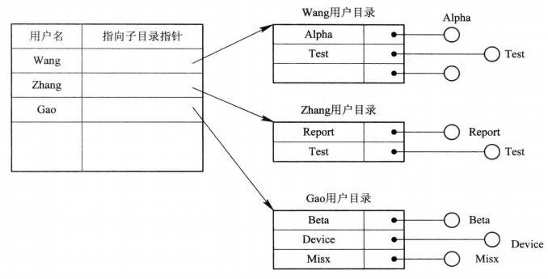

基本满足对文件目录的四方面的要求：

1. 提高了检索目录的速度
2. 在不同的用户目录中，可以使用相同的文件名
3. 不同用户还可使用不同的文件名访问系统中的同一个共享文件

### 7.3.3 树形结构目录

#### 树形目录

主目录被称为根目录，在每个文件目录中，有且只有一个根目录，每个文件和每个目录都只能有一个父目录，把数据文件称为树叶，其他的目录均作为树的结点，或称为子目录

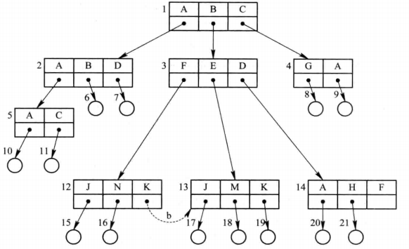

#### 路径名和当前目录

1. 路径名
2. 当前目录（工作目录）
3. 目录操作：创建目录、删除目录（不删除非空目录、可删除非空目录）、改变目录、移动目录、链接操作、查找

### 7.3.4 目录查询技术

1. 线性检索法

2. Hash方法

## 7.4 文件共享

### 7.4.1 基于有向无循环图实现文件共享

1. 有向无循环图DAG

   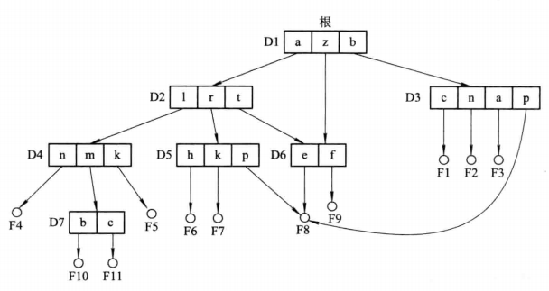

2. 利用索引结点

### 7.4.2 利用符号链接实现文件共享

1. 利用符号链接的基本思想

   允许一个文件或子目录有多个父目录，但其中仅有一个作为主（属主）父目录，其他的几个父目录都是通过符号链接方式与之相链接的（简称链接父目录）

   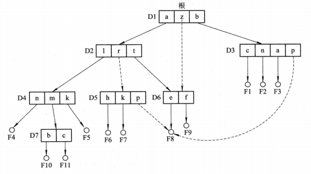

2. 如何利用符号链实现共享

   大白话：用快捷方式实现文件共享

3. 利用符号链接实现共享的优点

   不会产生空指针的问题

4. 利用符号链的共享方式存在的问题

   每次访问文件的开销大，增加了访问磁盘的频率，耗费一定的磁盘空间为它配置一个索引结点

## 7.5 文件保护

影响文件安全性的主要因素：人为因素、系统因素、自然因素

为确保文件的安全性，可采取的措施：

1. 通过存取控制机制，防止由人为因素所造成的文件不安全性
2. 采取系统容错技术，防止由系统部分的故障所造成的文件的不安全性
3. 建立后被系统，防止由自然因素所造成的不安全性

### 7.5.1 保护域

1. 访问权

2. 保护域

   进程只能在指定域内执行操作

3. 进程和域间的静态联系

   在进程和域之间可以一一对应，即一个进程只联系着一个域，换句话说，在进程的整个生命期中，可用资源是固定的，这种域被称为静态域

4. 进程和域间的动态联系方式

   进程和域之间的一对多关系，即一个进程可以联系着多个域

### 7.5.2 访问矩阵

1. 基本的访问矩阵

   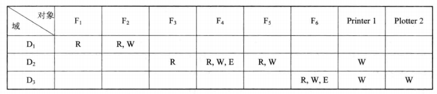

2. 具有域切换权的访问矩阵

   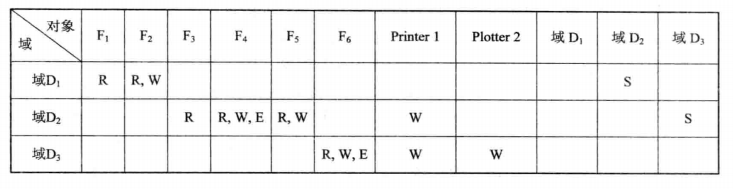

### 7.5.3 访问矩阵的修改

1. 拷贝权

   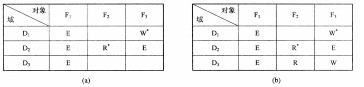

2. 所有权

   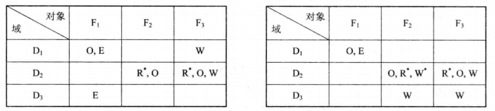

3. 控制权

   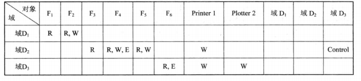

### 7.5.4 访问矩阵的实现

1. 访问控制表
2. 访问权限表

# 第8章 磁盘存储器的管理

对磁盘存储器管理的主要任务和要求是：

1. 有效地利用存储空间
2. 提高磁盘的I/O速度
3. 提高磁盘系统的可靠性

## 8.1 外存的组织方式

1. 连续组织方式
2. 链接组织方式
3. 索引组织方式

### 8.1.1 连续组织方式

主要优点：

1. 顺序访问容易
2. 顺序访问速度快

主要缺点：

1. 要求为一个文件分配连续的存储空间
2. 必须事先知道文件的长度
3. 不能灵活地删除和插入记录
4. 对于那些动态增长的文件

### 8.1.2 链接组织方式

主要优点：

1. 消除了磁盘的外部碎片，提高了外存的利用率
2. 对插入、删除和修改记录都非常容易
3. 能适应文件的动态增长，无需事先知道文件的大小

#### 隐式链接

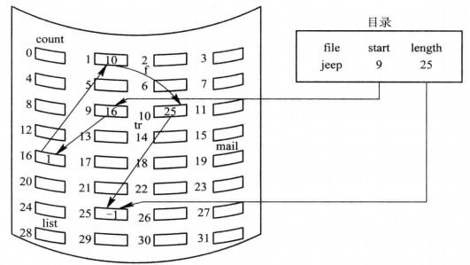

主要问题：只适合于顺序访问，对随机访问时及其低效的

改进方式：将几个盘块组成一个簇

#### 显式链接

把用于链接文件各物理块的指针显式地存放在内存的一张链接表FAT中。

### 8.1.3 FAT技术

1. FAT12 
2. FAT16
3. FAT32

### 8.1.4 NTFS的文件组织方式

#### NTFS新特征

1. 使用了64位磁盘地址
2. 支持长文件名
3. 具有系统容错功能
4. 能保证系统中的数据一致性

#### 磁盘组织

#### 文件的组织

### 8.1.5 索引组织方式

#### 单级索引组织方式

主要优点：支持直接访问

主要问题：每当建立一个索引文件时，应位该文件分配一个索引块，将分配给该文件的所有盘块号记录于其中

#### 多级索引组织方式

主要优点：大大加快了对大型文件的查找速度

主要缺点：在访问一个盘块时，其所需启动磁盘的次数随着索引级数的增加而增多

#### 增量式索引组织方式

基本思想：

1. 对于小文件：将它们的每一个盘块地址都直接放入文件控制块FCB中
2. 对于中等文件，采用单级索引组织方式
3. 对于大型和特大型文件，可以采用两级和三级索引组织方式

UNIX System V的组织方式：看书，不想记了

## 8.2 文件存储空间的管理
