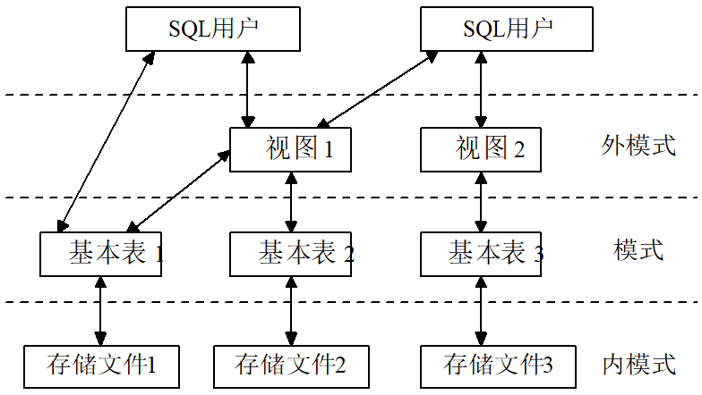

# 第1章 数据库发展史

## 1.1 数据管理技术的发展

### 1.1.1 人工管理阶段

时间：20世纪50年代中期以前，计算机本身的水平较低。

硬件方面：计算机的运算速度低、内存容量小，外存还没有磁盘等直接存取的存储设备

软件方面：还没有操作系统，没有管理数据的软件。

**特点**：

1. 数据不保存在计算机内
2. 没有专用的软件对数据进行管理
3. 只有程序，没有文件的概念
4. 数据面向程序

### 1.1.2 文件系统阶段

时间：从20世纪50年代后期到60年代中期，计算机的硬件、软件都有了很大发展

硬件：有了磁盘、磁鼓等直接存取的存储设备

软件：有了操作系统，其中有专门管理数据的文件系统。

从处理方式讲，不仅有了文件批处理，而且能够联机实时处理。此时，计算机不仅用于科学计算，还大量用于管理。


**特点**：

1. 数据以文件形式长期保存在磁盘上
2. 数据的逻辑结构与物理结构有了区别
3. 文件组织多样化
4. 数据不再属于某个特定的程序，可以重复使用
5. 对数据的操作以记录为单位


### 1.1.3 文件系统的缺陷

**数据的冗余性**：文件之间缺乏联系，每个应用程序对应的文件中可能有重复存储的数据

**数据不一致性**：往往由数据冗余造成，文件更新时，相同的数据在不同文件中不一样。

**数据联系弱**：文件之间相互独立，缺乏联系

### 1.1.4 倒排文件系统阶段

倒排文件是索引文件的推广，每个字段提供单独的索引，方便用户检索，但数据的更新比较复杂和困难

## 1.2 数据库技术的产生和发展

### 1.2.1 数据库技术的产生

**IMS系统**

1968年IBM公司研制IMS系统，在IBM360/370机上运行。

**DBTG报告**

1969年CODASYL（美国数据系统语言协会）的DBTG小组出一份报告，即DBTG报告。

**E.F.Codd的文章**

E.F.Codd于1970年在美国计算机学会通信杂志发表一文。

### 1.2.2 数据库阶段的数据管理特点

1. 采用复杂的数据模型表示数据结构

   描述数据之间的关系，通过存取路径实现，面向整个应用系统

   数据库系统和传统文件系统的根本区别：数据库系统通过所有存取路径表示自然的数据联系

2. 有较高的数据独立性：物理独立性、逻辑独立性

   数据独立性：数据和程序分离，解耦

   物理数据独立性：物理结构的改变尽量不影响整体逻辑结构、用户的逻辑结构以及应用程序

   逻辑数据独立性：整体逻辑结构改变时，尽量不影响用户的逻辑结构及应用程序

3. 提供了方便的用户接口

4. 提供四个方面的数据控制功能

   并发控制、恢复、完整性、安全性

5. 数据操作灵活


### 1.2.3 数据库技术的术语

**数据库（DB）**：

是统一管理的相关数据的集合。

**数据库管理系统（DBMS）**：

是位于用户与操作系统之间的一层数据管理软件，为用户和应用程序提供访问DB的方法，包括DB的建立、查询、更新及各种数据控制。

**数据库系统（DBS）**：

是实现有组织地、动态地存储大量关联数据，方便多用户的计算机软件、硬件和数据资源组成的系统，即采用了数据库技术的计算机系统。

**数据库技术**：

是一门研究数据库的结构、存储、管理和使用的软件学科。

### 1.2.4 数据库技术的发展

分布式数据库技术（区块链）

面向对象数据库技术

数据仓库

云数据库（Amazon AWS）

大数据（5V）

其他数据库技术

# 第2章 数据库系统结构

## 2.1 数据描述

### 2.1.1 概念设计中的数据描述

概念设计：根据用户的需求设计数据库的概念结构

**实体(Entity)**

实体是客观存在、可以相互区分的事物，既可以是实际存在的对象，也可以是某种概念。例如：一个工厂、一个车间、一种操作流程等。

**属性(Attribute)**

事物是有特性的。反映在实体上，就是实体的属性。一个实体具有有限个属性，也可以说是这些属性的总和组成了这个实体。

**实体集(Entityset)**

所有属性名完全相同的实体往往集合在一起，称为实体集。例如：全体职工就是一个实体集。为了区分实体集，每个实体集都有一个名称，即实体名。。

**实体标识符(Identifier)**

能惟一标识实体的属性或属性集。也称关键码，或键。

### 2.1.2 逻辑设计中的数据描述

逻辑设计：根据概念设计得到的概念结构来设计的数据库逻辑结构，即表达方式和实现方法

**字段（Field）**

标记实体属性的命名单位。也称数据项。

**记录（Record）**

字段的有序集合。

**文件（File）**

同一类记录的集合。

**关键码（Key）**

能惟一标识文件中每个记录的字段。


### 2.1.3 存储介质层次及数据描述

**物理存储介质层次**：

高速缓冲存储器

主存储器

快擦写存储器（快闪存）

磁盘存储器

光存储器

磁带

**物理存储中的数据描述**：位、字节、字、块、桶、卷

### 2.1.4 数据联系的描述

实体集内部（实体和实体之间）的联系

实体间的联系有三种：

1. 同一实体集中各实体之间的联系(一元联系)。

2. 两个实体集中各实体之间的联系(两元联系)。
3. 三个实体集中各实体之间的联系(三元联系)。

二元联系的实体间联系有三种情况：

1. 一对一 （1：1）
2. 一对多 （1：N）
3. 多对多 （M：N）

## 2.2 数据模型

### 2.2.1 数据模型的定义

数据模型分两种：

1. 概念数据模型：用于建立信息世界的数据模型，与硬件、DBMS无关，实现方法是“实体联系模型”。（用户观点）
2. 结构（逻辑）数据模型：直接面向数据库的逻辑结构，与硬件、DBMS有关，有三部分构成：**数据结构**、**数据操作**、**数据完整性约束**

**数据结构**是指对实体类型和实体间联系的表达和实现。

**数据操作**是指对数据库的检索和更新（包括插入、删除和修改〉两类操作。

**数据完整性约束**给出数据及其联系应具有的制约和依赖规则。

### 2.2.2 实体联系模型

P.P.S.Chen（陈品山）于1976年提出的“实体―联系模型” （Entity―Relationship Approach,简称E―R模型）

ER图中四个基本成分：

1. **矩形框：表示实体类型**

2. **菱形框：表示联系类型**

3. **椭圆形框：表示实体类型或联系类型的属性**

4. **连线：实体与属性之间、实体与联系之间**

多元联系：两个及以上实体集之间的联系


自身联系：在一个联系中,一个实体集可以出现两次或多次, 扮演多个不同角色, 此种情况称为实体集的自身联系。


### 2.2.3 层次模型

用**树**形（层次）结构表示实体类型及实体间联系的数据模型称为**层次模型**。

树的结点是记录类型，每个非根结点有且只有一个父节点，上一层和下一层记录类型之间的联系是1:N联系

**特点**：

1. 有且仅有一个结点无父结点,这样的结点称为根结点；
2. 非根结点都有且仅有一个父结点。
3. 记录之间的联系通过**指针**实现，查询效率高

**优点**：

1. 查询效率高
2. 用户面对逻辑数据，不必过多考虑物理细节，逻辑与物理数据的转换由DBMS完成

**缺点**：

1. 只能表示1:N联系，M:N联系实现复杂，用户不易掌握
2. 层次顺序严格和复杂，导致数据的查询和更新操作复杂，使程序编写复杂

### 2.2.4 网状模型

用有向**图**结构表示实体类型及实体间联系的数据模型称为**网状模型**。

有向图中的结点是记录类型，箭头表示从箭尾的记录类型到箭头的记录类型间的联系是1:N联系

换句话说：把层次模型的限制放开： 一个结点可以有一个以上的父结点, 就得到网状模型。

**特点**：

1. 可能有一个以上的结点无父结点
2. 结点与其父结点之间的联系可以不止一个
3. 记录之间的联系通过**指针**实现，查询效率高

**缺点**：数据结构复杂和编程复杂

### 2.2.5 关系模型

关系模型的主要特征是用二维**表**格表达实体集。

**特点**：数据结构是**表格**，记录之间的联系通过模式的键体现

### 2.2.6 面向对象模型

面向对象模型是一种可扩充的数据模型,在该数据模型中,数据模型是可扩充的,即用户可根据需要,自己定义新的数据类型及相应的约束和操作。

基本的概念是对象和类

**对象**：对象是面向对象数据模型的基本结构,是面向对象数据库系统的核心。 一个对象是由一些数据以及能够作用在这些数据上的操作组成。 例如,一个职工对象,将包含与职工相关的数据（职工号、 姓名、 性别、 职称、 部门等）以及能够在这些职工数据上进行的操作（增加职工、 删除职工、改变职称等等）。

**类**：在组织信息时,人们总是将具有相似特性的对象归为一类。 类中的每个对象称为类的一个实例（Instance）。 一个类中的所有对象其特性必须相同,即具有相同的属性、 响应相同的消息、 使用相同的方法。

如果说类的概念相当于关系模型中的关系模式,那么类的实例类似于元组,类的实例之间和类之间可以有复杂的联系。

## 2.3 数据库的体系结构

### 2.3.1 三级模式结构

数据的三级模式结构包含有外模式、模式和内模式。


### 2.3.2 三级结构和两级映像

#### 三级结构

**模式**（Schema）

​	模式也称概念模式，是数据库中全体数据在逻辑上的视图。

​	不涉及到存储结构、访问技术等细节，以达到物理数据独立性。

**外模式**（External Schema）

​	外模式也称子模式，是个别用户的数据视图，即个别用户涉及到的数据的逻辑结构。

**内模式**（Internal Schema）

​	内模式也称存储模式。它既定义了数据库中全部数据的物理结构，还定义了数据的存储方法、存取策略等。

#### 二级映像

**外模式/模式映像**：存在于外部级与概念级之间，用于定义外模式和概念模式之间的对应性

**模式/内模式映像**：存在于概念级和内部级之间，用于定义概念模式和内模式之间的对应性

在外模式与模式之间通过外模式/模式映象进行转换。当模式改变时，只要相应改变外模式/模式映象，可使外模式保持不变。在模式与内模式之间通过模式/内模式映象进行转换。

### 2.3.3 两级数据独立性

**数据独立性**：应用程序和数据库的数据结构之间相互独立，不受影响

分为**物理数据独立性**和**逻辑数据独立性**

当数据库的存储结构改变时，只要相应改变模式/内模式映象，可使模式保持不变，从而，外模式也可保持不变。这二级转换使数据库系统的数据具有较高的逻辑独立性和物理独立性。

### 2.3.4 用户及用户界面

用户是指使用数据库的应用程序或联机终端用户。

编写应用程序的语言是高级程序设计语言，称为主语言。

DBMS还提供数据操纵语言DML。

## 2.4 数据库管理系统

### 2.4.1 DBMS的工作模式

接受应用程序的数据请求和处理请求

将用户的数据请求（高级指令）转换成复杂的机器代码（底层指令）

实现对数据库的操作

从对数据库的操作中接受查询结果

对查询结果进行处理（格式转换）

将处理结果返回给用户


### 2.4.2 DBMS的主要功能

**数据库的定义功能**

DBMS提供DDL来定义模式、外模式和内模式

**数据库的操纵功能**

DBMS应提供数据操纵语言（DML）供用户对数据库中的数据进行检索、修改、删除以及插入工作。

**数据库的保护功能**

数据库的恢复、并发控制、完整性、安全性

**数据库的维护功能**

**数据字典DD**

### 2.4.3 DBMS的模块组成

两大模块：查询处理器和存储管理器

**查询处理器**

DML编译器、嵌入型DML的预编译器、DML编译器、查询运行核心程序。

**存储管理器** 

授权和完整性管理器、事务管理器、文件管理器、缓冲区管理器。

## 2.5 数据库系统

**数据库**

物理数据库，描述数据库。

**硬件**

计算机硬件，存储设备。

**软件**

DBMS、OS、各种宿主语言和应用开发支撑软件。

**数据库管理员（DBA）**

控制数据整体结构，负责DBS的正常运行。

DBA的**职责**：

1. 定义模式
2. 定义内模式
3. 与用户的联络（定义外模式、应用程序设计、提供技术培训等专业服务）
4. 定义安全性规则，对用户访问数据库的授权
5. 定义完整性规则，监督数据库的运行
6. 数据库的转储与恢复工作

DBA的工具：DD系统和一系列实用程序

### 2.5.2 DBS的全局结构

**数据库用户**

DBA、专业用户、应用程序员、最终用户。

**DBMS的查询处理器**

DML编译器、嵌入型DML的预编译器、DDL编译器、查询运行核心程序。

**DBMS的存储管理器**

授权和完整性管理器、事务管理器、文件管理器、缓冲区管理器。

**磁盘存储器中的数据结构**

数据文件、数据字典、索引文件、统计数据、日志

### 2.5.3 DBS结构的分类

**集中式DBS**

**客户/服务器式DBS**

**并行式DBS**

**分布式DBS**

### 2.5.4 DBS的效益

**灵活性**

**简易性**

**面向用户**

**有效的数据控制**

**加快应用系统的开发速度**

**程序设计方便可维护性**

**标准化**

## 第3章 关系运算

## 3.1 关系数据模型

### 3.1.1 关系数据模型的定义

关系操作是集合操作。 操作的对象是集合， 操作的结果也是集合。 因此， 关系操作的基础是集合代数。

可以用如下方式理解：

1. 表：关系

2. 行：元组、记录

3. 列：属性、字段

域（Domain）：值的集合，即属性的取值范围

关系：

1. 用集合论的观点定义关系：关系是一个元数为 K 的元组的集合。即这个关系中有若干个元组，每个元组有 K 个属性值。 把关系看成一个集合，集合中的元素是元组。
2. 用值域的观点定义关系：关系是属性值域笛卡儿积的一个子集。  

关系的性质：

1. 列具有相同的性质，不同的列可有相同的域
2. 任意两个元组不能相同，元组的次序可交换
3. 每个属性值（分量）都是不可分的数据项（即属性值为最小单位）

### 3.1.2 关键码和表之间的关系

超键：在关系中能惟一标识元组的属性集称为关系模型的超键。

候选键：不含有多余属性的超键称为候选键。

主键：用户选作元组标识的一个候选键称为主键。

外键：该属性不是本关系的主键，正好是另外一个关系的主键，则该属性称为本关系的外键。  

### 3.1.3 关系模式、关系子模式和存储模式

三级体系结构

关系模式实际上是记录类型（模式）

关系子模式是关系模式的逻辑子集（外模式）

存储模式是文件结构的描述（内模式）

### 3.1.4 关系模式的完整性规则

关系模型的三类完整性规则：

1. 实体完整性规则：实体主键属性值不能为空。

2. 参照完整性规则：不引用不存在的实体。外键值或为空，或为参照关系中的某个主键值。
3. 用户定义的完整性规则：由用户的应用环境决定。  

### 3.1.5 关系模式的形式定义

关系模型有三部分组成：

1. 数据结构：关系。
2. 数据操作：关系代数和关系演算。
3. 完整性规则：三类。  

## 3.2 关系代数

### 3.2.1 关系查询语言和关系运算

关系数据库语言由查询语句（描述用户的检索操作）和更新语句（描述用户的插入、修改和删除等操作）两大类组成。

关系代数是通过对关系的运算来表达查询的。 它的运算对象是关系，运算结果也是关系。

关系运算理论分为关系代数和关系演算两种。

关系查询语言分为：

1. 关系代数语言：以集合操作为基础；
2. 关系演算语言：以谓词演算为基础； 元组关系演算语言和域关系演算语言；
3. 基于关系代数和关系演算语言双重特点的语言：SQL

### 3.2.2 关系代数的五个基本操作

关系代数是由一组以关系作为运算对象的特定的运算符组成，常用的运算为九种：并、交、差、笛卡尔积、联接、自然联接、投影、选择、除运算等，其中五种为基本运算：并、差、笛卡尔积、投影、选择运算

设有两个关系 R 和 S 具有相同的关系模式。  

1. 并（∪）
   R∪S≡{t∣t∈R∨t∈S},t 为元组变量，R 和S 结构相同。
   其含义为：任取元组t, 当且仅当t 属于R 或t 属于S 时,t 属于R ∪ S 。 R ∪ S 是一个n 目关系。
2. 差（ - ）
   R-S≡{t∣t∈R∧t∉S},t 为元组变量，R 和S 结构相同。
   其含义为：当且仅当t 属于R 并且不属于S 时,t 属于R-S 。 R-S 也是一个n目关系
3. 笛卡尔积（ Χ ）
   设关系 R 和关系 S 的元数分别为 r 和 s 。定义R 和 S 的笛卡儿积 R×S 是一个（ r+s ）元的元组集合，每个元组的前 r 个分量（属性值）来自 R 的一个元组，后 s 个分量是 S 的一个元组，记为 R×S 。
   RΧS≡{t∣t= 〈 $t^r$,$t^s$ 〉∧ $t^r$∈R∧$t^s$∈S}
   设 R 为 n 目关系 ,S 为 m 目关系 , $t_r$ $t_s$ 表示由两个元组 $t_r$ 和 $t_s$ 前后有序连接而成的一个元组。
   任取元组 $t_r$ 和 $t_s$, 当且仅当 $t_r$ 属于 R 且 $t_s$ 属于 S 时 , $t_r$ 和 $t_s$ 的有序连接即为 R×S 的一个元组

4. 投影 (Π)
   对一个关系进行垂直分割 , 消去某些列，并重新安排列的顺序 , 再删去重复元组。
   $Π_{i1,…,im}(R)≡{t∣t= 〈 t_i1,…,t_im 〉 ∧ 〈 t_1, …, t_k 〉∈ R}$
   从 R 中逐次取出一个元组 , 首先 , 去掉不在 < 属性名表 > 上的诸属性值 , 接着 , 按 < 属性名表 > 的次序重新排列剩下各分量后 , 作为一个新元组送入投影结果（但若投影结果关系中已有此元组 , 则必须舍弃之）  

5. 选择 (σ)
   根据某些条件对关系做水平分割, 选择符合条件的元组。
   $σ_F(R) ≡{t∣t∈R∧F(t)∈true}$,F 是由逻辑运算符和比较运算符连接运算对象构成的表达式。
   选择运算是在一个关系中, 选取符合某给定条件的全体元组, 生成的新关系。  

### 3.2.3 关系代数的组合操作

1. 交
   设关系 R 和关系 S 具有相同的元数 n （即两个关系都有 n 个属性），而且相应的属性取自同一个域。关系 R 和 S 的交记为 R∩S ，结果仍为 n 元的关系。由即属于 R 又属于 S 的元组组成。形式定义如下：
   	R∩S≡{t ︱ t ∈ R ∧ t ∈ S}
   	t 是元组变量， R 和 S 的元数相同。
   	关系的交可以由关系的差来表示
   	R∩S≡R-(R-S) 或 R∩S≡S-(S-R)  

2. 联接
   联接操作是笛卡儿积、选择操作的组合。
   其中 A 是 R 的属性， B 是 S 的属性。θ为比较运算符（>, <, =, ...)

   

   如果 θ 为等号“ =” ，那么这个联结操作称为等值连接。

3. 自然联接
   将关系 R 和 S 中公共属性组满足对应分量相等的元组联接起来， 并且要在结果中把重复的属性去掉。
   $R⋈S≡Π_{去掉S中公共属性}（σ_{公共属性上值相等}（ RΧS ））  $

4. 除
   设关系 R 和 S 的元数分别为 :r 、 s （ r>s>0 ），
   R÷S: 是一个（ r-s ）元的元组的集合，是满足下列条件的最大关系：
           其中每个元组 t 与 S 中每个元组 u 组成的
           新元组 <t,u> 必在关系 R 中。

例题：

R：

| A    | B    | C    | D    |
| ---- | ---- | ---- | ---- |
| a1   | b1   | c1   | d1   |
| a1   | b1   | c3   | d3   |
| a2   | b2   | c2   | d2   |
| a3   | b3   | c1   | d1   |
| a4   | b4   | c4   | d4   |
| a3   | b3   | c3   | d3   |

S：

| C    | D    |
| ---- | ---- |
| c1   | d1   |
| c3   | d3   |

求R÷S

解法：

1. 找到R中，S中没有的几列，并对值的不同进行分组
2. 如果得到的分组中，R、S共有的属性值对应相同，则为最终答案，否则，则舍弃

则答案为

| A    | B    |
| ---- | ---- |
| a1   | b1   |
| a3   | b3   |

### 3.2.4 关系代数表达式及其应用实例


### 3.2.5 扩充的关系代数操作

#### 外联接  （左外联接、右外联接）


举例：


#### 外部并


#### 半联接


举例：


## 3.3 关系演算

### 3.3.1 元组关系演算

元组表达形式{t∣P(t)}，t为元组变量，P(t)是由原子公式和运算符组成的。表示满足公式P的所有元组t的集合。

P(t)的最基本的形式称为原子公式。P(t)也可以是由原子公式和运算符组成的复合公式。

#### 三类原子公式

1. R(t)

   R为关系名，意为t是R中的一个元组。{t|R(t)}意为，任取t，只要t是R中的一个元组，t就是结果中的一个元组。{t|R(t)}即表示关系R。

2. t[i] θ u[j]

   t和u都是元组变量,θ是比较比较符。公式表示t的第i个分量和u的第j个分量满足比较关系θ，则t为结果关系中的元组。

   如{t|R(t)∧t[5]>t[3]}，意为：对于R中的任一元组，当且仅当其第5列属性值大于第3列属性值时，它就是结果关系的一员。

3. t[i] θ C或C θ t[i]，C为常数。

   表示t的第i个分量与常数C之间满足θ比较符时，t为结果关系中的元组。 如{t|R(t)∧t[7]=‘01’},意为：对R中的元组，当且仅当其第7列属性值为‘01’时，它就是结果关系中的一个元组。

#### 公式的完整定义

在一个公式中，如果一个元组变量的前面没有存在量词$或全称量词"的符号定义，称之为自由元组变量，否则称为约束元组变量。

原子公式的完整定义如下：

1. 单个原子公式是公式。
2. 若$P_1$和$P_2$是公式,则$P_1∧P_2$、$P_1∨P_2$、$\neg P1$也是公式。
3. 若$\phi$是公式,则$\exist (t_i) \phi $也是公式。其中,i=1,2,…,k。
4. 若$\phi$是公式,则$\forall (t_i)\phi$也是公式。其中,i=1,2,…,k。

#### 五种基本运算

并$R∪S=\{t∣R(t)∨S(t)\}$

差$R-S=\{t∣R(t)∧\neg S(t)\}$

笛卡尔积$RΧS=\{t∣(\exist u)(\exist v)(R(u) ∧S(v) ∧t[1]=u[1] ∧…∧t[n]=u[n] ∧t[n+1]=v[1] ∧…∧t[n+m]=v[m])\}$

投影$\Pi_{i1,…,ik}(R)=\{t∣(\exist u)(R(u) ∧t[1]=u[i1] ∧…∧t[k]=u[ik])\}$

选择$\sigma _F(R) =\{t∣R(t)∧F’\}$

### 3.3.2 域关系演算


## 3.4 查询优化

优化：是为了提高查询速度所进行的予处理。

优化方法：基于关系代数表达式的优化方法。

### 3.4.1 关系代数表达式的优化问题

查询学生姓名为CHEN的所选课程的成绩。

以下二种代数运算表达式是完全等价的。

T1：$Π_{cno,grade}σ_{s.sno=sc.sno ∧ sname='chen'} (S×SC)$

T3: $Π_{cno,grade}(σ_{sname='chen'}(S) ⋈ SC)$

对于T1：计算SΧSC，把S的每个元组和SC的全部连接起来。设S的物理文件需B1块存储器，SC的物理文件需B2块存储器，主存中提供的运算缓冲空间最多能装m块，而B1，B2均大于m。

执行方法：将S的文件分成若干个m-1块，将第一个m-1块装入内存，并逐步SC文件的一块，使之与S的已装入的m-1块进行乘积运算；当SC文件的每块都装入一遍后，再往内存装入S文件的下一个m-1块，重复执行，直至计算完乘积的全部元组为止。

其读块数目为：B1+（B1/（ m-1））B2

设B1=B2=1500，m=80，则所需读块总数目为30000，与读块时间相比，选择和投影等运算时间可忽略不计。如一秒种能读20块，完成T1运算需约25分钟。

对于T3：先对S文件作选择操作，读块数目为B1，再与SC连接、投影运算。其读块数目为B1+B2=3000，完成T3运算需约2.5分钟。

总之,T1到T3,时间缩短了,而关系代数表达式的等价交换是这种优化的基础。

### 3.4.2 关系代数表达式的等价变换规则

如果两个关系代数表达式E1，E2中，相同的关系名用同一个关系取代后，其结果是相同的，则两个关系代数表达式E1，E2等价。

#### 1、2. 联接和笛卡尔积的等价交换律、结合律


#### 3. 投影的串接等价规则

设E是一个关系代数表达式,A1,A2,…,An是属性名,并且Bi∈{A1,A2,…,An}（i=1,2,…,n）,则

$∏_{B1,B2,…,Bm}（∏_{A1,A2,…,An}（E））≡∏_{B1,B2,…,Bm}（E）$

#### 4. 选择的串接等价规则

设E是一个关系代数表达式,F1和F2是两个选择条件,则

$σ_{F1}（σ_{F2}（E））≡σ_{F1∧F2}（E）$

本规则说明,选择条件可合并成一次处理。

#### 5. 选择和投影的交换等价规则

设E为一个关系代数表达式,选择条件F只涉及属性A1,A2,…,An,

则$σ_F（∏_{A1,A2,…,An}（E））≡∏_{A1,A2,…,An}（σ_F（E））$

若上式中F还涉及不属于A1,A2,…,An的属性集B1,B2,…,Bm,则有

$∏_{A1,A2,…,An}（σ_F（E））≡∏_{A1,A2,…,An}（σ_F∏_{A1,A2,…,An,B1,B2,…,Bm}（E））$

#### 6. 选择与笛卡尔积的交换等价规则

设E1和E2是两个关系代数表达式,若条件F只涉及E1的属性,则有

$σ_F（E1×E2）≡σ_F（E1）×E2$

若有F=F1∧F2,并且F1只涉及E1中的属性,F2只涉及E2中的属性,则

$σ_F（E1×E2）≡σ_{F1}（E1）×σ_{F2}（E2）$

若F1只涉及E1中的属性,F2却涉及了E1和E2两者的属性,则有

$σ_F（E1×E2）≡σ_{F2}（σ_{F1}（E1）×E2）$

及早地执行选择操作是重要的操作规则。

#### 7. 选择对并的分配律


#### 8. 选择对集合差的分配律


#### 9. 选择对自然联接的分配律


#### 10. 投影对笛卡儿积的分配律


#### 11. 投影对并的分配律


这里要求E1和E2的属性有对应性

#### 12. 选择与联接操作的结合


#### 13. 并和交的交换律


#### 14. 并和交的结合律


### 3.4.3 优化的策略

任何策略都不能保证在所有情况下都能得到最好的方案。 但下面这些原则一般都是有效的。

(1) 尽可能早地执行选择操作。

(2) 在一些使用频率较高的属性上,建立索引或分类排序,这可大大提高存取效率。

(3) 同一关系的投影运算和选择运算同时进行。

(4) 把选择同选择前面的笛卡尔积结合起来成为一个连接运算。

(5) 把投影运算同其前后的双目运算结合起来进行,以免重复扫描文件。 

(6) 找出公共子表达式,并把运算结果存于外存。 需要时,再从外存读入。

### 3.4.3 优化算法

利用等价变换规则,使优化后的表达式能遵循一般原则。 这就是优化算法的工作。

算法： 关系代数表达式的优化。

输入：一个关系代数表达式的一棵语法树。

输出： 计算该表达式的一个优化程序。

**方法：**

1. 利用规则4，把形如$\sigma_{F1∧F2∧…∧Fn}(E)$的内容变换为$\sigma_{F1}(\sigma_{F2}(…\sigma_{Fn}(E)…))$
2. 对于每一个选择,使用规则4至规则8，尽可能把它移到树的叶端（即尽可能使它早一点执行）。
3. 对每一个投影，利用规则3、5、9、10，把它尽可能移向树的叶端。使用规则3可能会消去一些投影，使用规则5可能把一个投影分成两个，其中一个有可能被移向树的叶端。
4. 利用规则3、4、5把选择和投影串接成单个选择、单个投影或一个选择后跟一个投影、使多个选择或投影能同时执行或在一次投影中同时完成。
5. 将上述得到的语法树的内结点分组,每个二目运算（×、∪、-）结点与其直接祖先被分为一组（这些直接祖先由σ、 ∏表示）。 如果它的子结点一直到叶子都是单目运算（σ、 ∏）,则把它们并入该组。

# 第4章 结构化查询语言SQL

## 4.1 SQL概述

### 4.1.1 SQL发展历程

SQL(Structured Query Language)语言是1974年提出的在IBM公司的System R上实现。

是介于关系代数和关系演算之间的语言。

1986年ANSI批准SQL作为关系数据库语言的美国标准，同年，ISO也同样决定。

以后相继出现SQL89，SQL2（1992），SQL3（1999）。

### 4.1.2 SQL数据库的体系结构



**SQL**支持数据库的三级模式结构，如上图所示。从图中可以看出，模式与基本表相对应，外模式与视图相对应，内模式对应于存储文件。基本表和视图都是关系。

1. **基本表**（Base Table）

   基本表是模式的基本内容。每个基本表都是一个实际存在的关系。

2. **视图**（View)

   视图是外模式的基本单位，用户通过视图使用数据库中基于基本表的数据（基本表也可作为外模式使用）。

   视图是虚表，实际并不存在，只有定义存放在数据字典中。

3. **存储文件**

   存储文件是内模式的基本单位。每一个存储文件存储一个或多个基本表的内容。一个基本表可有若干索引，索引也存储在存储文件中。存储文件的存储结构对用户是透明的。

### 4.1.3 SQL的组成

数据定义DDL：CREATE、DROP、ALTER

数据操纵DML：

​	数据查询DQL：SELECT

​	数据操纵DML：INSERT、DELETE、UPDATE

数据控制DCL：GRANT、REVOKE

嵌入式SQL

## 4.2 SQL的数据定义（DDL）

模式，即**数据库**

**注意，模板中的“<>”、“[]”为无用内容，即不需要输入**

### 4.2.1 SQL模式的创建和撤销

SQL模式的创建

```sql
CREATE SCHEMA <模式名> AUTHORIZATION <用户名>
```

SQL模式的撤消

```sql
DROP SCHEMA　<模式名> [CASCADE|RESTRICT]
```

### 4.2.2 SQL提供的基本数据类型

各具体DBMS所提供的数据类型是不同的。但下面的数据类型几乎都是支持的：

INT或INTEGER    全字长二进制整数

SMALLINT       半字长二进制整数

DEC(p［,q］)或压缩十进制数，共p位，其中小数点后有q位

FLOAT              双字长的浮点数

CHAR(n)或CHARTER(n) 长度为n的定长字符串

VARCHAR(n)        最大长度为n的变长字符串

DATE       日期型，格式为YYYY―MM―DD

TIME        时间型，格式为HH.MM.SS

### 4.2.3 基本表的创建、修改和撤销

#### 基本表的创建——CREATE TABLE

```sql
CREATE TABLE <表名>
(<列名1> <类型> [<该列的完整性约束>]，
 <列名2> <类型> [ <该列的完整性约束>]…
primary key (<主键名>)
 <表级完整性约束>
) engine = InnoDB default charset=utf8;
```

<该列的完整性约束>：该列上数据必须符合的条件。最常见的有：

​	NOT NULL       该列值不能为空

​	NULL           该列值可以为空

​	UNIQUE         该列值不能有相同者

​	DEFAULT        该列上某值未定义时的默认值

<表级完整性约束>：对整个表的一些约束条件，常见的有定义主码(外码)，各列上数据必须符合的关联条件等。

#### 基本表结构的修改——ALTER TABLE

基本表的结构是可以随环境的变化而修改的，即根据需要增加、修改或删除其中一列(或完整性约束条件等)。

```sql
ALTER TABLE<表名>
[-ADD <列名> <数据类型> [完整性约束]]
[DROP <列名>]
[MODIFY <列名> <数据类型>[完整性约束]]
```

#### 基本表的撤消——DROP TABLE

```sql
DROP TABLE <表名> [CASCADE|RESTRICT]
```

此语句一执行，指定的表即从数据库中删除（表被删除，表在数据字典中的定义也被删除），此表上建立的索引和视图也被自动删除(有些系统对建立在此表上的视图的定义并不删除，但也无法使用了)。

### 4.2.4 索引的创建和撤消

#### 索引的建立——CREATE INDEX

在一个基本表上，可建立若干索引。有了索引，可以加快查询速度。索引的建立和删除工作由DBA或表的属主(建表人)负责。用户在查询时并不能选择索引，选择索引的工作由DBMS自动进行。

```sql
CREATE[UNIQUE]INDEX <索引名>
ON <表名> ( <列名> [ASC|DESC])…
本语句为规定<表名>建立一索引，索引名为<索引名>。
```

#### 删除索引——DROP INDEX

索引太多，索引的维护开销也将增大。因此，不必要的索引应及时删除。

```sql
DROP INDEX <索引名>
本语句将删除规定的索引。该索引在数据字典中的描述也将被删除。
```

## 4.3 SQL的数据查询

SELECT语句

### 4.3.1 SELECT语句格式

```sql
SELECT　［DISTINCT] *|<目标列表达式[别名]清单>  FROM <关系名[别名]或视图名清单>
[WHERE <查询条件表达式>] [GROUP BY 列名清单 [HAVING <组条件表达式>]] [ORDER BY 列名[ASC|DESC], ...]
```

整个语句的执行过程如下:
(1）读取FROM子句中基本表、视图的数据，执行笛卡儿积操作（或读取表引用所返回的查询结果或多表联接的结果)。
(2）选取满足WHERE子句中给出的条件表达式的元组。
(3）按GROUP子句中指定列的值分组，同时提取满足HAVING子句中组条件表达式的那些组。
(4)按SELECT子句中给出的列名或列表达式求值输出。
(5）ORDER子句对输出的目标表进行排序，按附加说明ASC升序排列，或按DESC降序排列。

SELECT语句中，WHERE子句称为“行条件子句”，GROUP子句称为“分组子句“，HAVING子句称为”组条件自居“，ORDER子句称为”排序子句“。

在 WHERE 子句的行条件表达式中可使用下列**运算符**：

1. 算术比较运算符：＜，＜＝，＞，＞＝，＝，＜＞或！＝；
2. 逻辑运算符： AND ， OR ， NOT ；
3. 集合成员资格运算符： IN ， NOT IN ；
4. 谓词： EXISTS ， ALL ， SOME ， UNIQUE ；
5. 聚合函数： AVG ， MIN ， MAX ， SUM ， COUNT ；
6. 集合运算符： UNION ， INTERSECT ， EXCEPT 。  

### 4.3.2 单表查询

**别名**：

1. 字段名称 AS 别名

2. 字段名称 别名

3. 别名 =字段名称  

**确定范围**：列名 [NOT] BETWEEN <下限 > AND <上限>

**查询空值**：is NULL

**字符匹配**：%表示任意多个字符，_ 表示任意一个字符，字符串外需要加单引号

**聚合函数**：

1. COUNT([DI STI NCT]*) 统计元组的个数
2. COUNT([DI STI NCT]<列名 >) 统计一列中值的个数
3. SUM([DI STI NCT]<列名 >) 计算一列值的总和
4. AVG([DI STI NCT]<列名 >) 计算一列值的平均值
5. MAX([DI STI NCT]<列名 >) 求一列值中的最大值
6. MIN([DI STI NCT]<列名 >) 求一列值中的最小值  

**排序**时可指定原表的列或获得的表的列号进行排序

​	order by 3 asc,2 desc

asc：升序，desc：降序

### 4.3.3 多表查询

#### 联结操作

联接条件可在 WHERE 中指定也可以在 FROM 子句中指定。

在 FROM 子句中指定联接条件时， SQL2 将联接操作符分成 : 联接类型、联接条件。

联接类型：决定了如何处理联接条件中不匹配的元组。

联接条件：决定了两个关系中哪些元组应该匹配。

联接类型中的 OUTER 字样可不写  

| 联接类型         | 联接类型说明                                                 |
| ---------------- | ------------------------------------------------------------ |
| INNER JOIN       | 内联接： 结果为两个联接表中的匹配行的联接。                  |
| LEFT OUTER JOIN  | 左外联接： 结果包括“左”表（出现在 JOIN 子句的最左边）中的所有行。不包括右表中的 不匹配行。 |
| RIGHT OUTER JOIN | 右外联接： 结果包括“右”表（出现在 JOIN 子句的最右边）中的所有行。不包括左表中的 不匹配行。 |
| FULL OUTER JOIN  | 完全外联接： 结果包括所有联接表中的所有行 不论它们是否匹配   |
| CROSS JOIN       | 交叉联接： 结果包括两个联接表中所有可能的 行组合。交叉联接返回的是两个表的笛卡儿积 |

#### IN的嵌套查询

可带有谓词ANY和ALL

#### 相关子查询

#### 带有EXISTS的子查询

## 4.4 SQL的数据更新

### 4.4.1 数据插入

```sql
INSERT INTO <表名> [（<属性名清单>）]
    VALUES （元组值）；
INSERT INTO <表名> （<属性名清单>）
    VALUES （元组值）， （元组值），… ；
INSERT INTO <表名> [（<属性名清单>）]
  （子查询）;
```

把子查询的结果插入指定的<表名>中。这样的一条INSERT语句，可以一次插入多条元组。

### 4.4.2 数据删除

```sql
DELETE   FROM <表名>
 ［WHERE <带有子查询的条件表达式>］
```

本语句将删除使<带有子查询的条件表达式>为真的所有元组。

### 4.4.3 数据修改

```sql
UPDATE <表名>
    SET<列名>=<表达式>
    [, <列名>=<表达式>……]
    [WHERE <带有子查询的条件表达式>]
```

本语句执行时，将修改使<带有子查询的条件表达式>为真的所有元组。

## 4.5 视图

### 4.5.1 视图的定义

一个视图是从一个或多个关系（基本表或已有的视图）导出的关系。

视图是虚表，导出后，数据库中只存有此视图的定义（在数据字典中），但并没有实际生成此关系。

视图一经定义就可以象基本表一样进行查询和更新。

```sql
CREATE VIEW <视图名>[(<列名清单>)]
         AS <子查询>
      [(WITH CHECK OPTION)]
```

若有<列名清单>，则此清单给出了此视图的全部属性的属性名；否则，此视图的所有属性名即为子查询中SELECT语句中的全部目标列。

有［WITH CHECK OPTION］时，则今后对此视图进行INSERT、UPDATE和DELETE操作时，系统会自动检查视图是否符合原定义视图时子查询中的<条件表达式>。

```sql
DROP VIEW <视图名>
```

此语句将把指定视图的定义从数据字典中删除。

一个关系（基本表或视图）被删除后，所有由该关系导出的视图并不自动删除，它们仍在数据字典中，但已无法使用。

### 4.5.2 视图的查询

DBMS对某SELECT语句进行处理时，若发现被查询对象是视图，则DBMS将进行下述操作：

1. 从数据字典中取出视图的定义。
2. 把视图定义的子查询和本SELECT的查询相结合，生成等价的对基本表的查询（此过程称为视图的消解）。
3. 执行对基本表的查询，把查询结果（作为本次对视图的查询结果）向用户显示。

### 4.5.3 视图的更新

视图是虚表，是没有数据的。所谓视图的更新，表面上是对视图执行INSERT、 UPDATE和DELETE来更新视图的数据，其实质是由DBMS自动转化成对导出视图的基本表的更新，转化成对基本表的INSERT、UPDATE和DELETE语句（用户在感觉上确实是在对视图更新）。

不是所有的视图都是可更新的，因为有些视图的更新不能有意义的转化成相应基本表的更新。

一般的DBMS只允许对单个基本表导出的视图进行更新。并有下列限制：

1. 若视图的列由表达式或常数组成，则不允许执行INSERT和UPDATE，但可执行DELETE。
2. 若视图的列由集函数组成，则不允许更新。
3. 若视图定义中有GROUPBY子句，则不允许更新。
4. 若视图定义中有DISTINCT选项，则不允许更新。
5. 若视图定义中有嵌套查询，且内外层FROM子句中的表是同一个表，则不允许更新。
6. 从不允许更新的视图导出的视图是不允许更新的。

### 4.5.4 视图的优点

1. 视图能方便用户操作
2. 视图可对数据提供安全保护
3. 视图能使不同用户都能用自己喜欢的方式看待同一数据同一数据，在不同用户的各个视图中，可以以不同的名称出现，可以以不同的角色出现（平均值，最大值……）。这给数据共享带来了很大的方便。

## 4.6 嵌入式SQL

### 4.6.1 SQL语言的运行环境

常用的方式是用某种传统的编程语言（例如：C、PASCAL等）编写程序，但程序中的某些函数或某些语句是SQL语句。这种方式下使用的SQL语言称为嵌入式SQL（EmbeddedSQL），其中传统的编程语言称为宿主语言（或主语言）。

DBMS有两种方法处理嵌入式SQL语言：预编译和扩充编译程序法。预编译是指由DBMS的预编译器对源程序进行扫描，识别出其中的SQL语句，把它们转换为宿主语言调用语句，使宿主语言编译器能够识别，最后由编译器将整个源程序编译为目标码。目前使用较多的是预编译方法，其处理过程如下图所示。


### 4.6.2 嵌入式SQL的使用规定

使用嵌入式SQL必须解决以下几个问题：

1. 预编译器不能识别和接受SQL语句，因此，嵌入式程序中，应有区分SQL语句与宿主语言语句的标记。
2. DBMS和宿主语言程序（程序工作单元）如何进行信息传递。
3. 一条SQL语句原则上可产生或处理一组记录，而宿主语言一次只能处理一个记录，必须协调这两种处理方式。

使用规定：

1. 对嵌入的SQL语句加前缀EXEC SQL，而结束标志则随宿主语言的不同而不同。在C语言中嵌入的SQL语句以EXECSQL开始，以分号“；”结尾：EXEC SQL＜SQL语句＞
2. 在DBMS和宿主语言程序之间的数据传递，是通过宿主语言程序变量，简称主变量（Host variable）来实现的。当SQL语句引用主变量时，变量前应加冒号“：”。
3. SQL语言和宿主语言的不同数据处理方式，是通过游标（Cursor）来协调的。游标是系统为用户开设的一个数据缓冲区，存放SQL语句的执行结果。每个游标都有一个名字。

游标：

​	用户可以用SQL语句逐一从游标中获取记录，并赋给主变量，由宿主语言作进一步的处理。游标的操作包括四个步骤：

1. 定义游标 ：EXEC SQL DECLARE 游标名 CURSOR FOR＜SELECT语句＞
2. 打开游标：EXEC SQL OPEN ＜游标名＞
3. 推进游标：EXEC SQL FETCH＜游标名＞INTO ＜主变量名列表＞
4. 关闭游标：EXEC SQL CLOSE＜游标名＞

### 4.6.3 嵌入式SQL的使用技术

#### 不涉及游标的嵌入式SQL、DML语句

在嵌入式SQL中，SQL的数据定义DDL与控制语句DCL都不需要使用游标。

### 4.6.4 动态SQL语句


## 4.7 语法整理


创建新的数据库：

```sql
create database <库名>;
```

创建数据表：（详见4.2.3）

```sql
create table if not exists <表名>（
<列名> <数据类型> [<约束条件>],
...
primary key (<主键名>)
) engine = InnoDB default charset=utf8;
```

从txt文件中导入数据：

```sql
load data infile '<文件地址，上下级目录用\隔开>' into table  <表名>;
```

增加外键约束：

```sql
ALTER TABLE <表名> ADD FOREIGN KEY (<键名>) REFERENCES <表名>(<键名>);
```

### 约束

--主键约束(Primary Key constraint):要求主键列的数据唯一，并且不允许为空。

--唯一约束(Unique Constraint)：要求该列唯一，允许为空，但只能出现一个空值。

--检查约束(Check Constraint):某列取值范围限制、格式限制等，如有关年龄的约束。

--默认约束(Default Constraint):某列的默认值，如我们的男性同学较多，性别默认为男。

--外键约束(Foreign Key):用于在两表之间建立关系需要制定引用主表的哪一列。

 

语法如下：

```sql
alter table <表名>

add constraint <约束名> <约束类型具体的约束说明>
```

 示例：

--添加主键约束

```sql
alter table <表名>

add constraint <约束名> primary key(<主键名>)
```

--添加唯一键约束

```sql
alter table <表名>

add constraint <约束名> unique(<键名>)
```

--添加默认约束

```sql
alter table <表名>

add constraint <约束名> default(<默认值>) for <键名>
```

--添加检查约束

```sql
alter table <表名>

add constraint <约束名> check(<检查内容>)
```

--添加外键约束

```sql
alter table <表名>

add constraint <约束名> foreign key(<外键名>) references <外键表>(<键名>)
```

 删除约束

```sql
alter table <表名> drop constraint <约束名>
```

### 级联删除

```sql
on delete cascade on update cascade
```

在创建表时添加：

```sql
CREATE TABLE <表名> (
  ...
  CONSTRAINT <外键名> FOREIGN KEY (<键名>) REFERENCES <表名> (<外键名>) ON DELETE CASCADE ON UPDATE CASCADE,
  ...
) ENGINE=InnoDB AUTO_INCREMENT=4 DEFAULT CHARSET=utf8

```

添加外键时增加：

```sql
ALTER TABLE <表名>
ADD CONSTRAINT <外键名>
FOREIGN KEY (<键名>)
REFERENCES <表名>(<外键名>) ON DELETE CASCADE ON UPDATE CASCADE;
```

