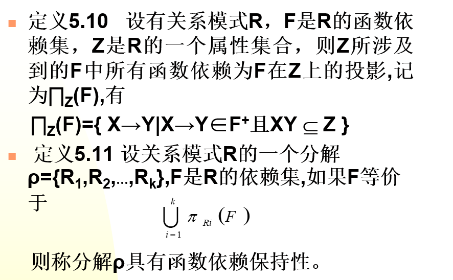
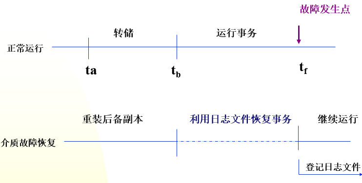
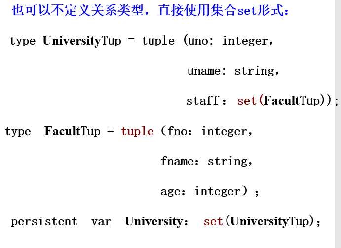
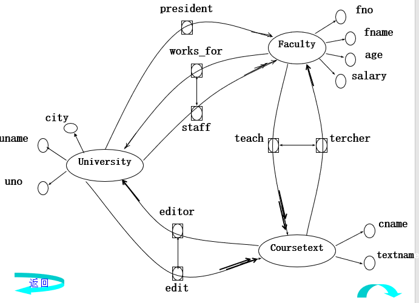
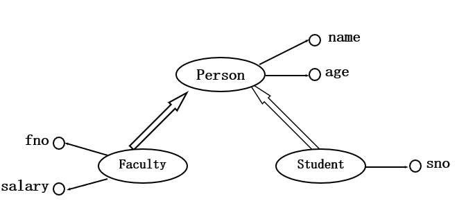
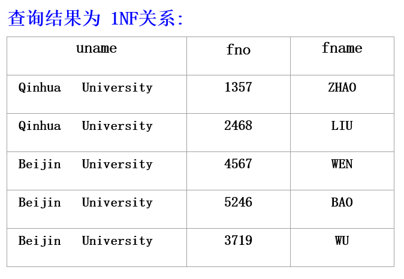

# 第1章 数据库发展史

## 1.1 数据管理技术的发展

### 1.1.1 人工管理阶段

时间：20世纪50年代中期以前，计算机本身的水平较低。

硬件方面：计算机的运算速度低、内存容量小，外存还没有磁盘等直接存取的存储设备

软件方面：还没有操作系统，没有管理数据的软件。

**特点**：

1. 数据不保存在计算机内
2. 没有专用的软件对数据进行管理
3. 只有程序，没有文件的概念
4. 数据面向程序

### 1.1.2 文件系统阶段

时间：从20世纪50年代后期到60年代中期，计算机的硬件、软件都有了很大发展

硬件：有了磁盘、磁鼓等直接存取的存储设备

软件：有了操作系统，其中有专门管理数据的文件系统。

从处理方式讲，不仅有了文件批处理，而且能够联机实时处理。此时，计算机不仅用于科学计算，还大量用于管理。


**特点**：

1. 数据以文件形式长期保存在磁盘上
2. 数据的逻辑结构与物理结构有了区别
3. 文件组织多样化
4. 数据不再属于某个特定的程序，可以重复使用
5. 对数据的操作以记录为单位


### 1.1.3 文件系统的缺陷

**数据的冗余性**：文件之间缺乏联系，每个应用程序对应的文件中可能有重复存储的数据

**数据不一致性**：往往由数据冗余造成，文件更新时，相同的数据在不同文件中不一样。

**数据联系弱**：文件之间相互独立，缺乏联系

### 1.1.4 倒排文件系统阶段

倒排文件是索引文件的推广，每个字段提供单独的索引，方便用户检索，但数据的更新比较复杂和困难

## 1.2 数据库技术的产生和发展

### 1.2.1 数据库技术的产生

**IMS系统**

1968年IBM公司研制IMS系统，在IBM360/370机上运行。层次

**DBTG报告**

1969年CODASYL（美国数据系统语言协会）的DBTG小组出一份报告，即DBTG报告。网状

**E.F.Codd的文章**

E.F.Codd于1970年在美国计算机学会通信杂志发表一文。关系

### 1.2.2 数据库阶段的数据管理特点

1. 采用复杂的数据模型表示数据结构

   描述数据之间的关系，通过存取路径实现，面向整个应用系统

   数据库系统和传统文件系统的根本区别：数据库系统通过所有存取路径表示自然的数据联系

2. 有较高的数据独立性：物理独立性、逻辑独立性

   数据独立性：数据和程序分离，解耦

   物理数据独立性：物理结构的改变尽量不影响整体逻辑结构、用户的逻辑结构以及应用程序

   逻辑数据独立性：整体逻辑结构改变时，尽量不影响用户的逻辑结构及应用程序

3. 提供了方便的用户接口

4. 提供四个方面的数据控制功能

   并发控制、恢复、完整性、安全性

5. 数据操作灵活


### 1.2.3 数据库技术的术语

**数据库（DB）**：

是统一管理的相关数据的集合。

**数据库管理系统（DBMS）**：

是位于用户与操作系统之间的一层数据管理软件，为用户和应用程序提供访问DB的方法，包括DB的建立、查询、更新及各种数据控制。

**数据库系统（DBS）**：

是实现有组织地、动态地存储大量关联数据，方便多用户的计算机软件、硬件和数据资源组成的系统，即采用了数据库技术的计算机系统。

**数据库技术**：

是一门研究数据库的结构、存储、管理和使用的软件学科。

### 1.2.4 数据库技术的发展

分布式数据库技术（区块链）

面向对象数据库技术

数据仓库

云数据库（Amazon AWS）

大数据（5V）

其他数据库技术

# 第2章 数据库系统结构

## 2.1 数据描述

### 2.1.1 概念设计中的数据描述

概念设计：根据用户的需求设计数据库的概念结构

**实体(Entity)**

实体是客观存在、可以相互区分的事物，既可以是实际存在的对象，也可以是某种概念。例如：一个工厂、一个车间、一种操作流程等。

**属性(Attribute)**

事物是有特性的。反映在实体上，就是实体的属性。一个实体具有有限个属性，也可以说是这些属性的总和组成了这个实体。

**实体集(Entityset)**

所有属性名完全相同的实体往往集合在一起，称为实体集。例如：全体职工就是一个实体集。为了区分实体集，每个实体集都有一个名称，即实体名。。

**实体标识符(Identifier)**

能惟一标识实体的属性或属性集。也称关键码，或键。

### 2.1.2 逻辑设计中的数据描述

逻辑设计：根据概念设计得到的概念结构来设计的数据库逻辑结构，即表达方式和实现方法

**字段（Field）**

标记实体属性的命名单位。也称数据项。

**记录（Record）**

字段的有序集合。

**文件（File）**

同一类记录的集合。

**关键码（Key）**

能惟一标识文件中每个记录的字段。


### 2.1.3 存储介质层次及数据描述

**物理存储介质层次**：

高速缓冲存储器

主存储器

快擦写存储器（快闪存）

磁盘存储器

光存储器

磁带

**物理存储中的数据描述**：位、字节、字、块、桶、卷

### 2.1.4 数据联系的描述

实体集内部（实体和实体之间）的联系

实体间的联系有三种：

1. 同一实体集中各实体之间的联系(一元联系)。

2. 两个实体集中各实体之间的联系(两元联系)。
3. 三个实体集中各实体之间的联系(三元联系)。

二元联系的实体间联系有三种情况：

1. 一对一 （1：1）
2. 一对多 （1：N）
3. 多对多 （M：N）

## 2.2 数据模型

### 2.2.1 数据模型的定义

数据模型分两种：

1. 概念数据模型：用于建立信息世界的数据模型，与硬件、DBMS无关，实现方法是“实体联系模型”。（用户观点）
2. 结构（逻辑）数据模型：直接面向数据库的逻辑结构，与硬件、DBMS有关，有三部分构成：**数据结构**、**数据操作**、**数据完整性约束**

**数据结构**是指对实体类型和实体间联系的表达和实现。

**数据操作**是指对数据库的检索和更新（包括插入、删除和修改〉两类操作。

**数据完整性约束**给出数据及其联系应具有的制约和依赖规则。

### 2.2.2 实体联系模型

P.P.S.Chen（陈品山）于1976年提出的“实体―联系模型” （Entity―Relationship Approach,简称E―R模型）

ER图中四个基本成分：

1. **矩形框：表示实体类型**

2. **菱形框：表示联系类型**

3. **椭圆形框：表示实体类型或联系类型的属性**

4. **连线：实体与属性之间、实体与联系之间**

多元联系：两个及以上实体集之间的联系


自身联系：在一个联系中,一个实体集可以出现两次或多次, 扮演多个不同角色, 此种情况称为实体集的自身联系。


### 2.2.3 层次模型

用**树**形（层次）结构表示实体类型及实体间联系的数据模型称为**层次模型**。

树的结点是记录类型，每个非根结点有且只有一个父节点，上一层和下一层记录类型之间的联系是1:N联系

**特点**：

1. 有且仅有一个结点无父结点,这样的结点称为根结点；
2. 非根结点都有且仅有一个父结点。
3. 记录之间的联系通过**指针**实现，查询效率高

**优点**：

1. 查询效率高
2. 用户面对逻辑数据，不必过多考虑物理细节，逻辑与物理数据的转换由DBMS完成

**缺点**：

1. 只能表示1:N联系，M:N联系实现复杂，用户不易掌握
2. 层次顺序严格和复杂，导致数据的查询和更新操作复杂，使程序编写复杂

### 2.2.4 网状模型

用有向**图**结构表示实体类型及实体间联系的数据模型称为**网状模型**。

有向图中的结点是记录类型，箭头表示从箭尾的记录类型到箭头的记录类型间的联系是1:N联系

换句话说：把层次模型的限制放开： 一个结点可以有一个以上的父结点, 就得到网状模型。

**特点**：

1. 可能有一个以上的结点无父结点
2. 结点与其父结点之间的联系可以不止一个
3. 记录之间的联系通过**指针**实现，查询效率高

**缺点**：数据结构复杂和编程复杂

### 2.2.5 关系模型

关系模型的主要特征是用二维**表**格表达实体集。

**特点**：数据结构是**表格**，记录之间的联系通过模式的键体现

### 2.2.6 面向对象模型

面向对象模型是一种可扩充的数据模型,在该数据模型中,数据模型是可扩充的,即用户可根据需要,自己定义新的数据类型及相应的约束和操作。

基本的概念是对象和类

**对象**：对象是面向对象数据模型的基本结构,是面向对象数据库系统的核心。 一个对象是由一些数据以及能够作用在这些数据上的操作组成。 例如,一个职工对象,将包含与职工相关的数据（职工号、 姓名、 性别、 职称、 部门等）以及能够在这些职工数据上进行的操作（增加职工、 删除职工、改变职称等等）。

**类**：在组织信息时,人们总是将具有相似特性的对象归为一类。 类中的每个对象称为类的一个实例（Instance）。 一个类中的所有对象其特性必须相同,即具有相同的属性、 响应相同的消息、 使用相同的方法。

如果说类的概念相当于关系模型中的关系模式,那么类的实例类似于元组,类的实例之间和类之间可以有复杂的联系。

## 2.3 数据库的体系结构

### 2.3.1 三级模式结构

数据的三级模式结构包含有外模式、模式和内模式。


### 2.3.2 三级结构和两级映像

#### 三级结构

**模式**（Schema）

​	模式也称概念模式，是数据库中全体数据在逻辑上的视图。

​	不涉及到存储结构、访问技术等细节，以达到物理数据独立性。

**外模式**（External Schema）

​	外模式也称子模式，是个别用户的数据视图，即个别用户涉及到的数据的逻辑结构。

**内模式**（Internal Schema）

​	内模式也称存储模式。它既定义了数据库中全部数据的物理结构，还定义了数据的存储方法、存取策略等。

#### 二级映像

**外模式/模式映像**：存在于外部级与概念级之间，用于定义外模式和概念模式之间的对应性

**模式/内模式映像**：存在于概念级和内部级之间，用于定义概念模式和内模式之间的对应性

在外模式与模式之间通过外模式/模式映象进行转换。当模式改变时，只要相应改变外模式/模式映象，可使外模式保持不变。在模式与内模式之间通过模式/内模式映象进行转换。

### 2.3.3 两级数据独立性

**数据独立性**：应用程序和数据库的数据结构之间相互独立，不受影响

分为**物理数据独立性**和**逻辑数据独立性**

当数据库的存储结构改变时，只要相应改变模式/内模式映象，可使模式保持不变，从而，外模式也可保持不变。这二级转换使数据库系统的数据具有较高的逻辑独立性和物理独立性。

### 2.3.4 用户及用户界面

用户是指使用数据库的应用程序或联机终端用户。

编写应用程序的语言是高级程序设计语言，称为主语言。

DBMS还提供数据操纵语言DML。

## 2.4 数据库管理系统

### 2.4.1 DBMS的工作模式

接受应用程序的数据请求和处理请求

将用户的数据请求（高级指令）转换成复杂的机器代码（底层指令）

实现对数据库的操作

从对数据库的操作中接受查询结果

对查询结果进行处理（格式转换）

将处理结果返回给用户


### 2.4.2 DBMS的主要功能

**数据库的定义功能**

DBMS提供DDL来定义模式、外模式和内模式

**数据库的操纵功能**

DBMS应提供数据操纵语言（DML）供用户对数据库中的数据进行检索、修改、删除以及插入工作。

**数据库的保护功能**

数据库的恢复、并发控制、完整性、安全性

**数据库的维护功能**

**数据字典DD**

### 2.4.3 DBMS的模块组成

两大模块：查询处理器和存储管理器

**查询处理器**

DML编译器、嵌入型DML的预编译器、DML编译器、查询运行核心程序。

**存储管理器** 

授权和完整性管理器、事务管理器、文件管理器、缓冲区管理器。

## 2.5 数据库系统

**数据库**

物理数据库，描述数据库。

**硬件**

计算机硬件，存储设备。

**软件**

DBMS、OS、各种宿主语言和应用开发支撑软件。

**数据库管理员（DBA）**

控制数据整体结构，负责DBS的正常运行。

DBA的**职责**：

1. 定义模式
2. 定义内模式
3. 与用户的联络（定义外模式、应用程序设计、提供技术培训等专业服务）
4. 定义安全性规则，对用户访问数据库的授权
5. 定义完整性规则，监督数据库的运行
6. 数据库的转储与恢复工作

DBA的工具：DD系统和一系列实用程序

### 2.5.2 DBS的全局结构

**数据库用户**

DBA、专业用户、应用程序员、最终用户。

**DBMS的查询处理器**

DML编译器、嵌入型DML的预编译器、DDL编译器、查询运行核心程序。

**DBMS的存储管理器**

授权和完整性管理器、事务管理器、文件管理器、缓冲区管理器。

**磁盘存储器中的数据结构**

数据文件、数据字典、索引文件、统计数据、日志

### 2.5.3 DBS结构的分类

**集中式DBS**

**客户/服务器式DBS**

**并行式DBS**

**分布式DBS**

### 2.5.4 DBS的效益

**灵活性**

**简易性**

**面向用户**

**有效的数据控制**

**加快应用系统的开发速度**

**程序设计方便可维护性**

**标准化**

## 第3章 关系运算

## 3.1 关系数据模型

### 3.1.1 关系数据模型的定义

关系操作是集合操作。 操作的对象是集合， 操作的结果也是集合。 因此， 关系操作的基础是集合代数。

可以用如下方式理解：

1. 表：关系

2. 行：元组、记录

3. 列：属性、字段

域（Domain）：值的集合，即属性的取值范围

关系：

1. 用集合论的观点定义关系：关系是一个元数为 K 的元组的集合。即这个关系中有若干个元组，每个元组有 K 个属性值。 把关系看成一个集合，集合中的元素是元组。
2. 用值域的观点定义关系：关系是属性值域笛卡儿积的一个子集。  

关系的性质：

1. 列具有相同的性质，不同的列可有相同的域
2. 任意两个元组不能相同，元组的次序可交换
3. 每个属性值（分量）都是不可分的数据项（即属性值为最小单位）

### 3.1.2 关键码和表之间的关系

超键：在关系中能惟一标识元组的属性集称为关系模型的超键。

候选键：不含有多余属性的超键称为候选键。

主键：用户选作元组标识的一个候选键称为主键。

外键：该属性不是本关系的主键，正好是另外一个关系的主键，则该属性称为本关系的外键。  

### 3.1.3 关系模式、关系子模式和存储模式

三级体系结构

关系模式实际上是记录类型（模式）

关系子模式是关系模式的逻辑子集（外模式）

存储模式是文件结构的描述（内模式）

### 3.1.4 关系模式的完整性规则

关系模型的三类完整性规则：

1. 实体完整性规则：实体主键属性值不能为空。

2. 参照完整性规则：不引用不存在的实体。外键值或为空，或为参照关系中的某个主键值。
3. 用户定义的完整性规则：由用户的应用环境决定。  

### 3.1.5 关系模式的形式定义

关系模型有三部分组成：

1. 数据结构：关系。
2. 数据操作：关系代数和关系演算。
3. 完整性规则：三类。  

## 3.2 关系代数

### 3.2.1 关系查询语言和关系运算

关系数据库语言由查询语句（描述用户的检索操作）和更新语句（描述用户的插入、修改和删除等操作）两大类组成。

关系代数是通过对关系的运算来表达查询的。 它的运算对象是关系，运算结果也是关系。

关系运算理论分为关系代数和关系演算两种。

关系查询语言分为：

1. 关系代数语言：以集合操作为基础；
2. 关系演算语言：以谓词演算为基础； 元组关系演算语言和域关系演算语言；
3. 基于关系代数和关系演算语言双重特点的语言：SQL

### 3.2.2 关系代数的五个基本操作

关系代数是由一组以关系作为运算对象的特定的运算符组成，常用的运算为九种：并、交、差、笛卡尔积、联接、自然联接、投影、选择、除运算等，其中五种为基本运算：并、差、笛卡尔积、投影、选择运算

设有两个关系 R 和 S 具有相同的关系模式。  

1. 并（∪）
   R∪S≡{t∣t∈R∨t∈S},t 为元组变量，R 和S 结构相同。
   其含义为：任取元组t, 当且仅当t 属于R 或t 属于S 时,t 属于R ∪ S 。 R ∪ S 是一个n 目关系。
2. 差（ - ）
   R-S≡{t∣t∈R∧t∉S},t 为元组变量，R 和S 结构相同。
   其含义为：当且仅当t 属于R 并且不属于S 时,t 属于R-S 。 R-S 也是一个n目关系
3. 笛卡尔积（ Χ ）
   设关系 R 和关系 S 的元数分别为 r 和 s 。定义R 和 S 的笛卡儿积 R×S 是一个（ r+s ）元的元组集合，每个元组的前 r 个分量（属性值）来自 R 的一个元组，后 s 个分量是 S 的一个元组，记为 R×S 。
   RΧS≡{t∣t= 〈 $t^r$,$t^s$ 〉∧ $t^r$∈R∧$t^s$∈S}
   设 R 为 n 目关系 ,S 为 m 目关系 , $t_r$ $t_s$ 表示由两个元组 $t_r$ 和 $t_s$ 前后有序连接而成的一个元组。
   任取元组 $t_r$ 和 $t_s$, 当且仅当 $t_r$ 属于 R 且 $t_s$ 属于 S 时 , $t_r$ 和 $t_s$ 的有序连接即为 R×S 的一个元组

4. 投影 (Π)
   对一个关系进行垂直分割 , 消去某些列，并重新安排列的顺序 , 再删去重复元组。
   $Π_{i1,…,im}(R)≡{t∣t= 〈 t_i1,…,t_im 〉 ∧ 〈 t_1, …, t_k 〉∈ R}$
   从 R 中逐次取出一个元组 , 首先 , 去掉不在 < 属性名表 > 上的诸属性值 , 接着 , 按 < 属性名表 > 的次序重新排列剩下各分量后 , 作为一个新元组送入投影结果（但若投影结果关系中已有此元组 , 则必须舍弃之）  

5. 选择 (σ)
   根据某些条件对关系做水平分割, 选择符合条件的元组。
   $σ_F(R) ≡\{t∣t∈R∧F(t)∈true\}$,F 是由逻辑运算符和比较运算符连接运算对象构成的表达式。
   选择运算是在一个关系中, 选取符合某给定条件的全体元组, 生成的新关系。  

### 3.2.3 关系代数的组合操作

1. 交
   设关系 R 和关系 S 具有相同的元数 n （即两个关系都有 n 个属性），而且相应的属性取自同一个域。关系 R 和 S 的交记为 R∩S ，结果仍为 n 元的关系。由即属于 R 又属于 S 的元组组成。形式定义如下：
   	R∩S≡{t ︱ t ∈ R ∧ t ∈ S}
   	t 是元组变量， R 和 S 的元数相同。
   	关系的交可以由关系的差来表示
   	R∩S≡R-(R-S) 或 R∩S≡S-(S-R)  

2. 联接
   联接操作是笛卡儿积、选择操作的组合。
   其中 A 是 R 的属性， B 是 S 的属性。θ为比较运算符（>, <, =, ...)

   

   如果 θ 为等号“ =” ，那么这个联结操作称为等值连接。

3. 自然联接
   将关系 R 和 S 中公共属性组满足对应分量相等的元组联接起来， 并且要在结果中把重复的属性去掉。
   $R⋈S≡Π_{去掉S中公共属性}(σ_{公共属性上值相等}( RΧS ))$

4. 除
   设关系 R 和 S 的元数分别为 :r 、 s （ r>s>0 ），
   R÷S: 是一个（ r-s ）元的元组的集合，是满足下列条件的最大关系：
           其中每个元组 t 与 S 中每个元组 u 组成的
           新元组 <t,u> 必在关系 R 中。

例题：

R：

| A    | B    | C    | D    |
| ---- | ---- | ---- | ---- |
| a1   | b1   | c1   | d1   |
| a1   | b1   | c3   | d3   |
| a2   | b2   | c2   | d2   |
| a3   | b3   | c1   | d1   |
| a4   | b4   | c4   | d4   |
| a3   | b3   | c3   | d3   |

S：

| C    | D    |
| ---- | ---- |
| c1   | d1   |
| c3   | d3   |

求R÷S

解法：

1. 找到R中，S中没有的几列，并对值的不同进行分组
2. 如果得到的分组中，R、S共有的属性值对应相同，则为最终答案，否则，则舍弃

则答案为

| A    | B    |
| ---- | ---- |
| a1   | b1   |
| a3   | b3   |

### 3.2.4 关系代数表达式及其应用实例


### 3.2.5 扩充的关系代数操作

#### 外联接  （左外联接、右外联接）


举例：


#### 外部并


#### 半联接


举例：


## 3.3 关系演算

### 3.3.1 元组关系演算

元组表达形式{t∣P(t)}，t为元组变量，P(t)是由原子公式和运算符组成的。表示满足公式P的所有元组t的集合。

P(t)的最基本的形式称为原子公式。P(t)也可以是由原子公式和运算符组成的复合公式。

#### 三类原子公式

1. R(t)

   R为关系名，意为t是R中的一个元组。{t|R(t)}意为，任取t，只要t是R中的一个元组，t就是结果中的一个元组。{t|R(t)}即表示关系R。

2. t[i] θ u[j]

   t和u都是元组变量,θ是比较比较符。公式表示t的第i个分量和u的第j个分量满足比较关系θ，则t为结果关系中的元组。

   如{t|R(t)∧t[5]>t[3]}，意为：对于R中的任一元组，当且仅当其第5列属性值大于第3列属性值时，它就是结果关系的一员。

3. t[i] θ C或C θ t[i]，C为常数。

   表示t的第i个分量与常数C之间满足θ比较符时，t为结果关系中的元组。 如{t|R(t)∧t[7]=‘01’},意为：对R中的元组，当且仅当其第7列属性值为‘01’时，它就是结果关系中的一个元组。

#### 公式的完整定义

在一个公式中，如果一个元组变量的前面没有存在量词$或全称量词"的符号定义，称之为自由元组变量，否则称为约束元组变量。

原子公式的完整定义如下：

1. 单个原子公式是公式。
2. 若$P_1$和$P_2$是公式,则$P_1∧P_2$、$P_1∨P_2$、$\neg P1$也是公式。
3. 若$\phi$是公式,则$\exist (t_i) \phi $也是公式。其中, i = 1, 2, …, k。
4. 若$\phi$是公式,则$\forall (t_i)\phi$也是公式。其中, i = 1, 2, …, k。

#### 关系代数到元组表达式的转换

并$R∪S=\{t∣R(t)∨S(t)\}$

差$R-S=\{t∣R(t)∧\neg S(t)\}$

笛卡尔积$RΧS=\{t∣(\exist u)(\exist v)(R(u) ∧S(v) ∧t[1]=u[1] ∧…∧t[n]=u[n] ∧t[n+1]=v[1] ∧…∧t[n+m]=v[m])\}$

投影$\Pi_{i1,…,ik}(R)=\{t∣(\exist u)(R(u) ∧t[1]=u[i1] ∧…∧t[k]=u[ik])\}$

选择$\sigma _F(R) =\{t∣R(t)∧F’\}$

### 3.3.2 域关系演算


## 3.4 查询优化

优化：是为了提高查询速度所进行的予处理。

优化方法：基于关系代数表达式的优化方法。

### 3.4.1 关系代数表达式的优化问题

查询学生姓名为CHEN的所选课程的成绩。

以下二种代数运算表达式是完全等价的。

T1: $Π_{cno,grade}σ_{s.sno=sc.sno ∧ sname='chen'} (S×SC)$

T3:  $Π_{cno,grade}(σ_{sname='chen'}(S) ⋈ SC)$

对于T1：计算SΧSC，把S的每个元组和SC的全部连接起来。设S的物理文件需B1块存储器，SC的物理文件需B2块存储器，主存中提供的运算缓冲空间最多能装m块，而B1，B2均大于m。

执行方法：将S的文件分成若干个m-1块，将第一个m-1块装入内存，并逐步SC文件的一块，使之与S的已装入的m-1块进行乘积运算；当SC文件的每块都装入一遍后，再往内存装入S文件的下一个m-1块，重复执行，直至计算完乘积的全部元组为止。

其读块数目为：B1+（B1/（ m-1））B2

设B1=B2=1500，m=80，则所需读块总数目为30000，与读块时间相比，选择和投影等运算时间可忽略不计。如一秒种能读20块，完成T1运算需约25分钟。

对于T3：先对S文件作选择操作，读块数目为B1，再与SC连接、投影运算。其读块数目为B1+B2=3000，完成T3运算需约2.5分钟。

总之,T1到T3,时间缩短了,而关系代数表达式的等价交换是这种优化的基础。

### 3.4.2 关系代数表达式的等价变换规则

如果两个关系代数表达式E1，E2中，相同的关系名用同一个关系取代后，其结果是相同的，则两个关系代数表达式E1，E2等价。

#### 1、2. 联接和笛卡尔积的等价交换律、结合律


#### 3. 投影的串接等价规则

设E是一个关系代数表达式,A1,A2,…,An是属性名,并且Bi∈{A1,A2,…,An}（i=1,2,…,n）,则

$∏_{B1,B2,…,Bm}(∏_{A1,A2,…,An}(E))≡∏_{B1,B2,…,Bm}(E)$

#### 4. 选择的串接等价规则

设E是一个关系代数表达式,F1和F2是两个选择条件,则

$σ_{F1}(σ_{F2}(E))≡σ_{F1∧F2}(E)$

本规则说明,选择条件可合并成一次处理。

#### 5. 选择和投影的交换等价规则

设E为一个关系代数表达式,选择条件F只涉及属性A1,A2,…,An,

则$σ_F(∏_{A1,A2,…,An}(E))≡∏_{A1,A2,…,An}(σ_F(E))$

若上式中F还涉及不属于A1,A2,…,An的属性集B1,B2,…,Bm,则有

$∏_{A1,A2,…,An}（σ_F（E））≡∏_{A1,A2,…,An}（σ_F∏_{A1,A2,…,An,B1,B2,…,Bm}（E））$

#### 6. 选择与笛卡尔积的交换等价规则

设E1和E2是两个关系代数表达式,若条件F只涉及E1的属性,则有

$σ_F（E1×E2）≡σ_F（E1）×E2$

若有F=F1∧F2,并且F1只涉及E1中的属性,F2只涉及E2中的属性,则

$σ_F（E1×E2）≡σ_{F1}（E1）×σ_{F2}（E2）$

若F1只涉及E1中的属性,F2却涉及了E1和E2两者的属性,则有

$σ_F（E1×E2）≡σ_{F2}（σ_{F1}（E1）×E2）$

及早地执行选择操作是重要的操作规则。

#### 7. 选择对并的分配律


#### 8. 选择对集合差的分配律


#### 9. 选择对自然联接的分配律


#### 10. 投影对笛卡儿积的分配律


#### 11. 投影对并的分配律


这里要求E1和E2的属性有对应性

#### 12. 选择与联接操作的结合


#### 13. 并和交的交换律


#### 14. 并和交的结合律


### 3.4.3 优化的策略

任何策略都不能保证在所有情况下都能得到最好的方案。 但下面这些原则一般都是有效的。

(1) 尽可能早地执行选择操作。

(2) 在一些使用频率较高的属性上,建立索引或分类排序,这可大大提高存取效率。

(3) 同一关系的投影运算和选择运算同时进行。

(4) 把选择同选择前面的笛卡尔积结合起来成为一个连接运算。

(5) 把投影运算同其前后的双目运算结合起来进行,以免重复扫描文件。 

(6) 找出公共子表达式,并把运算结果存于外存。 需要时,再从外存读入。

### 3.4.3 优化算法

利用等价变换规则,使优化后的表达式能遵循一般原则。 这就是优化算法的工作。

算法： 关系代数表达式的优化。

输入：一个关系代数表达式的一棵语法树。

输出： 计算该表达式的一个优化程序。

**方法：**

1. 利用规则4，把形如$\sigma_{F1∧F2∧…∧Fn}(E)$的内容变换为$\sigma_{F1}(\sigma_{F2}(…\sigma_{Fn}(E)…))$
2. 对于每一个选择,使用规则4至规则8，尽可能把它移到树的叶端（即尽可能使它早一点执行）。
3. 对每一个投影，利用规则3、5、9、10，把它尽可能移向树的叶端。使用规则3可能会消去一些投影，使用规则5可能把一个投影分成两个，其中一个有可能被移向树的叶端。
4. 利用规则3、4、5把选择和投影串接成单个选择、单个投影或一个选择后跟一个投影、使多个选择或投影能同时执行或在一次投影中同时完成。
5. 将上述得到的语法树的内结点分组,每个二目运算（×、∪、-）结点与其直接祖先被分为一组（这些直接祖先由σ、 ∏表示）。 如果它的子结点一直到叶子都是单目运算（σ、 ∏）,则把它们并入该组。

例题：


# 第4章 结构化查询语言SQL

## 4.1 SQL概述

### 4.1.1 SQL发展历程

SQL(Structured Query Language)语言是1974年提出的在IBM公司的System R上实现。

是介于关系代数和关系演算之间的语言。

1986年ANSI批准SQL作为关系数据库语言的美国标准，同年，ISO也同样决定。

以后相继出现SQL89，SQL2（1992），SQL3（1999）。

### 4.1.2 SQL数据库的体系结构


**SQL**支持数据库的三级模式结构，如上图所示。从图中可以看出，模式与基本表相对应，外模式与视图相对应，内模式对应于存储文件。基本表和视图都是关系。

1. **基本表**（Base Table）

   基本表是模式的基本内容。每个基本表都是一个实际存在的关系。

2. **视图**（View)

   视图是外模式的基本单位，用户通过视图使用数据库中基于基本表的数据（基本表也可作为外模式使用）。

   视图是虚表，实际并不存在，只有定义存放在数据字典中。

3. **存储文件**

   存储文件是内模式的基本单位。每一个存储文件存储一个或多个基本表的内容。一个基本表可有若干索引，索引也存储在存储文件中。存储文件的存储结构对用户是透明的。

### 4.1.3 SQL的组成

数据定义DDL：CREATE、DROP、ALTER

数据操纵DML：

​	数据查询DQL：SELECT

​	数据操纵DML：INSERT、DELETE、UPDATE

数据控制DCL：GRANT、REVOKE

嵌入式SQL

## 4.2 SQL的数据定义（DDL）

模式，即**数据库**

**注意，模板中的“<>”、“[]”为无用内容，即不需要输入**

### 4.2.1 SQL模式的创建和撤销

SQL模式的创建

```sql
CREATE SCHEMA <模式名> AUTHORIZATION <用户名>
```

SQL模式的撤消

```sql
DROP SCHEMA　<模式名> [CASCADE|RESTRICT]
```

### 4.2.2 SQL提供的基本数据类型

各具体DBMS所提供的数据类型是不同的。但下面的数据类型几乎都是支持的：

INT或INTEGER    全字长二进制整数

SMALLINT       半字长二进制整数

DEC(p［,q］)或压缩十进制数，共p位，其中小数点后有q位

FLOAT              双字长的浮点数

CHAR(n)或CHARTER(n) 长度为n的定长字符串

VARCHAR(n)        最大长度为n的变长字符串

DATE       日期型，格式为YYYY―MM―DD

TIME        时间型，格式为HH.MM.SS

### 4.2.3 基本表的创建、修改和撤销

#### 基本表的创建——CREATE TABLE

```sql
CREATE TABLE <表名>
(<列名1> <类型> [<该列的完整性约束>]，
 <列名2> <类型> [ <该列的完整性约束>]…
primary key (<主键名>)
 <表级完整性约束>
) engine = InnoDB default charset=utf8;
```

<该列的完整性约束>：该列上数据必须符合的条件。最常见的有：

​	NOT NULL       该列值不能为空

​	NULL           该列值可以为空

​	UNIQUE         该列值不能有相同者

​	DEFAULT        该列上某值未定义时的默认值

<表级完整性约束>：对整个表的一些约束条件，常见的有定义主码(外码)，各列上数据必须符合的关联条件等。

#### 基本表结构的修改——ALTER TABLE

基本表的结构是可以随环境的变化而修改的，即根据需要增加、修改或删除其中一列(或完整性约束条件等)。

```sql
ALTER TABLE<表名>
[-ADD <列名> <数据类型> [完整性约束]]
[DROP <列名>]
[MODIFY <列名> <数据类型>[完整性约束]]
```

#### 基本表的撤消——DROP TABLE

```sql
DROP TABLE <表名> [CASCADE|RESTRICT]
```

此语句一执行，指定的表即从数据库中删除（表被删除，表在数据字典中的定义也被删除），此表上建立的索引和视图也被自动删除(有些系统对建立在此表上的视图的定义并不删除，但也无法使用了)。

### 4.2.4 索引的创建和撤消

#### 索引的建立——CREATE INDEX

在一个基本表上，可建立若干索引。有了索引，可以加快查询速度。索引的建立和删除工作由DBA或表的属主(建表人)负责。用户在查询时并不能选择索引，选择索引的工作由DBMS自动进行。

```sql
CREATE[UNIQUE]INDEX <索引名>
ON <表名> ( <列名> [ASC|DESC])…
本语句为规定<表名>建立一索引，索引名为<索引名>。
```

#### 删除索引——DROP INDEX

索引太多，索引的维护开销也将增大。因此，不必要的索引应及时删除。

```sql
DROP INDEX <索引名>
本语句将删除规定的索引。该索引在数据字典中的描述也将被删除。
```

## 4.3 SQL的数据查询

SELECT语句

### 4.3.1 SELECT语句格式

```sql
SELECT　［DISTINCT] *|<目标列表达式[别名]清单>  FROM <关系名[别名]或视图名清单>
[WHERE <查询条件表达式>] [GROUP BY 列名清单 [HAVING <组条件表达式>]] [ORDER BY 列名[ASC|DESC], ...]
```

整个语句的执行过程如下:
(1）读取FROM子句中基本表、视图的数据，执行笛卡儿积操作（或读取表引用所返回的查询结果或多表联接的结果)。
(2）选取满足WHERE子句中给出的条件表达式的元组。
(3）按GROUP子句中指定列的值分组，同时提取满足HAVING子句中组条件表达式的那些组。
(4)按SELECT子句中给出的列名或列表达式求值输出。
(5）ORDER子句对输出的目标表进行排序，按附加说明ASC升序排列，或按DESC降序排列。

SELECT语句中，WHERE子句称为“行条件子句”，GROUP子句称为“分组子句“，HAVING子句称为”组条件自居“，ORDER子句称为”排序子句“。

在 WHERE 子句的行条件表达式中可使用下列**运算符**：

1. 算术比较运算符：＜，＜＝，＞，＞＝，＝，＜＞或！＝；
2. 逻辑运算符： AND ， OR ， NOT ；
3. 集合成员资格运算符： IN ， NOT IN ；
4. 谓词： EXISTS ， ALL ， SOME ， UNIQUE ；
5. 聚合函数： AVG ， MIN ， MAX ， SUM ， COUNT ；
6. 集合运算符： UNION ， INTERSECT ， EXCEPT 。  

### 4.3.2 单表查询

**别名**：

1. 字段名称 AS 别名

2. 字段名称 别名

3. 别名 =字段名称  

**确定范围**：列名 [NOT] BETWEEN <下限 > AND <上限>

**查询空值**：is NULL

**字符匹配**：%表示任意多个字符，_ 表示任意一个字符，字符串外需要加单引号

**聚合函数**：

1. COUNT([DI STI NCT]*) 统计元组的个数
2. COUNT([DI STI NCT]<列名 >) 统计一列中值的个数
3. SUM([DI STI NCT]<列名 >) 计算一列值的总和
4. AVG([DI STI NCT]<列名 >) 计算一列值的平均值
5. MAX([DI STI NCT]<列名 >) 求一列值中的最大值
6. MIN([DI STI NCT]<列名 >) 求一列值中的最小值  

**排序**时可指定原表的列或获得的表的列号进行排序

​	order by 3 asc,2 desc

asc：升序，desc：降序

### 4.3.3 多表查询

#### 联结操作

联接条件可在 WHERE 中指定也可以在 FROM 子句中指定。

在 FROM 子句中指定联接条件时， SQL2 将联接操作符分成 : 联接类型、联接条件。

联接类型：决定了如何处理联接条件中不匹配的元组。

联接条件：决定了两个关系中哪些元组应该匹配。

联接类型中的 OUTER 字样可不写  

| 联接类型         | 联接类型说明                                                 |
| ---------------- | ------------------------------------------------------------ |
| INNER JOIN       | 内联接： 结果为两个联接表中的匹配行的联接。                  |
| LEFT OUTER JOIN  | 左外联接： 结果包括“左”表（出现在 JOIN 子句的最左边）中的所有行。不包括右表中的 不匹配行。 |
| RIGHT OUTER JOIN | 右外联接： 结果包括“右”表（出现在 JOIN 子句的最右边）中的所有行。不包括左表中的 不匹配行。 |
| FULL OUTER JOIN  | 完全外联接： 结果包括所有联接表中的所有行 不论它们是否匹配   |
| CROSS JOIN       | 交叉联接： 结果包括两个联接表中所有可能的 行组合。交叉联接返回的是两个表的笛卡儿积 |

#### IN的嵌套查询

可带有谓词ANY和ALL

#### 相关子查询

#### 带有EXISTS的子查询

## 4.4 SQL的数据更新

### 4.4.1 数据插入

```sql
INSERT INTO <表名> [（<属性名清单>）]
    VALUES （元组值）；
INSERT INTO <表名> （<属性名清单>）
    VALUES （元组值）， （元组值），… ；
INSERT INTO <表名> [（<属性名清单>）]
  （子查询）;
```

把子查询的结果插入指定的<表名>中。这样的一条INSERT语句，可以一次插入多条元组。

### 4.4.2 数据删除

```sql
DELETE   FROM <表名>
 ［WHERE <带有子查询的条件表达式>］
```

本语句将删除使<带有子查询的条件表达式>为真的所有元组。

### 4.4.3 数据修改

```sql
UPDATE <表名>
    SET<列名>=<表达式>
    [, <列名>=<表达式>……]
    [WHERE <带有子查询的条件表达式>]
```

本语句执行时，将修改使<带有子查询的条件表达式>为真的所有元组。

## 4.5 视图

### 4.5.1 视图的定义

一个视图是从一个或多个关系（基本表或已有的视图）导出的关系。

视图是虚表，导出后，数据库中只存有此视图的定义（在数据字典中），但并没有实际生成此关系。

视图一经定义就可以象基本表一样进行查询和更新。

```sql
CREATE VIEW <视图名>[(<列名清单>)]
         AS <子查询>
      [(WITH CHECK OPTION)]
```

若有<列名清单>，则此清单给出了此视图的全部属性的属性名；否则，此视图的所有属性名即为子查询中SELECT语句中的全部目标列。

有［WITH CHECK OPTION］时，则今后对此视图进行INSERT、UPDATE和DELETE操作时，系统会自动检查视图是否符合原定义视图时子查询中的<条件表达式>。

```sql
DROP VIEW <视图名>
```

此语句将把指定视图的定义从数据字典中删除。

一个关系（基本表或视图）被删除后，所有由该关系导出的视图并不自动删除，它们仍在数据字典中，但已无法使用。

### 4.5.2 视图的查询

DBMS对某SELECT语句进行处理时，若发现被查询对象是视图，则DBMS将进行下述操作：

1. 从数据字典中取出视图的定义。
2. 把视图定义的子查询和本SELECT的查询相结合，生成等价的对基本表的查询（此过程称为视图的消解）。
3. 执行对基本表的查询，把查询结果（作为本次对视图的查询结果）向用户显示。

### 4.5.3 视图的更新

视图是虚表，是没有数据的。所谓视图的更新，表面上是对视图执行INSERT、 UPDATE和DELETE来更新视图的数据，其实质是由DBMS自动转化成对导出视图的基本表的更新，转化成对基本表的INSERT、UPDATE和DELETE语句（用户在感觉上确实是在对视图更新）。

不是所有的视图都是可更新的，因为有些视图的更新不能有意义的转化成相应基本表的更新。

一般的DBMS只允许对单个基本表导出的视图进行更新。并有下列限制：

1. 若视图的列由表达式或常数组成，则不允许执行INSERT和UPDATE，但可执行DELETE。
2. 若视图的列由集函数组成，则不允许更新。
3. 若视图定义中有GROUPBY子句，则不允许更新。
4. 若视图定义中有DISTINCT选项，则不允许更新。
5. 若视图定义中有嵌套查询，且内外层FROM子句中的表是同一个表，则不允许更新。
6. 从不允许更新的视图导出的视图是不允许更新的。

### 4.5.4 视图的优点

1. 视图能方便用户操作
2. 视图可对数据提供安全保护
3. 视图能使不同用户都能用自己喜欢的方式看待同一数据同一数据，在不同用户的各个视图中，可以以不同的名称出现，可以以不同的角色出现（平均值，最大值……）。这给数据共享带来了很大的方便。

## 4.6 嵌入式SQL

### 4.6.1 SQL语言的运行环境

常用的方式是用某种传统的编程语言（例如：C、PASCAL等）编写程序，但程序中的某些函数或某些语句是SQL语句。这种方式下使用的SQL语言称为嵌入式SQL（EmbeddedSQL），其中传统的编程语言称为宿主语言（或主语言）。

DBMS有两种方法处理嵌入式SQL语言：预编译和扩充编译程序法。预编译是指由DBMS的预编译器对源程序进行扫描，识别出其中的SQL语句，把它们转换为宿主语言调用语句，使宿主语言编译器能够识别，最后由编译器将整个源程序编译为目标码。目前使用较多的是预编译方法，其处理过程如下图所示。


### 4.6.2 嵌入式SQL的使用规定

使用嵌入式SQL必须解决以下几个问题：

1. 预编译器不能识别和接受SQL语句，因此，嵌入式程序中，应有区分SQL语句与宿主语言语句的标记。
2. DBMS和宿主语言程序（程序工作单元）如何进行信息传递。
3. 一条SQL语句原则上可产生或处理一组记录，而宿主语言一次只能处理一个记录，必须协调这两种处理方式。

使用规定：

1. 对嵌入的SQL语句加前缀EXEC SQL，而结束标志则随宿主语言的不同而不同。在C语言中嵌入的SQL语句以EXECSQL开始，以分号“；”结尾：EXEC SQL＜SQL语句＞
2. 在DBMS和宿主语言程序之间的数据传递，是通过宿主语言程序变量，简称主变量（Host variable）来实现的。当SQL语句引用主变量时，变量前应加冒号“：”。
3. SQL语言和宿主语言的不同数据处理方式，是通过游标（Cursor）来协调的。游标是系统为用户开设的一个数据缓冲区，存放SQL语句的执行结果。每个游标都有一个名字。

游标：

​	用户可以用SQL语句逐一从游标中获取记录，并赋给主变量，由宿主语言作进一步的处理。游标的操作包括四个步骤：

1. 定义游标 ：EXEC SQL DECLARE 游标名 CURSOR FOR＜SELECT语句＞
2. 打开游标：EXEC SQL OPEN ＜游标名＞
3. 推进游标：EXEC SQL FETCH＜游标名＞INTO ＜主变量名列表＞
4. 关闭游标：EXEC SQL CLOSE＜游标名＞

### 4.6.3 嵌入式SQL的使用技术

#### 不涉及游标的嵌入式SQL、DML语句

在嵌入式SQL中，SQL的数据定义DDL与控制语句DCL都不需要使用游标。

### 4.6.4 动态SQL语句


## 4.7 语法整理


创建新的数据库：

```sql
create database <库名>;
```

创建数据表：（详见4.2.3）

```sql
create table if not exists <表名>（
<列名> <数据类型> [<约束条件>],
...
primary key (<主键名>)
) engine = InnoDB default charset=utf8;
```

从txt文件中导入数据：

```sql
load data infile '<文件地址，上下级目录用\隔开>' into table  <表名>;
```

增加外键约束：

```sql
ALTER TABLE <表名> ADD FOREIGN KEY (<键名>) REFERENCES <表名>(<键名>);
```

### 约束

--主键约束(Primary Key constraint):要求主键列的数据唯一，并且不允许为空。

--唯一约束(Unique Constraint)：要求该列唯一，允许为空，但只能出现一个空值。

--检查约束(Check Constraint):某列取值范围限制、格式限制等，如有关年龄的约束。

--默认约束(Default Constraint):某列的默认值，如我们的男性同学较多，性别默认为男。

--外键约束(Foreign Key):用于在两表之间建立关系需要制定引用主表的哪一列。

 

语法如下：

```sql
alter table <表名>

add constraint <约束名> <约束类型具体的约束说明>
```

 示例：

--添加主键约束

```sql
alter table <表名>

add constraint <约束名> primary key(<主键名>)
```

--添加唯一键约束

```sql
alter table <表名>

add constraint <约束名> unique(<键名>)
```

--添加默认约束

```sql
alter table <表名>

add constraint <约束名> default(<默认值>) for <键名>
```

--添加检查约束

```sql
alter table <表名>

add constraint <约束名> check(<检查内容>)
```

--添加外键约束

```sql
alter table <表名>

add constraint <约束名> foreign key(<外键名>) references <外键表>(<键名>)
```

 删除约束

```sql
alter table <表名> drop constraint <约束名>
```

### 级联删除

```sql
on delete cascade on update cascade
```

在创建表时添加：

```sql
CREATE TABLE <表名> (
  ...
  CONSTRAINT <外键名> FOREIGN KEY (<键名>) REFERENCES <表名> (<外键名>) ON DELETE CASCADE ON UPDATE CASCADE,
  ...
) ENGINE=InnoDB AUTO_INCREMENT=4 DEFAULT CHARSET=utf8

```

添加外键时增加：

```sql
ALTER TABLE <表名>
ADD CONSTRAINT <外键名>
FOREIGN KEY (<键名>)
REFERENCES <表名>(<外键名>) ON DELETE CASCADE ON UPDATE CASCADE;
```

# 第6章 实体联系模型

## 6.1 ER模型的基本元素

### 1. 实体

实体是客观存在、可以相互区分的事物。

实体集是具有相同类型及相同性质（属性）的实体集合。

### 2. 联系

联系集是指同类联系的集合。

在E―R模型中,用矩形框表示实体集,矩形框中写上实体名,用椭圆表示属性,椭圆中标上属性名,实体的主码用下划线表示。

### 3. 属性

事物是有特性的。反映在实体上，就是实体的属性。一个实体具有有限个属性，也可以说是这些属性的总和组成了这个实体。

## 6.2 属性的分类

### 1. 基本属性和复合属性

基本属性：不可再分割的属性。例如：性别、年龄等。

复合属性：可再分解为其他属性的属性。例如：邮政编码等。

### 2. 单值属性和多值属性

基本属性：不可再分割的属性。例如：性别、年龄等。

复合属性：可再分解为其他属性的属性。例如：邮政编码等。


### 3. 导出属性

导出属性：通过具有相互依赖的属性推导而产生的属性。例如，人的出生年份可以从年龄推导出来。

### 4. 空值

导出属性：通过具有相互依赖的属性推导而产生的属性。例如，人的出生年份可以从年龄推导出来。

## 6.3 联系的设计

### 1. 联系的元数

一个联系涉及到的实体集的个数，称为联系的元数或度数。

实体间的联系有三种：

同一实体集中各实体之间的联系(一元联系)。

两个实体集中各实体之间的联系(两元联系)。

三个实体集中各实体之间的联系(三元联系)。

### 2. 联系的连通词

联系涉及到的实体集之间实体对应的方式，称为联系的连通词。

实体间连通词有三种情况：

一对一 （1：1）

一对多 （1：N）

多对多 （M：N）

### 3. 联系的基数

有两个实体集E1和E2，E1中每个实体与E2中有联系实体数目的最小值Min和最大值Max，称为E1的基数，用（Min，Max）表示。

## 6.4 ER模型的扩充

### 1. 依赖联系和弱实体

一个实体的存在必须以另外实体的存在为前提。例如：职工和家属。

一个实体对于另一些实体具有很强的依赖联系，而且该实体主键的部分或全部从其父实体中获得，称该实体为弱实体。


### 2. 子类和超类

当较低层上的实体类型表达了与之联系的较高层上的实体类型的特殊情况时，就称较高层上的实体类型为超类型，较低层上的实体类型为子类型。

性质：

1. 子类实体继承超类实体的所有属性。

2. 继承性是通过子类和超类相同的实体标识符实现

## 6.5 ER模型的实例

### 1. E—R模型实例

例1 企业职工管理中，需要涉及的功能有：

① 人事处对职工的档案和部门进行管理,包括职工基本情况，部门的基本情况以及各种职称、 职务的管理；

② 财务处管理职工的工资情况；

③ 科研处管理项目、 职工参加项目的情况。


### 2. E—R模型向关系模型的转化

(1) 将每一个实体集转换为一个关系模式，实体集的属性转换成关系的属性,实体集的码即对应关系的码。

本例中将生成如下三个关系模式：

1. 职工（职工号,姓名,性别,年龄,工资）
2. 部门（部门号,名称,电话,负责人）
3. 职称职务（代号,名称,津贴,住房面积）

(2) 将每个联系集转换成关系模式。 对于给定的联系R,由它所转换的关系具有以下属性：

① 联系R单独的属性都转换为该关系的属性；

② 联系R涉及到的每个实体集的码属性（集）转换为该关系的属性。 转换后关系的码有以下几种情况：

1. 若联系R为1∶1联系,则每个相关实体的码均可作为关系的候选码；
2. 若联系R为1∶n联系,则关系1中的码作为n端实体的外码；
3. 若联系R为m∶n联系,则关系的码为相关实体码的组合。

# 第5章 规范化设计

## 5.1 关系模式的设计问题

### 5.1.1 关系模式的外延和内涵

一个关系模型包括外延和内涵两个方面的内容

外延就是关系、表或当前值，就是表里的数据

内涵就是对数据的定义以及对数据完整性约束的定义

### 5.1.2 泛关系模式与数据库模式

关系模式R(U)，R表示关系模式，U表示属性的全集，关系r是关系模式R(U)的当前值，是元组的集合。这样的关系模式和关系称为泛关系模式和泛关系。

实际使用时，用一个关系模式的集合$\rho ={R_1，……，R_K}$来代替R(U)，其中每个$R_i$是U的子集，$\rho$称为数据库模式。

### 5.1.3 关系模式的冗余和异常问题

1. 数据冗余度大
2. 插入、修改与删除异常


解决方法：分解

## 5.2 函数依赖

### 5.2.1 函数依赖FD的定义	 

定义5.1 设有关系模式$R(A_1, A_2, …, A_n)$，X，Y是U的子集，r是R的任一具体关系 ，如果对r的任意两个元组u、v，由u[X] = v[X]导致u[Y] = v[Y]，则称X函数决定Y，记为X→Y。

在关系R中，X、Y为R的两个属性或属性组,如果对于R的所有关系r都存在： 对于X的每一个具体值,Y都只有一个具体值与之对应,则称属性Y函数依赖于属性X。

或者说,属性X函数决定属性Y,记作$X\to Y$。 其中X叫决定因素,Y叫被决定因素。

此定义可简单表述为：如果属性X的值决定属性Y的值,那么属性Y函数依赖于属性X。 换一种说法是,如果知道X的值,就可以获得Y的值。

(1) 若Y函数不依赖于X,记作$X\nrightarrow Y$。

(2) 若$X\to Y$, $Y\to X$,记作$X\leftrightarrow Y$。

### 5.2.2 函数依赖的定义

定义5.2 设F是在关系模式R(U)上成立的函数依赖集，X和Y是属性集U上的子集，如果从F推导出X→Y也在R(U)上成立，那么称F逻辑蕴涵X→Y，记为F ⊨ X→Y。

定义5.3设F是关系模式$R(A_1, A_2,…, A_n)$上成立的函数依赖集，X和Y是属性集$(A_1, A_2, …, A_n)$的子集，F的所有逻辑蕴涵组成的集合称为函数依赖集F的闭包,记为$F^+$。

​	$F^+=\{ X\to Y | F\models X\to Y\}$

即：从给定的函数依赖集合F推出的所有函数依赖组成的集合，称为F的闭包。

### 5.2.3 函数依赖的推理规则

Armstrong公理系统：设有关系模式R（A1，A2，…，An）和属性集$U= A_1A_2…A_n$，X，Y，Z，W是U的一个子集，F是R的一个函数依赖集，推理规则如下：

自反律：如果$Y\subseteq X\subseteq U$，则X→Y在R上成立。

增广律：如果X→Y为F所蕴涵，$Z\subseteq U$，则XZ→YZ在R上成立。

传递律：如果X→Y和Y→Z在R上成立，则X→Z在R上成立。

FD的其它三个推理规则：

合并律：如果X→Y和X→Z成立，则X→YZ也成立。

伪传递律：如果X→Y和WY→Z成立，则WX→Z也成立。

分解律：如果X→Y和$Z\subseteq Y$，则X→Z成立。

定义5.4 对于FD X→Y 如果$Y\subseteq X$，那么称X→Y是一个平凡的FD；否则称为一个非平凡的FD

### 5.2.4 FD与关键码的联系

定义5.5 设有关系模式$R(A_1, A_2, …, A_n)$，F是R的一个函数依赖集，X是$\{ A_1, A_2, …, A_n \}$的一个子集。如果

①$X\rightarrow A_1A_2…A_n∈F^+$，且

②不存在X真子集Y，使得$Y\rightarrow A_1A_2…A_n$ 成立，则称X是R的候选键。

包含在任何一个候选键中的属性称为主属性

不包含在任何一个候选键中的属性称为非主属性。

#### 补充：候选码的求解算法（自学）

设关系模式R<U, F>

(1) 将R的所有属性分为 L、 R、N和 LR四类，并令X代表L、N两类，Y代表LR类。

  L类: 仅出现在F的函数依赖左部的属性；

  R类: ………………………...右…………；

  N类: 在F的函数依赖左右两边都不出现的属性；

  LR类: …………………………都出现的属性 。 

(2) 求属性集闭包X+，若 X+包含了R的全部属性则X即为R的唯一候选码, 转(5);

(3) 否则, 在Y中取一属性A，求属性集闭包(XA)+，若(XA)+包含了R的全部属性，则转(4)；否则，调换一属性反复进行这一过程，直到试完所有Y中的属性。

 (4) 如果已找出了所有的候选码，则转(5)；否则在Y中依次取2个、3个、…属性，求X与它们的属性集闭包，直到其闭包包含R的全部属性。

 (5) 停止，输出结果。

例如：已知R(ABCDE)，F={A→B，BC→A，A→D}，求R的全部非主属性。

现将所有属性分类

L：C

R：D

N：E

LR：A、B

则X代表L、N两类  Y代表LR类

则首先X为CE，(CE)+={C,E}依次将X设为(ACE)和(BCE)得到(ACE)+={A,B,C,D,E}

  (BCE)+={A,B,C,D,E}

由上得，非主属性为D

### 5.2.5 属性集的闭包

定义5.6 设关系模式R(U,F), U为R的属性集合,F为其函数依赖集,则称所有用Armstrong公理从F推出的函数依赖$X\to A_i$中$A_i$的属性集合,为X的属性闭包,记作$X^+$,读作X关于函数依赖集F的闭包。

定理 5.3 设关系模式R(U,F) ,U为R的属性集合,F为其函数依赖集,$X, Y \subseteq U$,则从F推出X→Y的充要条件是$Y\subseteq X^+$。

算法 5.1 求属性集X关于函数依赖F的属性闭包$X^+$。

输入：关系模式R的全部属性集U,U的子集X,U上的函数依赖集F。

输出：X关于F的属性闭包$X^+$。

步骤： 设i=0,1,2,…。

(1) 初始化： i=0, X(0) = X。

(2) X(i+1) = X(i)∪A

求属性集A。A是这样的属性： 在F中寻找尚未用过的左边是X(i)子集的函数依赖：Y(j)→Z(j) (j=1,…,k),其中$Y(j)\subseteq X(i)$,并且在Z中寻找X(i)中未出现过的属性集合A，若无这样的A，则转(4)

(3) 判断是否有X(i+1) = X(i)，若是则转(4)，否则转(2)。

(4) 输出X(i),即为$X^+$。

### 5.2.6 FD的最小依赖集

定义 设F和G是关系模式R（U）上的两个函数依赖集,如果$F^+=G^+$，则称F和G是等价的,记作F≡G。 也可称为F覆盖G,或G覆盖F,或F、G相互覆盖。

引理 F≡G的充分必要条件是$F\subseteq G^+$、$G\subseteq F^+$。

引理 任一函数依赖集总可以为一右边都为单属性的函数依赖集所覆盖。

定义 5.7 如果函数依赖集F满足下列条件,则称F为一个极小函数依赖集,也称为最小依赖集或最小覆盖。

(1) F中任一函数依赖的右部都是单属性。

(2) F中任一函数依赖X→A,都不会使F与F-{X→A}等价。

(3) F中任一函数依赖X→A,X的任一真子集Z,不会使F-{X→A}∪{Z→A}与F等价。

条件(2)保证了F中不存在多余的函数依赖

条件(3)保证了F中每个函数依赖的左边没有多余的属性。


## 5.3 关系模式的分解特性

### 5.3.1 模式分解问题

定义5.8 关系模式R(U, F)的一个分解是指$\rho=\{R_1(U_1,F_1),R_2(U_2,F_2),…,R_n(U_n,F_n)\} $

其中$U=\bigcup^n_{i=1}u_i$

并且没有$u_i\subseteq u_j$，$1\leq i$，$j\leq n$，$F_i$是$F$在$u_i$上的投影。

定义 函数依赖集合$\{ X→Y|X→Y∈F^+且XY\subseteq u_i\}$的一个覆盖$F_i$叫做$F$在属性$u_i$上的投影。

### 5.3.2 无损分解


### 5.3.3 无损分解的测试方法


### 5.3.4 保持函数依赖的分解

\


## 5.4 关系模式的范式

### 5.4.1 第一范式1NF

非规范化的关系：当一个关系中的所有分量都是不可分的数据项时,该关系是规范化的。 

定义5.12 如果关系模式R的所有的属性的值域中每一个值都是不可分解的值，则R满足第一范式,简称1NF（First Normal Form）,记作R∈1NF。

1NF是对关系的最低要求,不满足1NF的关系是非规范化关系

非规范化关系转化为1NF的方法很简单,当然也不是唯一的。 

### 5.4.2 第二范式2NF

定义5.13 设X、Y是关系R的两个不同的属性或属性组,且X→Y。如果存在X的某一个真子集X′,使X′→Y成立,则称Y部分函数依赖于X,记作$X\to^PY$。 反之,则称Y完全函数依赖于X,记作$X\to^FY$。

定义5.15 如果关系模式R为1NF，并且R中的每一个非主属性完全函数依赖于R的某个候选键，则称R是属于2NF。

推论： 如果关系模式R∈1NF,且它的每一个候选码都是单码,则R∈2NF。

### 5.4.3 第三范式3NF

定义5.16 在关系R中,X、Y、Z是R的三个不同的属性或属性组,如果X→Y,Y→Z，但 $Y\nrightarrow X$ 且Y不是X的子集,则称Z传递依赖于X。
定义5.17 如果关系模式R为2NF，并且R中的每一个非主属性都不传递依赖于R的候选键，则称R是属于3NF。

举例：设有关系模式R（职工编号，日期，日营业额，部门名，部门经理），该模式统计商店里每个职工的日营业额，以及职工所在的部门和经理信息。如果规定：每个职工每天只有一个营业额；每个职工只在一个部门工作；每个部门只有一个经理。
	试回答下列问题：
  （1）根据上述规定，写出模式R的基本FD和关键码；
  （2）说明R不是2NF的理由，并把R分解成2NF模式集；
  （3）进而分解成3NF模式集。

 解: （1）据:     每个职工每天只有一个营业额，每个职工只在一个部门工作,   每个部门只有一个经理。得到基本的函数依赖有三个：
（职工编号，日期）→ 日营业额 
职工编号 → 部门名,       部门名 → 部门经理
R的关键码为（职工编号，日期）

（2） R中有两个这样的FD：
（职工编号，日期）→（部门名，部门经理）
职工编号 → （部门名，部门经理）
由于前一个函数依赖是部分函数依赖，所以R不是2NF模式。
R应分解成 R1（ 职工编号，部门名，部门经理 ）
R2（ 职工编号，日期，日营业额 ）

此时，R1和R2都是2NF模式。R1（职工编号，部门名，部门经理）R2（职工编号，日期，日营业额）

（3）R2已是3NF模式。

但在R1中存在传递依赖：职工编号 → 部门经理
∵   职工编号 → 部门名,      部门名 → 部门经理
∴ R1不是3NF模式。
将 R1 分解为： R11（ 职工编号，部门名 ）
		                 R12（ 部门名，部门经理 ）
       这样，ρ= { R11，R12，R2 }是一个3NF模式集。

### 5.4.4 巴克斯范式

第三范式的修正形式是Boyee―Codd范式（简称BCNF）,是由Boyee与Codd提出的。 
定义5.18  设关系模式R（U,F）∈1NF,若F的任一函数依赖X→Y（$Y \notin X$）中X都包含了R的一个码,则称R∈BCNF。 
换言之,在关系模式R中,如果每一个决定因素都包含码,则R∈BCNF。 

### 5.4.5 分解成BCNF模式集的方法

算法5.3 将关系模式分解为BCNF，使它具有无损连接。
输入：关系模式R和函数依赖F。
输出：具有无损连接性的分解，使得分解中的每一个关系模式对于F在这个模式上的投影都满足BCNF。
方法：1、构造ρ，开始ρ={R（U，F）}
2、分解ρ，检查ρ中各关系模式是否均属于BCNF，若是，则算法终止。
3、如果S是ρ的一个关系模式，而S不是BCNF，又设X → A为S所满足的函数依赖，其中X不包含S的码，A不包含在X中，则在S中除X，A外还有一些属性存在，否则X就是S的码。将X，A组成模式S1，将S中除去A外其他属性组成模式S2。由于$S_1\cap S_2=X$，S1-S2=A，而且满足X → A，所以S分解为$S_1，S_2$具有无损连接性，分解ρ中将由$S_1$和$S_2$代替，$S_1$为BCNF。
$S_1$和$S_2$中包含的属性个数都比S中的属性个数少，经过有限次迭代ρ的每个模式都是BCNF。

### 5.4.6 分解成3NF模式集的方法

算法5.4 将一个关系模式分解为3NF，使它具有保持函数依赖。
输入：关系模式R和最小函数依赖集$F_{min}$。
输出：R的一个分解$ρ=\{R_1，R_2，…，R_K\}$， $R_i$为3NF， ρ 保持函数依赖。
方法：
1、如果$F_{min}$只有一个函数依赖X → A，且XA=R，则输出ρ={R}
2、如果R中某些属性与$F_{min}$中所有函数依赖的左部和右部都无关系，则将他们组成一个关系模式，从R中将它们分出去。
3、对于$F_{min}$中的每一个$X_i\to A_i$，都构成一个关系子模式$R_i =X_i A_i$
4、停止分解，输出R。

算法5.5 将一个关系模式分解为3NF，使它既具有无损连接又保持函数依赖的分解。
方法：
1、算法5.4中关系模式R分解为$ρ={R_1，R_2，…，R_K}$，设X是R的码，则$\tau= ρ\cup \{X\}$是R的一个分解。
2、若有某个ui，X$\subseteq$ui ，将X 从$\tau$中去掉。
3、$\tau$就是所求的分解。


# 第7章 数据库设计

## 7.1 数据库设计概述

### 7.1.1 软件生存期

按软件工程分六个阶段：
	规划阶段
	需求分析阶段
	设计阶段
	程序编程阶段
	调试阶段
	运行维护阶段

### 7.1.2 数据库系统生存期

分七个阶段：
	规划
	需求分析
	概念结构设计
	逻辑结构设计
	物理结构设计
	数据库的实现
	数据库的运行和维护

### 7.1.3 数据库设计的步骤

四个主要阶段：

1. 用户需求分析
2. 信息分析和定义（概念设计）：视图模型化、试图分析和汇总
3. 设计实现（逻辑设计）：
   模式初始设计；子模式设计；应用程序设计；模式评价；模式求精
4. 物理设计


## 7.2 规划

### 7.2.1 规划阶段完成的任务

确定系统的范围

确定开发工作所需要的资源

估计软件开发的成本

确定项目的进度

### 7.2.2 可行性分析报告

规划工作完成后，写出详尽的可行性分析报告和数据库系统规划纲要，内容包括：信息范围、信息来源、人力资源、设备资源、软件及支持工具资源、开发成本估算、开发进度计划、现行系统向新系统过渡计划等。

规划送决策部门评审。

## 7.3 需求分析

### 7.3.1 需求描述与分析

需求分析阶段所得的结果是下一阶段——系统的概念结构设计的基础。 如果需求分析有误,则以它为基础的整个数据库设计将成为毫无意义的工作。 而需求分析也是数据库设计人员感觉最繁琐和困难的一步。

数据库需求分析和一般信息系统的系统分析,基本上是一致的。 但是,数据库需求分析所收集的信息,却要详细得多,不仅要收集数据的型（包括数据的名称、 数据类型、 字节长度等）,还要收集与数据库运行效率、 安全性、 完整性有关的信息,包括数据使用频率、 数据间的联系以及对数据操纵时的保密要求等等。

### 7.3.2 需求分析阶段的输入与输出

需求调查是指,为了彻底了解原系统的全部概况,系统分析师和数据库设计人员深入到应用部门,和用户一起调查和收集原系统所涉及的全部数据。 需求调查要明确的问题很多,大到企业的经营方针策略、 组织结构,小到每一张票据的产生、 输入、 输出、 修改、 查询等。 重点是以下几个方面：

(1) 信息要求。 用户需要对哪些信息进行查询和分析,信息与信息之间的关系如何等。

(2) 处理要求。 用户需要对信息进行何种处理,每一种处理有哪些输入、 输出要求,处理的方式如何,每一种处理有无特殊要求等。

(3) 系统要求：
	安全性要求： 系统有几种用户使用,每一种用户的使用权限如何。
	使用方式要求： 用户的使用环境是什么,平均有多少用户同时使用,最高峰时有多少用户同时使用,有无查询相应的时间要求等。
	可扩充性要求： 对未来功能、 性能和应用访问的可扩充性的要求。

### 7.3.3 需求分析的步骤

需求调查所得到的数据可能是零碎的、 局部的,分析师和设计人员必须进一步分析和表达用户的需求。 需求分析的具体任务是：

(1) 分析需求调查得到的资料,明确计算机应当处理和能够处理的范围,确定新系统应具备的功能。

(2) 综合各种信息所包含的数据,各种数据之间的关系,数据的类型、 取值范围、 流向。

(3) 将需求调查文档化,文档既要为用户所理解,又要方便数据库的概念结构设计。 需求分析的结果应及时与用户进行交流,反复修改,直到得到用户的认可。

在数据库设计中,数据需求分析是对有关信息系统现有数据及数据间联系的收集和处理,当然也要适当考虑系统在将来的可能需求。 一般地,需求分析包括数据流的分析及功能分析。 功能分析是指系统如何得到事务活动所需要的数据,在事务处理中如何使用这些数据进行处理（也叫加工）,以及处理后数据流向的全过程的分析。 换言之,功能分析是对所建数据模型支持的系统事务处理的分析。

数据流分析是对事务处理所需的原始数据的收集及经处理后所得数据及其流向。 一般用数据流程图（DFD）来表示。 DFD不仅指出了数据的流向,而且还指出了需要进行的事务处理（但并不涉及如何处理,这是应用程序的设计范畴）。

在需求分析阶段,应当用文档形式整理出整个系统所涉及的数据、 数据间的依赖关系、 事务处理的说明和所需产生的报告,并且尽量借助于数据字典（DD）加以说明。 除了使用数据流程图、 数据字典以外,需求分析还可使用判定表、 判定树等工具。 下面介绍数据流程图和数据字典,其他工具的使用可参见软件工程等方面的参考书。

## 7.4 概念结构设计

### 7.4.1 概念设计的必要性

n数据流分析是对事务处理所需的原始数据的收集及经处理后所得数据及其流向。 一般用数据流程图（DFD）来表示。 DFD不仅指出了数据的流向,而且还指出了需要进行的事务处理（但并不涉及如何处理,这是应用程序的设计范畴）。

在需求分析阶段,应当用文档形式整理出整个系统所涉及的数据、 数据间的依赖关系、 事务处理的说明和所需产生的报告,并且尽量借助于数据字典（DD）加以说明。 除了使用数据流程图、 数据字典以外,需求分析还可使用判定表、 判定树等工具。 下面介绍数据流程图和数据字典,其他工具的使用可参见软件工程等方面的参考书。


### 7.4.2 概念模型

(1) 有丰富的语义表达能力。 能表达用户的各种需求,反映现实世界中各种数据及其复杂的联系,及用户对数据的处理要求等。

(2) 易于交流和理解。 概念模型是系统分析师、 数据库设计人员和用户之间的主要交流工具。

(3) 易于修改。 概念模型能灵活地加以改变,以反映用户需求和环境的变化。

(4) 易于向各种数据模型转换。 设计概念模型的最终目的是向某种DBMS支持的数据模型转换,建立数据库应用系统。

### 7.4.3 概念设计的主要步骤

概念设计的任务分为三步：

​	进行数据抽象，设计局部概念模式

​	将局部概念模式综合成全局概念模式。

​	评审

### 7.4.4 数据抽象

聚集

概括

数据抽象层次

### 7.4.5 ER模型的操作

实体类型的分裂：垂直分割、水平分割

实体类型的合并

联系类型的分裂

联系类型的合并

### 7.4.6 采用ER方法的数据库概念设计

设计局部ER模式
	确定局部结构范围
	实体定义
	联系定义
	属性分配

设计全部ER模式
	确定公共实体类型
	局部ER模式的合并
	消除冲突

全部ER模式的优化
	实体类型的合并
	冗余属性的消除

## 7.5 逻辑结构设计

### 7.5.1 逻辑设计的环境

数据库的逻辑设计就是把概念设计得到的数据库模型,转化为具体的DBMS所能接受的数据库逻辑结构,包括数据库模式和外模式。

(1) 概念结构设计阶段的输出信息： 所有的局部和全局概念模式。 图中用E―R模型表示。

(2) 处理需求： 需求分析阶段产生的业务活动分析结果。 包括： 用户需求、 数据的使用频率和数据库的规模。

(3) DBMS特性： 即特定的DBMS所支持的数据结构。 如RDBMS的数据结构是二维表。

### 7.5.2 逻辑设计的步骤

（1） 将E―R模型转换为等价的关系模式。

（2） 按需要对关系模式进行规范化。

（3） 对规范化后的模式进行评价。 调整关系模式,使其满足性能、 存储空间等方面的要求。

（4）根据局部应用的需要,设计用户外模式。


### 7.5.3 ER模型向关系模型的转换

ER模型向关系模型的转化的一般规则

超类和子类的转换规则

### 7.5.4 关系数据库的逻辑设计

导出初始关系模式

规范化处理

模式评价

模式修正

## 7.6 物理结构设计

物理设计分五步完成：

1. 存储记录结构设计
2. 确定数据存放位置
3. 存取方法的设计
4. 完整性和安全性的考虑
5. 程序设计

## 7.7 数据库的实现

实现阶段主要有三项工作：

1. 简历实际的数据结构
2. 装入实际数据对应用程序进行调试
3. 装入实际数据，进入试运行状态

## 7.8 数据库的运行和维护

运行维护阶段主要有四项工作：

1. 维护数据库的安全性和完整性
2. 监测并改善数据库运行性能
3. 根据用户要求对数据库现有功能进行扩充
4. 及时改正运行中发现的错误

# 第8章 数据库的管理

## 8.1 事务的概念

### 8.1.1 事务的定义

事务是由若干数据库操作组成的一个逻辑工作单位，是一个不可分割的工作单位。

一个应用程序可以包括多个事务。

事务以BEGIN TRANSACTION语句的成功执行开始，以COMMIT或ROLLBACK语句的成功执行结束。

COMMIT（提交）语句表示一事务的全部操作都已成功，它对DB的所有更新可真正写到DB中。

ROLLBACK（回退）语句表示事务没有成功地完成全部操作，系统将撤消该事务对DB已作的更新。

### 8.1.2 事务的性质

事务有四个重要性质：原子性、一致性、隔离性和持久性。通常称为“ACID性质”。

原子性（atomicity）： 事务对数据库的更新要么全部起作用，要么完全不起作用。DBMS的事务管理子系统

一致性（consistency）：事务将数据库从一个一致性状态转变为另一个一致性状态。 程序员（正确地编写事务）DBMS的完整性子系统

隔离性（isolation）：事务相互隔离，在多个事务并发执行时，任一事务的更新操作在该事务成功提交前对其他事务都是不可见的。DBMS的并发控制子系统

持久性（durability）：事务一旦成功提交，其对数据库的更新就永久有效，不会因系统崩溃等而丢失。DBMS的恢复管理子系统

### 8.1.3 事务的状态变迁


## 8.2 数据库的恢复

### 8.2.1 数据库恢复的定义原则和方法

数据库恢复的定义：系统能把数据库从被破坏、不正确的状态、恢复到最近一个正确的状态，DBMS的这种能力称为数据库的可恢复性

数据库恢复的基本策略和实现方法：

​	恢复的基本方略：冗余（数据重复存储）

​	实现方法：

​		备份：定期对数据库复制或转储（静态转储（无用户操作时备份）和动态转储（有用户操作时备份），海量转储（全备份）和增量转储（备份新修改的数据））

​		日志：执行事务时，记录其开始、结束和对DB的每次更新操作


$t_a和t_b$做过备份，运行事务时故障发生，方法是：回到最新的存档点$t_b$，然后根据日志重新运行事务

### 8.2.2 故障类型

事务故障
	非预期事务故障：运算错误、数据错误、死锁等，故障事务夭折
	可预期事务故障：在事务中可预期出错的地方所加的ROLLBACK语句

系统故障： 硬件、系统软件出错，停电等，事务执行被打断，内存中数据被破坏

介质故障： 磁头、磁盘控制器或磁盘损坏，盘上数据丢失，病毒破坏等，DB遭破坏

### 8.2.3 恢复方法

当系统运行过程中发生故障，利用数据库后备副本和日志文件将数据库恢复到故障前的某个一致性状态。不同故障其恢复技术不一样：

1．事务故障的恢复

​	事务故障是指事务在运行至正常终止点前被中止，此时恢复子系统应撤销（UNDO）此事务已对数据库进行的修改。

事务故障恢复的具体做法如下:

① 反向扫描日志文件（即从最后向前扫描日志文件），查找该事务的更新操作。

② 对该事务的更新操作执行逆操作。

​	即将日志记录中“更新前的值”写入数据库：

​	若记录中是插入操作，则相当于做删除操作;

​	若记录中是删除操作,则做插入操作；

​	若是修改操作，则用修改前值代替修改后值。

③ 继续反向扫描日志文件，查找该事务的其他更新操作，并做同样处理。

④ 如此处理下去，直至读到此事务的开始标记，事务故障恢复就完成了。

**事务故障的恢复是由系统自动完成的,不需要用户干预。**

2．系统故障的恢复

系统故障造成数据库不一致状态的原因有两个：

​	未完成事务对数据库的更新已写数据库；

​	已提交事务对数据库的更新还留在缓冲区没来得及真正写入数据库。

恢复操作：撤销故障发生时未完成的事务，重做已完成的事务。

具体做法如下:

① 正向扫描日志文件(即从头开始扫描日志文件)，找出在故障发生前:

​	已提交事务(既有<Ti,START>记录，也有<Ti，COMMIT>记录)，将其事务标识记入重做队列。

​	尚未完成的事务(有<Ti,START>记录,无<Ti,COMMIT>记录)，将其事务标识记入撤销队列。

② 对撤销队列中的各个事务进行撤销（UNDO）处理

​	进行撤销（UNDO）处理的方法是:

​		反向扫描日志文件，

​		对每个UNDO事务的更新操作执行逆操作，即将日志记录中“更新前的值”写入数据库。

③ 对重做队列中的各个事务进行重做（REDO）处理

​	进行重做REDO处理的方法是：

​		正向扫描日志文件，对每个REDO事务重新执行登记操作。即将日志记录中“更新后的值”写入数据库。

**系统故障的恢复也由系统自动完成的,不需要用户干预。**

3．介质故障的恢复

在发生介质故障和遭受病毒破坏时，磁盘上的物理数据库遭到毁灭性破坏。此时恢复的过程如下：

① 装入最新的后备副本到新的磁盘，使数据库恢复到最近一次转储时的一致状态。

② 装入有关的日志文件副本，重做已提交的所有事务。

这样就可以将数据库恢复到故障前某一时刻的一致状态。



### 8.2.4 检查点机制

1. 检查点（Checkpoint）方法

​	DBMS定时设置检查点，在检查点时刻才真正做到把对DB的修改写到磁盘，并在日志文件写入一条检查点记录。

检查点方法的恢复方法（二步）

​	根据日志文件建立重做队列和事务撤消队列。

​	对重做队列中的事务进行REDO处理，对撤消队列中的事务进行UNDO处理。

DBMS定时设置检查点，在检查点时，做下列事情：

第一步：将日志缓冲区中的日志记录写入磁盘。

第二步：将数据库缓冲区中修改过的缓冲块内容写入磁盘。

第三步：写一个检查点记录到磁盘，内容包括：

​	① 检查点时刻，所有活动事务；

​	② 每个事务最近日志记录地址。

第四步：把磁盘中日志检测点记录的地址写入“重新启动文件中”。

2. 检查点恢复步骤

① 正向扫描日志文件，建立事务重做队列和事务撤消队列。

​	重做队列：将已完成的事务加入重做队列；

​	撤销队列：未完成的事务加入撤销队列。

② 对撤销队列做UNDO处理的方法是：

​	反向扫描日志文件，根据撤销队列的记录对每一个撤销

​	事务的更新操作执行逆操作，使其恢复到原状态。

③ 对重做队列做REDO处理的方法是：

​	正向扫描日志文件，根据重做队列的记录对每一个重做事务实施对数据库的更新操作。

例：


分析：T1：T1在检查点c之前已经做完，所以T1不用恢复；T2、T4：在检查点c未做完，但在故障点之前已经做完了，因此放入重做队列；T3、T5：在检查点c和故障点时都没做完，因此放入撤销队列

### 8.2.5 运行记录的优先原则

运行记录优先原则包括两点：

​	将一个更新结果写到DB中前，必须确保先在日志中成功登记了这个更新。

​	直至对一事务的日志登记全部完成，方能够允许该事务完成COMMIT处理。

这个原则确保了发生故障后能够根据日志对事务进行REDO或UNDO。

## 8.3 数据库的并发控制

### 8.3.1 并发操作带来的三个问题

为了充分利用数据库这个共享资源，DBMS允许多个事务并发地存取数据库。

如果不对并发操作进行恰当的控制，可能导致如下的数据不一致性问题：

1. 丢失更新问题：一事务所作q的更新操作因另一事务的操作而丢失。
2. 读“脏数据”问题：又称为未提交依赖，指一事务取用了别的事务未提交随后又被撤消的数据。
3. 不一致分析问题：指事务从数据库中读取了处于不一致状态的数据，并因此进行了不一致的分析。


### 8.3.2 封锁机制

封锁是实现并发控制的重要技术。所谓封锁，是指事务向系统发出对某数据对象加锁的请求，以取得对该对象一定的控制权。基本的封锁有两类：

1. 排它型封锁（写锁，X封锁）：一个事务对数据对象加了X锁后，在它释放X锁之前不允许其他事务再对该数据对象加任何锁。
2. 共享型锁（读锁，S封锁）：一个事务对数据对象加了S锁后，允许其他事务再对该数据对象加S锁，但在它释放S锁之前不允许其他事务加X锁。

**封锁协议（排它型封锁）：**

​	PX协议主要内容是：事务若要更新数据，则必须先提出对此数据对象的X封锁请求；事务如果未获准X封锁，那么进入等待状态，直至获准在此数据对象上的X封锁，才能继续执行。PX协议可以解决因多事务同时更新同一数据对象而引起的更新丢失问题。

​	PXC协议 是在“PX协议”上再加一规定：解除X锁的操作合并到事务的结束（COMMIT或ROLLBACK）操作中。PXC协议可以解决因事务ROLLBACK而引起的更新丢失问题。


**封锁协议（共享型封锁）：**

PS协议 其主要内容是：事务若要存取数据，则必须先提出对此数据对象的S封锁请求；事务如果未获准S封锁，那么进入等待状态，直至获准在此数据对象上S封锁，才能继续执行；事务在更新数据前必须先将它在该数据对象上的S封锁升级（UPGRADE）为X封锁。

PSC协议 是在“PS协议”上再加一规定：解锁操作合并到事务的结束（COMMIT或ROLLBACK）操作中。PSC协议可以解决丢失更新、读“脏数据”和不一致分析问题。


封锁相容矩阵：


### 8.3.3 活锁和死锁

恰当地运用封锁技术，可以保证并发调度的正确性、有效地避免数据不一致，但有可能引起活锁和死锁问题。

① 活锁：出现某个事务永远处于等待状态得不到执行的现象。

​	避免活锁的一个简便方法是采用“先来先服务”排队的策略。封锁子系统按请求在时间上的先后次序对事务排序,数据对象上原有的锁一释放,即执行队列中第一个事务的封锁请求。


② 死锁：出现若干事务因循环等待而无法继续执行的现象。

​	例： 两个事务T1和T2已分别封锁了数据D1和D2。T1和T2由于需要各自分别申请封锁D2和D1,但是由于D2和D1已被对方封锁,因而T1和T2只能等待。 而T1和T2由于等待封锁而不能结束,从而使对方的封锁申请也永远不能被选中,这就形成了死锁。

​	合理的解决方案：1. 死锁的诊断 DBMS周期地测试系统中是否出现了死锁。用事务依赖图的形式可以测试系统中是否存在死锁。如果在事务依赖图中，沿着箭头方向存在一个循环，那么表示已出现死锁现象；2. 定时向事务发消息，并让事务应答，检测是否出现思索，如果出现思索，对Rollback代价最小的事务进行Rollback

​	不合理的解决方案：1. 规定所有数据的加锁顺序，比如：A、B、C、D，所有数据必须按此顺序加锁，比如A、C；2. 每个事务必须一次性将所有需要的数据同时加锁，否则，不予执行


③ 饿死：有可能存在一个事务队列，其中每个事务都申请对数据项加S锁，且每个事务在授权加锁后一小段时间内释放封锁，此时若另有一个事务欲在该数据项上加X锁，则永远轮不上封锁的机会。

解决方案：当事务T2申请对数据项Q加S锁时，授权加锁的条件是，1. 不存在在数据项Q上持有X锁的其他事务；2. 不存在等待对数据项Q加锁且先于T2申请加锁的食物

### 8.3.4 并发事务的可串行化调度

事务的调度、串行调度和并发调度

​	事务的执行次序称为“调度”。

​	若多个事务依次执行，则称为事务的串行调度。

​	若设法（例如利用分时的方法）多个事务同时被处理（即交错执行），则称为事务的并发调度。

​	在应用环境中，事务的任一串行调度都是有效的（正确的），但是事务的并发调度不一定是正确的，有可能产生前面提到的不一致性问题。

例：现在有两个事务，分别包含下列操作：

​	事务T1：读B；A=B十1；写回A；

​	事务T2：读A；B=A十1；写回B

​	假设A的初值为10，B的初值为2。

下图给出了对这两个事务的三种不同的调度策略。

（a）和（b）为两种不同的串行调度策略，虽然执行结果不同，但它们都是正确的调度。

（c）中两个事务是交错执行的，由于其执行结果与（a）、（b）的结果都不同，所以是错误的调度。

（d）中两个事务也是交错执行的，由于其执行结果与串行调度1（图（a））的执行结果相同，所以是正确的调度。


为了保证并行操作的正确性：DBMS的并行控制机制必须提供一定的手段来保证调度是可串行化的。

​	从理论上讲，在某一事务执行时禁止其他事务执行的调度策略一定是可串行化的调度，这也是最简单的调度策略，但这种方法实际上是不可行的，因为它使用户不能充分共享数据库资源。

**可串行化概念**

​	如果一个并发调度与某一串行调度具有相同的执行结果，那么称这个并发调度是“可串行化的调度”（即正确的并发调度），否则是不可串行化的调度。

**两段封锁协议**

​	事务在对数据对象存取之前必须先获得对此数据对象的封锁，事务在解除了一个锁之后不再获得任何锁。

​	若所有事务都遵守两段封锁协议,则对这些事务的任何并发调度策略都是可串行化的；

​	但若并发事务的一个调度是可串行化的,并不一定所有事务都符合两段封锁协议。

​	两段封锁协议与防止死锁的一次封锁法是不同的。 一次封锁法符合两段封锁协议,但两段封锁协议并不要求一次封锁法。 因此,遵守两段封锁协议的事务也有可能发生死锁。

封锁的粒度：封锁对象的规模称为封锁粒度（Granularity）。

### 8.3.5 SQL中事务的存取模式和隔离级别

事务的存取模式

​	READ ONLY（只读型）

​	READ WRITE（读写型）

事务的隔离级别

​	SERIALIZABLE（可串行化）

​	REPEATABLE READ（可重复读）

​	READ COMMITED（读提交数据）

​	READ UNCOMMITED（读未提交数据）

## 8.4 数据库的完整性

### 8.4.1 完整性子系统和完整性规则

完整性：是指数据的正确性、有效性和相容性。

完整性约束条件：为保证数据的完整性而规定的条件。

完整性检查：检查DB中数据是否满足完整性约束条件。

完整性子系统：DBMS中执行完整性检查的子系统。其功能：

​	①监督事务的执行，测试其是否违反完整性约束条件；

​	②若有违反，则按进行预定的处理。

完整性规则的组成：

​	① 每个规则包括三部分：

​		触发条件 规定何时执行本规则进行检查；

​		约束条件 又称谓词，定义应满足的条件；

​		否则子句 规定不满足条件时该作的处理。

​	② 在关系DB中，完整性规则可分为三类：

​		域完整性规则：定义属性取值范围。

​		域联系的规则：定义属性间的联系、影响和约束。

​		关系完整性规则：定义更新操作对值的影响和限制。

​	③ 完整性规则用DDL描述，由系统执行检查。

### 8.4.2 SQL中的完整性约束

完整性约束分为三大类：域约束、基本表约束、断言

#### 1. 域完整性规则

定义属性的取值范围―属性值约束。

包括：域约束子句、非空值约束、基于属性的检查子句。

①用“CREATE DOMAIN”语句定义新的域,并可出现CHECK子句。

例: 定义一个新的域DEPT，可用下列语句实现：

CREATE DOMAIN DEPT CHAR （20） DEFAULT ‘计算机软件‘

CONSTRAINT VALID_ DEPT      /\*域约束名字\*/

CHECK（VALUE IN (‘计算机科学与技术’,‘计算机软件’))；

允许域约束上的CHECK子句中可以有任意复杂的条件表达式。

②非空值约束（NOT NULL）

例： SNO char(4) NOT NULL

③基于属性的检查子句(CHECK):

例：CHECK (GRADE IS NULL) OR (GRADE BRTWEEN 0 AND 100)

#### 2. 基本表约束

①主键约束

可用主键约束来描述实体完整性规则。主键约束可用两种形式表示：主键子句和主键短语。

主码可在定义关系的CREATE TABLE语句中使用PRIMARY KEY关键字加以定义。有两种定义主键的方法，一种是在属性后增加关键字，另一种是在属性表中加入额外的定义主键的子句：

PRIMARY KEY(主键属性名表)

使用关键字UNIQUE，说明该属性（或属性组）的值不能重复出现。

②外键约束

FOREIGN KEY（〈列名序列1〉）.

REFERENCES <参照表> [（<列名序列2>）]

[[ ON DELETE <参照动作> ]

[[ ON UPDATE <参照动作> ]

外部码的取值只有两种情况：①要么取空值；②要么取参照关系中的主码值。当用户的删除或修改操作违反了上述规则时，如何保持此种约束呢？SQL中提供了五种可选方案供数据库实现者使用。

参照动作可以有五种方式：

​	NO ACTION（无影响）

​	CASCADE（级联方式）

​	RESTRICT（受限方式）

​	SET NULL（置空值）

​	SET DEFAULT（置缺省值）

③ 检查约束

对单个关系的元组值加以约束。

对表内元组说明约束时，在CREATE TABLE语句中的属性表、主码、外部码的说明之后加上CHECK子句。每当对元组进行插入或修改操作时，都要对CHECK子句的条件表达式求值，如果条件为假，违背了约束，系统将拒绝该插入或修改操作。

CHECK子句的一般格式为： CHECK <条件>

#### 3. 断言

如果完整性约束与多个关系有关，或者与聚合操作有关，SQL提供“断言”（Assertions）机制让用户书写完整性约束。

定义：CREATE ASSERTION 断言名 CHECK（条件）

撤消：DROP ASSERTION 断言名

例：设有三个关系模式：

EMP（ENO，ENAME，AGE，SEX，ECITY）

COMP（CNO，CNAME，CITY）

WORK（ENO，CNO，SALARY）

试用SQL的断言机制定义下列完整性约束：

①每个职工至多可在3个公司兼职工作:

​	CREATE ASSERTION ASSE1 CHECK（ 3 >= ALL (SELECT COUNT(CNO) FROM WORK GROUP BY ENO ））； 

② 每家公司男职工的平均年龄不超过40岁: 

​	CREATE ASSERTION ASSE2 CHECK（40 >= ALL（SELECT AVG(EMP.AGE FROM EMP,WORK WHERE EMP.ENO=WORK.ENO AND SEX=’男’ GROUP BY CNO））；

③ 不允许女职工在建筑公司工作:

CREATE ASSERTION ASSE3 CHECK（ NOT EXISTS（SELECT \* FROM WORK WHERE CNO IN（SELECT CNO FROM COMP WHERE CNAME =‘建筑公司’) AND ENO IN（SELECT ENO FROM EMP WHERE SEX=‘女’)));

断言也可以在关系定义中用检查子句形式定义，但是检查子句不一定能保证完整性约束彻底实现，而断言能保证不出差错。

### 8.4.3 SQL3的触发器

触发器结构组成：

​	触发动作实际上是一系列SQL语句，可以有两种方式：

​	(1) 对被事件影响的每一行（FOR EACH ROW）——每一元组执行触发过程，称为行级触发器。

​	(2) 对整个事件只执行一次触发过程（FOR EACH STATEMENT）称为语句级触发器。该方式是触发器的默认方式。所以综合触发时间和触发方式，触发器的基本类型如下表所示。


SQL3的触发器实例

【实例1】某单位修改工资原则:如果职工工资修改后仍低于900元，那么，在修改后的工资基础上再增加原工资的5%，但不得超过900元（元组级触发器 ）。


```sql
 CREATE TRIGGER TRI_UPD_SALARY     /*触发器命名*/
  AFTER UPDATE OF SALARY ON WORK /*触发时间,触发事件,目标表*/
  REFERENCING                   /*设置必要的变量*/
      OLD AS OLDTUPLE          /*为元组级触发器设置变量*/
      NEW AS NEWTUPLE 
  FOR EACH ROW                  /*触发器的动作时间间隔*/
  WHEN ( 900 > NEWTUPLE.SALARY )   /*触发器的动作条件部分*/  
   BEGIN ATOMIC  
    UPDATE WORK                   /*触发器的动作部分1*/
     SET SALARY=NEWTUPLE.SALARY+OLDTUPLE.SALARY*0.05
     WHERE ENO=NEWTUPLE.ENO
   	  AND (900>NEWTUPLE.SALARY+OLDTUPLE.SALARY*0.05); 
    UPDATE WORK                   /*触发器的动作部分2*/
     SET SALARY=900
     WHERE ENO=NEWTUPLE.ENO
      AND (900<=NEWTUPLE.SALARY+OLDTUPLE.SALARY*0.05);
   END;
```

【实例2】在学习关系SC表中修改课程号CNO,即学生的选课登记需作变化。在关系SC中的约束：要求保持每门课程选修人数不超过50。如果更改课程号后，违反这个约束，那么这个更改应该不做。（语句级触发器）

```sql
CREATE  TRIGGER  TRI_UPD_SC               /*触发器的命名*/
  INSTEAD  OF  UPDATE OF CNO  ON  SC     /*时间、事件、目标*/
  REFERENCING                             /*设置变量*/   
    OLD_TABLE  AS  OLDSTUFF         /*为语句级触发器设置变量*/
    NEW_TABLE  AS  NEWSTUFF
  WHEN （50 >= ALL（SELECT  COUNT(SNO)    /*动作时间条件*/
    FROM ((SC EXCEPT OLDSTUFF) UNION NEWSTUFF)
    GROUP  BY  CNO）））
  BEGIN ATOMIC                                 /*动作体*/
    DELETE FROM  SC                            /*触发动作1*/
    WHERE (SNO,CNO,GRADE) IN OLDSTUFF; 
    INSERT INTO SC                             /*触发动作2*/
    SELECT * FROM NEWSTUFF
  END;
```

   触发器的动作时间:INSTEAD OF（第2行），任何企图修改关系SC中CNO值都被这个触发器截获，并且触发事件的操作（即修改CNO）不再进行，由触发器的条件真假值来判断是否执行动作部分的操作。

INSTEAD OF 表示：在触发事件发生时,只要满足WHEN条件，就执行动作部分的操作，而触发事件的操作不再执行。

  动作部分的操作由两个SQL语句组成，前一个语句是从关系SC中删除修改前的元组，后一个语句是在关系SC中插入修改后的元组。用这样的方式完成触发事件的操作。

  因为是语句级触发器，所以没有FOR EACH ROW，在这里FOR EACH STATEMENT也省略了。

**SQL Server的数据库完整性及实现方法**

SQL Server具有较健全的数据库完整性控制机制。

SQL Server使用约束、缺省，规则和触发器4种方法定义和实施数据库完整性功能。

1、SQL Server的数据完整性的种类

SQL Server中的数据完整性包括 域完整性、实体完整性和参照完整性3种。

（1）域完整性为列级和元组级完整性----为列或列组指定一个有效的数据集，并确定该列是否允许为空。

（2）实体完整性为表级完整性---要求表中所有的元组都应该有一个唯一的标识符(主码)。

（3）参照完整性是表级完整性---维护参照表中的外码与被参照表中主码的相容关系。

2、SQL Server数据完整性的两种方式

SQL Server 使用声明数据完整性和过程数据完整性两种方式实现 数据完整性控制。

（1）声明数据完整性：通过在对象定义中定义、系统本身自动强制来实现。声明数据完整性包括各种约束、缺省和规则。

（2）过程数据完整性：通过使用脚本语言（主语言或 TransactSOL）定义，系统在执行这些语言时强制完整性实现。过程数据完整性包括触发器和存储过程等。

3、SQL Server 实现数据完整性的具体方法有4种：约束、缺省、规则和触发器。

（1）SQL约束类型――效率高可在定义、修改表语句中定义。

约束是通过限制列中的数据、行中的数据和表之间数据来保证数据完整性的方法：

（2）缺省和规则――――功能较低开支大

​	缺省（DEFAULT）和规则（RULE）都是数据库对象。当它们被创建后，可以绑定到一列或几列上，并可以反复使用。

（3）触发器——高功能高开支的数据完整性方法

​	①Inserted和deleted表

​	当触发器被执行时，SQL Server创建一个或两个临时表（Inserted或者deleted 表）。当一个记录插入到表中时，相应的插入触发器创建一个inserted表,该表镜像该触发器相连接的表的列结构。

​	②Update()函数

​	Update（）函数只在插入和更新触发器中可用，它确定用户传递给它的列是否已经被引起触发器激活的insert或update语句所作用。

 **过程数据完整性：**通过使用脚本语言（主语言或TransactSOL）定义，系统在执行这些语言时强制完整性实现。过程数据完整性包括触发器和存储过程等。

## 8.5 数据库的安全性

### 8.5.1 安全性级别

定义：是指保护DB，防止不合法的使用，以免数据的泄漏、非法更改和破坏。

安全性级别：设置安全措施所牵涉的层次。分成环境级、职员级、OS级、网络级和DBS级等五个级别。这里只讨论DBS级的安全性问题。

### 8.5.2 权限

权限的授予、转授与回收

​	授权 可根据需要把在某对象上的某些权限授予特定的用户。

​	转授 若拥有转授权，则允许把已获得的权限再转授给其他用户。

​	回收 也可以撤消已授给某用户的某些权限。

权限的种类：读、插入、修改、删除

### 8.5.3 安全性和授权

安全性由两个机制提供：视图和授权子系统。

视图：视图是虚表，视图机制使DBS具有三个优点：数据安全性、逻辑独立性、用户操作简便性。

SQL中的用户权限及操作：

​	六类权限：SELECT，INSERT，DELETE，UPDATE，REFERENCES，USAGE。

​	授权（GRANT）语句：将关系和视图操作权授予特定用户

​	回收（REVOKE）语句：回收已授给某用户的权限。

一般授权是指授予某用户对某数据对象进行某种操作的权利。 在SQL语言中,DBA及拥有权限的用户可用GRANT语句向用户授权。

​	GRANT语句的格式：

```sql
GRANT<权限表> ON <数据库元素>
          TO<用户名表>
         [ WITH GRANT OPTION］； 
```

其中,<数据库元素>规定了数据对象,如：TABLE student(基本表student)；

<权限表>规定了可以对<数据库元素>所执行的操作,如：SELECT,UPDATE <用户名表>规定了得到权力的用户的用户标识符。

WITH GRANT OPTION的意义：
	如果在GRANT语句中选择了WITH GRANT OPTION的子句,则获得规定权限的用户不仅自己可以执行这些操作,还获得了用GRANT语句把这些权限授予其他用户的权限； 如果在GRANT语句中未选择此子句,则获得规定权限的用户仅仅只能自己执行这些操作,不能传播这些权限。

用一般授权格式GRANT授出的权限者（及DBA）可用对应格式REVOKE语句收回之。 此REVOKE语句的格式为：  

```sql
REVOKE <权限表> ON <数据库元素>
         FROM<用户名表>
```

本语句将把FROM子句指定的所有用户,［对ON子句指定的数据对象］所具有的<权限表>全部收回。

(1) 只有使用GRANT授出了权限的用户（及DBA）才能使用本语句收回自己授出去的权限。

(2) 若<用户名表> 中,有些用户还把所授出的权限授予其他用户（因为当授权时，带有WITH GRANT OPTION子句）,则间接收到此权限的用户也自动被收回了这些权限。

例1: 把对关系S的查询、修改权限授给用户WANG，并且WANG还可以把这些权限转授给其他用户:

```sql
GRANT SELECT, UPDATE ON S TO WANG

WITH GRANT OPTION
```


例2:允许用户BAO建立新关系，并可以引用关系C的主键CNO作为新关系的外键，并有转让权限。

```sql
GRANT REFERENCES (CNO) ON C TO BAO

WITH GRANT OPTION
```


例3:从用户WANG连锁回收对关系S的查询、修改权限。

```sql
REVOKE SELECT, UPDATE ON S FROM WANG CASCADE 
```

### 8.5.4 数据加密

数据加密 数据存储和传输时采用加密技术。

数据是存储在介质上的,数据还经常通过通信线路传输。 敌手既可在介质上窃取数据,也可在通信线路上窃听到数据,有时,跟踪审计的日志文件中也找不到敌手的踪影。 对敏感的数据进行加密储存是防止数据泄露的有效手段。 原始的数据（称为明文Plain text）在加密密钥的作用下,通过加密系统加密成密文（Cipher text）。 明文是大家都看得懂的数据,一旦失窃,后果严重。

但密文是谁也看不懂的数据,只有掌握解密密钥的人，才能在解密密钥的帮助下,由解密系统解密成明文。 因此,单单窃得密文数据是没有用处的。

数据加、 解密的代价也不小。 因此,实际DBMS往往把加密特性作为一种可选功能,由用户决定是否选用。 如果选用了加密功能,用户必须要保管好自己的加密密钥和解密密钥,不能失去或泄露。

失去密钥,则自己都无法知道密文的真实内容。 泄露密钥,则还不如不采用加密功能,采用一个不安全的加密系统,还不如采用一个不加密的系统来得安全。

数据的安全性和完整性是两个不同的概念。 数据的安全性是防止数据库被恶意破坏和非法存取,而数据完整性是为了防止错误信息的输入,保证数据库中的数据符合应用环境的语义要求。 安全性措施的防范对象是非法用户和非法操作,而完整性措施的防范对象是不合语义的数据。

### 8.5.5 自然环境的安全性

DBS的设备、硬件和环境的安全性。

# 第10章 对象关系数据库

新一代DBS的两条途径：ORDBS和OODBS

本章概念：

平面关系模型，嵌套关系模型，复合对象模型，引用类型

对象联系图的成分及表示方法，数据的泛化/细化

ORDB的定义语言：数据类型、继承性、引用类型的定义

ORDB的查询语言：路径表达式、嵌套与解除嵌套。

**数据库技术发展的三个演变过程：**

1. 数据模型的演变过程

   

2. 查询语言的演变

   

3. 概念建模的演变

   


## 10.1 对象联系图

### 10.1.1 三种模型的表示


例：在教育系统中,大学(University)与教师 (Faculty) 组成了嵌套关系：

University ( uno, uname, city, Staff (fno，fname，age ))属性Staff是一个关系类型，表示一所大学中的所有教师。





### 10.1.2 引用类型

嵌套关系和复合对象的明显弱点是：无法表达递归的结构，类型定义不允许递归。

**采用“引用”技术解决类型定义中的递归问题。** 

​	在属性的类型中，除了基本数据类型、元组类型、关系类型外，

 还可以出现“引用类型”。引用类型相当于程序设计中指针的概念，在面向对象技术中称为“对象标识”。

### 10.1.3 对象联系图的成分




### 10.1.4 数据的细化/泛化

数据的泛化／细化：对概念之间联系进行抽象的一种方法。

“泛化”：称较高层上抽象是较低层上抽象的“泛化”。（在较低层上抽象表达与之联系的较高层上的抽象）

 “细化”：称较低层上抽象是较高层上抽象的“细化”。这种细化联系是一种“是”（is a）的联系。

在有泛化／细化联系的对象类型之间：

​	较高层的对象类型称为“超类型”（supertype），较低层的对象类型称为“子类型”（subtype）。

​	子类具有继承性,继承超类的特征,而子类本身又有其它的特征。

泛化/细化联系用泛化边(双线箭头)表示,泛化边从子类指向超类。



## 10.2 面向对象的类型系统

一、基本数据类型:整型、浮点型、字符型、字符串、布尔型和枚举型；

二、复合类型：复合类型有下列五种：

1. 结构（或行）类型：不同类型元素的有序集合称为结构。
  2. 数组类型：同类元素的有序集合，称为数组（array）。
  3. 包(多集)类型：同类元素的无序集合并且允许有重复的元素。
  4. 集合类型：相同类型元素的无序集合，并且所有的元素必须是不同的（set）。
  5. 列表类型：类型相同并且允许有重复的元素的有序集合。

复合类型中: 数组、列表、包、集合统称为聚集类型。


 数据类型可以嵌套。

例： 课程成绩集	{(MATHS,80),(PHYSICS,90),(PL,70),(OS,80),(DB,80)}外层是集合类型，里层是结构类型。

 三、引用类型

数据类型的定义只能嵌套，若要允许递归，就要前面提到的引用类型

## 10.3 ORDB的定义语言

一、ORDB的定义:

在传统的关系数据模型基础上，提供元组、数组、集合一类丰富的数据类型以及处理新的数据类型操作的能力，并且有继承性和对象标识等面向对象特点。

二、ORDB数据类型的定义

在对象关系模型中，属性可以是基本数据类型或复合类型。

复合类型有下列四种：

1. 结构类型：不同类型元素的有序集合称为结构。
2. 数组类型：同类元素的有序集合，称为数组（array）。
3. 多集类型：同类元素的无序集合（有的成员可多次出现），称为多集（multiset）。
4. 集合类型：同类元素的无序集合（每个成员只能出现一次），称为集合（set）。


三、继承性的定义

继承性可以发生在类型一级或表一级。

1. 类型级的继承性：数据类型之间的子类型与超类型的联系。


2. 表的继承性：在表级实现继承性（子表与超表的联系）


 子表和超表应满足下列两个一致性要求：

​	① 超表中每个元组最多可以与每个子表中的一个元组对应。

​	② 子表中每个元组在超表中恰有一个元组对应，并在继承的属性上有相同的值。

四、引用类型的定义

数据类型可以嵌套定义，但要实现递归，就要使用“引用”类型。在嵌套引用时，不是引用对象本身的值，是引用对象标识符（即“指针”的概念）。

引用类型有两种方式：

1.“ref” 表示引用的是元组的标识符，不是元组值。

例如，大学中属性“校长”是对教师对象元组标识符的引用：

​	president ref（faculty）

2.“setof” 表示属性值是集合类型。

例如：大学中属性“员工”是教师对象的集合：

staff setof (ref (faculty) ) /\*对faculty对象的引用的集合\*/


## 10.4 ORDB的查询语言

一、扩充的SQL语言对SELECT语句的使用规定：

1. 允许用于计算关系的表达式出现在任何关系名可以出现的地方，比如FROM子句或SELECT子句中。这种可自由使用子表达式的能力使得充分利用嵌套关系结构成为可能。


2. 在ORDB中规定要为每个基本表设置一个元组变量，然后才可引用(不允许出现：表名.属性名)，在FROM子句中要为每个关系定义一个元组变量。

3. 当属性值为单值或结构值时，属性的引用方式仍和传统的关系模型一样，在层次之间加园点“.”。

   如：检索某大学的校长姓名时，可写成“U.president.fname”，这里U是为关系university设置的元组变量。

4. 当路径中某个属性值为集合时，就不能连着写下去，必须定义元组变量。



