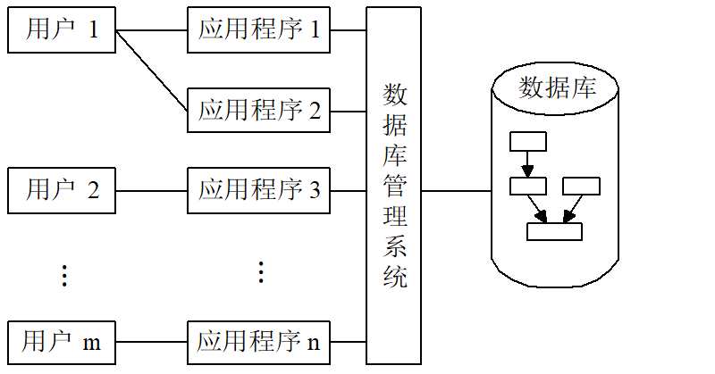

# 第1章 数据库发展史

## 1.1 数据管理技术的发展

### 1.1.1 人工管理阶段

时间：20世纪50年代中期以前，计算机本身的水平较低。

硬件方面：计算机的运算速度低、内存容量小，外存还没有磁盘等直接存取的存储设备

软件方面：还没有操作系统，没有管理数据的软件。

**特点**：

1. 数据不保存在计算机内
2. 没有专用的软件对数据进行管理
3. 只有程序，没有文件的概念
4. 数据面向程序

### 1.1.2 文件系统阶段

时间：从20世纪50年代后期到60年代中期，计算机的硬件、软件都有了很大发展

硬件：有了磁盘、磁鼓等直接存取的存储设备

软件：有了操作系统，其中有专门管理数据的文件系统。

从处理方式讲，不仅有了文件批处理，而且能够联机实时处理。此时，计算机不仅用于科学计算，还大量用于管理。

**特点**：

1. 数据以文件形式长期保存在磁盘上
2. 数据的逻辑结构与物理结构有了区别
3. 文件组织多样化
4. 数据不再属于某个特定的程序，可以重复使用
5. 对数据的操作以记录为单位

### 1.1.3 文件系统的缺陷

**数据的冗余性**：文件之间缺乏联系，每个应用程序对应的文件中可能有重复存储的数据

**数据不一致性**：往往由数据冗余造成，文件更新时，相同的数据在不同文件中不一样。

**数据联系弱**：文件之间相互独立，缺乏联系

### 1.1.4 倒排文件系统阶段

倒排文件是索引文件的推广，每个字段提供单独的索引，方便用户检索，但数据的更新比较复杂和困难

## 1.2 数据库技术的产生和发展

### 1.2.1 数据库技术的产生

**IMS系统**

1968年IBM公司研制IMS系统，在IBM360/370机上运行。

**DBTG报告**

1969年CODASYL（美国数据系统语言协会）的DBTG小组出一份报告，即DBTG报告。

**E.F.Codd的文章**

E.F.Codd于1970年在美国计算机学会通信杂志发表一文。

### 1.2.2 数据库阶段的数据管理特点

1. 采用复杂的数据模型表示数据结构

   描述数据之间的关系，通过存取路径实现，面向整个应用系统

   数据库系统和传统文件系统的根本区别：数据库系统通过所有存取路径表示自然的数据联系

2. 有较高的数据独立性：物理独立性、逻辑独立性

   物理数据独立性：物理结构的改变尽量不影响整体逻辑结构、用户的逻辑结构以及应用程序

   逻辑数据独立性：整体逻辑结构改变时，尽量不影响用户的逻辑结构及应用程序

3. 提供了方便的用户接口

4. 提供四个方面的数据控制功能

   并发控制、恢复、完整性、安全性

5. 数据操作灵活

### 1.2.3 数据库技术的术语

**数据库（DB）**：

是统一管理的相关数据的集合。

**数据库管理系统（DBMS）**：

是位于用户与操作系统之间的一层数据管理软件，为用户和应用程序提供访问DB的方法，包括DB的建立、查询、更新及各种数据控制。

**数据库系统（DBS）**：

是实现有组织地、动态地存储大量关联数据，方便多用户的计算机软件、硬件和数据资源组成的系统，即采用了数据库技术的计算机系统。

**数据库技术**：

是一门研究数据库的结构、存储、管理和使用的软件学科。

### 1.2.4 数据库技术的发展

分布式数据库技术（区块链）

面向对象数据库技术

数据仓库

云数据库（Amazon AWS）

大数据（5V）

其他数据库技术

# 第2章 数据库系统结构

## 2.1 数据描述

### 2.1.1 概念设计中的数据描述

概念设计：根据用户的需求设计数据库的概念结构

**实体(Entity)**

实体是客观存在、可以相互区分的事物，既可以是实际存在的对象，也可以是某种概念。例如：一个工厂、一个车间、一种操作流程等。

**属性(Attribute)**

事物是有特性的。反映在实体上，就是实体的属性。一个实体具有有限个属性，也可以说是这些属性的总和组成了这个实体。

**实体集(Entityset)**

所有属性名完全相同的实体往往集合在一起，称为实体集。例如：全体职工就是一个实体集。为了区分实体集，每个实体集都有一个名称，即实体名。。

**实体标识符(Identifier)**

能惟一标识实体的属性或属性集。也称关键码，或键。

### 2.1.2 逻辑设计中的数据描述

逻辑设计：根据概念设计得到的概念结构来设计的数据库逻辑结构，即表达方式和实现方法

**字段（Field）**

标记实体属性的命名单位。也称数据项。

**记录（Record）**

字段的有序集合。

**文件（File）**

同一类记录的集合。

**关键码（Key）**

能惟一标识文件中每个记录的字段。

### 2.1.3 存储介质层次及数据描述

**物理存储介质层次**：

高速缓冲存储器

主存储器

快擦写存储器（快闪存）

磁盘存储器

光存储器

磁带

**物理存储中的数据描述**：位、字节、字、块、桶、卷

### 2.1.4 数据联系的描述

实体集内部（实体和实体之间）的联系

实体间的联系有三种：

1. 同一实体集中各实体之间的联系(一元联系)。

2. 两个实体集中各实体之间的联系(两元联系)。
3. 三个实体集中各实体之间的联系(三元联系)。

二元联系的实体间联系有三种情况：

1. 一对一 （1：1）
2. 一对多 （1：N）
3. 多对多 （M：N）

## 2.2 数据模型

### 2.2.1 数据模型的定义

数据模型分两种：

1. 概念数据模型：用于建立信息世界的数据模型，与硬件、DBMS无关，实现方法是“实体联系模型”。（用户观点）
2. 结构（逻辑）数据模型：直接面向数据库的逻辑结构，与硬件、DBMS有关，有三部分构成：**数据结构**、**数据操作**、**数据完整性约束**

**数据结构**是指对实体类型和实体间联系的表达和实现。

**数据操作**是指对数据库的检索和更新（包括插入、删除和修改〉两类操作。

**数据完整性约束**给出数据及其联系应具有的制约和依赖规则。

### 2.2.2 实体联系模型

P.P.S.Chen（陈品山）于1976年提出的“实体―联系模型” （Entity―Relationship Approach,简称E―R模型）

ER图中四个基本成分：

1. **矩形框：表示实体类型**

2. **菱形框：表示联系类型**

3. **椭圆形框：表示实体类型或联系类型的属性**

4. **连线：实体与属性之间、实体与联系之间**

多元联系：两个及以上实体集之间的联系

自身联系：在一个联系中,一个实体集可以出现两次或多次, 扮演多个不同角色, 此种情况称为实体集的自身联系。

### 2.2.3 层次模型

用树形（层次）结构表示实体类型及实体间联系的数据模型称为**层次模型**。

树的结点是记录类型，每个非根结点有且只有一个父节点，上一层和下一层记录类型之间的联系是1:N联系

**特点**：

1. 有且仅有一个结点无父结点,这样的结点称为根结点；
2. 非根结点都有且仅有一个父结点。
3. 记录之间的联系通过指针实现，查询效率高

**优点**：

1. 查询效率高
2. 用户面对逻辑数据，不必过多考虑物理细节，逻辑与物理数据的转换由DBMS完成

**缺点**：

1. 只能表示1:N联系，M:N联系实现复杂，用户不易掌握
2. 层次顺序严格和复杂，导致数据的查询和更新操作复杂，使程序编写复杂

### 2.2.4 网状模型

用有向图结构表示实体类型及实体间联系的数据模型称为**网状模型**。

有向图中的结点是记录类型，箭头表示从箭尾的记录类型到箭头的记录类型间的联系是1:N联系

换句话说：把层次模型的限制放开： 一个结点可以有一个以上的父结点, 就得到网状模型。

**特点**：

1. 可能有一个以上的结点无父结点
2. 结点与其父结点之间的联系可以不止一个

