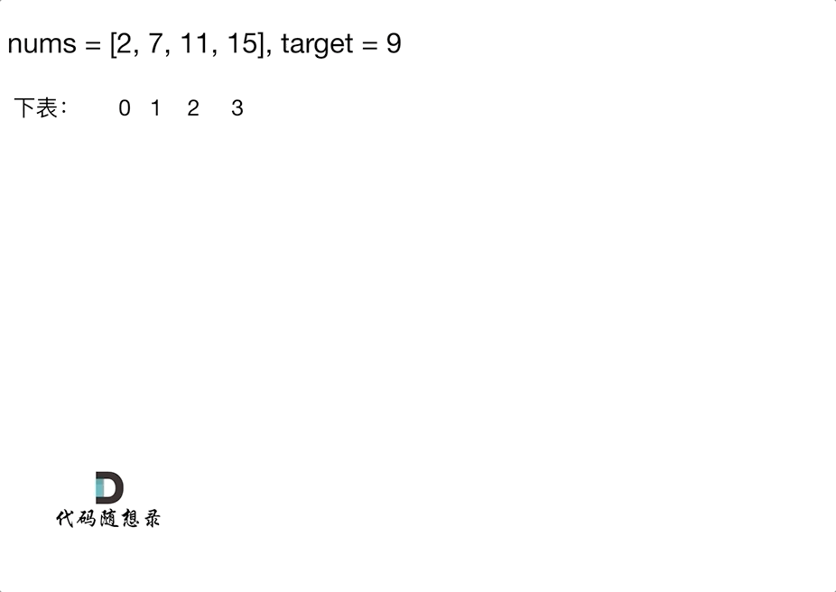
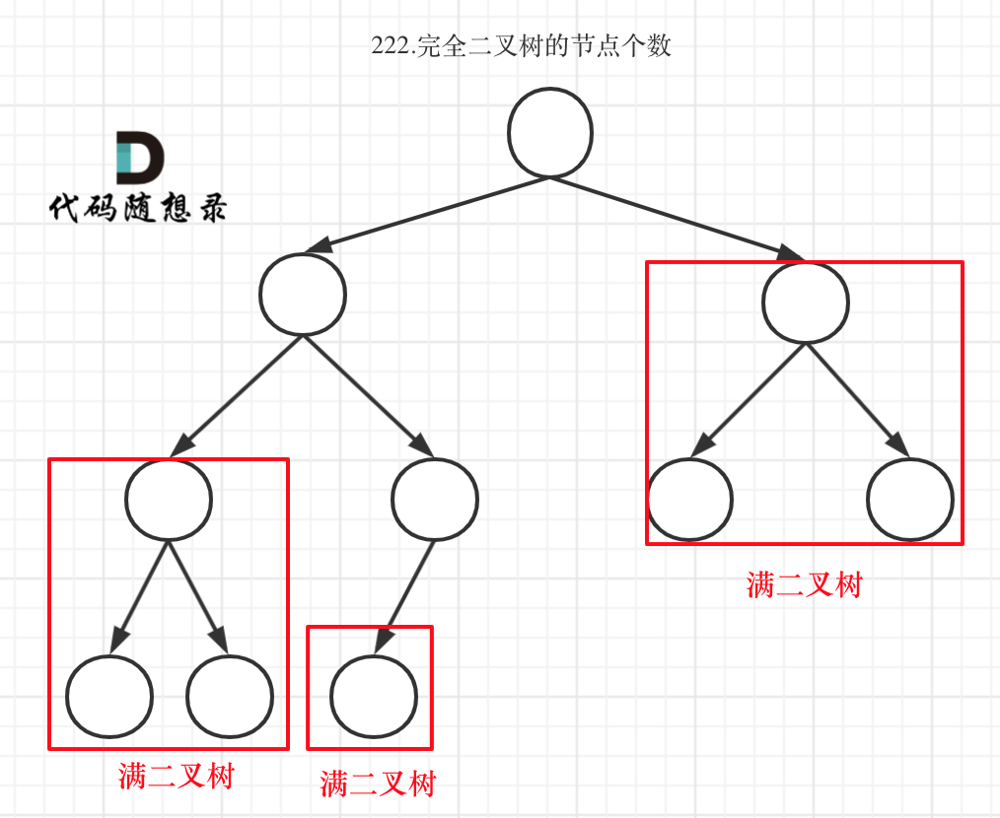

## 数组

### 二分法

满足二分法的前提条件：数组为有序数组，且数组中无重复元素

- 二分法时间复杂度：$O(\log n)$

#### [35. 搜索插入位置](https://leetcode-cn.com/problems/search-insert-position/)

```C++
class Solution {
public:
    int searchInsert(vector<int>& nums, int target) {
        int left = 0, right = nums.size() - 1;	// 
        int middle = 0;
        while(left <= right)
        {
            middle = left + (right - left) / 2;
            if(nums[middle] == target)
            {
                return middle;
            }
            if(nums[middle] < target)
            {
                left = middle + 1;
            }
            else
            {
                right = middle - 1;
            }
        }
        return right + 1;
    }
};
```

#### [34. 在排序数组中查找元素的第一个和最后一个位置](https://leetcode-cn.com/problems/find-first-and-last-position-of-element-in-sorted-array/)

思路一：找到第一个target，往左右遍历

思路二：找到最大的小于target的元素及最小的大于target的元素，案例采用方案二

```C++
class Solution {
public:
    vector<int> searchRange(vector<int>& nums, int target) {
        vector<int> ans;
        if(nums.size() == 0)
        {
            ans.push_back(-1);
            ans.push_back(-1);
            return ans;
        }
        int i = getBorder(nums, target);
        int j = getBorder(nums, target, 1);
        ans.push_back(i);
        ans.push_back(j);
        return ans;
    }
    int getBorder(vector<int>& nums, int target, bool flag = 0)
    {
        bool found = 0;
        int left = 0, right = nums.size() - 1;
        int middle = 0;
        while(left <= right)
        {
            middle = left + (right - left) / 2;
            if(nums[middle] < target)
            {
                left = middle + 1;
            }
            else if(nums[middle] > target)
            {
                right = middle - 1;
            }
            else
            {
                found = 1;
                if(!flag)
                {
                    right = middle - 1;
                }
                else
                {
                    left = middle + 1;
                }
            }
        }
        if(flag && nums[middle] != target)
        {
            middle--;
        }
        else if(!flag && nums[middle] != target)
        {
            middle++;
        }
        if(!found)
            return -1;
        else
            return middle;
    }
};
```

#### [69. x 的平方根 ](https://leetcode-cn.com/problems/sqrtx/)

二分法做，很简单，唯一的问题是，注意数据溢出，middle*middle很容易数据溢出

不能使用int temp = middle * middle，因为究其根本是创建一个临时变量=middle * middle，再复制给temp，仍会溢出

```C++
class Solution {
public:
    int mySqrt(int x) {
        int left = 1, right = x;
        int middle = 0;
        while(left <= right)
        {
            middle = left + ((right - left) / 2);
            if((long long) middle * middle == x)
                return middle;
            if((long long) middle * middle > x)
            {
                right = middle - 1;
            }
            else 
            {
                left = middle + 1;
            }
        }
        return right;
    }
};
```

#### [367. 有效的完全平方数](https://leetcode-cn.com/problems/valid-perfect-square/)

方法同69题

```c++
class Solution {
public:
    bool isPerfectSquare(int num) {
        int left = 1, right = num;
        int middle = 0;
        while(left <= right)
        {
            middle = left + ((right - left) / 2);
            if((long long) middle * middle == num)
                return true;
            if((long long) middle * middle > num)
            {
                right = middle - 1;
            }
            else 
            {
                left = middle + 1;
            }
        }
        return false;
    }
};
```

### 移除元素

双指针时间复杂度：$O(n)$

#### [27. 移除元素](https://leetcode-cn.com/problems/remove-element/)

双指针法（快慢指针法）： **通过一个快指针和慢指针在一个for循环下完成两个for循环的工作。**

删除过程如下：


```c++
class Solution {
public:
    int removeElement(vector<int>& nums, int val) {
        int slowIndex = 0, fastIndex = 0;
        while(fastIndex < nums.size())
        {
            while(fastIndex < nums.size() && nums[fastIndex] == val)
                fastIndex++;
            if(fastIndex == nums.size())
            {
                return slowIndex;
            }
            nums[slowIndex] = nums[fastIndex];
            slowIndex++;
            fastIndex++;
        }
        return slowIndex;
    }
};
```

#### [26. 删除有序数组中的重复项](https://leetcode-cn.com/problems/remove-duplicates-from-sorted-array/)

方法同27

```c++
class Solution {
public:
    int removeDuplicates(vector<int>& nums) {
        int slowIndex = 1;
        int fastIndex = 1;
        while(fastIndex < nums.size())
        {
            while(fastIndex < nums.size() && nums[fastIndex] == nums[slowIndex - 1])
                fastIndex++;
            if(fastIndex == nums.size())
                return slowIndex;
            nums[slowIndex] = nums[fastIndex];
            slowIndex++;
            fastIndex++;
        }
        return slowIndex;
    }
};
```

#### [283. 移动零](https://leetcode-cn.com/problems/move-zeroes/)

方法同27

```c++
class Solution {
public:
    void moveZeroes(vector<int>& nums) {
        int slowIndex = 0;
        int fastIndex = 0;
        while(fastIndex < nums.size())
        {
            while(fastIndex < nums.size() && nums[fastIndex] == 0)
                fastIndex++;
            if(fastIndex == nums.size())
                break;
            nums[slowIndex] = nums[fastIndex];
            slowIndex++;
            fastIndex++;
        }
        for(slowIndex; slowIndex < nums.size(); ++slowIndex)
            nums[slowIndex] = 0;
        return;
    }
};
```

#### [844. 比较含退格的字符串](https://leetcode-cn.com/problems/backspace-string-compare/)

方法同27

```c++
class Solution {
public:
    bool backspaceCompare(string s, string t) {
        int i = getStringSize(s);
        int j = getStringSize(t);
        if(i == j)
        {
            for(int k = 0; k < i; ++k)
                if(s[k] != t[k])
                    return false;
            return true;
        }
        return false;
    }
    int getStringSize(string & s)	// 这里string需要排序，注意参数是引用类型
    {
        int slowIndex = 0;
        int fastIndex = 0;
        while(fastIndex < s.size())
        {
            while(fastIndex < s.size() && s[fastIndex] == '#')
            {
                fastIndex++;
                slowIndex--;
                if(slowIndex < 0)
                    slowIndex = 0;
            }
            if(fastIndex == s.size())
                return slowIndex;
            s[slowIndex] = s[fastIndex];
            slowIndex++;
            fastIndex++;
        }
        return slowIndex;
    }
};
```

#### [977. 有序数组的平方](https://leetcode-cn.com/problems/squares-of-a-sorted-array/)

数组平方后，从头尾来看都是降序，因此这道题的思路就是用两个指针指向头尾，然后归并排序。

```c++
class Solution {
public:
    vector<int> sortedSquares(vector<int>& nums) {
        int i = 0, j = nums.size() - 1;
        int pos = nums.size() - 1;
        vector<int> ans(nums.size());
        while(i <= j)
        {
            int x = nums[i] * nums[i];
            int y = nums[j] * nums[j];
            if(x > y)
            {
                ans[pos] = x;
                i++;
            }
            else
            {
                ans[pos] = y;
                j--;
            }
            pos--;
        }
        return ans;
    }
};
```

### 滑动窗口

滑动窗口时间复杂度：$O(n)$

接下来就开始介绍数组操作中另一个重要的方法：**滑动窗口**。

所谓滑动窗口，**就是不断的调节子序列的起始位置和终止位置，从而得出我们要想的结果**。

这里还是以题目中的示例来举例，s=7， 数组是 2，3，1，2，4，3，来看一下查找的过程：


#### [209. 长度最小的子数组](https://leetcode-cn.com/problems/minimum-size-subarray-sum/)

```c++
class Solution {
public:
    int minSubArrayLen(int target, vector<int>& nums) {
        int ans = 0;
        int left = 0, right = 0;
        int sum = 0;
        while(right < nums.size())
        {
            while(right < nums.size() && sum < target)
            {
                sum += nums[right];
                right++;
            }
            if(ans == 0 && sum >= target)
            {
                ans = right - left;
            }
            while(sum - nums[left] >= target)
            {
                sum -= nums[left];
                left++;
            }
            if(right - left < ans)
            {
                ans = right - left;
            }
            sum -= nums[left];
            left++;
        }
        return ans;
    }
};
```

#### [904. 水果成篮](https://leetcode-cn.com/problems/fruit-into-baskets/)

```c++
class Solution {
public:
    int totalFruit(vector<int>& fruits) {
        if(fruits.size() == 0)
            return 0;
        int left = 0, right = 0;
        int ans = 0;
        while(right < fruits.size() && fruits[left] == fruits[right])
        {
            right++;
        }
        if(right == fruits.size())
            return fruits.size();
        while(right < fruits.size())
        {
            int a, b;
            a = fruits[left];
            b = fruits[right];
            while(right < fruits.size() && (fruits[right] == a || fruits[right] == b))
            {
                right++;
            }
            if(right - left > ans)
            {
                ans = right - left;
            }
            if(right == fruits.size())
                break;
            left = right - 1;
            int temp = fruits[left];
            while(fruits[left] == temp)
            {
                left--;
            }
            left++;
        }
        return ans;
    }
};
```

#### [76. 最小覆盖子串](https://leetcode-cn.com/problems/minimum-window-substring/)

```c++
class Solution {
public:
    string minWindow(string s, string t) {
        if (t == "" || s == "")
            return "";
        int left = 0;
        int right = 0;
        int size = t.size();
        int al = -1, ar = -1;	// 记录答案位置
        int ans = INT_MAX;		// 记录答案长度
        unordered_map<char, int> map;	// 用哈希表存储t子串中的字符
        for (int i = 0; i < size; i++)	// 初始化哈希表map
        {
            if (map.find(t[i]) == map.end())	
            {
                map.emplace(t[i], 1);
            }
            else
            {
                map.at(t[i])++;
            }
        }
        while (right < s.size())
        {
            if (map.find(s[left]) == map.end())	// 如果left指针对应的值非最优解，右移
            {
                if (left == right)
                    right++;
                left++;
                continue;
            }
            else if (map.at(s[left]) < 0)
            {
                map.at(s[left])++;
                left++;
                continue;
            }
            if (map.find(s[right]) != map.end())	// 右移right指针，判断当前字符是否满足条件
            {
                map.at(s[right])--;
                if (map.at(s[right]) >= 0)
                {
                    size--;
                }
            }
            right++;
            if (size == 0)	// 找到满足条件的子串，和当前最优解比较
            {
                if (ans > right - left)
                {
                    ans = right - left;
                    al = left;
                    ar = right;
                    if (ans == t.size())
                        break;
                }
                map.at(s[left])++;
                left++;
                size++;
            }
        }
        if (ans == INT_MAX)
            return "";
        string a = "";
        for (int i = al; i < ar; i++)	// 根据最优解更新答案值
        {
            a += s[i];
        }
        return a;
    }
};
```

### 螺旋矩阵

#### [59. 螺旋矩阵 II](https://leetcode-cn.com/problems/spiral-matrix-ii/)

这道题没啥难的，仔细就完事了

```c++
class Solution {
public:
    vector<vector<int>> generateMatrix(int n) {
        int direction = 0;
        int x = 0, y = 0;
        int pre = 2;
        vector<vector<int>> a;
        for (int i = 0; i < n; ++i)
        {
            vector<int> v(n, 0);
            a.push_back(v);
        }
        a[0][0] = 1;
        while (pre <= n * n)
        {
            if (direction == 0)
            {
                if (y + 1 == n || a[x][y + 1] != 0)
                {
                    direction++;
                    x++;
                }
                else
                {
                    y++;
                }
            }
            else if (direction == 1)
            {
                if (x + 1 == n || a[x + 1][y] != 0)
                {
                    direction++;
                    y--;
                }
                else
                {
                    x++;
                }
            }
            else if (direction == 2)
            {
                if (y - 1 == -1 || a[x][y - 1] != 0)
                {
                    direction++;
                    x--;
                }
                else
                {
                    y--;
                }
            }
            else if (direction == 3)
            {
                if (x - 1 == -1 || a[x - 1][y] != 0)
                {
                    direction = 0;
                    y++;
                }
                else
                {
                    x--;
                }
            }
            a[x][y] = pre;
            pre++;
        }
        return a;
    }
};
```

## 链表

#### [203. 移除链表元素](https://leetcode-cn.com/problems/remove-linked-list-elements/)

这里链表的循环最好不要用for循环，不太好控制

```c++
/**
 * Definition for singly-linked list.
 * struct ListNode {
 *     int val;
 *     ListNode *next;
 *     ListNode() : val(0), next(nullptr) {}
 *     ListNode(int x) : val(x), next(nullptr) {}
 *     ListNode(int x, ListNode *next) : val(x), next(next) {}
 * };
 */
class Solution {
public:
    ListNode* removeElements(ListNode* head, int val) {
        // 删除头结点
        while (head != NULL && head->val == val) { // 注意这里不是if
            ListNode* tmp = head;
            head = head->next;
            delete tmp;
        }

        // 删除非头结点
        ListNode* cur = head;
        while (cur != NULL && cur->next!= NULL) {
            if (cur->next->val == val) {
                ListNode* tmp = cur->next;
                cur->next = cur->next->next;
                delete tmp;
            } else {
                cur = cur->next;
            }
        }
        return head;
    }
};
```

#### [707. 设计链表](https://leetcode-cn.com/problems/design-linked-list/)

简单，仔细就好

```c++
class MyLinkedList {
public:
    MyLinkedList() {
        head = new Node();
    }
    
    int get(int index) {
        Node* p = head;
        while(p != nullptr && index >= 0)
        {
            p = p->next;
            index--;
        }
        if(p)
            return p->val;
        else 
            return -1;
    }
    
    void addAtHead(int val) {
        Node* tmp = new Node();
        tmp->val = val;
        tmp->next = head->next;
        head->next = tmp;
    }
    
    void addAtTail(int val) {
        Node* p = head;
        while(p->next)
        {
            p=p->next;
        }
        Node* tmp = new Node();
        tmp->val = val;
        p->next = tmp;
    }
    
    void addAtIndex(int index, int val) {
        if(index < 0)
            addAtHead(val);
        Node* p = head;
        while(p != nullptr && index > 0)
        {
            p = p->next;
            index--;
        }
        if(p)
        {
            Node* tmp = new Node();
            tmp->val = val;
            tmp->next = p->next;
            p->next = tmp;
        }
    }
    
    void deleteAtIndex(int index) {
        Node* p = head;
        while(p != nullptr && index > 0)
        {
            p = p->next;
            index--;
        }
        if(p && p->next)
        {
            Node* tmp = p->next;
            p->next = tmp->next;
            delete tmp;
        }
    }
private:
    struct Node
    {
        int val;
        Node* next;
    };
    Node* head;
};

/**
 * Your MyLinkedList object will be instantiated and called as such:
 * MyLinkedList* obj = new MyLinkedList();
 * int param_1 = obj->get(index);
 * obj->addAtHead(val);
 * obj->addAtTail(val);
 * obj->addAtIndex(index,val);
 * obj->deleteAtIndex(index);
 */
```

#### [206. 反转链表](https://leetcode-cn.com/problems/reverse-linked-list/)

方法一：看代码

```c++
/**
 * Definition for singly-linked list.
 * struct ListNode {
 *     int val;
 *     ListNode *next;
 *     ListNode() : val(0), next(nullptr) {}
 *     ListNode(int x) : val(x), next(nullptr) {}
 *     ListNode(int x, ListNode *next) : val(x), next(next) {}
 * };
 */
class Solution {
public:
    ListNode* reverseList(ListNode* head) {
        ListNode* p = head;
        while(p && p->next)
        {
            ListNode* tmp = p->next;
            p->next = tmp->next;
            tmp->next = head;
            head = tmp;
        }
        return head;
    }
};
```

方法二：双指针法


方法三：递归，本质是双指针法

```c++
class Solution {
public:
    ListNode* reverse(ListNode* pre,ListNode* cur){
        if(cur == NULL) return pre;
        ListNode* temp = cur->next;
        cur->next = pre;
        // 可以和双指针法的代码进行对比，如下递归的写法，其实就是做了这两步
        // pre = cur;
        // cur = temp;
        return reverse(cur,temp);
    }
    ListNode* reverseList(ListNode* head) {
        // 和双指针法初始化是一样的逻辑
        // ListNode* cur = head;
        // ListNode* pre = NULL;
        return reverse(NULL, head);
    }
};
```

#### [24. 两两交换链表中的节点](https://leetcode-cn.com/problems/swap-nodes-in-pairs/)

仔细就完事了

```c++
/**
 * Definition for singly-linked list.
 * struct ListNode {
 *     int val;
 *     ListNode *next;
 *     ListNode() : val(0), next(nullptr) {}
 *     ListNode(int x) : val(x), next(nullptr) {}
 *     ListNode(int x, ListNode *next) : val(x), next(next) {}
 * };
 */
class Solution {
public:
    ListNode* swapPairs(ListNode* head) {
        ListNode* p = new ListNode();
        p->next = head;
        head = p;
        while(p->next && p->next->next)
        {
            ListNode* tmp = p->next;
            p->next = tmp->next;
            tmp->next = p->next->next;
            p->next->next = tmp;
            p = p->next->next;
        }
        return head->next;
    }
};
```

#### [19. 删除链表的倒数第 N 个结点](https://leetcode-cn.com/problems/remove-nth-node-from-end-of-list/)

增加虚拟头节点，其他要仔细

```c++
/**
 * Definition for singly-linked list.
 * struct ListNode {
 *     int val;
 *     ListNode *next;
 *     ListNode() : val(0), next(nullptr) {}
 *     ListNode(int x) : val(x), next(nullptr) {}
 *     ListNode(int x, ListNode *next) : val(x), next(next) {}
 * };
 */
class Solution {
public:
    ListNode* removeNthFromEnd(ListNode* head, int n) {
        ListNode* p = new ListNode();
        p->next = head;
        head = p;
        ListNode* left = head;
        ListNode* right = head;
        while(n > 0)
        {
            right = right->next;
            n--;
        }
        while(right->next)
        {
            right = right->next;
            left = left->next;
        }
        p = left->next;
        left->next = p->next;
        delete p;
        return head->next;
    }
};
```

#### [面试题 02.07. 链表相交](https://leetcode-cn.com/problems/intersection-of-two-linked-lists-lcci/)

求出两个链表的长度，并求出两个链表长度的差值，将链表头指针指向距离链表尾部相同的距离，然后再开始比较

```c++
/**
 * Definition for singly-linked list.
 * struct ListNode {
 *     int val;
 *     ListNode *next;
 *     ListNode(int x) : val(x), next(NULL) {}
 * };
 */
class Solution {
public:
    ListNode *getIntersectionNode(ListNode *headA, ListNode *headB) {
        int lenA = 0, lenB = 0;
        ListNode* pA = headA, * pB = headB;
        while(pA)
        {
            pA = pA->next;
            lenA++;
        }
        while(pB)
        {
            pB = pB->next;
            lenB++;
        }
        if(lenA > lenB)
        {
            int n = lenA - lenB;
            while(n > 0)
            {
                n--;
                headA = headA->next;
            }
        }
        else if(lenA < lenB)
        {
            int n = lenB - lenA;
            while(n > 0)
            {
                n--;
                headB = headB->next;
            }
        }
        while(headA)
        {
            if(headA == headB)
                return headA;
            headA = headA->next;
            headB = headB->next;
        }
        return nullptr;
    }
};
```

#### [142. 环形链表 II](https://leetcode-cn.com/problems/linked-list-cycle-ii/)

[思路](https://programmercarl.com/0142.%E7%8E%AF%E5%BD%A2%E9%93%BE%E8%A1%A8II.html#_142-%E7%8E%AF%E5%BD%A2%E9%93%BE%E8%A1%A8ii)

```c++
/**
 * Definition for singly-linked list.
 * struct ListNode {
 *     int val;
 *     ListNode *next;
 *     ListNode(int x) : val(x), next(NULL) {}
 * };
 */
class Solution {
public:
    ListNode *detectCycle(ListNode *head) {
        ListNode* fast = head;
        ListNode* slow = head;
        while(fast != NULL && fast->next != NULL) {
            slow = slow->next;
            fast = fast->next->next;
            // 快慢指针相遇，此时从head 和 相遇点，同时查找直至相遇
            if (slow == fast) {
                ListNode* index1 = fast;
                ListNode* index2 = head;
                while (index1 != index2) {
                    index1 = index1->next;
                    index2 = index2->next;
                }
                return index2; // 返回环的入口
            }
        }
        return NULL;
    }
};

```

## 哈希表

### 常见的三种哈希结构

当我们想使用哈希法来解决问题的时候，我们一般会选择如下三种数据结构。

- 数组
- set （集合）
- map(映射)

这里数组就没啥可说的了，我们来看一下set。

在C++中，set 和 map 分别提供以下三种数据结构，其底层实现以及优劣如下表所示：

| 集合               | 底层实现 | 是否有序 | 数值是否可以重复 | 能否更改数值 | 查询效率    | 增删效率    |
| ------------------ | -------- | -------- | ---------------- | ------------ | ----------- | ----------- |
| std::set           | 红黑树   | 有序     | 否               | 否           | $O(\log n)$ | $O(\log n)$ |
| std::multiset      | 红黑树   | 有序     | 是               | 否           | $O(\log n)$ | $O(\log n)$ |
| std::unordered_set | 哈希表   | 无序     | 否               | 否           | $O(1)$      | $O(1)$      |

std::unordered_set底层实现为哈希表，std::set 和std::multiset 的底层实现是红黑树，红黑树是一种平衡二叉搜索树，所以key值是有序的，但key不可以修改，改动key值会导致整棵树的错乱，所以只能删除和增加。

| 映射               | 底层实现 | 是否有序 | 数值是否可以重复 | 能否更改数值 | 查询效率    | 增删效率    |
| ------------------ | -------- | -------- | ---------------- | ------------ | ----------- | ----------- |
| std::map           | 红黑树   | key有序  | key不可重复      | key不可修改  | $O(\log n)$ | $O(\log n)$ |
| std::multimap      | 红黑树   | key有序  | key可重复        | key不可修改  | $O(\log n)$ | $O(\log n)$ |
| std::unordered_map | 哈希表   | key无序  | key不可重复      | key不可修改  | $O(1)$      | $O(1)$      |

std::unordered_map 底层实现为哈希表，std::map 和std::multimap 的底层实现是红黑树。同理，std::map 和std::multimap 的key也是有序的（这个问题也经常作为面试题，考察对语言容器底层的理解）。

当我们要使用集合来解决哈希问题的时候，优先使用unordered_set，因为它的查询和增删效率是最优的，如果需要集合是有序的，那么就用set，如果要求不仅有序还要有重复数据的话，那么就用multiset。

那么再来看一下map ，在map 是一个key value 的数据结构，map中，对key是有限制，对value没有限制的，因为key的存储方式使用红黑树实现的。

其他语言例如：java里的HashMap ，TreeMap 都是一样的原理。可以灵活贯通。

虽然std::set、std::multiset 的底层实现是红黑树，不是哈希表，但是std::set、std::multiset  依然使用哈希函数来做映射，只不过底层的符号表使用了红黑树来存储数据，所以使用这些数据结构来解决映射问题的方法，我们依然称之为哈希法。  map也是一样的道理。

**当我们遇到了要快速判断一个元素是否出现集合里的时候，就要考虑哈希法**。

但是哈希法也是**牺牲了空间换取了时间**，因为我们要使用额外的数组，set或者是map来存放数据，才能实现快速的查找。

### 哈希解法

#### [242. 有效的字母异位词](https://leetcode-cn.com/problems/valid-anagram/)

哈希表

使用标准库版本：

```c++
class Solution {
public:
    bool isAnagram(string s, string t) {
        if(s.size() != t.size())
            return false;
        multiset<char> a;
        for(int i = 0; i < s.size(); i++)
        {
            a.insert(s[i]);
        }
        for(int i = 0; i < s.size(); i++)
        {
            multiset<char>::iterator m;
            if((m = a.find(t[i])) == a.end())
                return false;
            a.erase(m);
        }
        return true;
    }
};
```

自己写哈希函数版本，即用数组来做：

```c++
class Solution {
public:
    bool isAnagram(string s, string t) {
        int record[26] = {0};
        for (int i = 0; i < s.size(); i++) {
            // 并不需要记住字符a的ASCII，只要求出一个相对数值就可以了
            record[s[i] - 'a']++;
        }
        for (int i = 0; i < t.size(); i++) {
            record[t[i] - 'a']--;
        }
        for (int i = 0; i < 26; i++) {
            if (record[i] != 0) {
                // record数组如果有的元素不为零0，说明字符串s和t 一定是谁多了字符或者谁少了字符。
                return false;
            }
        }
        // record数组所有元素都为零0，说明字符串s和t是字母异位词
        return true;
    }
};
```

#### [383. 赎金信](https://leetcode-cn.com/problems/ransom-note/)

方法同242，如果不用stl做效率会更高（即用数组方法做效率会更高）

```c++
class Solution {
public:
    bool canConstruct(string ransomNote, string magazine) {
        multiset<char> a;
        for(int i = 0; i < ransomNote.size(); i++)
        {
            a.insert(ransomNote[i]);
        }
        for(int i = 0; i < magazine.size(); i++)
        {
            multiset<char>::iterator m;
            if((m = a.find(magazine[i])) != a.end())
                a.erase(m);
        }
        if(a.empty())
            return true;
        return false;
    }
};
```

#### [49. 字母异位词分组](https://leetcode-cn.com/problems/group-anagrams/)

方法一：排序后每个string相同，排序后的字符串作为哈希表的键

```c++
class Solution {
public:
    vector<vector<string>> groupAnagrams(vector<string>& strs) {
        vector<vector<string>> ans;
        unordered_map<string, int> map;
        // unordered_map<string>::iterator iter;
        for(int i = 0; i < strs.size(); ++i)
        {
            string str = strs[i];
            sort(str.begin(), str.end());
            if(map.find(str) == map.end())
            {
                map.insert(pair<string, int>(str, ans.size()));
                vector<string> tmp;
                tmp.push_back(strs[i]);
                ans.push_back(tmp);
            }
            else
            {
                ans[map[str]].push_back(strs[i]);
            }
        }
        return ans;
    }
};
```

方法二：将每个字母的出现频率作为哈希表的键

#### [438. 找到字符串中所有字母异位词](https://leetcode-cn.com/problems/find-all-anagrams-in-a-string/)

滑动窗口+哈希表

```c++
class Solution {
public:
    vector<int> findAnagrams(string s, string p) {
        vector<int> ans;
        int left = 0;
        int right = 0;
        unordered_map<char, int> map;
        int size = p.size();
        for(int i = 0; i < p.size(); i++)		// 哈希表初始化
        {
            if(map.find(p[i]) == map.end())
            {
                map.insert(pair<char, int>(p[i], 1));
            }
            else
            {
                map[p[i]]++;
            }
        }
        while(right < s.size())			
        {
            if(map.find(s[right]) == map.end())	// 哈希表内未找到
            {
                while(left < right)
                {
                    map[s[left]]++;
                    left++;
                    size++;
                }
                left++;
            }
            else if(map[s[right]] == 0)		// 哈希表内找到，但是该字符数量超过范围
            {
                while(left < right && map[s[right]] == 0)
                {
                    map[s[left]]++;
                    left++;
                    size++;
                }
                map[s[right]]--;
                size--;
            }
            else			//哈希表内找到，并且字符数量合适
            {
                map[s[right]]--;
                size--;
                if(size == 0)
                {
                    ans.emplace_back(left);
                    map[s[left]]++;
                    size++;
                    left++;
                }
            }
            right++;
        }
        return ans;
    }
};
```

#### [349. 两个数组的交集](https://leetcode-cn.com/problems/intersection-of-two-arrays/)

哈希表

这道题不能用数组做，因为数字的大小是不固定的，数组大小不能确定

```c++
class Solution {
public:
    vector<int> intersection(vector<int>& nums1, vector<int>& nums2) {
        unordered_set<int> set;
        vector<int> ans;
        for(int i = 0; i < nums1.size(); ++i)
        {
            if(set.find(nums1.at(i)) == set.end())
            {
                set.insert(nums1.at(i));
            }
        }
        for(int i = 0; i < nums2.size(); ++i)
        {
            unordered_set<int>::iterator it;
            if((it = set.find(nums2.at(i))) != set.end())
            {
                ans.emplace_back(nums2.at(i));
                set.erase(it);
            }
        }
        return ans;
    }
};
```

#### [350. 两个数组的交集 II](https://leetcode-cn.com/problems/intersection-of-two-arrays-ii/)

方法同349，换个容器做就好，将unordered_set改为multiset

```c++
    class Solution {
    public:
        vector<int> intersect(vector<int>& nums1, vector<int>& nums2) {
            multiset<int> set;
            vector<int> ans;
            for(int i = 0; i < nums1.size(); ++i)
            {
                set.insert(nums1.at(i));
            }
            for(int i = 0; i < nums2.size(); ++i)
            {
                multiset<int>::iterator it;
                if((it = set.find(nums2.at(i))) != set.end())
                {
                    ans.emplace_back(nums2.at(i));
                    set.erase(it);
                }
            }
            return ans;
        }
    };
```

#### [1. 两数之和](https://leetcode-cn.com/problems/two-sum/)



```c++
class Solution {
public:
    vector<int> twoSum(vector<int>& nums, int target) {
        unordered_map<int, int> map;
        vector<int> ans;
        for(int i = 0; i < nums.size(); ++i)
        {
            if(map.find(target - nums[i]) != map.end())
            {
                ans.emplace_back(i);
                ans.emplace_back(map[target - nums[i]]);
                break;
            }
            if(map.find(nums[i]) == map.end())
                map.insert(pair<int, int>(nums[i], i));            
        }
        return ans;
    }
};
```

#### [454. 四数相加 II](https://leetcode-cn.com/problems/4sum-ii/)


```c++
class Solution {
public:
    int fourSumCount(vector<int>& nums1, vector<int>& nums2, vector<int>& nums3, vector<int>& nums4) {
        unordered_map<int, int> map;
        int ans = 0;
        for(int i = 0; i < nums1.size(); ++i)
        {
            for(int j = 0; j < nums2.size(); ++j)
            {
                int tmp = nums1[i] + nums2[j];
                if(map.find(tmp) == map.end())
                {
                    map.insert(pair<int, int>(tmp, 1));
                }
                else
                {
                    map[tmp]++;
                }
            }
        }
        for(int i = 0; i < nums3.size(); ++i)
        {
            for(int j = 0; j < nums4.size(); ++j)
            {
                int tmp = nums3[i] + nums4[j];
                if(map.find(-tmp) != map.end())
                {
                    ans += map[-tmp];
                }
            }
        }
        return ans;
    }
};
```

以下是官方解，虽然思路一样，但是官方解好短！！！好好参考一下

```c++
class Solution {
public:
    int fourSumCount(vector<int>& A, vector<int>& B, vector<int>& C, vector<int>& D) {
        unordered_map<int, int> countAB;
        for (int u: A) {
            for (int v: B) {
                ++countAB[u + v];
            }
        }
        int ans = 0;
        for (int u: C) {
            for (int v: D) {
                if (countAB.count(-u - v)) {
                    ans += countAB[-u - v];
                }
            }
        }
        return ans;
    }
};

```

#### [15. 三数之和](https://leetcode-cn.com/problems/3sum/)

1、双指针法

固定一个指针i确定已遍历过的区域，剩下的left和right指针慢慢往中间缩小，找到等于0的位置


```c++
class Solution {
public:
    vector<vector<int>> threeSum(vector<int>& nums) {
        vector<vector<int>> result;
        sort(nums.begin(), nums.end());
        // 找出a + b + c = 0
        // a = nums[i], b = nums[left], c = nums[right]
        for (int i = 0; i < nums.size(); i++) {
            // 排序之后如果第一个元素已经大于零，那么无论如何组合都不可能凑成三元组，直接返回结果就可以了
            if (nums[i] > 0) {
                return result;
            }
            // 错误去重方法，将会漏掉-1,-1,2 这种情况
            /*
            if (nums[i] == nums[i + 1]) {
                continue;
            }
            */
            // 正确去重方法
            if (i > 0 && nums[i] == nums[i - 1]) {
                continue;
            }
            int left = i + 1;
            int right = nums.size() - 1;
            while (right > left) {
                // 去重复逻辑如果放在这里，0，0，0 的情况，可能直接导致 right<=left 了，从而漏掉了 0,0,0 这种三元组
                /*
                while (right > left && nums[right] == nums[right - 1]) right--;
                while (right > left && nums[left] == nums[left + 1]) left++;
                */
                if (nums[i] + nums[left] + nums[right] > 0) {
                    right--;
                } else if (nums[i] + nums[left] + nums[right] < 0) {
                    left++;
                } else {
                    result.push_back(vector<int>{nums[i], nums[left], nums[right]});
                    // 去重逻辑应该放在找到一个三元组之后
                    while (right > left && nums[right] == nums[right - 1]) right--;
                    while (right > left && nums[left] == nums[left + 1]) left++;

                    // 找到答案时，双指针同时收缩
                    right--;
                    left++;
                }
            }
        }
        return result;
    }
};
```

2、哈希解法

两层for循环就可以确定 a 和b 的数值了，可以使用哈希法来确定 0-(a+b) 是否在 数组里出现过，其实这个思路是正确的，但是我们有一个非常棘手的问题，就是题目中说的不可以包含重复的三元组。

把符合条件的三元组放进vector中，然后再去重，这样是非常费时的，很容易超时，也是这道题目通过率如此之低的根源所在。

去重的过程不好处理，有很多小细节，如果在面试中很难想到位。

时间复杂度可以做到$O(n^2)$，但还是比较费时的，因为不好做剪枝操作。

大家可以尝试使用哈希法写一写，就知道其困难的程度了。

哈希法C++代码:

```c++
class Solution {
public:
    vector<vector<int>> threeSum(vector<int>& nums) {
        vector<vector<int>> result;
        sort(nums.begin(), nums.end());
        // 找出a + b + c = 0
        // a = nums[i], b = nums[j], c = -(a + b)
        for (int i = 0; i < nums.size(); i++) {
            // 排序之后如果第一个元素已经大于零，那么不可能凑成三元组
            if (nums[i] > 0) {
                break;
            }
            if (i > 0 && nums[i] == nums[i - 1]) { //三元组元素a去重
                continue;
            }
            unordered_set<int> set;
            for (int j = i + 1; j < nums.size(); j++) {
                if (j > i + 2
                        && nums[j] == nums[j-1]
                        && nums[j-1] == nums[j-2]) { // 三元组元素b去重
                    continue;
                }
                int c = 0 - (nums[i] + nums[j]);
                if (set.find(c) != set.end()) {
                    result.push_back({nums[i], nums[j], c});
                    set.erase(c);// 三元组元素c去重
                } else {
                    set.insert(nums[j]);
                }
            }
        }
        return result;
    }
};
```

#### [18. 四数之和](https://leetcode-cn.com/problems/4sum/)

方法同15，只有细微区别

```c++
class Solution {
public:
    vector<vector<int>> fourSum(vector<int>& nums, int target) {
        vector<vector<int>> ans;
        sort(nums.begin(), nums.end());
        for (int i = 0; i < nums.size(); i++)
        {
            if (nums[i] * 2 > target / 2) break;
            if (i > 0 && nums[i] == nums[i - 1]) continue;
            for (int j = nums.size() - 1; j > i; j--)
            {
                if (nums[j] * 2 < target / 2) break;
                if (j < nums.size() - 1 && nums[j] == nums[j + 1]) continue;
                int left = i + 1;
                int right = j - 1;
                while (left < right)
                {
                    if (nums[i] + nums[j] > target - nums[left] - nums[right])
                    {
                        right--;
                    }
                    else if (nums[i] + nums[j] < target - nums[left] - nums[right])
                    {
                        left++;
                    }
                    else
                    {
                        ans.emplace_back(vector<int>{nums[i], nums[left], nums[right], nums[j]});
                        while (left < right && nums[left] == nums[left + 1])
                            left++;
                        while (left < right && nums[right] == nums[right - 1])
                            right--;
                        right--;
                        left++;
                    }
                }
            }
        }
        return ans;
    }
};
```

## 字符串

#### [344. 反转字符串](https://leetcode-cn.com/problems/reverse-string/)

双指针法

```c++
class Solution {
public:
    void reverseString(vector<char>& s) {
        int right = s.size() - 1;
        int left = 0;
        while(left < right)
        {
            char tmp = s[left];
            s[left] = s[right];
            s[right] = tmp;
            left++;
            right--;
        }
    }
};
```

#### [541. 反转字符串 II](https://leetcode-cn.com/problems/reverse-string-ii/)

方法同344

```c++
class Solution {
public:
    string reverseStr(string s, int k) {
        int right = k - 1;
        int left = 0;
        while(left < s.size())
        {
            if(right >= s.size())
                right = s.size() - 1;
            int r = right, l = left;
            while(l < r)
            {
                char tmp = s[l];
                s[l] = s[r];
                s[r] = tmp;
                l++;
                r--;
            }
            right += k * 2;
            left += k * 2;
        }
        return s;
    }
};
```

#### [剑指 Offer 05. 替换空格](https://leetcode-cn.com/problems/ti-huan-kong-ge-lcof/)

方法一：

```c++
class Solution {
public:
    string replaceSpace(string s) {
        string ans;
        for(int i = 0; i < s.size(); ++i)
        {
            if(s[i] == ' ')
            {
                ans += "%20";
            }
            else
            {
                ans += s[i];
            }
        }
        return ans;
    }
};
```

方法二：不使用额外空间的方法，双指针


```c++
class Solution {
public:
    string replaceSpace(string s) {
        int count = 0; // 统计空格的个数
        int sOldSize = s.size();
        for (int i = 0; i < s.size(); i++) {
            if (s[i] == ' ') {
                count++;
            }
        }
        // 扩充字符串s的大小，也就是每个空格替换成"%20"之后的大小
        s.resize(s.size() + count * 2);
        int sNewSize = s.size();
        // 从后先前将空格替换为"%20"
        for (int i = sNewSize - 1, j = sOldSize - 1; j < i; i--, j--) {
            if (s[j] != ' ') {
                s[i] = s[j];
            } else {
                s[i] = '0';
                s[i - 1] = '2';
                s[i - 2] = '%';
                i -= 2;
            }
        }
        return s;
    }
};
```

#### [151. 翻转字符串里的单词](https://leetcode-cn.com/problems/reverse-words-in-a-string/)

方法：第一步将多余空格删除，使用双指针法；第二步将整个字符串反转，第三步将字符串里的每个单词单独进行反转。

```c++
class Solution {
public:
    string reverseWords(string s) {
        RemoveExtraSpaces(s);
        reverse(s, 0, s.size() - 1);
        int loc = 0;
        for(int i = 0; i < s.size(); ++i)
        {
            if(s[i] == ' ')
            {
                reverse(s, loc, i - 1);
                loc = i + 1;
            }
        }
        reverse(s, loc, s.size() - 1);
        return s;
    }
    void RemoveExtraSpaces(string& s)		// 删除多余空格
    {
        int slow = 0;
        int fast = 0;
        while(s.size() > 0 && fast < s.size() && s[fast] == ' ')
        {
            fast++;
        }
        while(fast < s.size())
        {
            if(fast - 1 > 0 && s[fast] == s[fast - 1] && s[fast] == ' ')
            {
                fast++;
                continue;
            }
            else
            {
                s[slow++] = s[fast];
            }
            fast++;
        }
        if(slow - 1 > 0 && s[slow - 1] == ' ')
        {
            s.resize(slow - 1);
        }
        else
        {
            s.resize(slow);
        }
    }
    void reverse(string& s, int left, int right)	// 反转字符串
    {
        while(left < right)
        {
            swap(s[left], s[right]);
            left++;
            right--;
        }
    }
};
```

#### [剑指 Offer 58 - II. 左旋转字符串](https://leetcode-cn.com/problems/zuo-xuan-zhuan-zi-fu-chuan-lcof/)

对整个字符串进行反转，再对其中的两个单独子串反转，可以得到想要的结果

```c++
class Solution {
public:
    string reverseLeftWords(string s, int n) {
        reverse(s.begin(), s.begin() + n);
        reverse(s.begin() + n, s.end());
        reverse(s.begin(), s.end());
        return s;
    }
};
```

#### [28. 实现 strStr()](https://leetcode-cn.com/problems/implement-strstr/)

KMP

```c++
class Solution {
public:
    void getNext(int* next, const string& s) {
        int j = -1;
        next[0] = j;
        for(int i = 1; i < s.size(); i++) { // 注意i从1开始
            while (j >= 0 && s[i] != s[j + 1]) { // 前后缀不相同了
                j = next[j]; // 向前回退
            }
            if (s[i] == s[j + 1]) { // 找到相同的前后缀
                j++;
            }
            next[i] = j; // 将j（前缀的长度）赋给next[i]
        }
    }
    int strStr(string haystack, string needle) {
        if (needle.size() == 0) {
            return 0;
        }
        int next[needle.size()];
        getNext(next, needle);
        int j = -1; // // 因为next数组里记录的起始位置为-1
        for (int i = 0; i < haystack.size(); i++) { // 注意i就从0开始
            while(j >= 0 && haystack[i] != needle[j + 1]) { // 不匹配
                j = next[j]; // j 寻找之前匹配的位置
            }
            if (haystack[i] == needle[j + 1]) { // 匹配，j和i同时向后移动
                j++; // i的增加在for循环里
            }
            if (j == (needle.size() - 1) ) { // 文本串s里出现了模式串t
                return (i - needle.size() + 1);
            }
        }
        return -1;
    }
};
```

#### [459. 重复的子字符串](https://leetcode-cn.com/problems/repeated-substring-pattern/)

KMP

这道题关系到KMP的next数组，数组长度为：len。

如果len % (len - (next[len - 1] + 1)) == 0 ，则说明 (数组长度-最长相等前后缀的长度) 正好可以被 数组的长度整除，说明有该字符串有重复的子字符串。

**数组长度减去最长相同前后缀的长度相当于是第一个周期的长度，也就是一个周期的长度，如果这个周期可以被整除，就说明整个数组就是这个周期的循环。**

**强烈建议大家把next数组打印出来，看看next数组里的规律，有助于理解KMP算法**

如图：


```c++
class Solution {
public:
    bool repeatedSubstringPattern(string s) {
        int next[s.size()];
        getNext(next, s);
        int len = s.size();
        if(next[len - 1] != -1 && len % (len - next[len - 1] - 1) == 0)
            return true;
        return false;
    }
    void getNext(int* next, const string& s)
    {
        int j = -1;
        next[0] = j;
        for(int i = 1; i < s.size(); ++i)
        {
            while(j >= 0 && s[j + 1] != s[i])
                j = next[j];
            if(s[i] == s[j + 1])
            {
                j++;
            }
            next[i] = j;
        }
    }
};
```

## 栈与队列

#### [232. 用栈实现队列](https://leetcode-cn.com/problems/implement-queue-using-stacks/)

```c++
class MyQueue {
public:
    stack<int> sin;
    stack<int> sout;
    MyQueue() {

    }
    
    void push(int x) {
        sin.push(x);
    }
    
    int pop() {
        if(sout.empty())
        {
            while(!sin.empty())
            {
                sout.push(sin.top());
                sin.pop();
            }
        }
        int result = sout.top();
        sout.pop();
        return result;
    }
    
    int peek() {
        int res = pop();
        sout.push(res);
        return res;
    }
    
    bool empty() {
        return sin.empty() && sout.empty();
    }
};

/**
 * Your MyQueue object will be instantiated and called as such:
 * MyQueue* obj = new MyQueue();
 * obj->push(x);
 * int param_2 = obj->pop();
 * int param_3 = obj->peek();
 * bool param_4 = obj->empty();
 */
```


#### [225. 用队列实现栈](https://leetcode-cn.com/problems/implement-stack-using-queues/)


优化后：只用一个队列

```c++
class MyStack {
public:
    queue<int> que;
    MyStack() {

    }
    
    void push(int x) {
        que.push(x);
    }
    
    int pop() {
        int s = que.size();
        while(s > 1)
        {
            que.push(que.front());
            que.pop();
            s--;
        }
        int res = que.front();
        que.pop();
        return res;
    }
    
    int top() {
        return que.back();
    }
    
    bool empty() {
        return que.empty();
    }
};

/**
 * Your MyStack object will be instantiated and called as such:
 * MyStack* obj = new MyStack();
 * obj->push(x);
 * int param_2 = obj->pop();
 * int param_3 = obj->top();
 * bool param_4 = obj->empty();
 */
```

#### [20. 有效的括号](https://leetcode-cn.com/problems/valid-parentheses/)

虽然基础方法很简单，但一些小细节使得这个代码非常简短，详情看代码

```c++
class Solution {
public:
    bool isValid(string s) {
        stack<int> st;
        for (int i = 0; i < s.size(); i++) {
            if (s[i] == '(') st.push(')');
            else if (s[i] == '{') st.push('}');
            else if (s[i] == '[') st.push(']');
            // 第三种情况：遍历字符串匹配的过程中，栈已经为空了，没有匹配的字符了，说明右括号没有找到对应的左括号 return false
            // 第二种情况：遍历字符串匹配的过程中，发现栈里没有我们要匹配的字符。所以return false
            else if (st.empty() || st.top() != s[i]) return false;
            else st.pop(); // st.top() 与 s[i]相等，栈弹出元素
        }
        // 第一种情况：此时我们已经遍历完了字符串，但是栈不为空，说明有相应的左括号没有右括号来匹配，所以return false，否则就return true
        return st.empty();
    }
};
```

#### [150. 逆波兰表达式求值](https://leetcode-cn.com/problems/evaluate-reverse-polish-notation/)

思路很简单，用栈实现，但我写的代码就是会更长一些，再多品一品吧

```c++
class Solution {
public:
    int evalRPN(vector<string>& tokens) {
        stack<int> st;
        for (int i = 0; i < tokens.size(); i++) {
            if (tokens[i] == "+" || tokens[i] == "-" || tokens[i] == "*" || tokens[i] == "/") {
                int num1 = st.top();
                st.pop();
                int num2 = st.top();
                st.pop();
                if (tokens[i] == "+") st.push(num2 + num1);
                if (tokens[i] == "-") st.push(num2 - num1);
                if (tokens[i] == "*") st.push(num2 * num1);
                if (tokens[i] == "/") st.push(num2 / num1);
            } else {
                st.push(stoi(tokens[i]));
            }
        }
        int result = st.top();
        st.pop(); // 把栈里最后一个元素弹出（其实不弹出也没事）
        return result;
    }
};
```

#### [239. 滑动窗口最大值](https://leetcode-cn.com/problems/sliding-window-maximum/)


```c++
class Solution {
public:
    vector<int> maxSlidingWindow(vector<int>& nums, int k) {
        int left = 0, right = 0;
        MyQueue q;
        vector<int> ans;
        while(right < nums.size())
        {
            if(right - left == k)
            {
                ans.emplace_back(q.front());
                if(nums[left] == q.front())
                    q.pop();
                left++;
            }
            q.push(nums[right]);
            right++;
        }
        ans.emplace_back(q.front());
        return ans;
    }
    class MyQueue
    {
    private:
        deque<int> q;
    public:
        void push(int x)
        {
            while(!q.empty() && x > q.back())
            {
                q.pop_back();
            }
            q.push_back(x);
        }
        void pop()
        {
            q.pop_front();
        }
        int front()
        {
            return q.front();
        }
    };
};
```

#### [347. 前 K 个高频元素](https://leetcode-cn.com/problems/top-k-frequent-elements/)


```c++
// 时间复杂度：O(nlogk)
// 空间复杂度：O(n)
class Solution {
public:
    // 小顶堆
    class mycomparison {
    public:
        bool operator()(const pair<int, int>& lhs, const pair<int, int>& rhs) {
            return lhs.second > rhs.second;
        }
    };
    vector<int> topKFrequent(vector<int>& nums, int k) {
        // 要统计元素出现频率
        unordered_map<int, int> map; // map<nums[i],对应出现的次数>
        for (int i = 0; i < nums.size(); i++) {
            map[nums[i]]++;
        }

        // 对频率排序
        // 定义一个小顶堆，大小为k
        priority_queue<pair<int, int>, vector<pair<int, int>>, mycomparison> pri_que;

        // 用固定大小为k的小顶堆，扫面所有频率的数值
        for (unordered_map<int, int>::iterator it = map.begin(); it != map.end(); it++) {
            pri_que.push(*it);
            if (pri_que.size() > k) { // 如果堆的大小大于了K，则队列弹出，保证堆的大小一直为k
                pri_que.pop();
            }
        }

        // 找出前K个高频元素，因为小顶堆先弹出的是最小的，所以倒序来输出到数组
        vector<int> result(k);
        for (int i = k - 1; i >= 0; i--) {
            result[i] = pri_que.top().first;
            pri_que.pop();
        }
        return result;

    }
};
```

## 二叉树

### 二叉树的遍历

#### 递归

以前序为例，中序后序相似

```c++
class Solution {
public:
    void traversal(TreeNode* cur, vector<int>& vec) {
        if (cur == NULL) return;
        vec.push_back(cur->val);    // 中
        traversal(cur->left, vec);  // 左
        traversal(cur->right, vec); // 右
    }
    vector<int> preorderTraversal(TreeNode* root) {
        vector<int> result;
        traversal(root, result);
        return result;
    }
};
```

#### 迭代

前序遍历：

```c++
class Solution {
public:
    vector<int> preorderTraversal(TreeNode* root) {
        stack<TreeNode*> st;
        vector<int> result;
        if (root == NULL) return result;
        st.push(root);
        while (!st.empty()) {
            TreeNode* node = st.top();                       // 中
            st.pop();
            result.push_back(node->val);
            if (node->right) st.push(node->right);           // 右（空节点不入栈）
            if (node->left) st.push(node->left);             // 左（空节点不入栈）
        }
        return result;
    }
};
```

中序遍历：

```c++
class Solution {
public:
    vector<int> inorderTraversal(TreeNode* root) {
        vector<int> result;
        stack<TreeNode*> st;
        TreeNode* cur = root;
        while (cur != NULL || !st.empty()) {
            if (cur != NULL) { // 指针来访问节点，访问到最底层
                st.push(cur); // 将访问的节点放进栈
                cur = cur->left;                // 左
            } else {
                cur = st.top(); // 从栈里弹出的数据，就是要处理的数据（放进result数组里的数据）
                st.pop();
                result.push_back(cur->val);     // 中
                cur = cur->right;               // 右
            }
        }
        return result;
    }
};
```

后序遍历：前序遍历之后反转结果即可

```c++
class Solution {
public:
    vector<int> postorderTraversal(TreeNode* root) {
        stack<TreeNode*> st;
        vector<int> result;
        if (root == NULL) return result;
        st.push(root);
        while (!st.empty()) {
            TreeNode* node = st.top();
            st.pop();
            result.push_back(node->val);
            if (node->left) st.push(node->left); // 相对于前序遍历，这更改一下入栈顺序 （空节点不入栈）
            if (node->right) st.push(node->right); // 空节点不入栈
        }
        reverse(result.begin(), result.end()); // 将结果反转之后就是左右中的顺序了
        return result;
    }
};
```

### 二叉树的统一迭代法

中序遍历：

```c++
class Solution {
public:
    vector<int> inorderTraversal(TreeNode* root) {
        vector<int> result;
        stack<TreeNode*> st;
        if (root != NULL) st.push(root);
        while (!st.empty()) {
            TreeNode* node = st.top();
            if (node != NULL) {
                st.pop(); // 将该节点弹出，避免重复操作，下面再将右中左节点添加到栈中
                if (node->right) st.push(node->right);  // 添加右节点（空节点不入栈）

                st.push(node);                          // 添加中节点
                st.push(NULL); // 中节点访问过，但是还没有处理，加入空节点做为标记。

                if (node->left) st.push(node->left);    // 添加左节点（空节点不入栈）
            } else { // 只有遇到空节点的时候，才将下一个节点放进结果集
                st.pop();           // 将空节点弹出
                node = st.top();    // 重新取出栈中元素
                st.pop();
                result.push_back(node->val); // 加入到结果集
            }
        }
        return result;
    }
};
```

前序遍历和后序遍历和中序遍历相似，此处不做赘述

### 层序遍历

#### [102. 二叉树的层序遍历](https://leetcode-cn.com/problems/binary-tree-level-order-traversal/)

```c++
/**
 * Definition for a binary tree node.
 * struct TreeNode {
 *     int val;
 *     TreeNode *left;
 *     TreeNode *right;
 *     TreeNode() : val(0), left(nullptr), right(nullptr) {}
 *     TreeNode(int x) : val(x), left(nullptr), right(nullptr) {}
 *     TreeNode(int x, TreeNode *left, TreeNode *right) : val(x), left(left), right(right) {}
 * };
 */
class Solution {
public:
    vector<vector<int>> levelOrder(TreeNode* root) {
        queue<TreeNode*> q;
        vector<vector<int>> ans;
        if(root) q.push(root);
        while(!q.empty())
        {
            int size = q.size();
            vector<int> vec;
            for(int i = 0; i < size; ++i)
            {
                TreeNode* node = q.front();
                vec.emplace_back(node->val);
                q.pop();
                if(node->left) q.push(node->left);
                if(node->right) q.push(node->right);
            }
            ans.emplace_back(vec);
        }
        return ans;
    }
};
```

#### [107. 二叉树的层序遍历 II](https://leetcode-cn.com/problems/binary-tree-level-order-traversal-ii/)

方法就是，层序遍历之后，将结果翻转一下就可以了

```c++
/**
 * Definition for a binary tree node.
 * struct TreeNode {
 *     int val;
 *     TreeNode *left;
 *     TreeNode *right;
 *     TreeNode() : val(0), left(nullptr), right(nullptr) {}
 *     TreeNode(int x) : val(x), left(nullptr), right(nullptr) {}
 *     TreeNode(int x, TreeNode *left, TreeNode *right) : val(x), left(left), right(right) {}
 * };
 */
class Solution {
public:
    vector<vector<int>> levelOrderBottom(TreeNode* root) {
        queue<TreeNode*> q;
        vector<vector<int>> ans;
        if(root) q.push(root);
        while(!q.empty())
        {
            int size = q.size();
            vector<int> vec;
            for(int i = 0; i < size; ++i)
            {
                TreeNode* node = q.front();
                vec.emplace_back(node->val);
                q.pop();
                if(node->left) q.push(node->left);
                if(node->right) q.push(node->right);
            }
            ans.emplace_back(vec);
        }
        reverse(ans.begin(), ans.end());
        return ans;
    }
};
```

#### [199. 二叉树的右视图](https://leetcode-cn.com/problems/binary-tree-right-side-view/)

本质还是层序遍历，没啥好说的

```c++
/**
 * Definition for a binary tree node.
 * struct TreeNode {
 *     int val;
 *     TreeNode *left;
 *     TreeNode *right;
 *     TreeNode() : val(0), left(nullptr), right(nullptr) {}
 *     TreeNode(int x) : val(x), left(nullptr), right(nullptr) {}
 *     TreeNode(int x, TreeNode *left, TreeNode *right) : val(x), left(left), right(right) {}
 * };
 */
class Solution {
public:
    vector<int> rightSideView(TreeNode* root) {
        queue<TreeNode*> q;
        vector<int> ans;
        if(root) q.push(root);
        while(!q.empty())
        {
            int size = q.size();
            for(int i = 0; i < size; ++i)
            {
                TreeNode* node = q.front();
                if(i == size - 1) ans.emplace_back(node->val);
                q.pop();
                if(node->left) q.push(node->left);
                if(node->right) q.push(node->right);
            }
        }
        return ans;
    }
};
```

#### [637. 二叉树的层平均值](https://leetcode-cn.com/problems/average-of-levels-in-binary-tree/)

本质是层序遍历

```c++
/**
 * Definition for a binary tree node.
 * struct TreeNode {
 *     int val;
 *     TreeNode *left;
 *     TreeNode *right;
 *     TreeNode() : val(0), left(nullptr), right(nullptr) {}
 *     TreeNode(int x) : val(x), left(nullptr), right(nullptr) {}
 *     TreeNode(int x, TreeNode *left, TreeNode *right) : val(x), left(left), right(right) {}
 * };
 */
class Solution {
public:
    vector<double> averageOfLevels(TreeNode* root) {
        queue<TreeNode*> q;
        if(root) q.push(root);
        vector<double> ans;
        while(!q.empty())
        {
            int size = q.size();
            double sum = 0;
            for(int i = 0; i < size; ++i)
            {
                TreeNode* node =  q.front();
                sum += node->val;
                q.pop();
                if(node->left) q.push(node->left);
                if(node->right) q.push(node->right);
            }
            ans.emplace_back(sum / size);
        }
        return ans;
    }
};
```

#### [429. N 叉树的层序遍历](https://leetcode-cn.com/problems/n-ary-tree-level-order-traversal/)

层序遍历

```c++
/*
// Definition for a Node.
class Node {
public:
    int val;
    vector<Node*> children;

    Node() {}

    Node(int _val) {
        val = _val;
    }

    Node(int _val, vector<Node*> _children) {
        val = _val;
        children = _children;
    }
};
*/

class Solution {
public:
    vector<vector<int>> levelOrder(Node* root) {
        queue<Node*> q;
        vector<vector<int>> ans;
        if(root) q.push(root);
        while(!q.empty())
        {
            int size = q.size();
            vector<int> vec;
            for(int i = 0; i < size; ++i)
            {
                Node* node = q.front();
                vec.emplace_back(node->val);
                q.pop();
                for(int j = 0; j < node->children.size(); ++j)
                {
                    q.push(node->children[j]);
                }
            }
            ans.emplace_back(vec);
        }
        return ans;
    }
};
```

#### [515. 在每个树行中找最大值](https://leetcode-cn.com/problems/find-largest-value-in-each-tree-row/)

层序遍历

```c++
/**
 * Definition for a binary tree node.
 * struct TreeNode {
 *     int val;
 *     TreeNode *left;
 *     TreeNode *right;
 *     TreeNode() : val(0), left(nullptr), right(nullptr) {}
 *     TreeNode(int x) : val(x), left(nullptr), right(nullptr) {}
 *     TreeNode(int x, TreeNode *left, TreeNode *right) : val(x), left(left), right(right) {}
 * };
 */
class Solution {
public:
    vector<int> largestValues(TreeNode* root) {
        queue<TreeNode*> q;
        vector<int> ans;
        if(root) q.push(root);
        while(!q.empty())
        {
            int size = q.size();
            vector<int> vec;
            int max = INT_MIN;
            for(int i = 0; i < size; ++i)
            {
                TreeNode* node = q.front();
                if(node->val > max) max = node->val;
                q.pop();
                if(node->left) q.push(node->left);
                if(node->right) q.push(node->right);
            }
            ans.emplace_back(max);
        }
        return ans;
    }
};
```

#### [116. 填充每个节点的下一个右侧节点指针](https://leetcode-cn.com/problems/populating-next-right-pointers-in-each-node/)

层序遍历

```c++
/*
// Definition for a Node.
class Node {
public:
    int val;
    Node* left;
    Node* right;
    Node* next;

    Node() : val(0), left(NULL), right(NULL), next(NULL) {}

    Node(int _val) : val(_val), left(NULL), right(NULL), next(NULL) {}

    Node(int _val, Node* _left, Node* _right, Node* _next)
        : val(_val), left(_left), right(_right), next(_next) {}
};
*/

class Solution {
public:
    Node* connect(Node* root) {
        queue<Node*> q;
        if(root) q.push(root);
        while(!q.empty())
        {
            int size = q.size();
            for(int i = 0; i < size; ++i)
            {
                Node* node = q.front();
                q.pop();
                if(i == size - 1) node->next = nullptr;
                else node->next = q.front();
                if(node->left) q.push(node->left);
                if(node->right) q.push(node->right);
            }
        }
        return root;
    }
};
```

#### [117. 填充每个节点的下一个右侧节点指针 II](https://leetcode-cn.com/problems/populating-next-right-pointers-in-each-node-ii/)

层序遍历，和116的代码一模一样

#### [104. 二叉树的最大深度](https://leetcode-cn.com/problems/maximum-depth-of-binary-tree/)

层序遍历

```c++
/**
 * Definition for a binary tree node.
 * struct TreeNode {
 *     int val;
 *     TreeNode *left;
 *     TreeNode *right;
 *     TreeNode() : val(0), left(nullptr), right(nullptr) {}
 *     TreeNode(int x) : val(x), left(nullptr), right(nullptr) {}
 *     TreeNode(int x, TreeNode *left, TreeNode *right) : val(x), left(left), right(right) {}
 * };
 */
class Solution {
public:
    int maxDepth(TreeNode* root) {
        queue<TreeNode*> q;
        int ans = 0;
        if(root) q.push(root);
        while(!q.empty())
        {
            int size = q.size();
            ans++;
            for(int i = 0; i < size; ++i)
            {
                TreeNode* node = q.front();
                q.pop();
                if(node->left) q.push(node->left);
                if(node->right) q.push(node->right);
            }
        }
        return ans;
    }
};
```

#### [111. 二叉树的最小深度](https://leetcode-cn.com/problems/minimum-depth-of-binary-tree/)

层序遍历

```c++
/**
 * Definition for a binary tree node.
 * struct TreeNode {
 *     int val;
 *     TreeNode *left;
 *     TreeNode *right;
 *     TreeNode() : val(0), left(nullptr), right(nullptr) {}
 *     TreeNode(int x) : val(x), left(nullptr), right(nullptr) {}
 *     TreeNode(int x, TreeNode *left, TreeNode *right) : val(x), left(left), right(right) {}
 * };
 */
class Solution {
public:
    int minDepth(TreeNode* root) {
        queue<TreeNode*> q;
        int ans = 0;
        if(root) q.push(root);
        while(!q.empty())
        {
            int size = q.size();
            ans++;
            for(int i = 0; i < size; ++i)
            {
                TreeNode* node = q.front();
                q.pop();
                if(!node->left && !node->right) return ans;
                if(node->left) q.push(node->left);
                if(node->right) q.push(node->right);
            }
        }
        return ans;
    }
};
```

#### [226. 翻转二叉树](https://leetcode-cn.com/problems/invert-binary-tree/)

交换每一个结点的左右孩子即可，可用前序、后序、层序遍历，但中序遍历需要经过处理才可以

```c++
/**
 * Definition for a binary tree node.
 * struct TreeNode {
 *     int val;
 *     TreeNode *left;
 *     TreeNode *right;
 *     TreeNode() : val(0), left(nullptr), right(nullptr) {}
 *     TreeNode(int x) : val(x), left(nullptr), right(nullptr) {}
 *     TreeNode(int x, TreeNode *left, TreeNode *right) : val(x), left(left), right(right) {}
 * };
 */
class Solution {
public:
    TreeNode* invertTree(TreeNode* root) {
        queue<TreeNode*> q;
        if(root) q.push(root);
        while(!q.empty())
        {
            int size = q.size();
            vector<int> vec;
            for(int i = 0; i < size; ++i)
            {
                TreeNode* node = q.front();
                vec.emplace_back(node->val);
                q.pop();
                if(node->left) q.push(node->left);
                if(node->right) q.push(node->right);
                TreeNode* tmp = node->left;
                node->left = node->right;
                node->right = tmp;
            }
        }
        return root;
    }
};
```

#### [101. 对称二叉树](https://leetcode-cn.com/problems/symmetric-tree/)

递归法：

```c++
/**
 * Definition for a binary tree node.
 * struct TreeNode {
 *     int val;
 *     TreeNode *left;
 *     TreeNode *right;
 *     TreeNode() : val(0), left(nullptr), right(nullptr) {}
 *     TreeNode(int x) : val(x), left(nullptr), right(nullptr) {}
 *     TreeNode(int x, TreeNode *left, TreeNode *right) : val(x), left(left), right(right) {}
 * };
 */
class Solution {
public:
    bool isSymmetric(TreeNode* root) {
        if(!root) return true;
        return compare(root->left, root->right);
    }
    bool compare(TreeNode* left, TreeNode* right)
    {
        if(!left && !right) return true;
        if(!right || !left || (left->val != right->val)) return false;
        if(compare(left->left, right->right) && compare(left->right, right->left)) return true;
        return false;
    }
};
```

迭代法：

数据结构使用栈和队列都是可以的


```c++
class Solution {
public:
    bool isSymmetric(TreeNode* root) {
        if (root == NULL) return true;
        queue<TreeNode*> que;
        que.push(root->left);   // 将左子树头结点加入队列
        que.push(root->right);  // 将右子树头结点加入队列
        
        while (!que.empty()) {  // 接下来就要判断这两个树是否相互翻转
            TreeNode* leftNode = que.front(); que.pop();
            TreeNode* rightNode = que.front(); que.pop();
            if (!leftNode && !rightNode) {  // 左节点为空、右节点为空，此时说明是对称的
                continue;
            }

            // 左右一个节点不为空，或者都不为空但数值不相同，返回false
            if ((!leftNode || !rightNode || (leftNode->val != rightNode->val))) {
                return false;
            }
            que.push(leftNode->left);   // 加入左节点左孩子
            que.push(rightNode->right); // 加入右节点右孩子
            que.push(leftNode->right);  // 加入左节点右孩子
            que.push(rightNode->left);  // 加入右节点左孩子
        }
        return true;
    }
};
```

#### [100. 相同的树](https://leetcode-cn.com/problems/same-tree/)

方法同101，代码稍作修改，此处使用迭代法

```c++
/**
 * Definition for a binary tree node.
 * struct TreeNode {
 *     int val;
 *     TreeNode *left;
 *     TreeNode *right;
 *     TreeNode() : val(0), left(nullptr), right(nullptr) {}
 *     TreeNode(int x) : val(x), left(nullptr), right(nullptr) {}
 *     TreeNode(int x, TreeNode *left, TreeNode *right) : val(x), left(left), right(right) {}
 * };
 */
class Solution {
public:
    bool isSameTree(TreeNode* p, TreeNode* q) {
        queue<TreeNode*> que;
        que.push(p);
        que.push(q);
        while(!que.empty())
        {
            TreeNode* left = que.front();
            que.pop();
            TreeNode* right = que.front();
            que.pop();
            if(!left && !right) continue;
            if(!left || !right || (left->val != right->val)) return false;
            que.push(left->left);
            que.push(right->left);
            que.push(left->right);
            que.push(right->right);
        }
        return true;
    }
};
```

#### [572. 另一棵树的子树](https://leetcode-cn.com/problems/subtree-of-another-tree/)

方法同101，稍作修改，使用递归做

```c++
/**
 * Definition for a binary tree node.
 * struct TreeNode {
 *     int val;
 *     TreeNode *left;
 *     TreeNode *right;
 *     TreeNode() : val(0), left(nullptr), right(nullptr) {}
 *     TreeNode(int x) : val(x), left(nullptr), right(nullptr) {}
 *     TreeNode(int x, TreeNode *left, TreeNode *right) : val(x), left(left), right(right) {}
 * };
 */
class Solution {
public:
    bool isSubtree(TreeNode* root, TreeNode* subRoot) {
        queue<TreeNode*> q;
        if(!subRoot) return true;
        if(!root) return false;
        q.push(root);
        while(!q.empty())
        {
            int size = q.size();
            for(int i = 0; i < size; ++i)
            {
                TreeNode* node = q.front();
                q.pop();
                if(compare(node, subRoot)) return true;
                if(node->left) q.push(node->left);
                if(node->right) q.push(node->right);
            }
        }
        return false;
    }
    bool compare(TreeNode* left, TreeNode* right)
    {
        if(!left && !right) return true;
        if(!left || !right || (right->val != left->val)) return false;
        return compare(left->left, right->left) && compare(left->right, right->right);
    }
};
```

 [559. N 叉树的最大深度](https://leetcode-cn.com/problems/maximum-depth-of-n-ary-tree/)

使用递归

```c++
/*
// Definition for a Node.
class Node {
public:
    int val;
    vector<Node*> children;

    Node() {}

    Node(int _val) {
        val = _val;
    }

    Node(int _val, vector<Node*> _children) {
        val = _val;
        children = _children;
    }
};
*/

class Solution {
public:
    int maxDepth(Node* root) {
        return getDepth(root, 0);
    }
    int getDepth(Node* node, int depth)
    {
        if(!node) return depth;
        int max = depth + 1;
        for(int i = 0; i < node->children.size(); ++i)
        {
            int ans = getDepth(node->children[i], depth + 1);
            if(ans > max)
                max = ans;
        }
        return max;
    }
};
```

#### [222. 完全二叉树的节点个数](https://leetcode-cn.com/problems/count-complete-tree-nodes/)



```c++
class Solution {
public:
    int countNodes(TreeNode* root) {
        if (root == nullptr) return 0;
        TreeNode* left = root->left;
        TreeNode* right = root->right;
        int leftHeight = 0, rightHeight = 0; // 这里初始为0是有目的的，为了下面求指数方便
        while (left) {  // 求左子树深度
            left = left->left;
            leftHeight++;
        }
        while (right) { // 求右子树深度
            right = right->right;
            rightHeight++;
        }
        if (leftHeight == rightHeight) {
            return (2 << leftHeight) - 1; // 注意(2<<1) 相当于2^2，所以leftHeight初始为0
        }
        return countNodes(root->left) + countNodes(root->right) + 1;
    }
};
```

#### [110. 平衡二叉树](https://leetcode-cn.com/problems/balanced-binary-tree/)

递归：

```c++
/**
 * Definition for a binary tree node.
 * struct TreeNode {
 *     int val;
 *     TreeNode *left;
 *     TreeNode *right;
 *     TreeNode() : val(0), left(nullptr), right(nullptr) {}
 *     TreeNode(int x) : val(x), left(nullptr), right(nullptr) {}
 *     TreeNode(int x, TreeNode *left, TreeNode *right) : val(x), left(left), right(right) {}
 * };
 */
class Solution {
public:
    // 返回以该节点为根节点的二叉树的高度，如果不是二叉搜索树了则返回-1
    int getHeight(TreeNode* node) {
        if (node == NULL) {
            return 0;
        }
        int leftHeight = getHeight(node->left);
        if (leftHeight == -1) return -1;
        int rightHeight = getHeight(node->right);
        if (rightHeight == -1) return -1;
        return abs(leftHeight - rightHeight) > 1 ? -1 : 1 + max(leftHeight, rightHeight);
    }
    bool isBalanced(TreeNode* root) {
        return getHeight(root) == -1 ? false : true;
    }
};
```

迭代：

```c++
class Solution {
private:
    int getDepth(TreeNode* cur) {
        stack<TreeNode*> st;
        if (cur != NULL) st.push(cur);
        int depth = 0; // 记录深度
        int result = 0;
        while (!st.empty()) {
            TreeNode* node = st.top();
            if (node != NULL) {
                st.pop();
                st.push(node);                          // 中
                st.push(NULL);
                depth++;
                if (node->right) st.push(node->right);  // 右
                if (node->left) st.push(node->left);    // 左

            } else {
                st.pop();
                node = st.top();
                st.pop();
                depth--;
            }
            result = result > depth ? result : depth;
        }
        return result;
    }

public:
    bool isBalanced(TreeNode* root) {
        stack<TreeNode*> st;
        if (root == NULL) return true;
        st.push(root);
        while (!st.empty()) {
            TreeNode* node = st.top();                       // 中
            st.pop();
            if (abs(getDepth(node->left) - getDepth(node->right)) > 1) {
                return false;
            }
            if (node->right) st.push(node->right);           // 右（空节点不入栈）
            if (node->left) st.push(node->left);             // 左（空节点不入栈）
        }
        return true;
    }
};
```

#### [257. 二叉树的所有路径](https://leetcode-cn.com/problems/binary-tree-paths/)

递归

```c++
/**
 * Definition for a binary tree node.
 * struct TreeNode {
 *     int val;
 *     TreeNode *left;
 *     TreeNode *right;
 *     TreeNode() : val(0), left(nullptr), right(nullptr) {}
 *     TreeNode(int x) : val(x), left(nullptr), right(nullptr) {}
 *     TreeNode(int x, TreeNode *left, TreeNode *right) : val(x), left(left), right(right) {}
 * };
 */
class Solution {
public:
    vector<string> binaryTreePaths(TreeNode* root) {
        vector<string> ans;
        if(!root) return ans;
        depth(root, to_string(root->val), ans);
        return ans;
    }
    void depth(TreeNode* node, string path, vector<string>& ans)
    {
        if(!node->left && !node->right) ans.emplace_back(path);
        if(node->left) depth(node->left, path + "->" + to_string(node->left->val), ans);
        if(node->right) depth(node->right, path + "->" + to_string(node->right->val), ans);
    }
};
```

迭代：

```c++
class Solution {
public:
    vector<string> binaryTreePaths(TreeNode* root) {
        stack<TreeNode*> treeSt;// 保存树的遍历节点
        stack<string> pathSt;   // 保存遍历路径的节点
        vector<string> result;  // 保存最终路径集合
        if (root == NULL) return result;
        treeSt.push(root);
        pathSt.push(to_string(root->val));
        while (!treeSt.empty()) {
            TreeNode* node = treeSt.top(); treeSt.pop(); // 取出节点 中
            string path = pathSt.top();pathSt.pop();    // 取出该节点对应的路径
            if (node->left == NULL && node->right == NULL) { // 遇到叶子节点
                result.push_back(path);
            }
            if (node->right) { // 右
                treeSt.push(node->right);
                pathSt.push(path + "->" + to_string(node->right->val));
            }
            if (node->left) { // 左
                treeSt.push(node->left);
                pathSt.push(path + "->" + to_string(node->left->val));
            }
        }
        return result;
    }
};
```

#### [404. 左叶子之和](https://leetcode-cn.com/problems/sum-of-left-leaves/)

递归法，我自己写的版本

```c++
/**
 * Definition for a binary tree node.
 * struct TreeNode {
 *     int val;
 *     TreeNode *left;
 *     TreeNode *right;
 *     TreeNode() : val(0), left(nullptr), right(nullptr) {}
 *     TreeNode(int x) : val(x), left(nullptr), right(nullptr) {}
 *     TreeNode(int x, TreeNode *left, TreeNode *right) : val(x), left(left), right(right) {}
 * };
 */
class Solution {
public:
    int sumOfLeftLeaves(TreeNode* root) {
        int ans = 0;
        if(!root) return ans;
        if(root && !root->left && !root->right) return ans;
        sum(root, ans);
        return ans;
    }
    void sum(TreeNode* node, int& ans)
    {
        if(node->left) 
        {
            if(!node->left->left && !node->left->right)
                ans += node->left->val;
            else
                sum(node->left, ans);
        }
        if(node->right)
        {
            sum(node->right, ans);
        }
    }
};
```

递归法，其他版本

```c++
class Solution {
public:
    int sumOfLeftLeaves(TreeNode* root) {
        if (root == NULL) return 0;
        int midValue = 0;
        if (root->left != NULL && root->left->left == NULL && root->left->right == NULL) {
            midValue = root->left->val;
        }
        return midValue + sumOfLeftLeaves(root->left) + sumOfLeftLeaves(root->right);
    }
};
```

迭代法：

```c++
class Solution {
public:
    int sumOfLeftLeaves(TreeNode* root) {
        stack<TreeNode*> st;
        if (root == NULL) return 0;
        st.push(root);
        int result = 0;
        while (!st.empty()) {
            TreeNode* node = st.top();
            st.pop();
            if (node->left != NULL && node->left->left == NULL && node->left->right == NULL) {
                result += node->left->val;
            }
            if (node->right) st.push(node->right);
            if (node->left) st.push(node->left);
        }
        return result;
    }
};
```

#### [513. 找树左下角的值](https://leetcode-cn.com/problems/find-bottom-left-tree-value/)

层序遍历，记录每层第一个结点的值

```c++
/**
 * Definition for a binary tree node.
 * struct TreeNode {
 *     int val;
 *     TreeNode *left;
 *     TreeNode *right;
 *     TreeNode() : val(0), left(nullptr), right(nullptr) {}
 *     TreeNode(int x) : val(x), left(nullptr), right(nullptr) {}
 *     TreeNode(int x, TreeNode *left, TreeNode *right) : val(x), left(left), right(right) {}
 * };
 */
class Solution {
public:
    int findBottomLeftValue(TreeNode* root) {
        queue<TreeNode*> s;
        s.push(root);
        int ans = root->val;
        while(!s.empty())
        {
            int size = s.size();
            for(int i = 0; i < size; ++i)
            {
                TreeNode* node = s.front();
                s.pop();
                if(i == 0) ans = node->val;
                if(node->left) s.push(node->left);
                if(node->right) s.push(node->right);
            }
        }
        return ans;
    }
};
```

使用递归的话，思路是，使用后序遍历，这样可以优先遍历左下角的结点，每次最大深度的更新，就代表更深一层的最左结点出现了

```cpp
class Solution {
public:
    int maxLen = INT_MIN;
    int maxleftValue;
    void traversal(TreeNode* root, int leftLen) {
        if (root->left == NULL && root->right == NULL) {
            if (leftLen > maxLen) {
                maxLen = leftLen;
                maxleftValue = root->val;
            }
            return;
        }
        if (root->left) {
            traversal(root->left, leftLen + 1); // 隐藏着回溯
        }
        if (root->right) {
            traversal(root->right, leftLen + 1); // 隐藏着回溯
        }
        return;
    }
    int findBottomLeftValue(TreeNode* root) {
        traversal(root, 0);
        return maxleftValue;
    }
};
```

#### [112. 路径总和](https://leetcode-cn.com/problems/path-sum/)

迭代，这道题中，每个结点到根节点的路经总和其实是不变的，因此，用pair<结点指针, 路径总和>来存储每个结点

```c++
class solution {

public:
    bool haspathsum(treenode* root, int sum) {
        if (root == null) return false;
        // 此时栈里要放的是pair<节点指针，路径数值>
        stack<pair<treenode*, int>> st;
        st.push(pair<treenode*, int>(root, root->val));
        while (!st.empty()) {
            pair<treenode*, int> node = st.top();
            st.pop();
            // 如果该节点是叶子节点了，同时该节点的路径数值等于sum，那么就返回true
            if (!node.first->left && !node.first->right && sum == node.second) return true;

            // 右节点，压进去一个节点的时候，将该节点的路径数值也记录下来
            if (node.first->right) {
                st.push(pair<treenode*, int>(node.first->right, node.second + node.first->right->val));
            }

            // 左节点，压进去一个节点的时候，将该节点的路径数值也记录下来
            if (node.first->left) {
                st.push(pair<treenode*, int>(node.first->left, node.second + node.first->left->val));
            }
        }
        return false;
    }
};
```

递归

```c++
class solution {
public:
    bool haspathsum(treenode* root, int sum) {
        if (root == null) return false;
        if (!root->left && !root->right && sum == root->val) {
            return true;
        }
        return haspathsum(root->left, sum - root->val) || haspathsum(root->right, sum - root->val);
    }
};
```

递归，我自己写的版本：

```c++
class Solution {
public:
    bool hasPathSum(TreeNode* root, int targetSum) {
        if(!root) return false;
        return path(root, 0, targetSum);
    }
    bool path(TreeNode* node, int len, int targetSum)
    {
        if(!node) return false;
        int tmp = len + node->val;
        if(!node->right && !node->left) return tmp == targetSum ? true : false;
        return path(node->left, tmp, targetSum) || path(node->right, tmp, targetSum);
    }
};
```

#### [113. 路径总和 II](https://leetcode-cn.com/problems/path-sum-ii/)

递归

```c++
/**
 * Definition for a binary tree node.
 * struct TreeNode {
 *     int val;
 *     TreeNode *left;
 *     TreeNode *right;
 *     TreeNode() : val(0), left(nullptr), right(nullptr) {}
 *     TreeNode(int x) : val(x), left(nullptr), right(nullptr) {}
 *     TreeNode(int x, TreeNode *left, TreeNode *right) : val(x), left(left), right(right) {}
 * };
 */
class Solution {
public:
    vector<vector<int>> ans;
    vector<int> path;
    vector<vector<int>> pathSum(TreeNode* root, int targetSum) {
        if(!root) return ans;
        traversal(root, targetSum);
        return ans;
    }
    void traversal(TreeNode* node, int count)
    {
        path.push_back(node->val);
        if(!node->left && !node->right)
        {
            if(count == node->val) 
            {
                ans.push_back(path);
            }
            path.pop_back();
            return;
        }
        if(node->left) traversal(node->left, count - node->val);
        if(node->right) traversal(node->right, count - node->val);
        path.pop_back();
    }
};
```

#### [106. 从中序与后序遍历序列构造二叉树](https://leetcode-cn.com/problems/construct-binary-tree-from-inorder-and-postorder-traversal/)

递归，以下版本较慢，因为每次遍历需要遍历postorder，这里可用哈希表存储，将查询复杂度从O(n)降为O(1)

```c++
	class Solution {
    int post_idx;
    unordered_map<int, int> idx_map;
public:
    TreeNode* helper(int in_left, int in_right, vector<int>& inorder, vector<int>& postorder){
        // 如果这里没有节点构造二叉树了，就结束
        if (in_left > in_right) {
            return nullptr;
        }

        // 选择 post_idx 位置的元素作为当前子树根节点
        int root_val = postorder[post_idx];
        TreeNode* root = new TreeNode(root_val);

        // 根据 root 所在位置分成左右两棵子树
        int index = idx_map[root_val];

        // 下标减一
        post_idx-
        // 构造右子树
        root->right = helper(index + 1, in_right, inorder, postorder);
        // 构造左子树
        root->left = helper(in_left, index - 1, inorder, postorder);
        return root;
    }
    TreeNode* buildTree(vector<int>& inorder, vector<int>& postorder) {
        // 从后序遍历的最后一个元素开始
        post_idx = (int)postorder.size() - 1;

        // 建立（元素，下标）键值对的哈希表
        int idx = 0;
        for (auto& val : inorder) {
            idx_map[val] = idx++;
        }
        return helper(0, (int)inorder.size() - 1, inorder, postorder);
    }
};
```

迭代法较为复杂，详细请看leetcode官解

#### [105. 从前序与中序遍历序列构造二叉树](https://leetcode-cn.com/problems/construct-binary-tree-from-preorder-and-inorder-traversal/)

这道题和106方法相同，几乎一样，详细请看106

#### [654. 最大二叉树](https://leetcode-cn.com/problems/maximum-binary-tree/)

递归这道题方法和106有一点像，我自己写的版本仿照106新建了vector，但速度很慢，直接按以下版本写效率更高

```c++
class Solution {
private:
    // 在左闭右开区间[left, right)，构造二叉树
    TreeNode* traversal(vector<int>& nums, int left, int right) {
        if (left >= right) return nullptr;

        // 分割点下标：maxValueIndex
        int maxValueIndex = left;
        for (int i = left + 1; i < right; ++i) {
            if (nums[i] > nums[maxValueIndex]) maxValueIndex = i;
        }

        TreeNode* root = new TreeNode(nums[maxValueIndex]);

        // 左闭右开：[left, maxValueIndex)
        root->left = traversal(nums, left, maxValueIndex);

        // 左闭右开：[maxValueIndex + 1, right)
        root->right = traversal(nums, maxValueIndex + 1, right);

        return root;
    }
public:
    TreeNode* constructMaximumBinaryTree(vector<int>& nums) {
        return traversal(nums, 0, nums.size());
    }
};
```

#### [617. 合并二叉树](https://leetcode-cn.com/problems/merge-two-binary-trees/)

递归

```c++
/**
 * Definition for a binary tree node.
 * struct TreeNode {
 *     int val;
 *     TreeNode *left;
 *     TreeNode *right;
 *     TreeNode() : val(0), left(nullptr), right(nullptr) {}
 *     TreeNode(int x) : val(x), left(nullptr), right(nullptr) {}
 *     TreeNode(int x, TreeNode *left, TreeNode *right) : val(x), left(left), right(right) {}
 * };
 */
class Solution {
public:
    TreeNode* mergeTrees(TreeNode* root1, TreeNode* root2) {
        if(!root1 && !root2) return nullptr;
        if(!root1) return root2;
        if(!root2) return root1;
        TreeNode* root = new TreeNode(root1->val + root2->val);
        root->left = mergeTrees(root1->left, root2->left);
        root->right = mergeTrees(root1->right, root2->right);
        return root;
    }
};
```

迭代，好长，好烦，多半就是个遍历的改，就这样吧

```c++
class Solution {
public:
    TreeNode* mergeTrees(TreeNode* t1, TreeNode* t2) {
        if (t1 == NULL) return t2;
        if (t2 == NULL) return t1;
        queue<TreeNode*> que;
        que.push(t1);
        que.push(t2);
        while(!que.empty()) {
            TreeNode* node1 = que.front(); que.pop();
            TreeNode* node2 = que.front(); que.pop();
            // 此时两个节点一定不为空，val相加
            node1->val += node2->val;

            // 如果两棵树左节点都不为空，加入队列
            if (node1->left != NULL && node2->left != NULL) {
                que.push(node1->left);
                que.push(node2->left);
            }
            // 如果两棵树右节点都不为空，加入队列
            if (node1->right != NULL && node2->right != NULL) {
                que.push(node1->right);
                que.push(node2->right);
            }

            // 当t1的左节点 为空 t2左节点不为空，就赋值过去
            if (node1->left == NULL && node2->left != NULL) {
                node1->left = node2->left;
            }
            // 当t1的右节点 为空 t2右节点不为空，就赋值过去
            if (node1->right == NULL && node2->right != NULL) {
                node1->right = node2->right;
            }
        }
        return t1;
    }
};
```

#### [700. 二叉搜索树中的搜索](https://leetcode-cn.com/problems/search-in-a-binary-search-tree/)

递归

```c++
/**
 * Definition for a binary tree node.
 * struct TreeNode {
 *     int val;
 *     TreeNode *left;
 *     TreeNode *right;
 *     TreeNode() : val(0), left(nullptr), right(nullptr) {}
 *     TreeNode(int x) : val(x), left(nullptr), right(nullptr) {}
 *     TreeNode(int x, TreeNode *left, TreeNode *right) : val(x), left(left), right(right) {}
 * };
 */
class Solution {
public:
    TreeNode* searchBST(TreeNode* root, int val) {
        if(!root || root->val == val) return root;
        return root->val > val ? searchBST(root->left, val) : searchBST(root->right, val);
    }
};
```

迭代

```c++
class Solution {
public:
    TreeNode* searchBST(TreeNode* root, int val) {
        while (root != NULL) {
            if (root->val > val) root = root->left;
            else if (root->val < val) root = root->right;
            else return root;
        }
        return NULL;
    }
};
```

#### [98. 验证二叉搜索树](https://leetcode-cn.com/problems/validate-binary-search-tree/)

 将二叉搜索树中序遍历之后，得到的结果其实是一个单调递增的数列

递归

```c++
/**
 * Definition for a binary tree node.
 * struct TreeNode {
 *     int val;
 *     TreeNode *left;
 *     TreeNode *right;
 *     TreeNode() : val(0), left(nullptr), right(nullptr) {}
 *     TreeNode(int x) : val(x), left(nullptr), right(nullptr) {}
 *     TreeNode(int x, TreeNode *left, TreeNode *right) : val(x), left(left), right(right) {}
 * };
 */
class Solution {
public:
    vector<int> ans;
    bool isValidBST(TreeNode* root) {
        return helper(root);
    }
    bool helper(TreeNode* node)
    {
        if(!node) return true;
        if(node->left && !helper(node->left)) return false;
        if(ans.size() > 0 && node->val <= ans[ans.size() - 1]) return false;
        ans.emplace_back(node->val);
        if(node->right && !helper(node->right)) return false;
        return true;
    }
};
```

迭代

```c++
class Solution {
public:
    bool isValidBST(TreeNode* root) {
        stack<TreeNode*> st;
        TreeNode* cur = root;
        TreeNode* pre = NULL; // 记录前一个节点
        while (cur != NULL || !st.empty()) {
            if (cur != NULL) {
                st.push(cur);
                cur = cur->left;                // 左
            } else {
                cur = st.top();                 // 中
                st.pop();
                if (pre != NULL && cur->val <= pre->val)
                return false;
                pre = cur; //保存前一个访问的结点

                cur = cur->right;               // 右
            }
        }
        return true;
    }
};
```

#### [530. 二叉搜索树的最小绝对差](https://leetcode-cn.com/problems/minimum-absolute-difference-in-bst/)

方法同98差不多

递归

```c++
class Solution {
private:
int result = INT_MAX;
TreeNode* pre;
void traversal(TreeNode* cur) {
    if (cur == NULL) return;
    traversal(cur->left);   // 左
    if (pre != NULL){       // 中
        result = min(result, cur->val - pre->val);
    }
    pre = cur; // 记录前一个
    traversal(cur->right);  // 右
}
public:
    int getMinimumDifference(TreeNode* root) {
        traversal(root);
        return result;
    }
};
```

迭代

```c++
class Solution {
public:
    int getMinimumDifference(TreeNode* root) {
        stack<TreeNode*> st;
        TreeNode* cur = root;
        TreeNode* pre = NULL;
        int result = INT_MAX;
        while (cur != NULL || !st.empty()) {
            if (cur != NULL) { // 指针来访问节点，访问到最底层
                st.push(cur); // 将访问的节点放进栈
                cur = cur->left;                // 左
            } else {
                cur = st.top();
                st.pop();
                if (pre != NULL) {              // 中
                    result = min(result, cur->val - pre->val);
                }
                pre = cur;
                cur = cur->right;               // 右
            }
        }
        return result;
    }
};
```

#### [501. 二叉搜索树中的众数](https://leetcode-cn.com/problems/find-mode-in-binary-search-tree/)

递归

```c++
class Solution {
private:
    int maxCount; // 最大频率
    int count; // 统计频率
    TreeNode* pre;
    vector<int> result;
    void searchBST(TreeNode* cur) {
        if (cur == NULL) return ;

        searchBST(cur->left);       // 左
                                    // 中
        if (pre == NULL) { // 第一个节点
            count = 1;
        } else if (pre->val == cur->val) { // 与前一个节点数值相同
            count++;
        } else { // 与前一个节点数值不同
            count = 1;
        }
        pre = cur; // 更新上一个节点

        if (count == maxCount) { // 如果和最大值相同，放进result中
            result.push_back(cur->val);
        }

        if (count > maxCount) { // 如果计数大于最大值频率
            maxCount = count;   // 更新最大频率
            result.clear();     // 很关键的一步，不要忘记清空result，之前result里的元素都失效了
            result.push_back(cur->val);
        }

        searchBST(cur->right);      // 右
        return ;
    }

public:
    vector<int> findMode(TreeNode* root) {
        count = 0;
        maxCount = 0;
        TreeNode* pre = NULL; // 记录前一个节点
        result.clear();

        searchBST(root);
        return result;
    }
};
```

迭代

```c++
class Solution {
public:
    vector<int> findMode(TreeNode* root) {
        stack<TreeNode*> st;
        TreeNode* cur = root;
        TreeNode* pre = NULL;
        int maxCount = 0; // 最大频率
        int count = 0; // 统计频率
        vector<int> result;
        while (cur != NULL || !st.empty()) {
            if (cur != NULL) { // 指针来访问节点，访问到最底层
                st.push(cur); // 将访问的节点放进栈
                cur = cur->left;                // 左
            } else {
                cur = st.top();
                st.pop();                       // 中
                if (pre == NULL) { // 第一个节点
                    count = 1;
                } else if (pre->val == cur->val) { // 与前一个节点数值相同
                    count++;
                } else { // 与前一个节点数值不同
                    count = 1;
                }
                if (count == maxCount) { // 如果和最大值相同，放进result中
                    result.push_back(cur->val);
                }

                if (count > maxCount) { // 如果计数大于最大值频率
                    maxCount = count;   // 更新最大频率
                    result.clear();     // 很关键的一步，不要忘记清空result，之前result里的元素都失效了
                    result.push_back(cur->val);
                }
                pre = cur;
                cur = cur->right;               // 右
            }
        }
        return result;
    }
};
```

#### [236. 二叉树的最近公共祖先](https://leetcode-cn.com/problems/lowest-common-ancestor-of-a-binary-tree/)

回溯法

```c++
class Solution {
public:
    TreeNode* lowestCommonAncestor(TreeNode* root, TreeNode* p, TreeNode* q) {
        if (root == q || root == p || root == NULL) return root;
        TreeNode* left = lowestCommonAncestor(root->left, p, q);
        TreeNode* right = lowestCommonAncestor(root->right, p, q);
        if (left != NULL && right != NULL) return root;
        if (left == NULL) return right;
        return left;
    }
};
```

#### [235. 二叉搜索树的最近公共祖先](https://leetcode-cn.com/problems/lowest-common-ancestor-of-a-binary-search-tree/)

回溯法，同236

```c++
/**
 * Definition for a binary tree node.
 * struct TreeNode {
 *     int val;
 *     TreeNode *left;
 *     TreeNode *right;
 *     TreeNode(int x) : val(x), left(NULL), right(NULL) {}
 * };
 */

class Solution {
public:
    TreeNode* lowestCommonAncestor(TreeNode* root, TreeNode* p, TreeNode* q) {
        if(!root || root == p || root == q) return root;
        if((root->val > p->val && root->val < q->val) || (root->val < p->val && root->val > q->val)) return root;
        if(root->val > p->val) return lowestCommonAncestor(root->left, p, q);

        return lowestCommonAncestor(root->right, p, q);
    }
};
```

#### [701. 二叉搜索树中的插入操作](https://leetcode-cn.com/problems/insert-into-a-binary-search-tree/)

递归

```c++
class Solution {
public:
    TreeNode* insertIntoBST(TreeNode* root, int val) {
        if(!root) return new TreeNode(val);
        if(val > root->val) root->right = insertIntoBST(root->right, val);
        else if(val < root->val) root->left = insertIntoBST(root->left, val);
        return root;
    }
};
```

迭代

```c++
class Solution {
public:
    TreeNode* insertIntoBST(TreeNode* root, int val) {
        if (root == NULL) {
            TreeNode* node = new TreeNode(val);
            return node;
        }
        TreeNode* cur = root;
        TreeNode* parent = root; // 这个很重要，需要记录上一个节点，否则无法赋值新节点
        while (cur != NULL) {
            parent = cur;
            if (cur->val > val) cur = cur->left;
            else cur = cur->right;
        }
        TreeNode* node = new TreeNode(val);
        if (val < parent->val) parent->left = node;// 此时是用parent节点的进行赋值
        else parent->right = node;
        return root;
    }
};
```

#### [450. 删除二叉搜索树中的节点](https://leetcode-cn.com/problems/delete-node-in-a-bst/)

有以下五种情况：

- 第一种情况：没找到删除的节点，遍历到空节点直接返回了
- 找到删除的节点
  - 第二种情况：左右孩子都为空（叶子节点），直接删除节点， 返回NULL为根节点
  - 第三种情况：删除节点的左孩子为空，右孩子不为空，删除节点，右孩子补位，返回右孩子为根节点
  - 第四种情况：删除节点的右孩子为空，左孩子不为空，删除节点，左孩子补位，返回左孩子为根节点
  - 第五种情况：左右孩子节点都不为空，则将删除节点的左子树头结点（左孩子）放到删除节点的右子树的最左面节点的左孩子上，返回删除节点右孩子为新的根节点。

第五种情况有点难以理解，看下面动画：


递归

```c++
/**
 * Definition for a binary tree node.
 * struct TreeNode {
 *     int val;
 *     TreeNode *left;
 *     TreeNode *right;
 *     TreeNode() : val(0), left(nullptr), right(nullptr) {}
 *     TreeNode(int x) : val(x), left(nullptr), right(nullptr) {}
 *     TreeNode(int x, TreeNode *left, TreeNode *right) : val(x), left(left), right(right) {}
 * };
 */
class Solution {
public:
    TreeNode* deleteNode(TreeNode* root, int key) {
        if(!root) return root;
        if(root->val > key) root->left = deleteNode(root->left, key);
        else if(root->val < key) root->right = deleteNode(root->right, key);
        else 
        {
            if(!root->right && !root->left)
            {
                delete root;
                return nullptr;
            }
            else if(!root->right)
            {
                TreeNode* l = root->left;
                delete root;
                return l;
            }
            else if(!root->left)
            {
                TreeNode* r = root->right;
                delete root;
                return r;
            }
            else 
            {
                TreeNode* cur = root->right;
                while(cur->left)
                    cur = cur->left;
                cur->left = root->left;
                cur = root->right;
                delete root;
                return cur;
            }
        }
        return root;
    }
};
```

迭代

```c++
class Solution {
private:
    // 将目标节点（删除节点）的左子树放到 目标节点的右子树的最左面节点的左孩子位置上
    // 并返回目标节点右孩子为新的根节点
    // 是动画里模拟的过程
    TreeNode* deleteOneNode(TreeNode* target) {
        if (target == nullptr) return target;
        if (target->right == nullptr) return target->left;
        TreeNode* cur = target->right;
        while (cur->left) {
            cur = cur->left;
        }
        cur->left = target->left;
        return target->right;
    }
public:
    TreeNode* deleteNode(TreeNode* root, int key) {
        if (root == nullptr) return root;
        TreeNode* cur = root;
        TreeNode* pre = nullptr; // 记录cur的父节点，用来删除cur
        while (cur) {
            if (cur->val == key) break;
            pre = cur;
            if (cur->val > key) cur = cur->left;
            else cur = cur->right;
        }
        if (pre == nullptr) { // 如果搜索树只有头结点
            return deleteOneNode(cur);
        }
        // pre 要知道是删左孩子还是右孩子
        if (pre->left && pre->left->val == key) {
            pre->left = deleteOneNode(cur);
        }
        if (pre->right && pre->right->val == key) {
            pre->right = deleteOneNode(cur);
        }
        return root;
    }
};
```

#### [669. 修剪二叉搜索树](https://leetcode-cn.com/problems/trim-a-binary-search-tree/)

递归

```c++
/**
 * Definition for a binary tree node.
 * struct TreeNode {
 *     int val;
 *     TreeNode *left;
 *     TreeNode *right;
 *     TreeNode() : val(0), left(nullptr), right(nullptr) {}
 *     TreeNode(int x) : val(x), left(nullptr), right(nullptr) {}
 *     TreeNode(int x, TreeNode *left, TreeNode *right) : val(x), left(left), right(right) {}
 * };
 */
class Solution {
public:
    TreeNode* trimBST(TreeNode* root, int low, int high) {
        if(!root) return root;
        if(root->val < low) return trimBST(root->right, low, high);
        if(root->val > high) return trimBST(root->left, low, high);
        root->left = trimBST(root->left, low, high);
        root->right = trimBST(root->right, low, high);
        return root;
    }
};
```

迭代

```c++
class Solution {
public:
    TreeNode* trimBST(TreeNode* root, int L, int R) {
        if (!root) return nullptr;

        // 处理头结点，让root移动到[L, R] 范围内，注意是左闭右闭
        while (root != nullptr && (root->val < L || root->val > R)) {
            if (root->val < L) root = root->right; // 小于L往右走
            else root = root->left; // 大于R往左走
        }
        TreeNode *cur = root;
        // 此时root已经在[L, R] 范围内，处理左孩子元素小于L的情况
        while (cur != nullptr) {
            while (cur->left && cur->left->val < L) {
                cur->left = cur->left->right;
            }
            cur = cur->left;
        }
        cur = root;

        // 此时root已经在[L, R] 范围内，处理右孩子大于R的情况
        while (cur != nullptr) {
            while (cur->right && cur->right->val > R) {
                cur->right = cur->right->left;
            }
            cur = cur->right;
        }
        return root;
    }
};
```

#### [108. 将有序数组转换为二叉搜索树](https://leetcode-cn.com/problems/convert-sorted-array-to-binary-search-tree/)

递归

这道题中，我发现如果参数传的是引用类型，会使效率提高很多

```c++
/**
 * Definition for a binary tree node.
 * struct TreeNode {
 *     int val;
 *     TreeNode *left;
 *     TreeNode *right;
 *     TreeNode() : val(0), left(nullptr), right(nullptr) {}
 *     TreeNode(int x) : val(x), left(nullptr), right(nullptr) {}
 *     TreeNode(int x, TreeNode *left, TreeNode *right) : val(x), left(left), right(right) {}
 * };
 */
class Solution {
public:
    TreeNode* sortedArrayToBST(vector<int>& nums) {
        return helper(nums, 0, nums.size());
    }
    TreeNode* helper(vector<int>& nums, int left, int right)
    {
        if(right <= left) return nullptr;
        if(right - left == 1) return new TreeNode(nums[left]);
        return new TreeNode(nums[(left + right) / 2], helper(nums, left, (left + right) / 2), helper(nums, (left + right) / 2 + 1, right));
    }
};
```

#### [538. 把二叉搜索树转换为累加树](https://leetcode-cn.com/problems/convert-bst-to-greater-tree/)

递归

```c++
/**
 * Definition for a binary tree node.
 * struct TreeNode {
 *     int val;
 *     TreeNode *left;
 *     TreeNode *right;
 *     TreeNode() : val(0), left(nullptr), right(nullptr) {}
 *     TreeNode(int x) : val(x), left(nullptr), right(nullptr) {}
 *     TreeNode(int x, TreeNode *left, TreeNode *right) : val(x), left(left), right(right) {}
 * };
 */
class Solution {
public:
    TreeNode* convertBST(TreeNode* root) {
        if(!root) return root;
        if(root->right) root->right = convertBST(root->right);
        pre += root->val;
        root->val = pre;
        if(root->left) root->left = convertBST(root->left);
        return root;
    }
    int pre = 0;
};
```

迭代

```c++
class Solution {
private:
    int pre; // 记录前一个节点的数值
    void traversal(TreeNode* root) {
        stack<TreeNode*> st;
        TreeNode* cur = root;
        while (cur != NULL || !st.empty()) {
            if (cur != NULL) {
                st.push(cur);
                cur = cur->right;   // 右
            } else {
                cur = st.top();     // 中
                st.pop();
                cur->val += pre;
                pre = cur->val;
                cur = cur->left;    // 左
            }
        }
    }
public:
    TreeNode* convertBST(TreeNode* root) {
        pre = 0;
        traversal(root);
        return root;
    }
};
```

## 回溯算法

### 回溯法理论基础


回溯法，一般可以解决如下几种问题：

- 组合问题：N个数里面按一定规则找出k个数的集合
- 切割问题：一个字符串按一定规则有几种切割方式
- 子集问题：一个N个数的集合里有多少符合条件的子集
- 排列问题：N个数按一定规则全排列，有几种排列方式
- 棋盘问题：N皇后，解数独等等

**回溯法解决的问题都可以抽象为树形结构**，是的，我指的是所有回溯法的问题都可以抽象为树形结构！

因为回溯法解决的都是在集合中递归查找子集，**集合的大小就构成了树的宽度，递归的深度，都构成的树的深度**。

分析完过程，回溯算法模板框架如下：

```text
void backtracking(参数) {
    if (终止条件) {
        存放结果;
        return;
    }

    for (选择：本层集合中元素（树中节点孩子的数量就是集合的大小）) {
        处理节点;
        backtracking(路径，选择列表); // 递归
        回溯，撤销处理结果
    }
}
```

#### [216. 组合总和 III](https://leetcode-cn.com/problems/combination-sum-iii/)

```c++
class Solution {
public:
    vector<vector<int>> combinationSum3(int k, int n) {
        helper(k, n, 1);
        return res;
    }
    void helper(int k, int n, int start)
    {
        if(a.size() == k)
        {
            if(sum == n)
                res.push_back(a);
            return;
        }
        for(int i = start; i <= (n - sum) / (k - a.size()) && i < 10; ++i)
        {
            a.push_back(i);
            sum += i;
            helper(k, n, i + 1);
            a.pop_back();
            sum -= i;
        }
    }
    vector<int> a;
    int sum = 0;
    vector<vector<int>> res;
};
```

#### [17. 电话号码的字母组合](https://leetcode-cn.com/problems/letter-combinations-of-a-phone-number/)

这道题中，数字到字符串的映射可以存到一个数组中

```c++
class Solution {
public:
    vector<string> letterCombinations(string digits) {
        if(digits == "") return ans;
        helper(digits, 0);
        return ans;
    }
    void helper(string digits, int pos)
    {
        if(pos == digits.size())
        {
            ans.push_back(s);
            return;
        }
        for(int i = 0; i < map[digits[pos] - '0'].size(); ++i)
        {
            s += map[digits[pos] - '0'][i];
            helper(digits, pos + 1);
            s.resize(s.size() - 1);
        }
    }
    string s = "";
    vector<string> ans;
    const string map[10] = 
    {
        "", "", 
        "abc",
        "def",
        "ghi",
        "jkl",
        "mno",
        "pqrs",
        "tuv",
        "wxyz"
    };
};
```

#### [39. 组合总和](https://leetcode-cn.com/problems/combination-sum/)

```c++
class Solution {
public:
    vector<vector<int>> combinationSum(vector<int>& candidates, int target) {
        helper(candidates, target, 0);
        return ans;
    }
    void helper(vector<int>& candidates, int target, int pos)
    {
        if(target == 0)
        {
            ans.push_back(a);
            return;
        }
        if(target < 0) return;
        for(int i = pos; i < candidates.size(); ++i)
        {
            a.push_back(candidates[i]);
            helper(candidates, target - candidates[i], i);
            a.pop_back();
        }
    }
    int sum = 0;
    vector<int> a;
    vector<vector<int>> ans;
};
```

#### [40. 组合总和 II](https://leetcode-cn.com/problems/combination-sum-ii/)

这道题和39类似，区别是，给的candidates数组中元素有重复，使用used数组来去重


注意vector数组初始化的方法

```c++
class Solution {
public:
    vector<vector<int>> combinationSum2(vector<int>& candidates, int target) {
        vector<bool> flag(candidates.size(), false);
        sort(candidates.begin(), candidates.end());
        helper(candidates, target, 0, flag);
        return ans;
    }
    void helper(vector<int>& candidates, int target, int pos, vector<bool>& flag)
    {
        if (target == 0)
        {
            ans.push_back(a);
            return;
        }
        if (target < 0) return;
        for (int i = pos; i < candidates.size(); ++i)
        {
            if (i > 0 && candidates[i] == candidates[i - 1] && !flag[i - 1]) continue;
            flag[i] = 1;
            a.push_back(candidates[i]);
            helper(candidates, target - candidates[i], i + 1, flag);
            a.pop_back();
            flag[i] = 0;
        }
    }
    int sum = 0;
    int l = 0;
    vector<int> a;
    vector<vector<int>> ans;
};
```

#### [131. 分割回文串](https://leetcode-cn.com/problems/palindrome-partitioning/)

```c++
class Solution {
public:
    vector<vector<string>> partition(string s) {
        helper(s, 0);
        return ans;
    }
    void helper(const string& s, int pos)
    {
        if (pos == s.size())
        {
            ans.push_back(path);
            return;
        }
        for (int i = pos; i < s.size(); ++i)
        {
            if (isPalindrome(s, pos, i))
            {
                path.push_back(s.substr(pos, i - pos + 1));
                helper(s, i + 1);
                path.pop_back();
            }
        }
    }
    bool isPalindrome(const string& s, int l, int r)
    {
        while (l < r)
        {
            if (s[l] != s[r]) return false;
            l++;
            r--;
        }
        return true;
    }
    vector<string> path;
    vector<vector<string>> ans;
};
```

#### [93. 复原 IP 地址](https://leetcode-cn.com/problems/restore-ip-addresses/)

```c++
class Solution {
public:
    vector<string> restoreIpAddresses(string s) {
        helper(s, 0);
        return ans;
    }
    void helper(const string& s, int pos)
    {
        if (count == 5) return;
        if (pos == s.size() && count == 4)
        {
            ans.push_back(path);
            return;
        }
        if (s[pos] == '0')
        {
            if (count != 0) path += ".";
            count++;
            path += s.substr(pos, 1);
            helper(s, pos + 1);
            int tmp = path.size() - 1;
            count--;
            if (count != 0) tmp--;
            path.resize(tmp);
            return;
        }
        int sum = 0;
        for (int i = pos; i < pos + 3 && i < s.size(); ++i)
        {
            sum = sum * 10 + (s[i] - '0');
            if (sum > 255) return;
            if (count != 0) path += ".";
            count++;
            path += s.substr(pos, i + 1 - pos);
            helper(s, i + 1);
            int tmp = path.size() - i - 1 + pos;
            count--;
            if (count != 0) tmp--;
            path.resize(tmp);
        }
    }
    int count = 0;
    string path = "";
    vector<string> ans;
};
```

#### [78. 子集](https://leetcode-cn.com/problems/subsets/)

```c++
class Solution {
public:
    vector<vector<int>> subsets(vector<int>& nums) {
        helper(nums, 0);
        return ans;
    }
    void helper(const vector<int>& nums, int pos)
    {
        ans.push_back(sub);
        if(pos == nums.size())
        {
            return;
        }
        for(int i = pos; i < nums.size(); ++i)
        {
            sub.push_back(nums[i]);
            helper(nums, i + 1);
            sub.pop_back();
        }
    }
    vector<int> sub;
    vector<vector<int>> ans;
};
```

#### [90. 子集 II](https://leetcode-cn.com/problems/subsets-ii/)

方法同40，使用used数组去重

```c++
class Solution {
public:
    vector<vector<int>> subsetsWithDup(vector<int>& nums) {
        sort(nums.begin(), nums.end());
        vector<bool> flag(nums.size(), false);
        helper(nums, 0, flag);
        return ans;
    }
    void helper(const vector<int>& nums, int pos, vector<bool>& flag)
    {
        ans.push_back(path);
        if(pos == nums.size()) return;
        for(int i = pos; i < nums.size(); ++i)
        {
            if(i > 0 && nums[i] == nums[i - 1] && !flag[i - 1]) continue;
            path.push_back(nums[i]);
            flag[i] = true;
            helper(nums, i + 1, flag);
            path.pop_back();
            flag[i] = false;
        }
    }
    vector<bool> flag;
    vector<int> path;
    vector<vector<int>> ans;
};
```

#### [491. 递增子序列](https://leetcode-cn.com/problems/increasing-subsequences/)

```c++
class Solution {
public:
    vector<vector<int>> findSubsequences(vector<int>& nums) {
        vector<bool> flag(nums.size(), false);
        helper(nums, 0);
        return ans;
    }
    void helper(const vector<int>& nums, int pos)
    {
        if(path.size() > 1) ans.push_back(path);
        if(pos == nums.size()) return;
        unordered_set<int> uset;
        for(int i = pos; i < nums.size(); ++i)
        {
            if(uset.find(nums[i]) != uset.end() || (path.size() > 0 && nums[i] < path.back())) continue;
            path.push_back(nums[i]);
            uset.insert(nums[i]);
            helper(nums, i + 1);
            path.pop_back();
        }
    }
    vector<int> path;
    vector<vector<int>> ans;
};
```

#### [46. 全排列](https://leetcode-cn.com/problems/permutations/)

以下是用unordered_set判断是否有存储过，也可以用used数组，方法差不多

```c++
class Solution {
public:
    vector<vector<int>> permute(vector<int>& nums) {
        helper(nums);
        return ans;
    }
    void helper(const vector<int>& nums)
    {
        if(path.size() == nums.size())
        {
            ans.push_back(path);
            return;
        }
        for(int i = 0; i < nums.size(); ++i)
        {
            if(uset.find(nums[i]) != uset.end()) continue;
            path.push_back(nums[i]);
            uset.insert(nums[i]);
            helper(nums);
            path.pop_back();
            uset.erase(nums[i]);
        }
    }
    unordered_set<int> uset;
    vector<int> path;
    vector<vector<int>> ans;
};
```

#### [47. 全排列 II](https://leetcode-cn.com/problems/permutations-ii/)

```c++
class Solution {
public:
    vector<vector<int>> permuteUnique(vector<int>& nums) {
        vector<bool> flag(nums.size(), false);
        sort(nums.begin(), nums.end());
        helper(nums, flag);
        return ans;
    }
    void helper(const vector<int>& nums, vector<bool>& flag)
    {
        if(nums.size() == path.size())
        {
            ans.push_back(path);
            return;
        }
        for(int i = 0; i < nums.size(); ++i)
        {
            if(flag[i] || (i > 0 && nums[i - 1] == nums[i] && !flag[i - 1])) continue;
            path.push_back(nums[i]);
            flag[i] = true;
            helper(nums, flag);
            path.pop_back();
            flag[i] = false;
        }
    }
    vector<int> path;
    vector<vector<int>> ans;
};
```

#### [332. 重新安排行程](https://leetcode-cn.com/problems/reconstruct-itinerary/)

这道题注意两个问题：

1. 使用map存储到达机场和航班次数的好处其一：可以自动进行排序
2. 使用map存储到达机场和航班次数的好处其二：不记录的做法会把所有可能性都遍历一遍才能找到最优解，容易导致超时，记录并排序之后，找到的第一个解就是最优解

```c++
class Solution {
private:
// unordered_map<出发机场, map<到达机场, 航班次数>> targets
unordered_map<string, map<string, int>> targets;
bool backtracking(int ticketNum, vector<string>& result) {
    if (result.size() == ticketNum + 1) {
        return true;
    }
    for (pair<const string, int>& target : targets[result[result.size() - 1]]) {
        if (target.second > 0 ) { // 记录到达机场是否飞过了
            result.push_back(target.first);
            target.second--;
            if (backtracking(ticketNum, result)) return true;
            result.pop_back();
            target.second++;
        }
    }
    return false;
}
public:
    vector<string> findItinerary(vector<vector<string>>& tickets) {
        targets.clear();
        vector<string> result;
        for (const vector<string>& vec : tickets) {
            targets[vec[0]][vec[1]]++; // 记录映射关系
        }
        result.push_back("JFK"); // 起始机场
        backtracking(tickets.size(), result);
        return result;
    }
};
```

#### [51. N 皇后](https://leetcode-cn.com/problems/n-queens/)

解释一下就是，斜向和水平竖直三个方向不能有两个及以上的皇后

```c++
class Solution {
public:
    vector<vector<string>> solveNQueens(int n) {
        vector<string> path;
        helper(n, 0, path);
        return ans;
    }
    void helper(int n, int row, vector<string>& path)
    {
        string pre(n, '.');
        if (path.size() == n)
        {
            ans.push_back(path);
            return;
        }
        for (int col = 0; col < n; col++)
        {
            if (isValid(row, col, path, n))
            {
                pre[col] = 'Q';
                path.push_back(pre);
                helper(n, row + 1, path);
                pre[col] = '.';
                path.pop_back();
            }
        }
    }
    bool isValid(int row, int col, vector<string>& path, int n)
    {
        for (int i = 0; i < row; ++i)
            if (path[i][col] == 'Q') return false;
        for (int i = row - 1, j = col - 1; i > -1 && j > -1; --i, --j)
            if (path[i][j] == 'Q') return false;
        for (int i = row - 1, j = col + 1; i > -1 && j < n; --i, ++j)
            if (path[i][j] == 'Q') return false;
        return true;
    }
    vector<vector<string>> ans;
};
```

#### [37. 解数独](https://leetcode-cn.com/problems/sudoku-solver/)

这道题其实和51差不多，只是稍微更复杂一些，方法思路是相同的，注意代码中注释的地方

```c++
class Solution {
public:
    void solveSudoku(vector<vector<char>>& board) {
        helper(board);
    }

    bool helper(vector<vector<char>>& board)
    {
        for(int i = 0; i < 9; ++i)
        {
            for(int j = 0; j < 9; ++j)
            {
                if(board[i][j] == '.')
                {
                    for(char k = '1'; k <= '9'; ++k)
                    {
                        if(isValid(board, i, j, k))
                        {
                            board[i][j] = k;
                            if(helper(board)) return true;
                            board[i][j] = '.';
                        }
                    }
                    return false; // 9个值都不行，即错误，要回退
                }
            }
        }
        return true;  // 所有空格都填满了
    }

    bool isValid(const vector<vector<char>>& board, int row, int col, char val)
    {
        for(int i = 0; i < 9; ++i)
        {
            if(board[row][i] == val || board[i][col] == val)
                return false;
        }
        int r = row / 3, c = col / 3;
        for(int i = r * 3; i < r * 3 + 3; ++i)
        {
            for(int j = c * 3; j < c * 3 + 3; ++j)
            {
                if(board[i][j] == val) return false;
            }
        }
        return true;
    }
};
```

## 贪心算法


贪心的本质是选择每一阶段的局部最优，从而达到全局最优。

贪心算法一般分为如下四步：

- 将问题分解为若干个子问题
- 找出适合的贪心策略
- 求解每一个子问题的最优解
- 将局部最优解堆叠成全局最优解

#### [455. 分发饼干](https://leetcode-cn.com/problems/assign-cookies/)

大饼干喂给满足条件的胃口尽可能大的孩子

```c++
// 时间复杂度：O(nlogn)
// 空间复杂度：O(1)
class Solution {
public:
    int findContentChildren(vector<int>& g, vector<int>& s) {
        sort(g.begin(), g.end());
        sort(s.begin(), s.end());
        int index = s.size() - 1; // 饼干数组的下标
        int result = 0;
        for (int i = g.size() - 1; i >= 0; i--) {
            if (index >= 0 && s[index] >= g[i]) {
                result++;
                index--;
            }
        }
        return result;
    }
};
```

#### [376. 摆动序列](https://leetcode-cn.com/problems/wiggle-subsequence/)

注意审题，这道题是可以把不能构成摆动序列的结点删掉的，取最终删掉结点之后的序列，换句话说，这道题其实是把多于2个结点的单调递增（减）的最大连续子序列删到只剩2个结点

```c++
class Solution {
public:
    int wiggleMaxLength(vector<int>& nums) {
        if(nums.size() < 2) return nums.size();
        int pre = 0, cur = 0;
        int ans = 1;
        for(int i = 1; i < nums.size(); ++i)
        {
            cur = nums[i] - nums[i - 1];
            if((pre != 0 && cur * pre < 0) || (pre == 0 && cur != 0))
            {
                ans++;
                pre = cur;
            }
        }
        return ans;
    }
};
```

#### [53. 最大子数组和](https://leetcode-cn.com/problems/maximum-subarray/)


```c++
class Solution {
public:
    int maxSubArray(vector<int>& nums) {
        int ans = nums[0];
        int res = 0;
        for(int i = 0; i < nums.size(); ++i)
        {
            res += nums[i];
            if(res > ans) ans = res;
            if(res < 0) res = 0;
        }
        return ans;
    }
};
```

#### [122. 买卖股票的最佳时机 II](https://leetcode-cn.com/problems/best-time-to-buy-and-sell-stock-ii/)

和53相似

```c++
class Solution {
public:
    int maxProfit(vector<int>& prices) {
        int ans = 0;
        for(int i = 1; i < prices.size(); ++i)
            if(prices[i] - prices[i - 1] > 0) ans += prices[i] - prices[i - 1];
        return ans;
    }
};
```

#### [55. 跳跃游戏](https://leetcode-cn.com/problems/jump-game/)

```c++
class Solution {
public:
    bool canJump(vector<int>& nums) {
        int maxDis = 0;
        for(int i = 0; i < nums.size() && i <= maxDis; ++i)
        {
            if(i == nums.size() - 1) return true;
            if(i + nums[i] > maxDis) maxDis = i + nums[i];
        }
        return false;
    }
};
```

#### [45. 跳跃游戏 II](https://leetcode-cn.com/problems/jump-game-ii/)

```c++
class Solution {
public:
    int jump(vector<int>& nums) {
        int curDis = 0; 	// 当前覆盖的最大距离
        int nextDis = 0;	// 下一步覆盖的最大距离
        int ans = -1;	// 记录走的最大步数
        for(int i = 0; i < nums.size(); ++i)
        {
            nextDis = max(nextDis, i + nums[i]);
            if(i == curDis || i == nums.size() - 1)	// 到达当前覆盖的最大距离
            {
                ans++;
                curDis = nextDis;
            }
        }
        return ans;
    }
};
```

#### [1005. K 次取反后最大化的数组和](https://leetcode-cn.com/problems/maximize-sum-of-array-after-k-negations/)

这道题的技巧是，将数组按照绝对值大小进行排序，然后修改绝对值越大的负值

```c++
class Solution {
public:
    int largestSumAfterKNegations(vector<int>& nums, int k) {
        sort(nums.begin(), nums.end(), cmp);
        int ans = 0;
        for(int i = 0; i < nums.size(); ++i)
        {
            if(nums[i] < 0 && k > 0)
            {
                nums[i] *= -1;
                --k;
            }
            ans += nums[i];
        }
        if(k % 2 == 1) ans -= 2 * nums.back();
        return ans;
    }
    static bool cmp(int a, int b)
    {
        return abs(a) > abs(b);
    }
};
```

#### [134. 加油站](https://leetcode-cn.com/problems/gas-station/)

方法1：滑动窗口，保证剩余油量总和大于等于0，也可以说是贪心吧

```c++
class Solution {
public:
    int canCompleteCircuit(vector<int>& gas, vector<int>& cost) {
        vector<int> rest(gas.size());
        for(int i = 0; i < rest.size(); ++i)
        {
            rest[i] = gas[i] - cost[i];
        }
        int left = 0, right = 0;
        int ans = 0;
        while(left < rest.size())
        {
            ans += rest[right];
            right = (right + 1) % rest.size();
            if(right == left && ans >= 0) return left;
            while(ans < 0 && left < rest.size())
            {
                ans -= rest[left];
                left++;
            }
        }
        return -1;
    }
};
```

方法2：直接从全局进行贪心选择，情况如下：

- 情况一：如果gas的总和小于cost总和，那么无论从哪里出发，一定是跑不了一圈的
- 情况二：rest[i] = gas[i]-cost[i]为一天剩下的油，i从0开始计算累加到最后一站，如果累加没有出现负数，说明从0出发，油就没有断过，那么0就是起点。
- 情况三：如果累加的最小值是负数，汽车就要从非0节点出发，从后向前，看哪个节点能这个负数填平，能把这个负数填平的节点就是出发节点。

```c++
class Solution {
public:
    int canCompleteCircuit(vector<int>& gas, vector<int>& cost) {
        int curSum = 0;
        int min = INT_MAX; // 从起点出发，油箱里的油量最小值
        for (int i = 0; i < gas.size(); i++) {
            int rest = gas[i] - cost[i];
            curSum += rest;
            if (curSum < min) {
                min = curSum;
            }
        }
        if (curSum < 0) return -1;  // 情况1
        if (min >= 0) return 0;     // 情况2
                                    // 情况3
        for (int i = gas.size() - 1; i >= 0; i--) {
            int rest = gas[i] - cost[i];
            min += rest;
            if (min >= 0) {
                return i;
            }
        }
        return -1;
    }
};
```

#### [135. 分发糖果](https://leetcode-cn.com/problems/candy/)

这道题的思路其实不难，难点是这道题需要前后两个方向的遍历

```c++
class Solution {
public:
    int candy(vector<int>& ratings) {
        vector<int> num(ratings.size(), 1);
        int ans = 0;
        for(int i = 1; i < ratings.size(); ++i)
            if (ratings[i] > ratings[i - 1]) num[i] = num[i - 1] + 1;
        for(int i = ratings.size() - 2; i > -1; --i)
        {
            if (ratings[i] > ratings[i + 1] && num[i] < num[i + 1] + 1) num[i] = num[i + 1] + 1;
            ans += num[i + 1];
        }
        ans += num[0];
        return ans;
    }
};
```

#### [860. 柠檬水找零](https://leetcode-cn.com/problems/lemonade-change/)

优先使用10块钱即可

```c++
class Solution {
public:
    bool lemonadeChange(vector<int>& bills) {
        int fnum = 0;
        int tnum = 0;
        for(int i = 0; i < bills.size(); ++i)
        {
            if(bills[i] == 5) fnum++;
            else if(bills[i] == 10 && fnum > 0)
            {
                fnum--;
                tnum++;
            }
            else if(bills[i] == 10 && fnum == 0) return false;
            else
            {
                if(tnum > 0 && fnum > 0)
                {
                    tnum--;
                    fnum--;
                }
                else if(fnum > 2) fnum -= 3;
                else return false;
            }
        }
        return true;
    }
};
```

#### [406. 根据身高重建队列](https://leetcode-cn.com/problems/queue-reconstruction-by-height/)

首先按顺序由大到小排列，然后插入数组

插入的过程：

- 插入[7,0]：[[7,0]]
- 插入[7,1]：[[7,0],[7,1]]
- 插入[6,1]：[[7,0],[6,1],[7,1]]
- 插入[5,0]：[[5,0],[7,0],[6,1],[7,1]]
- 插入[5,2]：[[5,0],[7,0],[5,2],[6,1],[7,1]]
- 插入[4,4]：[[5,0],[7,0],[5,2],[6,1],[4,4],[7,1]]

```c++
class Solution {
public:
    static bool cmp(const vector<int>& a, const vector<int>& b) {
        if (a[0] == b[0]) return a[1] < b[1];
        return a[0] > b[0];
    }
    vector<vector<int>> reconstructQueue(vector<vector<int>>& people) {
        sort (people.begin(), people.end(), cmp);
        vector<vector<int>> que;
        for (int i = 0; i < people.size(); i++) {
            int position = people[i][1];
            que.insert(que.begin() + position, people[i]);
        }
        return que;
    }
};
```

#### [452. 用最少数量的箭引爆气球](https://leetcode-cn.com/problems/minimum-number-of-arrows-to-burst-balloons/)

这道题首先要排序，看似很难，其实只要看下图就能理解，以后这类题都可以通过图片来辅助思考


```c++
class Solution {
public:
    int findMinArrowShots(vector<vector<int>>& points) {
        sort(points.begin(), points.end(), cmp);
        int ans = 1;
        for(int i = 1; i < points.size(); ++i)
        {
            if(points[i][0] > points[i - 1][1])
            {
                ans++;
            }
            else
                points[i][1] = min(points[i][1], points[i - 1][1]);
        }
        return ans;
    }

    static bool cmp(vector<int>& a, vector<int>& b)
    {
        return a[0] < b[0];
    }
};
```

#### [435. 无重叠区间](https://leetcode-cn.com/problems/non-overlapping-intervals/)

这道题和452异曲同工

```c++
class Solution {
public:
    int eraseOverlapIntervals(vector<vector<int>>& intervals) {
        int ans = 0;
        sort(intervals.begin(), intervals.end(), cmp);
        for(int i = 1; i < intervals.size(); ++i)
        {
            if(intervals[i][0] < intervals[i - 1][1])
            {
                ans++;
                intervals[i][1] = min(intervals[i][1], intervals[i - 1][1]);
            }
        }
        return ans;
    }

    static bool cmp(vector<int>& a, vector<int>& b)
    {
        return a[0] < b[0];
    }
};
```

#### [763. 划分字母区间](https://leetcode-cn.com/problems/partition-labels/)

这道题的方法：首先遍历一遍字符串，记录每个字母的最远距离，接下来再思考思考就能知道答案了hhh

```c++
class Solution {
public:
    vector<int> partitionLabels(string s) {
        int hash[26] = {0};
        for(int i = 0; i < s.size(); ++i)
        {
            hash[s[i] - 'a'] = i;
        }
        vector<int> ans;
        int start = 0;
        int pre = hash[s[0] - 'a'];
        for(int i = 0; i < s.size(); ++i)
        {
            pre = max(pre, hash[s[i] - 'a']);
            if(i == pre)
            {
                ans.push_back(i - start + 1);
                start = i + 1;
            }
        }
        return ans;
    }
};
```

#### [56. 合并区间](https://leetcode-cn.com/problems/merge-intervals/)

方法类似452

```c++
class Solution {
public:
    vector<vector<int>> merge(vector<vector<int>>& intervals) {
        sort(intervals.begin(), intervals.end(), cmp);
        vector<vector<int>> ans(1, intervals[0]);
        for(int i = 1; i < intervals.size(); ++i)
        {
            if(intervals[i][0] <= ans.back()[1]) ans.back()[1] = max(ans.back()[1], intervals[i][1]);
            else ans.push_back(intervals[i]);
        }
        return ans;
    }
    static bool cmp(vector<int>& a, vector<int>& b)
    {
        return a[0] < b[0];
    }
};
```

#### [738. 单调递增的数字](https://leetcode-cn.com/problems/monotone-increasing-digits/)

这道题可以先把int转换成string再做，这样比较方便进行数字的比较，总的思路就是两位的比较，要是高位的值大于低位的值，高位--，低位变9

```c++
class Solution {
public:
    int monotoneIncreasingDigits(int N) {
        string strNum = to_string(N);
        // flag用来标记赋值9从哪里开始
        // 设置为这个默认值，为了防止第二个for循环在flag没有被赋值的情况下执行
        int flag = strNum.size();
        for (int i = strNum.size() - 1; i > 0; i--) {
            if (strNum[i - 1] > strNum[i] ) {
                flag = i;
                strNum[i - 1]--;
            }
        }
        for (int i = flag; i < strNum.size(); i++) {
            strNum[i] = '9';
        }
        return stoi(strNum);
    }
};
```

#### [714. 买卖股票的最佳时机含手续费](https://leetcode-cn.com/problems/best-time-to-buy-and-sell-stock-with-transaction-fee/)

这道题的思路不难，其实就是贪心拿最大的利润，要注意的地方是，这次有手续费，手续费这东西，使购买的次数也会影响最终的结果，我们很难去判断一个地方买一次和多次究竟哪个比较赚，因为我们很难去记录每次股票的买入和抛出，这里用了一种很巧妙的方法，每次记录抛出的时候，把当前价格减去手续费作为新的最低价，之后如果没有更低的价格的话，抛出的时候减去这个最低价，可以看作是少减去一个手续费，换句话说，就是可以把中途的那次抛出抵消，变成一次抛出

```c++
class Solution {
public:
    int maxProfit(vector<int>& prices, int fee) {
        int result = 0;
        int minPrice = prices[0];
        for(int i = 1; i < prices.size(); ++i)
        {
            minPrice = min(prices[i], minPrice);
            if(prices[i] > minPrice + fee)
            {
                result += prices[i] - fee - minPrice;
                minPrice = prices[i] - fee;
            }
        }
        return result;
    }
};
```

#### [968. 监控二叉树](https://leetcode-cn.com/problems/binary-tree-cameras/)

这道题想用最少的摄像头覆盖整颗树，换句话说，就是让每个摄像头覆盖尽可能多的区域，显然，如果把摄像头放在叶节点，是很浪费的，因为摄像头可以监控的范围中子节点的数量是父节点的两倍，而如果从根节点开始遍历，很容易导致摄像头放在叶节点上，因此要从叶节点开始计算，搞清楚这一点之后，将每个结点的进行分类讨论：情况0，未被摄像头覆盖的结点；情况1，有摄像头的结点；情况2，被摄像头覆盖的结点。而对于叶节点而言，属于被摄像头覆盖的结点，也就是情况2

```c++
/**
 * Definition for a binary tree node.
 * struct TreeNode {
 *     int val;
 *     TreeNode *left;
 *     TreeNode *right;
 *     TreeNode() : val(0), left(nullptr), right(nullptr) {}
 *     TreeNode(int x) : val(x), left(nullptr), right(nullptr) {}
 *     TreeNode(int x, TreeNode *left, TreeNode *right) : val(x), left(left), right(right) {}
 * };
 */
class Solution {
public:
    int minCameraCover(TreeNode* root) {
        if(helper(root) == 0) result++;
        return result;
    }
    int helper(TreeNode* root)
    {
        if(root == nullptr) return 2;
        int l = helper(root->left);
        int r = helper(root->right);
        if(l == 2 && r == 2)
        {
            return 0;
        }
        if(l == 0 || r == 0)
        {
            result++;
            return 1;
        }
        return 2;
    }
    int result = 0;
};
```

## 动态规划

### 动态规划理论基础


动态规划，英文：Dynamic Programming，简称DP，如果某一问题有很多重叠子问题，使用动态规划是最有效的。

解题步骤：

1. 确定dp数组（dp table）以及下标的含义
2. 确定递推公式
3. dp数组如何初始化
4. 确定遍历顺序
5. 举例推导dp数组

#### [509. 斐波那契数](https://leetcode-cn.com/problems/fibonacci-number/)

1. 确定dp数组以及下标的含义

dp[i]的定义为：第i个数的斐波那契数值是dp[i]

2. 确定递推公式

为什么这是一道非常简单的入门题目呢？

**因为题目已经把递推公式直接给我们了：状态转移方程 dp[i] = dp[i - 1] + dp[i - 2];**

3. dp数组如何初始化

**题目中把如何初始化也直接给我们了，如下：**

```text
dp[0] = 0;
dp[1] = 1;
```

4. 确定遍历顺序

从递归公式dp[i] = dp[i - 1] + dp[i - 2];中可以看出，dp[i]是依赖 dp[i - 1] 和 dp[i - 2]，那么遍历的顺序一定是从前到后遍历的

5. 举例推导dp数组

按照这个递推公式dp[i] = dp[i - 1] + dp[i - 2]，我们来推导一下，当N为10的时候，dp数组应该是如下的数列：

0 1 1 2 3 5 8 13 21 34 55

```c++
class Solution {
public:
    int fib(int n) {
        if(n <= 1) return n;
        vector<int> fb(n + 1);
        fb[0] = 0;
        fb[1] = 1;
        for(int i = 2; i < fb.size(); ++i)
            fb[i] = fb[i - 1] + fb[i - 2];
        return fb[n];
    }
};
```

#### [70. 爬楼梯](https://leetcode-cn.com/problems/climbing-stairs/)

这道题其实就是斐波那契数列，同509

```c++
class Solution {
public:
    int climbStairs(int n) {
        if(n <= 2) return n;
        vector<int> fb(n);
        fb[0] = 1;
        fb[1] = 2;
        for(int i = 2; i < n; ++i)
        {
            fb[i] = fb[i - 1] + fb[i - 2];
        }
        return fb.back();
    }
};
```

#### [746. 使用最小花费爬楼梯](https://leetcode-cn.com/problems/min-cost-climbing-stairs/)

同509

```c++
class Solution {
public:
    int minCostClimbingStairs(vector<int>& cost) {
        if(cost.size() < 2) return 0;
        vector<int> fb(cost.size() + 1);
        fb[0] = 0;
        fb[1] = 0;
        for(int i = 2; i < fb.size(); ++i)
        {
            fb[i] = min(fb[i - 1] + cost[i - 1], fb[i - 2] + cost[i - 2]);
        }
        return fb.back();
    }
};
```

#### [62. 不同路径](https://leetcode-cn.com/problems/unique-paths/)

```c++
class Solution {
public:
    int uniquePaths(int m, int n) {
        vector<vector<int>> dp(m, vector<int>(n, 0));

        for(int i = 0; i < m; ++i)
        {
            for(int j = 0; j < n; ++j)
            {
                if(i > 0 && j > 0) dp[i][j] = dp[i][j - 1] + dp[i - 1][j];
                else if(i > 0) dp[i][j] = dp[i - 1][j];
                else if(j > 0) dp[i][j] = dp[i][j - 1];
                else dp[i][j] = 1;
            }
        }
        return dp[m - 1][n - 1];
    }
};
```

#### [63. 不同路径 II](https://leetcode-cn.com/problems/unique-paths-ii/)

这道题和62几乎一样，小技巧是，可以把障碍物定义为0

```c++
class Solution {
public:
    int uniquePathsWithObstacles(vector<vector<int>>& obstacleGrid) {
        for(int i = 0; i < obstacleGrid.size(); ++i)
        {
            for(int j = 0; j < obstacleGrid[0].size(); ++j)
            {
                if(obstacleGrid[i][j] == 1)
                {
                    obstacleGrid[i][j] = 0;
                    continue;
                }
                if(i > 0 && j > 0) obstacleGrid[i][j] = obstacleGrid[i - 1][j] + obstacleGrid[i][j - 1];
                else if(i > 0) obstacleGrid[i][j] = obstacleGrid[i - 1][j];
                else if(j > 0) obstacleGrid[i][j] = obstacleGrid[i][j - 1];
                else obstacleGrid[i][j] = 1;
            }
        }
        return obstacleGrid[obstacleGrid.size() - 1][obstacleGrid[0].size() - 1];
    }
};
```

#### [343. 整数拆分](https://leetcode-cn.com/problems/integer-break/)

每一个数都是由它的两个数的最大积的乘积

```c++
class Solution {
public:
    int integerBreak(int n) {
        if(n <= 3) return n - 1;
        vector<int> dp(n + 1, 0);
        dp[1] = 1;
        dp[2] = 2;
        dp[3] = 3;
        for(int i = 4; i <= n; ++i)
        {
            for(int j = 1; j < i - 1; ++j)
            {
                dp[i] = max(dp[i], dp[j] * dp[i - j]);
            }
        }
        return dp.back();
    }
};
```

#### [96. 不同的二叉搜索树](https://leetcode-cn.com/problems/unique-binary-search-trees/)

```c++
class Solution {
public:
    int numTrees(int n) {
        vector<int> dp(n + 1, 0);
        dp[0] = 1;
        dp[1] = 1;
        for(int i = 2; i <= n; ++i)
        {
            for(int j = 0; j < i; ++j)
            {
                dp[i] += dp[j] * dp[i - j - 1];
            }
        }
        return dp.back();
    }
};
```

#### 01背包理论基础

有n件物品和一个最多能背重量为w 的背包。第i件物品的重量是weight[i]，得到的价值是value[i] 。**每件物品只能用一次**，求解将哪些物品装入背包里物品价值总和最大。

##### 二维dp数组

```
dp[i][j] = max(dp[i - 1][j], dp[i - 1][j - weight[i]] + value[i]);
```

```c++
void test_2_wei_bag_problem1() {
    vector<int> weight = {1, 3, 4};
    vector<int> value = {15, 20, 30};
    int bagweight = 4;

    // 二维数组
    vector<vector<int>> dp(weight.size(), vector<int>(bagweight + 1, 0));

    // 初始化
    for (int j = weight[0]; j <= bagweight; j++) {
        dp[0][j] = value[0];
    }

    // weight数组的大小 就是物品个数
    for(int i = 1; i < weight.size(); i++) { // 遍历物品
        for(int j = 0; j <= bagweight; j++) { // 遍历背包容量
            if (j < weight[i]) dp[i][j] = dp[i - 1][j];
            else dp[i][j] = max(dp[i - 1][j], dp[i - 1][j - weight[i]] + value[i]);

        }
    }

    cout << dp[weight.size() - 1][bagweight] << endl;
}

int main() {
    test_2_wei_bag_problem1();
}
```

##### 一维dp数组

```
dp[j] = max(dp[j], dp[j - weight[i]] + value[i]);
```

```c++
void test_1_wei_bag_problem() {
    vector<int> weight = {1, 3, 4};
    vector<int> value = {15, 20, 30};
    int bagWeight = 4;

    // 初始化
    vector<int> dp(bagWeight + 1, 0);
    for(int i = 0; i < weight.size(); i++) { // 遍历物品
        for(int j = bagWeight; j >= weight[i]; j--) { // 遍历背包容量，从后往前遍历，不然会有重复
            dp[j] = max(dp[j], dp[j - weight[i]] + value[i]);
        }
    }
    cout << dp[bagWeight] << endl;
}

int main() {
    test_1_wei_bag_problem();
}
```

#### [416. 分割等和子集](https://leetcode-cn.com/problems/partition-equal-subset-sum/)

01背包

```c++
class Solution {
public:
    bool canPartition(vector<int>& nums) {
        vector<int> dp(10001, 0);
        int sum = 0;
        for(int i = 0; i < nums.size(); ++i)
            sum += nums[i];
        if(sum % 2 == 1) return false;
        int target = sum / 2;
        for(int i = 0; i < nums.size(); ++i)
        {
            for(int j = target; j >= nums[i]; --j)
            {
                dp[j] = max(dp[j], dp[j - nums[i]] + nums[i]);
            }
        }
        if(dp[target] == target) return true;
        return false;
    }
};
```

#### [1049. 最后一块石头的重量 II](https://leetcode-cn.com/problems/last-stone-weight-ii/)

这道题和416的方法几乎一样，但需要把脑子转个弯，题目说，两个石头抵消，换个角度，把石头总重除以2得到一半的重量target，换句话说就是石头最大能把这个target填满多少，方法和416一样，之后再注意以下重量奇偶数的区别就好了

```c++
class Solution {
public:
    int lastStoneWeightII(vector<int>& stones) {
        int sum = 0;
        for(int i = 0; i < stones.size(); ++i)
            sum += stones[i];
        int target = sum / 2;
        vector<int> dp(1501, 0);
        for(int i = 0; i < stones.size(); ++i)
        {
            for(int j = target; j >= stones[i]; --j)
            {
                dp[j] = max(dp[j], dp[j - stones[i]] + stones[i]);
            }
        }
        return sum % 2 + 2 * (target - dp[target]);
    }
};
```

#### [494. 目标和](https://leetcode-cn.com/problems/target-sum/)

这道题，我的思路：可以把题转换成01背包的形式，把所有的值乘2，

```c++
class Solution {
public:
    int findTargetSumWays(vector<int>& nums, int target) {
        int sum = 0;
        for(int i = 0; i < nums.size(); ++i)
        {
            sum += nums[i];
        }
        if(target > sum || target + sum < 0|| (target + sum) % 2 == 1) return 0;
        vector<int> dp(sum + target + 1, 0);
        dp[0] = 1;
        for(int i = 0; i < nums.size(); ++i)
        {
            for(int j = target + sum; j >= 2 * nums[i]; j -= 2)
            {
                dp[j] += dp[j - 2 * nums[i]];
            }
        }
        return dp[target + sum];
    }
};
```

另一种思路，较为类似

```c++
class Solution {
public:
    int findTargetSumWays(vector<int>& nums, int S) {
        int sum = 0;
        for (int i = 0; i < nums.size(); i++) sum += nums[i];
        if (abs(S) > sum) return 0; // 此时没有方案
        if ((S + sum) % 2 == 1) return 0; // 此时没有方案
        int bagSize = (S + sum) / 2;
        vector<int> dp(bagSize + 1, 0);
        dp[0] = 1;
        for (int i = 0; i < nums.size(); i++) {
            for (int j = bagSize; j >= nums[i]; j--) {
                dp[j] += dp[j - nums[i]];
            }
        }
        return dp[bagSize];
    }
};
```

#### [474. 一和零](https://leetcode-cn.com/problems/ones-and-zeroes/)

这道题和之前的题的区别是，这道题是一个二维的01背包

```c++
class Solution {
public:
    int findMaxForm(vector<string>& strs, int m, int n) {
        vector<vector<int>> dp(m + 1, vector<int> (n + 1, 0));
        for(string str: strs) {
            int zeroNum = 0, oneNum = 0;
            for(char c : str) {
                if(c == '0') zeroNum++;
                else oneNum++;
            }
            for(int i = m; i >= zeroNum; i--) {
                for(int j = n; j >= oneNum; j--) {
                    dp[i][j] = max(dp[i][j], dp[i - zeroNum][j - oneNum] + 1);
                }
            }
        }
        return dp[m][n];
    }
};
```

