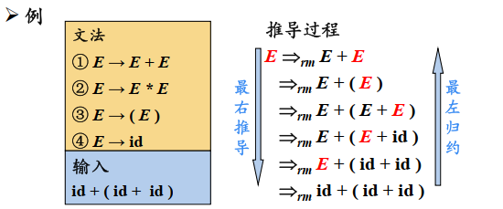
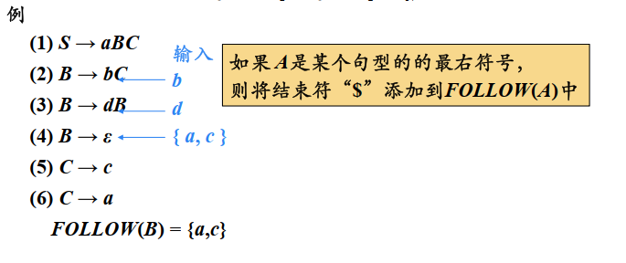

# 第1章 引论

## 1.1 什么是编译程序


预处理程序：将不同文件里的源程序合并+宏展开

编译程序：生成汇编代码

汇编程序：生成可再装配（或可重定位）的机器代码

装配/连接编辑程序：生成真正能在机器上运行的代码

## 1.2 编译过程和编译程序的结构

### 1.2.1 编译过程概述


#### 1. 词法分析

任务：从左到右一个字符一个字符地读入源程序，对构成源程序的字符流进行扫描和分解，从而识别出一个个单词（一些场合下也称单词符号或符号）。

例如：


词法单元（token）形式：<种别码, 属性值>

|      | 单词类型 |                             种别                             |           种别码           |
| :--: | :------: | :----------------------------------------------------------: | :------------------------: |
|  1   |  关键字  |                 program、if、else、then、...                 |          一词一码          |
|  2   |  标识符  |             变量名、数组名、记录名、过程名、...              |          多词一码          |
|  3   |   常量   |              整型、浮点型、记录名、过程名、...               |          一型一码          |
|  4   |  运算符  | 算术（+ - & / ++ --）<br>关系（> < == != >= <=）<br>逻辑（& \| ~） | 一词一码<br>或<br>一型一码 |
|  5   |  界限符  |                       ; ( ) = { } ...                        |          一词一码          |


#### 2. 语法分析

任务：在词法分析的基础上将单词序列分解成各类语法短语，如“程序”、“语句”、“表达式”等，这种语法短语也称为语法单位，可表示成语法树。

语法分析依据语言的语法规则，即描述程序结构的规则，通过语法分析确定整个输入串是否构成一个语法上正确的程序

程序的结构通常是由递归规则来表示的。

例如：


#### 3. 语义分析

任务：审查源程序有无语义错误，为代码生成阶段收集类型信息，并对可强制转换的对象进行处理。

#### 4. 中间代码生成

在经过上述阶段之后，有的编译程序会将源程序变成一种内部表示形式，即中间语言或中间代码。

所谓中间代码是一种结构简单、含义明确的记号系统，重要设计原则有两点：一是容易生成，二是容易将它翻译成目标代码。

很多编译程序采用了一种近似三地址格式的四元式中间代码：（运算符，运算对象1，运算对象2，结果）

例如，源程序sum := first + count * 10 可生成下图所示的四元式序列，其中$t_i$(i = 1, 2, 3)是编译程序生成的临时名字，用于存放运算的中间结果


#### 5. 代码优化

任务：对前一阶段产生的中间代码进行变换或进行改造，目的是使生成的代码更为高效，即省时间和省空间。

将在第10章详细介绍

#### 6. 目标代码生成

这一阶段的任务是把中间代码变换成特定机器上的绝对指令代码或可重定位的指令代码或汇编指令代码

### 1.2.2 编译程序的结构


表格管理：编译过程中源程序的各种信息被保留在种种不同的表格里，编译各阶段的工作都涉及构造、查找或更新有关的表格。

出错处理：如果编译过程中发现源程序有错误，编译程序应报告错误的性质和错误发生的地点并将错误所造成的影响控制在尽可能小的范围内，使得源程序的其余部分能继续被编译下去，有些编译程序还能自动校正错误。

### 1.2.3 编译阶段的组合

有时把编译的过程分为前端和后端

前端的工作主要依赖于源语言而于目标机无关，通常包括词法分析、语法分析、语义分析和中间代码生成，某些优化工作也可在前端做，还包括与前端每个阶段相关的出错处理工作和符号表管理工作。

后端指的是哪些依赖于目标机而一般不依赖于源语言，只与中间代码有关的那些阶段的工作，即目标代码生成，以及相关出错处理和符号表操作。

## 1.3 解释程序和一些软件工具

### 1.3.1 解释程序

解释程序和编译程序的区别就是，编译程序是把整个源代码翻译完之后再运行，而解释程序是边翻译边运行。


### 1.3.2 处理源程序的软件工具

#### 1. 语言的结构化编辑器

用户可使用这种编辑器在语言的语法制导下编制出所需的源程序

具有通常的正文编辑器的正文编辑和修改功能，并能够执行一些对正确编制程序有帮助的附加的任务，如检查用户的输入是否正确、联想、begin或左括号和end或右括号匹配等功能

#### 2. 语言程序的调试工具

#### 3. 程序格式化工具

#### 4. 语言程序测试工具

静态分析器和动态测试器

#### 5. 程序理解工具

#### 6. 高级语言之间的转换工具

## 1.4 PL/0语言编译系统

### 1.4.1 PL/0语言编译系统构成


为了描述方便，通常用T形图来表示一个编译程序涉及的三个方面的语言，即源语言、目标语言和编译程序的书写语言（实现语言）。T形图的左上角表示源语言，右上角表示目标语言，底部表示书写语言


### 1.4.2 PL/0语言

PL/0语言是Pascal的一个子集


在实践中，程序语言的语法描述常采用一种称为扩展巴克斯范式（EBNF）的形式来描述。


### 1.4.3 类P-code语言


### 1.4.4 PL/0编译程序

### 1.4.5 PL/0语言编译系统的驱动代码

# 第2章 文法和语言

## 2.1 文法的直观概念

类似于语法，主谓宾


## 2.2 符号和符号串

### 1. 字母表

元素的非空有穷集合，字母表中的元素称为符号，因此字母表又称符号集

例如，汉语的字母表中包含汉字、数字及标点符号等；C语言的字母表由字母、数字、若干专用符号及char、structural、if、do之类的保留字组成

### 2. 符号串

由字母表中的符号组成的任何有穷序列称为符号串

1. 符号串的头尾，固有头和固有尾

   

2. 符号串的连接

   

3. 符号串的方幂

   

4. 符号串集合

   

## 2.3 文法和语言的形式定义

规则，也称重写规则、产生式或生成式

定义2.1 文法G定义为四元组$(V_N,V_T,P,S)$。


## 2.4 文法的类型

### 0型文法

无限制文法/短语结构文法

$\alpha\rightarrow\beta$，$\forall\alpha\rightarrow\beta\in P$，$\alpha$中至少包含1个非终结符

0型语言：由0型文法G生成的语言

### 1型文法

上下文有关文法(Context-Sensitive Grammer, CSG)

$\alpha\rightarrow\beta$，$\forall\alpha\rightarrow\beta\in P$，$\alpha$中至少包含1个非终结符，且$|\alpha|\leq|\beta|$

产生式的一般形式：$\alpha_1A\alpha_2\rightarrow\alpha_1\beta\alpha_2(\beta\neq\varepsilon)$

CSG中不包含$\varepsilon$-产生式

上下文有关语言（1型语言）：由上下文有关文法（1型文法）G生成的语言L(G)

### 2型文法

上下文无关文法(Context-Free Grammar, CFG)

$\alpha\rightarrow\beta$，$\forall\alpha\rightarrow\beta\in P$, $\alpha\in V_N$

产生式的一般形式：$A\rightarrow\beta$

即每一个产生式的左部，必须是一个非终结符（A）

上下文无关语言（2型语言）：由上下文无关文法（2型文法）G生成的语言L(G)

### 3型文法

正则文法(Regular Grammar, RG)

右线性文法：$A\rightarrow wB$或$A\rightarrow w$（在右部为终结符w或在w的右边增加非终结符B来限制w）

左线性文法：$A\rightarrow Bw$或$A\rightarrow w$

左线性文法和右线性文法都成为正则文法

正则文法的右部最多只有一个非终结符，并且位置在同一侧

正则语言（3型语言）：由正则文法（3型文法）G生成的语言L(G)

正则文法能描述程序设计语言的多数单词

#### 四种文法之间的关系


## 2.5 上下文无关文法及其语法树


分析树是推导的图形化表示

### 最左（最右）推导

优先对最左（最右）非终结符进行替换

最右推导常被称为规范推导

### （句型的）短语

给定一个句型，其分析树中的每一颗子树的边缘称为该句型的一个短语

如果子树只有父子两代结点，那么这颗子树的边缘称为该句型的一个直接短语

直接短语一定是某产生式的右部，产生式的右部不一定是给定句型的直接短语

### 二义性文法

二义性文法：如果一个文法可以为某个句子生成多颗分析树，则称这个文法是二义性的

二义性文法的判定：对于任意一个上下文无关文法，不存在一个算法，判定它是无二义性的，但能给出一组充分条件，满足这组充分条件的文法是无二义性的

## 2.6 句型的分析

语法树又称为语法分析树或分析树

完成句型分析的程序称为分析程序或识别程序

分析算法又称识别算法

### 2.6.1 自上而下的分析方法

### 2.6.2 自下而上的分析方法

### 2.6.3 句型分析的有关问题


### 2.7.1 有关文法的实用限制

有害规则

  形如$U\rightarrow U$的产生式

多余规则

  文法中连一个句子的推导都用不到的规则。

1. 不可到达的非终结符

  不在任何规则的右部出现的非终结符

2. 不可终止的非终结符

  不能从它推出终结符号串的非终结符

对于文法G[S]，为了保证任一非终结符A在句子推导中出现，必须满足如下两个条件：

1. A必须在某句型中出现, 即有$\Rightarrow SαAβ$，其中α，β∈V*

2. 必须能够从A推出终结符号串t来, 即: $A=^+t$，其中$t∈V_T^*$

### 2.7.2 上下文无关文法中的ε规则

# 第3章 词法分析

## 3.1 正则表达式

正则表达式是一种用来描述正则语言的更紧凑的表示方法

正则表达式可以由较小的正则表达式按照特定规则递归地构建，每个正则表达式r定义一个语言，记为L(r)，这隔语言也是根据r的子表达式所表示的语言递归定义的

### 正则表达式的定义

ε是一个RE， L(ε) = {ε}

如果 a∈ ∑，则a是一个RE， L(a) = {a}  

假设 r和 s都是 RE，表示的语言分别是 L(r)和L(s)，则
	r|s 是一个RE， L( r|s ) = L(r)∪ L(s)
	rs 是一个RE， L( rs ) = L(r) L(s)
	r* 是一个RE， L( r* )= (L(r))*
	(r) 是一个RE， L( (r) ) = L(r)  

运算的优先级： *、 连接、 |  

例： C语言无符号整数的RE  

十进制整数的RE
	(1|...|9)(0|...|9)\*|0

八进制整数的RE
	0(0|1|2|3|4|5|6|7)(0|1|2|3|4|5|6|7)\*

十六进制整数的RE
	0x(0|1|...|9|a|...| f |A|…|F)(0|...|9|a|...| f |A|…|F )\*

|                        定律                         |        描述         |
| :-------------------------------------------------: | :-----------------: |
|                    r｜ s = s｜ r                    |   ｜是可以交换的    |
|           r｜（ s｜ t ） =（ r｜ s）｜ t            |    ｜是可结合的     |
|               r（ s t ） =（ r s） t                |   连接是可结合的    |
| r（ s｜ t ） = r s｜ r t ; （ s｜ t） r = s r｜ t r | 连接对｜ 是可分配的 |
|                     εr = rε = r                     |  ε 是连接的单位元   |
|                 r * =（ r｜ ε ） *                  |  闭包中一定包含 ε   |
|                      r **= r *                      |    * 具有幂等性     |

正则文法与正则表达式等价：

1. 对任何正则文法 G，存在定义同一语言的正则表达式 r
2. 对任何正则表达式 r，存在生成同一语言的正则文法 G

## 3.2 正则定义

正则定义是具有如下形式的定义序列：
$d_1→r_1, d_2→r_2,…,d_n→r_n$
其中：
每个di都是一个新符号，它们都不在字母表 Σ中，而且各不相同
每个$r_i$是字母表 $Σ∪ \{d_1 ,d_2 , … ,d_{i-1}\}$上的正则表达式  

正则定义就是给一些RE命名，并在之后的RE中像使用字母表中的符号一样使用这些名字

例：（整型或浮点型）无符号数的正则定义

​	digit → 0|1|2|…|9

​	digits → digit digit*

​	optionalFraction → .digits|ε

​	optionalExponent → ( E(+|-|ε)digits )|ε

​	number → digits optionalFraction optionalExponent

## 3.3 有穷自动机（FA）

有穷自动机是对一类处理系统建立的数学模型

这类系统具有一系列的输入输出信息和有穷数目的内部状态（状态：概括了对过去输入信息处理的状况）

系统只需要根据当前所处的状态和当前面临的输入信息就可以决定系统的后继行为。每当系统处理了当前的输入后，系统的内部状态也将发生改变

### 3.3.1 FA模型


输入带：用来存放输入符号串

读头：从左向右逐个读取输入符号，不能修改（只读）、不能往返移动

有穷控制器：具有有穷个状态数，根据当前状态和当前输入符号转入下一状态

### 3.3.2 FA的表示

#### 转换图


结点：FA的状态

​	初始状态（开始状态）：只有一个，由start箭头指向

​	终止状态（接收状态）：可以有多个，用双圈表示

带标记的有向边：如果对于输入a，存在一个从状态p到状态q的转换，就在p、q之间画一条有向边，并标记上a

给定输入串x， 如果存在一个对应于串x的从初始状态到某个终止状态的转换序列，则称串x被该FA接收
由一个有穷自动机M接收的所有串构成的集合称为是该FA定义（或接收）的语言，记为L(M )  

#### 转换表


**最长子串匹配原则**  

当输入串的多个前缀与一个或多个模式匹配时，总是选择最长的前缀进行匹配

在到达某个终态之后，只要输入带上还有符号，DFA就继续前进，以便寻找尽可能长的匹配  

## 3.4 有穷自动机的分类

### 3.4.1 确定的有穷自动机（DFA）

$M = ( S， Σ ， δ， s_0， F )  $

S： 有穷状态集
Σ： 输入字母表，即输入符号集合。 假设ε不是 Σ中的元素
δ： 将S× Σ映射到S的转换函数。$\forall s∈ S, a∈ Σ, δ(s,a)$表示从状态s出发，沿着标记为a的边所能到达的状态。
$s_0$： 开始状态 (或初始状态)， $s_0∈ S$
F： 接收状态（或终止状态） 集合， F⊆ S  

### 3.4.2 非确定的有穷自动机（NFA）

S：有穷状态集
Σ： 输入符号集合，即输入字母表。假设ε 不是Σ中的元素
δ： 将S× Σ映射到$2^S$的转换函数。 $\forall s∈ S, a∈ Σ, δ(s,a)$表示从状态s出发，沿着标记为a的边所能到达的状态集合
$s_0$：开始状态 (或初始状态)， $s_0∈ S$
F：接收状态（或终止状态）集合， F⊆ S  

例：一个NFA  


### 3.4.3DFA和NFA的等价性

对任何非确定的有穷自动机N ，存在定义同一语言的确定的有穷自动机D

对任何确定的有穷自动机D ，存在定义同一语言的非确定的有穷自动机N  

例：


### 3.4.4带有“ε-边”的NFA 

M = ( S， Σ ， δ， s0， F )
S：有穷状态集
Σ： 输入符号集合，即输入字母表。假设ε不是Σ中的元素
δ： 将S× (Σ∪ {ε})映射到2S的转换函数。 $\forall s∈ S, a∈ Σ∪ {ε}, δ(s,a)$表示从状态s出发，沿着标记为a的边所能到达的状态集合
$s_0$：开始状态 (或初始状态)， $s_0$∈ S
F：接收状态（或终止状态）集合， F⊆ S  

即状态A即使什么都不输入也能转化为状态B

**带有和不带有“ε-边”的NFA 的等价性  **


### 3.4.5 DFA的算法实现  

输入：以文件结束符eof结尾的字符串x。 DFA D 的开始状态$s_0$，接收状态集 F，转换函数move。
输出：如果 D接收 x，则回答“yes”，否则回答“no”。
方法：将下述算法应用于输入串 x。  

```
s = s0 ;
c = nextChar（） ;
while（c! = eof ）｛
	s = move ( s , c ) ;
	c = nextChar ( ) ;
｝
if (s在F中) return“yes” ;
else return “no” ;
```

函数nextChar( )返回输入串x的下一个符号
函数move(s, c)表示从状态s出发，沿着标记为c的边所能到达的状态  

## 3.5 从正则表达式到有穷自动机


### 3.5.1 根据RE构造NFA


**例:r=(a|b)*abb 对应的NFA**


## 3.6 从NFA到DFA的转换


### 子集构造法

输入： NFA N
输出：接收同样语言的DFA D
方法： 

```
一开始， ε-closure（ s0 ）是Dstates 中的唯一状态，且它未加标记；
while（在Dstates中有一个未标记状态T ）｛
	给T加上标记；
	for（每个输入符号a）｛
		U = ε-closure(move(T, a));
		if ( U不在Dstates中)
			将U加入到Dstates中，且不加标记；
		Dtran[T, a]=U ;
	}
}
```

| 操作            | 描述                                                         |
| --------------- | ------------------------------------------------------------ |
| ε-closure ( s ) | 能够从NFA的状态s开始只通过ε转换到达的NFA状态集合             |
| ε-closure ( T ) | 能够从T 中的某个NFA状态 s开始只通过ε转换到达的NFA状态集合,即$U_{s∈ T} ε-closure ( s )$ |
| move( T , a)    | 能够从T 中的某个状态 s出发通过标号为a的转换到达的NFA状态的集合 |

计算ε-closure (T ) 

```
将T的所有状态压入stack中；
将ε-closure（T ）初始化为 T ；
while（stack非空）｛
	将栈顶元素 t 给弹出栈中；
	for（每个满足如下条件的u ：从t出发有一个标号为ε的转换到达状态u)
		if ( u不在ε-closure（T ）中）｛
			将u加入到ε-closure（T ）中；
			将u压入栈中;
		}
}
```

## 3.7 识别单词的DFA


### 词法分析阶段的错误处理  

词法分析阶段可检测错误的类型
	单词拼写错误
		例： int i = 0x3G; float j =1.05e;
	非法字符
		例： ~ @

词法错误检测
	如果当前状态与当前输入符号在转换表对应项中的信息为空， 而当前状态又不是终止状态，则调用错误处理程序

错误处理
	查找已扫描字符串中最后一个对应于某终态的字符
		如果找到了，将该字符与其前面的字符识别成一个单词。
			然后将输入指针退回到该字符，扫描器重新回到初始状态，继续识别下一个单词
	如果没找到，则确定出错，采用错误恢复策略  

错误恢复策略
	最简单的错误恢复策略：“恐慌模式 (panic mode)”恢复
		从剩余的输入中不断删除字符，直到词法分析器能够在剩余输入的开头发现一个正确的字符为止

# 第4章 语法分析

## 4.1 自顶向下分析概述

**自顶向下的分析**

从分析树的顶部（根节点）向底部（叶节点）方向构造分析树，可以看成是从文法开始符号S推导出词串w的过程


每一步推导中，都需要做两个选择：

1. 替换当前句型中的哪个非终结符
2. 用该非终结符的哪个候选式进行替换

**最左推导**：在最左推导中，总是选择每个句型的最左非终结符进行替换


如果$S\Rightarrow_{lm}\alpha$，则称α是当前文法的最左句型（由最左推导得到的句型）

**最右推导**：在最右推导中，总是选择每个句型的最右非终结符进行替换



**在自底向上的分析中，总是采用最左归约的方式**，因此把最左归约称为规范归约，而最右推导相应地称为规范推导

最左推导和最右推导的唯一性，最左推导和最右推导的分析树是唯一的

**自顶向下的语法分析采用最左推导方式**

总是选择每个句型的最左非终结符进行替换

根据输入流中的下一个终结符，选择最左非终结符的一个候选  

**自顶向下语法分析的通用形式**

递归下降分析 (Recursive-Descent Parsing)
	由一组过程组成，每个过程对应一个非终结符
	从文法开始符号S对应的过程开始，其中递归调用文法中其它非终结符对应的过程。如果S对应的过程体恰好扫描了整个输入串，则成功完成语法分析


**预测分析**

预测分析是递归下降分析技术的一个特例，通过在输入中向前看固定个数（通常是一个） 符号来选择正确的A-产生式。

​	可以对某些文法构造出向前看k个输入符号的预测分析器，该类文法有时也称为LL(k) 文法类

预测分析不需要回溯，是一种确定的自顶向下分析方法  

## 4.2 文法转换

含有A→Aα形式产生式的文法称为是直接左递归的

如果一个文法中有一个非终结符A使得对某个串α存在一个推导$A\Rightarrow^+Aα$ ，那么这个文法就是左递归  

经过两步或两步以上推导产生的左递归称为是间接左递的

左递归文法会使递归下降分析器陷入无限循环

**消除直接左递归**：


消除直接左递归的一般形式：


消除左递归是要付出代价的——引进了一些非终结符和ε_产生式

**消除间接左递归**：


**消除左递归算法**：


**提取左公因子**：


## 4.3 LL(1)文法

**S_文法**：

预测分析法的工作过程
	从文法开始符号出发，在每一步推导过程中根据当前句型的最左非终结符A和当前输入符号a，选择正确的A-产生式。为保证分析的确定性，选出的候选式必须是唯一的。

S_文法（简单的确定性文法）为符合上述要求，需满足以下条件：每个产生式的右部都以终结符开始，同一非终结符的各个候选式的首终结符都不同

S_文法中不包含ε产生式

什么时候使用ε产生式？
	如果当前某非终结符A与当前输入符a不匹配时，若存在A→ε，可以通过检查a是否可以出现在 A的后面，来决定是否使用产生式 A→ε（若文法中无 A→ε ，则应报错）

**非终结符的后继符号集**

可能在某个句型中紧跟在A后边的终结符a的集合，记为FOLLOW(A)
$FOLLOW(A)=\{a| S \Rightarrow ^* \alpha A\alpha \beta, \alpha \in V_T， \alpha,\beta \in (V_T \cup V_N)^*\}$ 



**产生式的可选集**：

产生式A→β的可选集是指可以选用该产生式进行推导时对应的输入符号的集合，记为SELECT( A→β )
	SELECT( A→aβ ) = { a }
	SELECT( A→ε )=FOLLOW(A)
**q\_文法**
	每个产生式的右部或为ε ，或以终结符开始
	具有相同左部的产生式有不相交的可选集，q\_文法不含右部以非终结符打头的  
