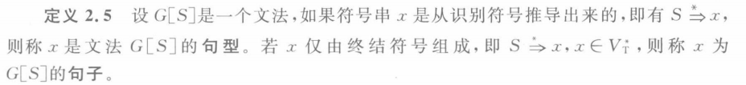

# 第1章 引论

## 1.1 什么是编译程序

预处理程序：将不同文件里的源程序合并+宏展开

编译程序：生成汇编代码

汇编程序：生成可再装配（或可重定位）的机器代码

装配/连接编辑程序：生成真正能在机器上运行的代码

## 1.2 编译过程和编译程序的结构

### 1.2.1 编译过程概述

#### 1. 词法分析

任务：从左到右一个字符一个字符地读入源程序，对构成源程序的字符流进行扫描和分解，从而识别出一个个单词（一些场合下也称单词符号或符号）。

例如：

词法单元（token）形式：<种别码, 属性值>

|      | 单词类型 |                             种别                             |           种别码           |
| :--: | :------: | :----------------------------------------------------------: | :------------------------: |
|  1   |  关键字  |                 program、if、else、then、...                 |          一词一码          |
|  2   |  标识符  |             变量名、数组名、记录名、过程名、...              |          多词一码          |
|  3   |   常量   |              整型、浮点型、记录名、过程名、...               |          一型一码          |
|  4   |  运算符  | 算术（+ - & / ++ --） 关系（> < == != >= <=） 逻辑（& \| ~） | 一词一码 或 一型一码 |
|  5   |  界限符  |                       ; ( ) = { } ...                        |          一词一码          |

#### 2. 语法分析

任务：在词法分析的基础上将单词序列分解成各类语法短语，如“程序”、“语句”、“表达式”等，这种语法短语也称为语法单位，可表示成语法树。

语法分析依据语言的语法规则，即描述程序结构的规则，通过语法分析确定整个输入串是否构成一个语法上正确的程序

程序的结构通常是由递归规则来表示的。

例如：

#### 3. 语义分析

任务：审查源程序有无语义错误，为代码生成阶段收集类型信息，并对可强制转换的对象进行处理。

#### 4. 中间代码生成

在经过上述阶段之后，有的编译程序会将源程序变成一种内部表示形式，即中间语言或中间代码。

所谓中间代码是一种结构简单、含义明确的记号系统，重要设计原则有两点：一是容易生成，二是容易将它翻译成目标代码。

很多编译程序采用了一种近似三地址格式的四元式中间代码：（运算符，运算对象1，运算对象2，结果）

例如，源程序sum := first + count * 10 可生成下图所示的四元式序列，其中$t_i$(i = 1, 2, 3)是编译程序生成的临时名字，用于存放运算的中间结果

#### 5. 代码优化

任务：对前一阶段产生的中间代码进行变换或进行改造，目的是使生成的代码更为高效，即省时间和省空间。

将在第10章详细介绍

#### 6. 目标代码生成

这一阶段的任务是把中间代码变换成特定机器上的绝对指令代码或可重定位的指令代码或汇编指令代码

### 1.2.2 编译程序的结构

表格管理：编译过程中源程序的各种信息被保留在种种不同的表格里，编译各阶段的工作都涉及构造、查找或更新有关的表格。

出错处理：如果编译过程中发现源程序有错误，编译程序应报告错误的性质和错误发生的地点并将错误所造成的影响控制在尽可能小的范围内，使得源程序的其余部分能继续被编译下去，有些编译程序还能自动校正错误。

### 1.2.3 编译阶段的组合

有时把编译的过程分为前端和后端

前端的工作主要依赖于源语言而于目标机无关，通常包括词法分析、语法分析、语义分析和中间代码生成，某些优化工作也可在前端做，还包括与前端每个阶段相关的出错处理工作和符号表管理工作。

后端指的是哪些依赖于目标机而一般不依赖于源语言，只与中间代码有关的那些阶段的工作，即目标代码生成，以及相关出错处理和符号表操作。

## 1.3 解释程序和一些软件工具

### 1.3.1 解释程序

解释程序和编译程序的区别就是，编译程序是把整个源代码翻译完之后再运行，而解释程序是边翻译边运行。

### 1.3.2 处理源程序的软件工具

#### 1. 语言的结构化编辑器

用户可使用这种编辑器在语言的语法制导下编制出所需的源程序

具有通常的正文编辑器的正文编辑和修改功能，并能够执行一些对正确编制程序有帮助的附加的任务，如检查用户的输入是否正确、联想、begin或左括号和end或右括号匹配等功能

#### 2. 语言程序的调试工具

#### 3. 程序格式化工具

#### 4. 语言程序测试工具

静态分析器和动态测试器

#### 5. 程序理解工具

#### 6. 高级语言之间的转换工具

## 1.4 PL/0语言编译系统

### 1.4.1 PL/0语言编译系统构成

为了描述方便，通常用T形图来表示一个编译程序涉及的三个方面的语言，即源语言、目标语言和编译程序的书写语言（实现语言）。T形图的左上角表示源语言，右上角表示目标语言，底部表示书写语言

### 1.4.2 PL/0语言

PL/0语言是Pascal的一个子集

在实践中，程序语言的语法描述常采用一种称为扩展巴克斯范式（EBNF）的形式来描述。

### 1.4.3 类P-code语言

### 1.4.4 PL/0编译程序

### 1.4.5 PL/0语言编译系统的驱动代码

# 第2章 文法和语言

## 2.1 文法的直观概念

类似于语法，主谓宾

## 2.2 符号和符号串

### 1. 字母表

元素的非空有穷集合，字母表中的元素称为符号，因此字母表又称符号集

例如，汉语的字母表中包含汉字、数字及标点符号等；C语言的字母表由字母、数字、若干专用符号及char、structural、if、do之类的保留字组成

### 2. 符号串

由字母表中的符号组成的任何有穷序列称为符号串

1. 符号串的头尾，固有头和固有尾

   

2. 符号串的连接

   

3. 符号串的方幂

   

4. 符号串集合

   

## 2.3 文法和语言的形式定义

规则，也称重写规则、产生式或生成式

定义2.1 文法G定义为四元组$(V_N,V_T,P,S)$。

## 2.4 文法的类型

### 0型文法

无限制文法/短语结构文法

$\alpha\rightarrow\beta$，$\forall\alpha\rightarrow\beta\in P$，$\alpha$中至少包含1个非终结符

0型语言：由0型文法G生成的语言

### 1型文法

上下文有关文法(Context-Sensitive Grammer, CSG)

$\alpha\rightarrow\beta$，$\forall\alpha\rightarrow\beta\in P$，$\alpha$中至少包含1个非终结符，且$|\alpha|\leq|\beta|$

产生式的一般形式：$\alpha_1A\alpha_2\rightarrow\alpha_1\beta\alpha_2(\beta\neq\varepsilon)$

CSG中不包含$\varepsilon$-产生式

上下文有关语言（1型语言）：由上下文有关文法（1型文法）G生成的语言L(G)

### 2型文法

上下文无关文法(Context-Free Grammar, CFG)

$\alpha\rightarrow\beta$，$\forall\alpha\rightarrow\beta\in P$, $\alpha\in V_N$

产生式的一般形式：$A\rightarrow\beta$

即每一个产生式的左部，必须是一个非终结符（A）

上下文无关语言（2型语言）：由上下文无关文法（2型文法）G生成的语言L(G)

### 3型文法

正则文法(Regular Grammar, RG)

右线性文法：$A\rightarrow wB$或$A\rightarrow w$（在右部为终结符w或在w的右边增加非终结符B来限制w）

左线性文法：$A\rightarrow Bw$或$A\rightarrow w$

左线性文法和右线性文法都成为正则文法

正则文法的右部最多只有一个非终结符，并且位置在同一侧

正则语言（3型语言）：由正则文法（3型文法）G生成的语言L(G)

正则文法能描述程序设计语言的多数单词

#### 四种文法之间的关系

## 2.5 上下文无关文法及其语法树

分析树是推导的图形化表示

### 最左（最右）推导

优先对最左（最右）非终结符进行替换

最右推导常被称为规范推导

### （句型的）短语

给定一个句型，其分析树中的每一颗子树的边缘称为该句型的一个短语

如果字数只有父子两代结点，那么这颗子树的边缘称为该句型的一个直接短语

直接短语一定是某产生式的右部，产生式的右部不一定是给定句型的直接短语

### 二义性文法

二义性文法：如果一个文法可以为某个句子生成多颗分析树，则称这个文法是二义性的

二义性文法的判定：对于任意一个上下文无关文法，不存在一个算法，判定它是无二义性的，但能给出一组充分条件，满足这组充分条件的文法是无二义性的

## 2.6 句型的分析

语法树又称为语法分析树或分析树

完成句型分析的程序称为分析程序或识别程序

分析算法又称识别算法

### 2.6.1 自上而下的分析方法

### 2.6.2 自下而上的分析方法

