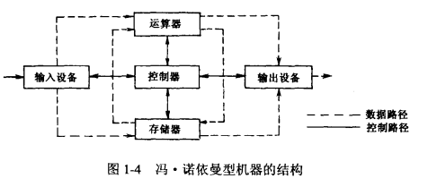
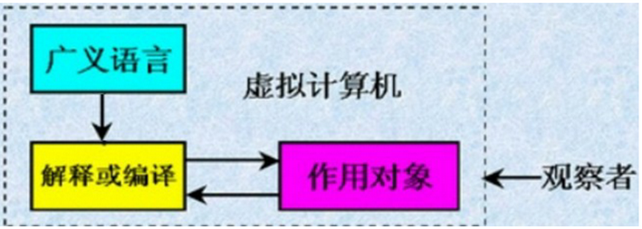
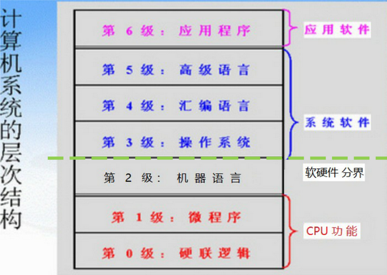
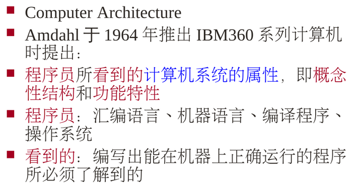
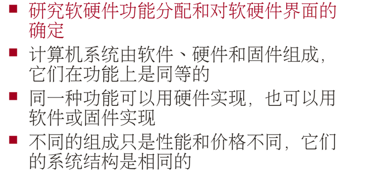
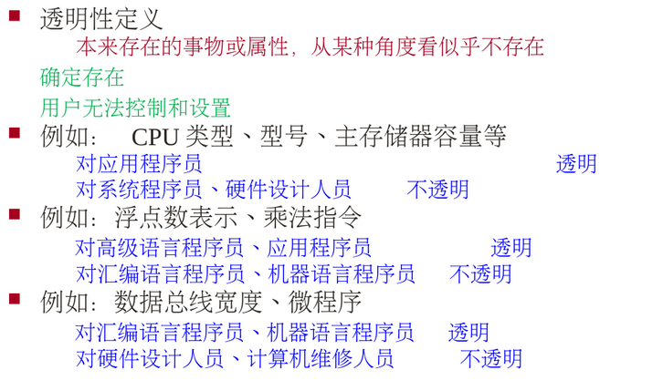

# 第一章 计算机系统结构导论

计算机系统结构又称为计算机体系结构，本章重点叙述计算机系统的功能、结构及设计方法，并介绍现代计算机系统结构的研究方向

## 1.1 计算机系统的基本概念

冯诺依曼体系的基础：数据由二进制存储、指令按顺序执行、由五大部件组成

计算机系统三种说法：

1. 五大部件组成：运算器、控制器、存储器、输入输出设备
2. 软件、硬件组成
3. 人员、数据、设备、程序、规程组成

## 1.2 计算机系统的发展

### 1.2.1 冯诺依曼结构的特点

特点：存储程序、运算器为中心、集中控制

现代处理机对冯诺依曼结构的改进：

不变：存储程序

改变：存储器为中心、总线结构、分散控制

### 1.2.2 器件发展的影响

第一代至第四代计算机以器件划分：

1. 第一代：电子管
2. 第二代：晶体管
3. 第三代：集成电路
4. 第四代：大规模集成电路

器件发展是提高计算机速度的主要途径

期间发展的特点：

1. 集成度迅速提高：每四年提高一个数量级
2. 速度已接近极限
3. 价格直线下降
4. 可靠性越来越高

### 1.2.3 应用发展的影响

### 1.2.4 算法的影响

在多个层次上，算法影响系统结构

### 1.2.5 价格对系统结构的影响

### 1.2.6 功耗对系统结构的影响

功耗与电压正相关，电路延迟与电压负相关

## 1.3 计算机系统的功能和结构

### 1.3.1 计算机系统的层次结构

虚拟计算机：

​	计算机用于完成信息处理，不同观察者用不同语言（广义语言）来描述信息处理流程

​	从不同角度所看到的计算机系统属性是不同的

第二级属于计算机系统结构

级之间有交叉，例如第3级必须依赖第4级和第5级来实现

### 1.3.2 计算机系统结构的定义

#### 之一

#### 之二

#### 透明性

### 1.3.3 计算机组成

计算机组成是指计算机系统结构的逻辑实现

计算机实现是指计算机组成的物理实现

### 1.3.4 计算机系统结构、组成和实现之间的关系

计算机系统结构->确定软硬件界面

计算机组成->逻辑实现

计算机实现->物理实现

三者的设计原则：

1. 系统结构设计不要对组成﹑实现有过多和不合理限制
2. 组成设计应在系统结构指导下，以目前可实现技术为基础
3. 实现应在组成的逻辑结构指导下，以目前器件技术为基础,以性能价格比优化为目标

### 1.3.5 计算机系统的特性

计算机等级：巨、大、中、小、微

系列机：具有相同的系统结构，但组成和实现技术不同的一系列计算机系统

#### 软件兼容

软件兼容:同一个软件的旦标程序可以不加修改地运行于系统结构相同的任何机器上
兼容种类:

​	向后兼容:新机器能直接运行老机器的目标程序

​	向上兼容:低档机上的目标软件能直接运行于高档机

​	向下兼容:高档机器的目标程序不加修改可运行于低档 (不常见)

向后兼容必须做到，向上兼容尽量做到，向前兼容和向下兼容，可以不考虑

采用系列机方法的主要优点:

1. 系列机之间软件兼容，可移植性好
2. 插件﹑接口等相互兼容
3. 便于实现机间通信
4. 便于维修﹑培训
5. 有利于提高产量﹑降低成本采用

系列机方法的主要缺点:

​	限制了计算机系统结构的发展,如PC 系列机，其系统结构非常落后，使用也最普及

#### 模拟与仿真

定义:在某个系统结构之上实现另一种系统结构。在一台现有的计算机上实现另一台计算机的指令系统·全部用软件实现的叫模拟，用软件﹑硬件﹑固件混合实现的叫仿真

模拟的实现方法：在A计算机上通过一段机器语言程序解释实现B计算机的指令系统。A机器称为宿主机，B机器称为虚拟机。

仿真的实现方法：直接用A机器的一段微程序解释执行B机器的指令，A机器称为宿主机，B机器称为目标机

优缺点：

模拟方法灵活，可实现程序在任何机器之间的相互移植,但实现复杂﹑速度低，因此适合移植运行时间不长，使用次数少的程序

仿真速度快，但难以仿真存储系统和IO系统，因此只适应于系统结构差别不大的机器之间的移植

## 1.4 计算机系统的设计方法

### 1.4.1 软硬件取舍

### 1.4.2 计算机系统设计的定量原则

