# 第一章 软件工程学概述

## 1.1 软件危机

个体化的软件环境：规模较小的程序，不需要设计，也没什么资料留存下来，只有软件清单。

这使得软件维护等工作非常浪费资源、很难维护

### 1.1.1 软件危机的介绍

#### 定义

软件危机指在计算机软件的开发和维护过程中所遇到的一系列严重问题。包括：

1. 如何开发软件，以满足软件日益增长的需求
2. 如何维护数量不断膨胀的已有软件

#### 特征

软件危机的特征：**长期性**和**症状不明显**

#### 典型表现

1. **对软件开发成本和进度的估计常常很不准确**：实际成本比预期成本高出一个数量级、实际进度比预期进度拖延几个月甚至几年
2. **用户对“已完成”的软件系统不满意的现象经常发生**：软件开发人员常常对用户要求只有模糊的了解，甚至对要解决的问题没有确切认识的情况下，匆忙着手编写程序。开发人员和用户之间的信息交流往往很不充分
3. **软件产品的质量往往靠不住**：软件质量保证技术（审查、复审、程序正确性证明和测试）没有应用到软件开发的全过程中
4. **软件常常是不可维护的**：难以适应不同的硬件环境；难以根据用户需要在原有程序中加入新功能
5. **软件通常没有适当的文档资料**：用于管理和评价软件开发工程的进展状况；作为通讯工具，帮助开发人员交流信息；帮助软件维护。文档资料应和程序代码完全一致
6. **软件成本在计算机系统总成本中所占的比例逐年上升**
7. **软件开发生产率提高的速度，远远跟不上计算机应用迅速普及深入的趋势**：软件产品供不应求
8. etc...

### 1.1.2 产生软件危机的原因

1. 规模加大、复杂性提高
2. 软件是逻辑产品，缺乏“可见性”
3. 技术手段和管理方法缺乏
4. 用户和软件开发人员的理解鸿沟（Gap)
5. 错误认识

​		认为软件开发就是写程序并设法使之运行

​		忽视软件需求分析的重要性

​		轻视软件测试和软件维护

### 1.1.3 应对软件危机的途径

1. 消除错误观念：**“软件就是程序”**

   一个软件由一个完整的配置组成，是程序、数据及相关文档的完整集合

2. 软件是产品，软件开发是工程项目

3. 成功的软件开发技术和方法

4. 软件工具和软件工程支撑环境

## 1.1 软件工程

### 1.2.1 软件工程的介绍

概括地说：软件工程是指导计算机软件开发和维护的一门工程学科

**1968年NATO会议**：软件工程就是为了**经济地**获得**可靠的**且能在实际机器上有效地运行的软件，而建立和使用完善的**工程原理**

**IEEE标准**：软件工程是：①把系统的、规范的、可度量的途径应用于软件开发、运行和维护过程。即把工程应用于软件；②研究①中的途径

软件工程**本质特性**：

1. 关注**大型程序**的构造
2. 中心课题是控制**复杂性**
3. 软件经常**变化**
4. 开发**效率**非常重要
5. 和谐**合作**：标准、规程，纪律是软件开发项目的一个关键
6. 软件必须有效地支持它的用户（**V & V**）
7. 一种文化背景的人替另一种文化背景的人创造**产品**

### 1.2.2 软件工程的基本原理

1. 分阶段的生命周期（控制复杂性）
2. 阶段评审（V&V、控制复杂性）
3. 严格的产品控制（变化管理、理解鸿沟）
4. 采用现代的程序设计技术（效率）
5. 结果应能清楚地审查（V&V）
6. 开发小组成员少而精（开发效率）
7. 不断改进软件工程实践

### 1.2.3 软件工程方法学

软件生命周期全过程中使用的一整套技术方法的集合，也称为范型(paradigm)

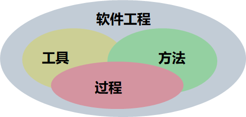

方法：完成软件开发的各项任务的技术方法（”怎么做“）

工具：运用方法而提供的自动的或半自动的软件工程支撑环境

过程：为了获得高质量的软件所需要完成的一系列任务的框架，规定了完成各项任务的工作步骤

#### 传统方法学

1. 生命周期方法学或结构化范型
2. 采用结构化技术(结构化分析、设计和实现)
3. 面向行为或面向数据

一个阶段一个阶段顺序开发，前一个阶段的完成是开始后一个阶段工作的前提和基础，后一阶段任务的完成通常是使前一阶段提出的解法更进一步具体化，加进了更多的实现细节。一个阶段的结束标准是后一阶段的开始标准

#### 面向对象方法学

1. 以数据为主线，封装数据和对数据的操作

2. 4个要点

   (1) 把对象作为融合了数据及在数据上的操作行为的统一的软件构件。（用对象分解取代了传统方法的功能分解）

   (2) 把所有对象都划分成类(class)。

   (3) 按照父类和子类的关系，把若干个相关类组成一个层次结构的系统（也称为类等级）。

   (4) 对象彼此间仅能通过发送消息互相联系。（封装性，不能直接处理对象内的数据，需要调用对象的操作）

面向对象方法=对象+类+继承+消息通信

#### 传统方法和面向对象方法的比较

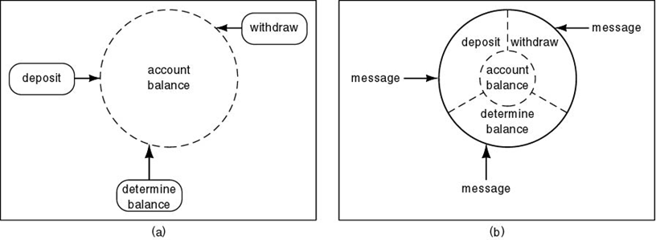

传统方法强调自顶向下地完成软件开发的各阶段任务

面向对象方法尽量模拟人类习惯的思维方式

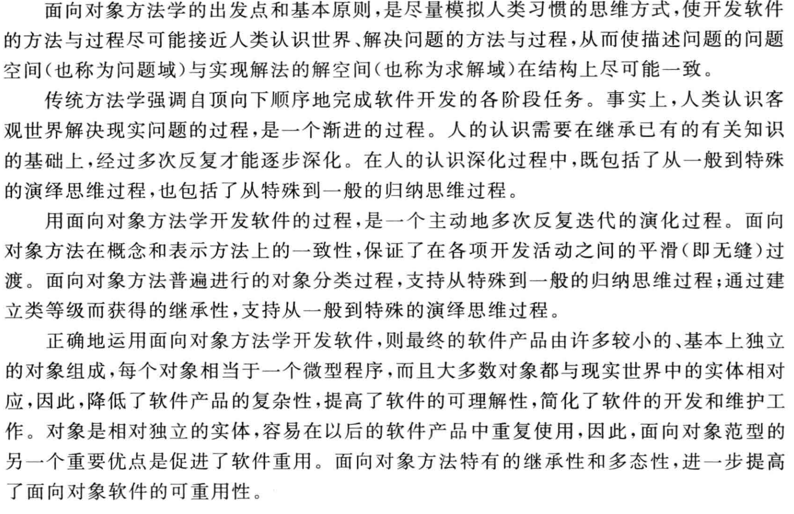

## 1.3 软件生命周期

软件产品或系统的一系列相关活动的全周期

3大阶段：软件定义、软件开发、软件维护

### 1.3.1 软件定义

要解决的问题：

1. 确定软件开发工程必须完成的总目标
2. 确定工程的可行性
3. 导出应该采用的策略及系统必须完成的功能
4. 估计资源和成本
5. 制定进度

三阶段：问题定义、可行性研究、需求分析

#### 问题定义

要解决的问题是什么，确定工程的目标和规模

#### 可行性研究

有可行的解决办法吗？

经济可行性、技术可行性、操作可行性等，不同的方案

#### 需求分析

为了解决问题，目标系统必须做什么

确定系统的功能和性能，运行环境，预测发展前景

书写规格说明书(specification)

### 1.3.2 软件开发

具体设计和实现在前一个时期定义的软件

四阶段：系统设计（总体设计、详细设计）、系统实现（编码和单元测试、综合测试）

#### 总体设计（概要设计）

概括地说，应该怎样实现目标系统

分析目标系统的几种可能方案，推荐一个最佳方案

设计程序的体系结构（程序由哪些模块组成及模块间的关系）

#### 详细设计

怎样具体地实现目标系统，设计程序的详细规格说明

#### 编码和单元测试

写出易理解、易维护的程序模块并测试每个模块

#### 综合测试

集成测试和验收测试，现场测试或平行运行

### 1.3.3 软件维护

使软件持久地满足用户的需要

改正错误、适配新环境、跟进用户新需求

改正性维护（改正软件错误）、适应性维护（适配新环境）、完善性维护（跟进用户新需求）、预防性维护（未雨绸缪，准备下一次维护）

## 1.4 软件过程

定义：为了获得高质量软件所需要的一系列任务的框架，它规定了完成各项任务的工作步骤

即什么人、什么时候、做什么和怎样做

把**生命周期**划分成**阶段**及**各个阶段的执行顺序**

ISO9000把过程定义为：使用资源将输入转化为输出的活动所构成的系统

此处，系统的含义是广义的：系统是相互关联或相互作用的一组要素

### 1.4.1 瀑布模型

传统软件工程方法学的软件过程，基本可以用瀑布模型描述

#### 特点

1. 阶段间具有顺序性和依赖性

   必须等前一阶段的工作完成之后，才能开始后一阶段的工作

   前一阶段的输出文档就是后一阶段的输入文档

2. 推迟实现

   区分逻辑设计与物理设计，推迟程序的物理实现

3. 质量保证(**文档驱动**)

   每个阶段必须完成规定的文档

   每个阶段结束前都要对所完成的文档进行评审

#### 优点

强迫开发人员使用规范化的方法

严格规定每个阶段必须提交的文档

每个阶段的产品都必须经过质量保证小组的仔细验证

#### 缺点

开发过程不能逆转，否则代价太大。难适应变化

软件的实际情况必须到开发后期才能看到

用户难以通过文档实际体验软件，依靠实践而产生新的需求或改动无法及时传达

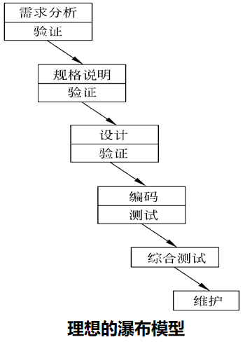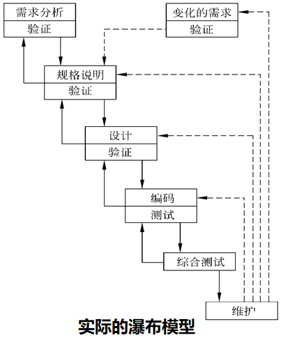

右图：反馈环

### 1.4.2 快速原型模型

快速建立可运行的程序，完成最终产品的功能子集

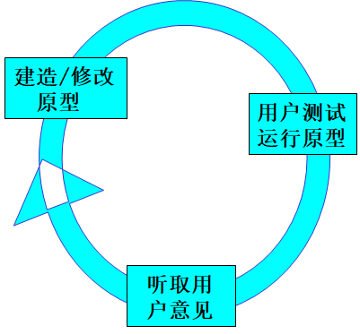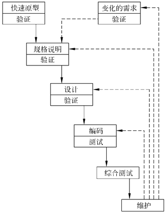

#### 特点

本质是“快速”

获取用户需求，适应需求变化

利于开发与培训的同步

#### 应用范围

用户需求不完全或不准确,有快速原型开发工具

项目招投标

产品移植、升级或客户化

### 1.4.3 增量模型

瀑布/快速原型：交付一个完整可用的产品

增量模型：把软件作为一系列增量构件来开发

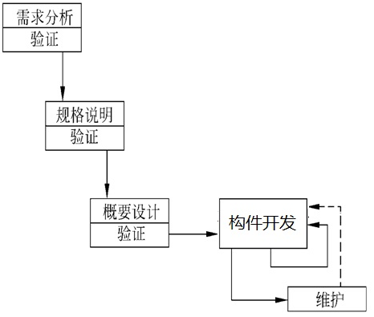

#### 优点

1. 分阶段交付可用产品
2. 减少全新产品给客户带来的心理上的影响
3. 需求经常变化，增量模型的灵活性使其具有更加优越的适用性

#### 困难

​	需要一个开放的结构，方便构件的加入

#### 风险更大的增量模型

不同的构件并行构建，速度加快，风险更大

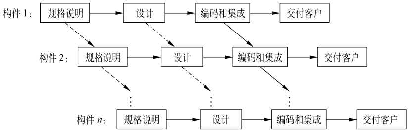

### 1.4.4 螺旋模型

基本思想：使用原型及其他方法来尽量降低风险，强调风险分析

可以看作在每个阶段之前都增加了风险分析过程的快速原型 模型

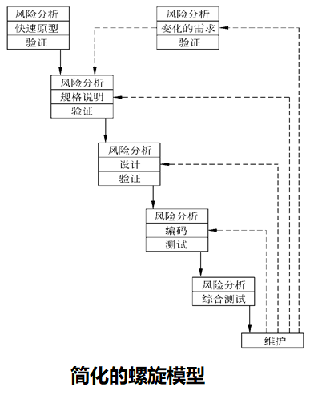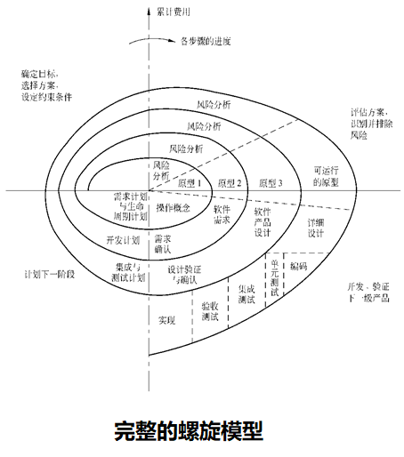

### 1.4.5 喷泉模型

迭代：软件开发过程的一种内在属性

阶段间的迭代

阶段内工作步骤的迭代

工作重点：分析阶段

定义面向问题的对象，不断充实和扩充对象

对生命周期各阶段的区分不重要、不明显

无缝连接：分析得到的对象模型也适用设计和实现

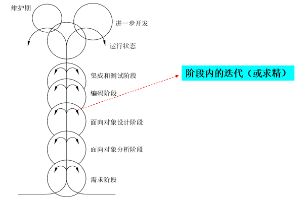

### 1.4.6 RUP过程

RUP: Rational Unified Process

**最佳实践**

​	迭代式开发

​	管理需求（需求连续变化，用例驱动）

​	基于构件的体系结构

​	可视化建模（UML）

​	验证软件质量（内建的贯穿整个开发过程）

​	控制软件变更

**四个阶段**

​	开始：建立业务模型，定义项目范围

​	精化：系统的体系结构、项目计划、 资源需求

​	构造：构件开发，软件产品

​	移交：软件产品移交给用户

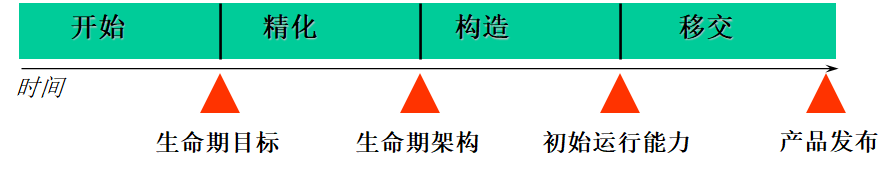

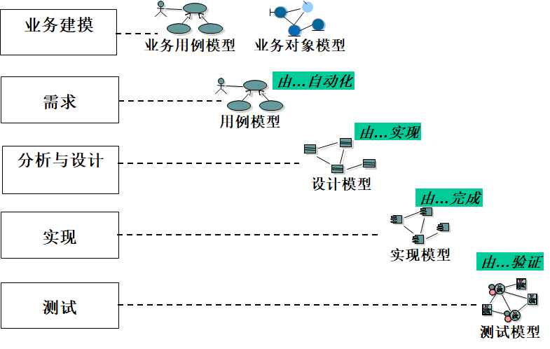

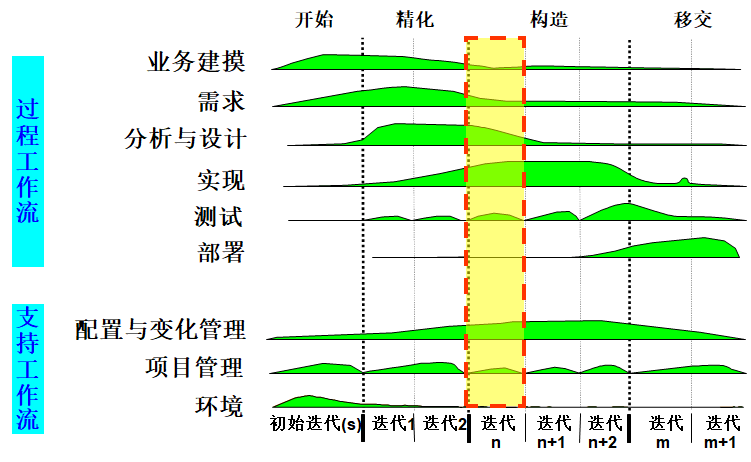

### 1.4.7 敏捷过程与极限编程

#### 1. 敏捷过程

1. 个体和交互胜过过程和工具
2. 可以工作的软件胜过面面俱到的文档
3. 客户合作胜过合同谈判
4. 响应变化胜过遵循计划

#### 2. 极限编程

1. 极限编程的有效实践

   客户作为开发团队的成员

   使用用户素材

   短交付周期

   验收测试

   结对编程

   测试驱动开发

   集成所有

   持续集成

   可持续的开发速度

   开放的工作空间

   及时调整计划

   简单的设计

   重构

   使用隐喻

2. 极限编程的整体开发过程

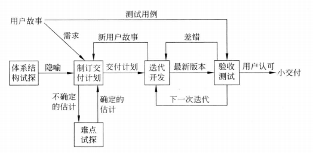

3. 极限编程的迭代过程

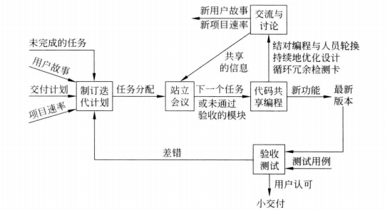

### 1.4.8 微软过程

1. 微软过程准则

   项目计划兼顾未来的不确定因素

   经常快速测试过渡版本

   快速循环、递进的开发过程

   小型项目组并行开发

   原型验证

   里程碑评审、切忌相互指责

   

# 第2章 可行性研究

## 2.1 可行性研究的任务

技术可行性

经济可行性

操作可行性

## 2.2 可行性研究过程

1. 复查系统规模和目标
2. 研究目前正在使用的系统
3. 到处新系统的高层逻辑模型
4. 进一步定义问题
5. 导出和评价供选择的解法
6. 推荐行动方针
7. 草拟开发计划
8. 书写文档提交审查

## 2.3 系统流程图

系统流程图是物理数据流图

### 2.3.1 符号

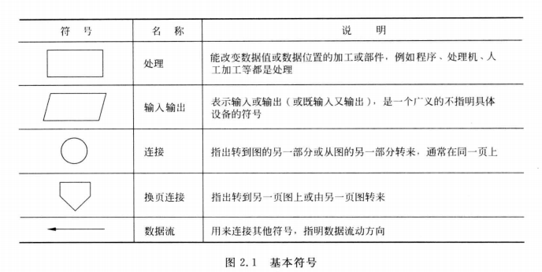

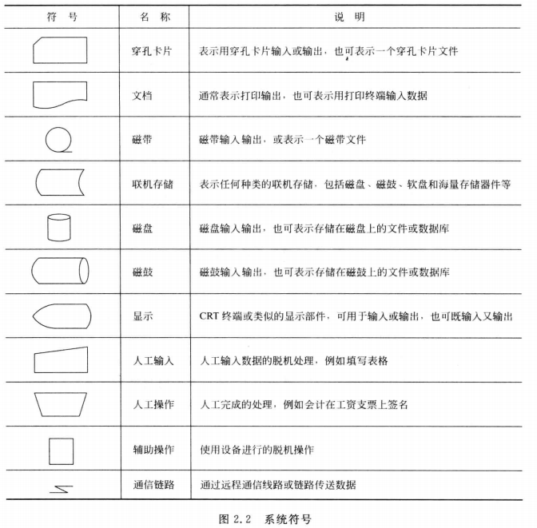

### 2.3.2 例子

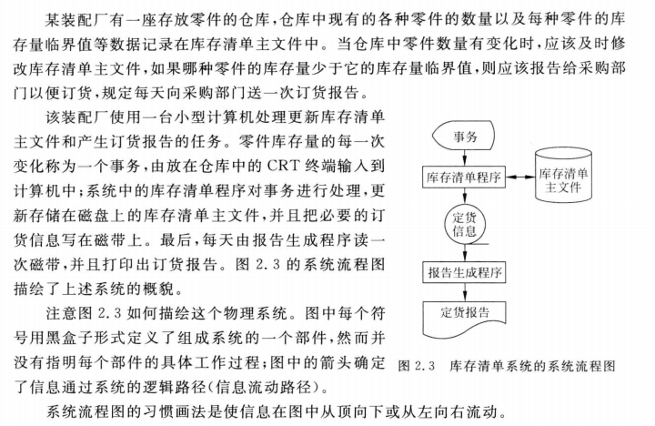

### 2.3.3 分层

对复杂系统，较好方法是分层次描绘这个系统

首先用一张高层次的系统流程图描绘系统总体概貌，表明系统的关键功能

然后分别把每个关键功能扩展到适当的详细程度，画在单独的一张纸上

## 2.4 数据流图

数据流图是系统逻辑功能的图形表示，只需考虑系统必须完成的基本逻辑功能

### 2.4.1 符号

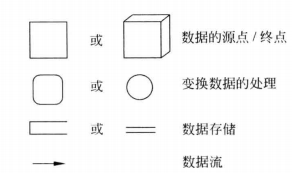

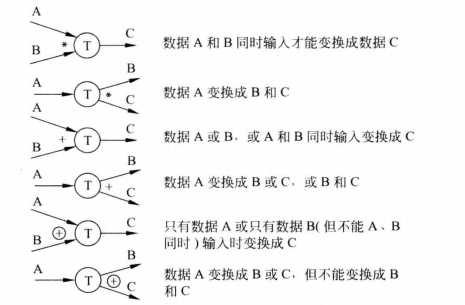

### 2.4剩下的不想记了，烦死了

## 2.5 数据字典

数据字典是关于数据的信息的集合，是对数据流图中包含的所有元素的定义的集合
